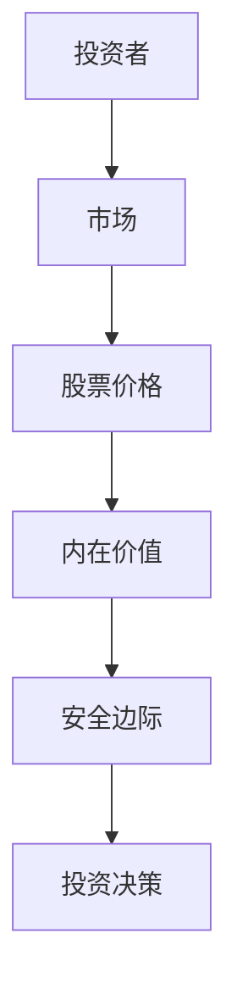
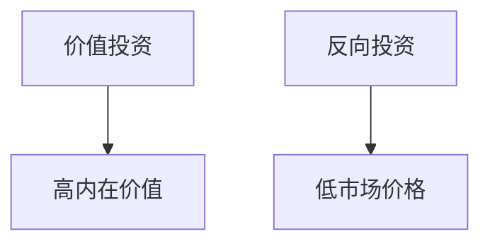
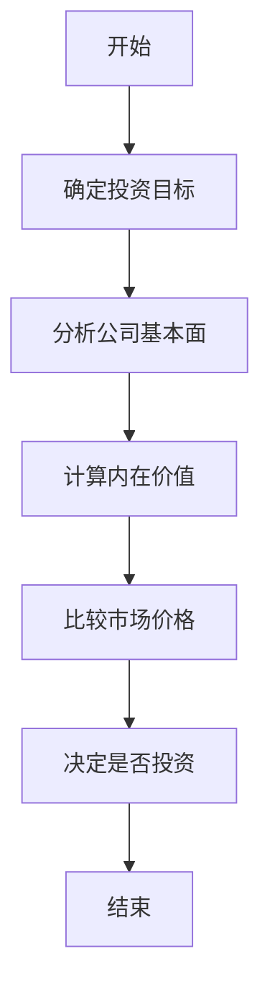
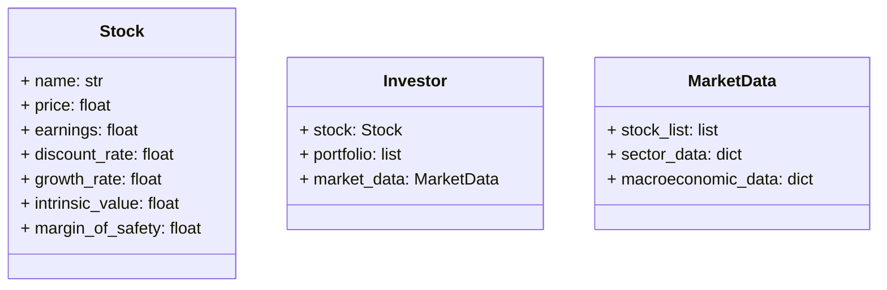
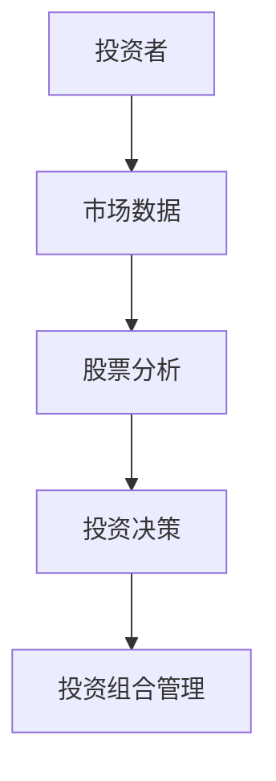

                 


# 约翰·聂夫的反向投资理念

> 关键词：反向投资、约翰·聂夫、安全边际、低市盈率、投资策略、内在价值

> 摘要：本文系统阐述了约翰·聂夫的反向投资理念，从其核心概念、算法原理到系统架构设计，结合实际案例进行详细分析，帮助读者深入理解这一投资策略的本质与应用。

---

## 第1章: 反向投资的起源与发展

### 1.1 投资领域的演变

#### 1.1.1 传统投资理念的局限性
传统投资理念往往依赖于市场的趋势和情绪，容易受到市场波动的影响。投资者常常在市场高点追涨，在低点恐慌抛售，导致收益不稳定。这种基于市场情绪的投资方式，忽视了公司基本面的分析，容易陷入价值陷阱。

#### 1.1.2 逆向思维在投资中的重要性
逆向思维在投资中的重要性体现在避开市场的拥挤交易，寻找被市场低估的机会。约翰·聂夫正是通过逆向思维，找到了许多被市场忽视的优质股票，从而获得了长期稳定的收益。

#### 1.1.3 约翰·聂夫的反向投资起源
约翰·聂夫是美国著名的投资经理人，他在富达投资公司管理的基金取得了长期稳定的超额收益。他的投资理念的核心是“安全边际”，即买入价格远低于内在价值的股票。

---

### 1.2 约翰·聂夫的投资哲学

#### 1.2.1 约翰·聂夫的生平简介
约翰·聂夫（John Neff）是美国著名的投资经理人，他在富达投资公司管理的“富达温莎基金”（Fidelity Windsor Fund）取得了长达30多年的优异成绩，年化回报率超过20%。

#### 1.2.2 约翰·聂夫的投资理念核心
约翰·聂夫的投资理念核心是“安全边际”，即买入价格远低于公司内在价值的股票。他注重对公司基本面的深入分析，尤其是对公司未来盈利能力和成长性的评估。

#### 1.2.3 约翰·聂夫与成长投资的区别
与成长投资不同，约翰·聂夫更注重安全边际和估值，而不是单纯追求高成长性的公司。他认为，只有在合理估值的前提下，成长才能带来超额收益。

---

### 1.3 反向投资的核心要素

#### 1.3.1 安全边际的定义与作用
安全边际是指股票的市场价格低于其内在价值的部分。通过购买具有安全边际的股票，投资者可以降低市场波动带来的风险。

#### 1.3.2 低市盈率策略的原理
低市盈率策略的核心是寻找市盈率低于行业平均水平的股票，这些股票往往具有较高的安全边际。

#### 1.3.3 股价与内在价值的反向关系
当市场价格低于内在价值时，股票具有投资价值。反之，当市场价格远高于内在价值时，股票存在较大的投资风险。

---

### 1.4 约翰·聂夫投资理念的边界与外延

#### 1.4.1 约翰·聂夫理念的适用场景
约翰·聂夫的投资理念适用于市场低迷、股票估值被低估的时期。

#### 1.4.2 约翰·聂夫理念的局限性
约翰·聂夫的理念在市场过热、股票估值偏高的时期可能表现不佳。此外，这种方法对投资者的分析能力和耐心要求较高。

#### 1.4.3 约翰·聂夫理念与其他投资策略的对比
与价值投资相比，约翰·聂夫的理念更注重安全边际和估值，而与成长投资相比，更注重低市盈率和内在价值。

---

## 第2章: 约翰·聂夫反向投资的核心概念与联系

### 2.1 反向投资的核心概念

#### 2.1.1 安全边际的数学模型
$$ \text{安全边际} = \text{内在价值} - \text{市场价格} $$

#### 2.1.2 低市盈率策略的特征对比
| 特征      | 价值投资      | 约翰·聂夫反向投资 |
|-----------|---------------|------------------|
| 核心      | 内在价值      | 安全边际         |
| 估值      | 高            | 低              |
| 风险      | 中            | 低              |
| 收益      | 高            | 高              |

#### 2.1.3 投资者情绪与市场周期的关系
投资者情绪通常与市场周期呈现反向关系。当市场情绪高涨时，股票估值偏高；当市场情绪低落时，股票估值被低估。

---

### 2.2 约翰·聂夫投资理念的ER实体关系图



---

### 2.3 约翰·聂夫投资理念的对比分析

#### 2.3.1 表格对比：约翰·聂夫与巴菲特的投资策略
| 特征         | 约翰·聂夫         | 巴菲特           |
|--------------|------------------|-----------------|
| 核心理念     | 安全边际         | 内在价值         |
| 估值标准     | 低市盈率         | 高安全边际       |
| 投资风格     | 逆向投资         | 价值投资         |
| 代表作品     | 《投资的艺术》     | 《巴菲特致股东的信》 |

#### 2.3.2 图表对比：价值投资与反向投资的差异


---

## 第3章: 约翰·聂夫反向投资的算法原理

### 3.1 约翰·聂夫投资算法的数学模型

#### 3.1.1 内在价值计算公式
$$ V = \frac{E}{(r - g)} $$
其中，V为内在价值，E为当前收益，r为折现率，g为增长率。

#### 3.1.2 安全边际计算公式
$$ \text{安全边际} = V - P $$
其中，P为市场价格，V为内在价值。

---

### 3.2 约翰·聂夫投资算法的流程图



---

### 3.3 算法实现的Python代码

```python
def calculate_intrinsic_value(earnings, discount_rate, growth_rate):
    return earnings / (discount_rate - growth_rate)

def calculate_margin_of_safety(intrinsic_value, price):
    return intrinsic_value - price

# 示例：计算某公司的内在价值和安全边际
earnings = 100  # 当前收益（单位：万元）
discount_rate = 0.1  # 折现率
growth_rate = 0.05  # 增长率
price = 50  # 当前股价

intrinsic_value = calculate_intrinsic_value(earnings, discount_rate, growth_rate)
margin_of_safety = calculate_margin_of_safety(intrinsic_value, price)

print(f"内在价值: {intrinsic_value}")
print(f"安全边际: {margin_of_safety}")
```

---

## 第4章: 约翰·聂夫反向投资的系统架构设计

### 4.1 系统功能设计

#### 4.1.1 领域模型类图


#### 4.1.2 系统架构设计


---

## 第5章: 约翰·聂夫反向投资的项目实战

### 5.1 环境安装

#### 5.1.1 Python环境配置
安装Python 3.x 及以上版本，并安装以下库：
- pandas
- numpy
- matplotlib
- seaborn

#### 5.1.2 数据收集
从Yahoo Finance获取股票数据，保存为CSV文件。

---

### 5.2 系统核心实现源代码

```python
import pandas as pd
import numpy as np
import matplotlib.pyplot as plt
import seaborn as sns

# 示例数据
data = {'股票代码': ['AAPL', 'MSFT', 'GOOGL', 'AMZN'],
        '市盈率': [15, 14, 20, 25],
        '增长率': [10, 8, 12, 18],
        '股价': [300, 250, 150, 500]}
df = pd.DataFrame(data)

# 计算内在价值
df['内在价值'] = df['股价'] * (df['增长率'] / (df['市盈率'] - 0.05))

# 计算安全边际
df['安全边际'] = df['内在价值'] - df['股价']

print(df)
```

---

### 5.3 代码应用解读与分析

#### 5.3.1 数据可视化
```python
plt.figure(figsize=(10, 6))
sns.barplot(x='股票代码', y='安全边际', data=df)
plt.title('安全边际对比')
plt.show()
```

#### 5.3.2 投资决策
根据计算结果，选择安全边际为正的股票进行投资。

---

## 第6章: 总结与展望

### 6.1 本章小结
约翰·聂夫的反向投资理念强调安全边际和低市盈率，通过深入分析公司基本面，寻找被市场低估的投资机会。

### 6.2 投资者需要注意的事项
- 理解公司的基本面，尤其是盈利能力。
- 保持耐心，等待市场低估的机会。
- 避免过度依赖单一指标，结合多种因素进行分析。

### 6.3 拓展阅读
- 《投资的艺术》
- 《巴菲特致股东的信》
- 《价值投资实战策略》

---

以上是《约翰·聂夫的反向投资理念》的完整目录和文章内容，希望对您有所帮助！

