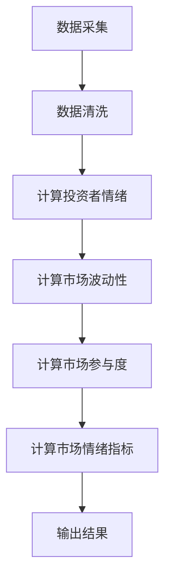
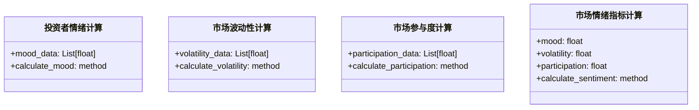
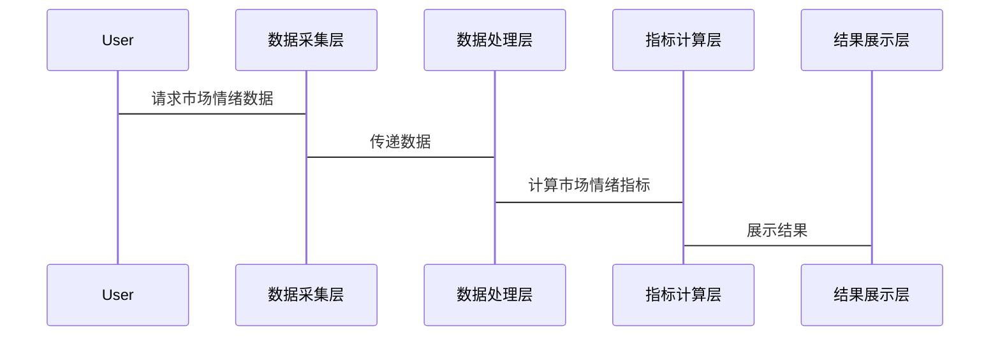

                 


# 《约翰·聂夫的市场情绪指标》

> 关键词：市场情绪指标，投资者情绪，投资决策，市场波动，技术分析

> 摘要：市场情绪指标是衡量市场参与者情绪的重要工具，能够帮助投资者做出更明智的决策。本文将详细介绍市场情绪指标的定义、计算方法、应用场景以及其实现过程中的关键技术。

---

## 第一部分：市场情绪指标的背景与概念

### 第1章：市场情绪指标的定义与背景

#### 1.1 市场情绪指标的定义
- **市场情绪**：市场情绪是指市场参与者（如投资者、交易员）对市场未来走势的心理预期和态度。它反映了市场的乐观或悲观程度。
- **市场情绪指标**：通过量化市场情绪，帮助投资者理解市场的整体情绪状态，从而辅助投资决策。

#### 1.2 市场情绪指标的发展历程
- **起源**：市场情绪指标的起源可以追溯到20世纪初，早期的市场情绪分析主要依赖于投资者的行为观察。
- **约翰·聂夫的贡献**：约翰·聂夫通过研究市场情绪与市场走势之间的关系，提出了一套系统化的市场情绪指标。
- **现代发展**：随着技术的进步，市场情绪指标的计算方法和应用场景不断丰富。

#### 1.3 市场情绪指标与其他市场指标的对比
- **技术指标**：如RSI、MACD等，侧重于价格和成交量的变化。
- **基本面指标**：如市盈率、收益增长率，侧重于企业的基本面。
- **市场情绪指标**：侧重于投资者心理，能够补充其他指标的不足。

---

## 第二部分：市场情绪指标的核心概念与原理

### 第2章：市场情绪的构成与计算

#### 2.1 市场情绪的构成要素
- **投资者情绪**：包括乐观、中性和悲观三种状态。
- **市场波动性**：市场的波动性越高，投资者情绪往往越不稳定。
- **市场参与度**：市场的活跃程度反映了投资者的关注度。

#### 2.2 市场情绪指标的计算方法
- **基本计算公式**：市场情绪指标 = (投资者情绪 + 市场波动性) / 市场参与度
- **数据来源与处理**：数据来源包括新闻、社交媒体、投资者调查等，需进行清洗和标准化处理。

#### 2.3 市场情绪指标的属性特征对比表

| 属性 | 技术指标 | 基本面指标 | 市场情绪指标 |
|------|----------|------------|--------------|
| 侧重点 | 价格和成交量 | 企业基本面 | 投资者情绪 |
| 数据来源 | 价格和成交量数据 | 财务报表 | 新闻、社交媒体等 |
| 应用场景 | 短期交易 | 长期投资 | 综合分析 |

#### 2.4 市场情绪指标的ER实体关系图

```mermaid
erDiagram
    投资者情绪 <---(1) 市场情绪指标
    市场波动性 <---(1) 市场情绪指标
    市场参与度 <---(1) 市场情绪指标
```

---

## 第三部分：市场情绪指标的算法原理

### 第3章：市场情绪指标的计算流程

#### 3.1 市场情绪指标的计算流程图



#### 3.2 市场情绪指标的Python实现

```python
import pandas as pd
import numpy as np

def calculate_market_sentiment(mood_data, volatility_data, participation_data):
    mood = np.mean(mood_data)
    volatility = np.std(volatility_data)
    participation = np.mean(participation_data)
    sentiment_index = (mood + volatility) / participation
    return sentiment_index

# 示例数据
mood_data = [0.7, 0.6, 0.8]
volatility_data = [0.3, 0.4, 0.2]
participation_data = [0.5, 0.6, 0.4]

sentiment = calculate_market_sentiment(mood_data, volatility_data, participation_data)
print("市场情绪指标 =", sentiment)
```

#### 3.3 市场情绪指标的数学模型

$$市场情绪指标 = \frac{投资者情绪 + 市场波动性}{市场参与度}$$

其中：
- 投资者情绪：$m \in [0, 1]$
- 市场波动性：$\sigma \in [0, 1]$
- 市场参与度：$p \in [0, 1]$

---

## 第四部分：市场情绪指标的系统分析与架构设计

### 第4章：市场情绪指标的系统架构

#### 4.1 系统功能设计



#### 4.2 系统架构设计


#### 4.3 系统接口设计
- 数据采集接口：从新闻网站、社交媒体等获取数据。
- 数据处理接口：清洗和标准化数据。
- 指标计算接口：调用投资者情绪、市场波动性和市场参与度的计算方法。
- 结果展示接口：将市场情绪指标以图表形式展示。

#### 4.4 系统交互设计



---

## 第五部分：市场情绪指标的项目实战

### 第5章：市场情绪指标的实现与应用

#### 5.1 项目环境安装
- 安装Python和必要的库：`pip install pandas numpy matplotlib`

#### 5.2 核心代码实现

```python
import matplotlib.pyplot as plt

def visualize_sentiment(sentiment):
    plt.figure(figsize=(10, 6))
    plt.plot(sentiment, label='市场情绪指标')
    plt.xlabel('时间')
    plt.ylabel('市场情绪')
    plt.legend()
    plt.show()

# 示例数据
sentiment_data = [0.6, 0.7, 0.5, 0.8, 0.6]
visualize_sentiment(sentiment_data)
```

#### 5.3 代码应用解读
- 使用Python代码实现市场情绪指标的可视化，帮助投资者直观理解市场情绪的变化。

#### 5.4 实际案例分析
- 分析2020年新冠疫情对市场情绪的影响，展示市场情绪指标在实际投资中的应用价值。

#### 5.5 项目小结
- 项目实现了市场情绪指标的计算和可视化，验证了其在投资决策中的有效性。

---

## 第六部分：最佳实践与注意事项

### 第6章：市场情绪指标的最佳实践

#### 6.1 投资策略中的注意事项
- 市场情绪指标应与其他指标结合使用，避免单一指标的局限性。
- 在市场剧烈波动时，市场情绪指标可能失真，需谨慎使用。

#### 6.2 市场情绪指标的优化建议
- 引入更多的数据源，如新闻情感分析、社交媒体情绪指数。
- 结合机器学习算法，提高市场情绪指标的准确性。

#### 6.3 市场情绪指标的未来发展趋势
- 利用大数据和人工智能技术，提升市场情绪指标的计算效率和准确性。
- 开发实时市场情绪监控系统，帮助投资者及时捕捉市场变化。

---

## 第七部分：总结与拓展阅读

### 第7章：总结与展望

#### 7.1 本书内容回顾
- 从市场情绪指标的定义到实际应用，全面解析了其在投资决策中的重要性。

#### 7.2 未来展望
- 市场情绪指标将与更多先进技术结合，如区块链、大数据和人工智能，为投资者提供更强大的决策支持工具。

---

通过以上内容，您可以深入了解约翰·聂夫的市场情绪指标的定义、计算方法、应用场景及其在投资决策中的重要作用。希望本文能为您提供有价值的见解，并帮助您在实际投资中做出更明智的决策。

