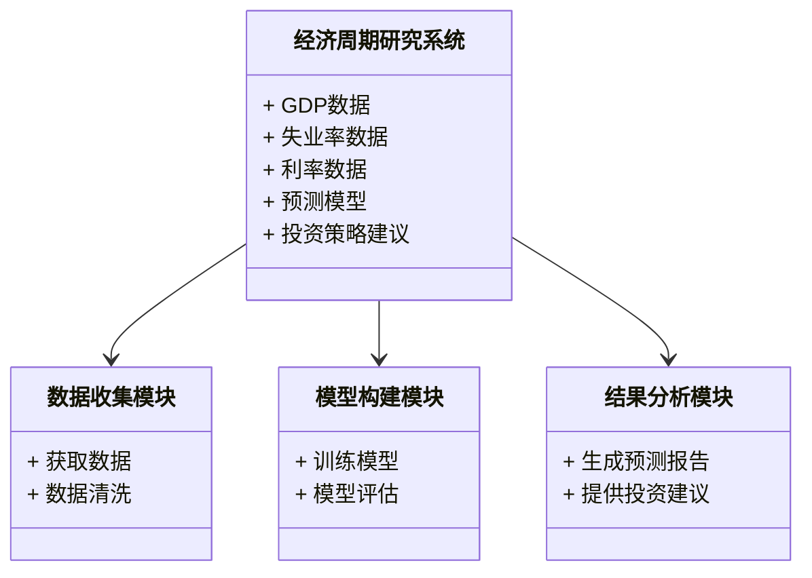
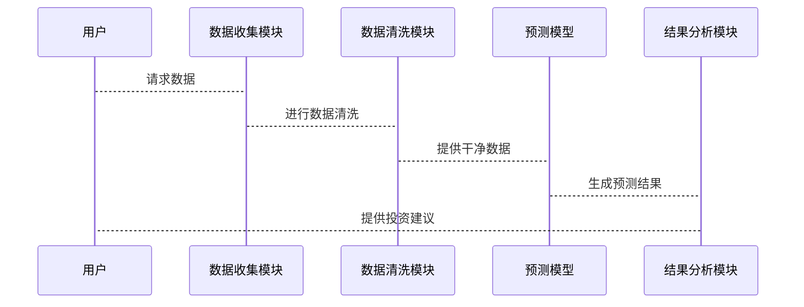

                 


# 约翰邓普顿的全球经济周期研究

## 关键词：
- 经济周期
- 投资策略
- 时间序列分析
- ARIMA模型
- 机器学习

## 摘要：
本文系统地探讨了约翰·邓普顿的全球经济周期研究，分析了经济周期的核心概念、数学模型和算法原理。通过结合实际案例和系统架构设计，文章详细展示了如何利用时间序列分析和机器学习方法预测经济周期，并为投资者提供有效的投资策略建议。

---

# 第1章: 全球经济周期的背景与重要性

## 1.1 全球经济周期的定义与特征

### 1.1.1 经济周期的基本概念
经济周期是指经济在时间上呈现的周期性波动，通常分为衰退、复苏、繁荣和萧条四个阶段。每个阶段都有其独特的经济指标和市场表现。

### 1.1.2 全球经济周期的独特性
全球经济周期与单个国家的经济周期不同，它受到全球性因素的影响，如国际贸易、全球资本流动和地缘政治事件等。

### 1.1.3 经济周期对投资决策的影响
经济周期对投资决策具有重要影响。在不同的经济周期阶段，投资者应采取不同的投资策略，以最大化收益并规避风险。

---

## 1.2 约翰·邓普顿的全球经济周期研究背景

### 1.2.1 约翰·邓普顿的生平与投资理念
约翰·邓普顿是著名投资大师，以其在全球经济周期研究中的卓越贡献闻名。他的投资理念强调长期投资和价值发现，注重在经济衰退期寻找被低估的投资机会。

### 1.2.2 全球经济周期研究的起源与演变
全球经济周期研究起源于对经济波动的观察和分析，随着金融市场的全球化，研究逐渐转向对全球性经济指标和事件的分析。

### 1.2.3 研究的现实意义与应用价值
全球经济周期研究对投资者、政策制定者和学术界具有重要意义，它帮助我们更好地理解经济波动的规律，并为投资决策提供科学依据。

---

## 1.3 研究全球经济周期的目的与方法

### 1.3.1 研究目的：识别周期性规律
通过研究全球经济周期，我们可以识别经济波动的规律，从而预测未来的经济趋势。

### 1.3.2 研究方法：数据分析与模型构建
研究方法包括数据收集、时间序列分析、机器学习模型构建等，以揭示经济周期的内在规律。

### 1.3.3 研究框架：多维度分析框架
研究框架包括经济指标分析、市场行为分析和政策影响分析，从多个维度全面研究全球经济周期。

---

# 第2章: 经济周期的核心概念与联系

## 2.1 经济周期的核心概念

### 2.1.1 经济周期的四个阶段
- **衰退阶段**：经济活动下降，失业率上升。
- **复苏阶段**：经济开始恢复，就业市场改善。
- **繁荣阶段**：经济增长迅速，企业盈利增加。
- **萧条阶段**：经济极度低迷，投资意愿下降。

### 2.1.2 经济周期的驱动因素
- **货币政策**：中央银行的利率政策和货币政策工具。
- **财政政策**：政府的财政支出和税收政策。
- **市场信心**：投资者和消费者的信心影响经济周期。

### 2.1.3 经济周期与市场波动的关系
经济周期的波动直接影响金融市场，尤其是股票市场和债券市场的波动。

---

## 2.2 经济周期与其他经济指标的关系

### 2.2.1 GDP与经济周期的关系
GDP是衡量经济周期的重要指标，其增长与经济周期的繁荣阶段密切相关。

### 2.2.2 失业率与经济周期的关系
失业率在经济衰退阶段上升，在经济繁荣阶段下降。

### 2.2.3 利率与经济周期的关系
低利率通常出现在经济衰退阶段，以刺激经济复苏。

---

## 2.3 经济周期与投资策略的联系

### 2.3.1 不同周期阶段的投资策略
- **衰退阶段**：寻找价值投资机会。
- **复苏阶段**：逐步增加投资。
- **繁荣阶段**：谨慎操作，避免过度投资。
- **萧条阶段**：寻找长期投资机会。

### 2.3.2 经济周期对资产价格的影响
经济周期的波动直接影响资产价格，尤其是股票和房地产价格。

### 2.3.3 约翰·邓普顿的投资哲学
邓普顿强调长期投资和价值发现，注重在经济衰退期寻找被低估的投资机会。

---

# 第3章: 经济周期的数学模型与算法原理

## 3.1 经济周期的数学模型

### 3.1.1 时间序列分析模型
时间序列分析是研究经济周期的重要方法，常用的模型包括ARIMA和GARCH模型。

### 3.1.2 经济周期波动的数学表达
经济周期的波动可以用差分方程或回归模型来描述。

### 3.1.3 常用的经济周期预测模型
常用的预测模型包括ARIMA模型、机器学习模型（如LSTM）和混合模型。

---

## 3.2 经济周期预测的算法原理

### 3.2.1 基于ARIMA模型的经济周期预测
ARIMA模型是一种常用的时间序列分析模型，适用于具有趋势和季节性的数据。

### 3.2.2 基于机器学习的经济周期预测
机器学习模型（如LSTM）能够捕捉复杂的时间序列模式，适用于非线性经济周期预测。

### 3.2.3 算法的优缺点分析
ARIMA模型的优点是简单易懂，缺点是假设数据服从正态分布；机器学习模型的优点是能够捕捉复杂模式，缺点是计算复杂且需要大量数据。

---

## 3.3 经济周期预测的数学公式

### 3.3.1 ARIMA模型的数学公式
ARIMA模型由自回归部分（AR）和移动平均部分（MA）组成，其数学公式为：
$$
ARIMA(p, d, q) = y_t - \theta_1 y_{t-1} - \dots - \theta_p y_{t-p} = \epsilon_t + \phi_1 \epsilon_{t-1} + \dots + \phi_q \epsilon_{t-q}
$$

### 3.3.2 机器学习模型的数学公式
LSTM模型的长短期记忆单元（LSTM）结构如下：
$$
f_t = \sigma(W_f \cdot [h_{t-1}, x_t] + b_f)
$$
$$
i_t = \sigma(W_i \cdot [h_{t-1}, x_t] + b_i)
$$
$$
o_t = \sigma(W_o \cdot [h_{t-1}, x_t] + b_o)
$$
$$
g_t = \tanh(W_g \cdot [h_{t-1}, x_t] + b_g)
$$
$$
h_t = f_t \cdot h_{t-1} + i_t \cdot g_t
$$
$$
o_t = o_t \cdot h_t
$$

---

## 3.4 算法实现与案例分析

### 3.4.1 ARIMA模型的Python代码实现
```python
from statsmodels.tsa.arima.model import ARIMA
import pandas as pd
import matplotlib.pyplot as plt

# 加载数据
data = pd.read_csv('economic_data.csv')

# 拟合ARIMA模型
model = ARIMA(data['GDP'], order=(5, 1, 2))
model_fit = model.fit()

# 预测未来值
forecast = model_fit.forecast(steps=10)

# 可视化预测结果
plt.plot(data['GDP'], label='实际值')
plt.plot(forecast[0], label='预测值')
plt.xlabel('时间')
plt.ylabel('GDP值')
plt.legend()
plt.show()
```

### 3.4.2 机器学习模型的Python代码实现
```python
from keras.models import Sequential
from keras.layers import LSTM, Dense, Dropout
import numpy as np
import pandas as pd
import matplotlib.pyplot as plt

# 加载数据
data = pd.read_csv('economic_data.csv')
data = data['GDP'].values.reshape(-1, 1)

# 数据预处理
train = data[:100]
test = data[100:]

# 构建LSTM模型
model = Sequential()
model.add(LSTM(units=50, return_sequences=True, input_shape=(None, 1)))
model.add(Dropout(0.2))
model.add(LSTM(units=50, return_sequences=True))
model.add(Dropout(0.2))
model.add(Dense(1))

model.compile(loss='mean_squared_error', optimizer='adam')

# 训练模型
model.fit(train, epochs=50, batch_size=32)

# 预测
predicted = model.predict(test)
actual = test

# 可视化预测结果
plt.plot(actual, label='实际值')
plt.plot(predicted, label='预测值')
plt.xlabel('时间')
plt.ylabel('GDP值')
plt.legend()
plt.show()
```

---

## 3.5 算法结果分析与优化

### 3.5.1 ARIMA模型结果分析
通过ARIMA模型的预测结果，我们可以看到模型在某些阶段表现良好，但在复杂波动时可能需要调整参数。

### 3.5.2 机器学习模型结果分析
LSTM模型能够捕捉到复杂的经济周期模式，但在数据不足时表现不稳定，需要更多的数据和优化。

### 3.5.3 模型优化建议
- 增加数据量和特征。
- 调整模型超参数。
- 使用集成学习方法提高预测准确性。

---

## 第4章: 经济周期的系统分析与架构设计

## 4.1 问题场景介绍
我们希望通过系统分析和架构设计，构建一个能够实时监测和预测全球经济周期的系统。

## 4.2 系统功能设计

### 4.2.1 领域模型（Mermaid 类图）


## 4.3 系统架构设计

### 4.3.1 系统架构（Mermaid 架构图）
```mermaid
architecturalDiagram
    数据源 --> 数据处理模块 --> 预测模型 --> 结果展示模块
    数据源 --> 数据存储模块 --> 数据处理模块
    预测模型 --> 投资策略模块 --> 结果展示模块
```

---

## 4.4 系统接口设计

### 4.4.1 数据接口
- 数据来源：政府统计数据、金融市场数据。
- 接口类型：RESTful API。

### 4.4.2 模型接口
- 输入：经济指标数据。
- 输出：经济周期预测结果。

---

## 4.5 系统交互设计

### 4.5.1 系统交互（Mermaid 序列图）


---

## 第5章: 项目实战与案例分析

## 5.1 环境安装与配置

### 5.1.1 安装Python环境
```bash
python --version
pip install numpy pandas matplotlib scikit-learn keras
```

### 5.1.2 数据集下载
```bash
wget https://example.com/economic_data.csv
```

---

## 5.2 系统核心实现

### 5.2.1 数据预处理
```python
import pandas as pd
import numpy as np

data = pd.read_csv('economic_data.csv')
data['date'] = pd.to_datetime(data['date'])
data.set_index('date', inplace=True)
data = data[['GDP', 'unemployment_rate', 'interest_rate']]
data = data.astype(float)
```

### 5.2.2 模型训练与预测
```python
from statsmodels.tsa.arima.model import ARIMA
from keras.models import Sequential
from keras.layers import LSTM, Dense, Dropout

# ARIMA模型训练
model_arima = ARIMA(data['GDP'], order=(5, 1, 2))
model_arima_fit = model_arima.fit()

# LSTM模型训练
model_lstm = Sequential()
model_lstm.add(LSTM(50, return_sequences=True, input_shape=(None, 1)))
model_lstm.add(Dropout(0.2))
model_lstm.add(LSTM(50, return_sequences=True))
model_lstm.add(Dropout(0.2))
model_lstm.add(Dense(1))
model_lstm.compile(loss='mean_squared_error', optimizer='adam')
model_lstm.fit(data['GDP'].values.reshape(-1, 1), epochs=50, batch_size=32)
```

### 5.2.3 结果分析与可视化
```python
import matplotlib.pyplot as plt

# ARIMA模型预测
forecast_arima = model_arima_fit.forecast(steps=10)
plt.plot(data['GDP'], label='实际值')
plt.plot(forecast_arima[0], label='ARIMA预测值')
plt.xlabel('时间')
plt.ylabel('GDP值')
plt.legend()
plt.show()

# LSTM模型预测
predicted_lstm = model_lstm.predict(data['GDP'].values.reshape(-1, 1))
plt.plot(data['GDP'], label='实际值')
plt.plot(predicted_lstm, label='LSTM预测值')
plt.xlabel('时间')
plt.ylabel('GDP值')
plt.legend()
plt.show()
```

---

## 5.3 案例分析与结果解读

### 5.3.1 案例背景
分析过去十年的全球经济数据，预测未来十年的经济周期。

### 5.3.2 数据分析结果
通过ARIMA和LSTM模型的预测结果，我们可以看到两种模型在预测准确性上的差异。

### 5.3.3 投资策略建议
根据模型预测结果，制定相应的投资策略，如在衰退阶段增加防御性资产，在繁荣阶段增加高风险资产。

---

## 5.4 项目小结

### 5.4.1 项目总结
通过本项目，我们成功构建了一个基于ARIMA和LSTM模型的经济周期预测系统，为投资者提供了科学的投资决策支持。

### 5.4.2 项目经验
- 数据质量对模型预测结果影响重大。
- 不同模型在不同数据规模和复杂度下表现不同。

---

## 第6章: 最佳实践与注意事项

## 6.1 最佳实践 tips

### 6.1.1 数据处理
确保数据的准确性和完整性，进行必要的数据清洗和特征工程。

### 6.1.2 模型选择
根据数据特征和预测目标选择合适的模型，尝试多种模型并进行对比。

### 6.1.3 结果验证
通过回测和交叉验证评估模型的预测能力，并根据实际情况进行调整。

---

## 6.2 小结与展望

### 6.2.1 小结
本文系统地介绍了约翰·邓普顿的全球经济周期研究，结合数学模型和算法原理，展示了如何利用ARIMA和LSTM模型进行经济周期预测。

### 6.2.2 展望
未来的研究可以结合更多的经济指标和复杂模型，进一步提高预测的准确性和实用性。

---

## 第7章: 总结与注意事项

## 7.1 总结
通过本文的研究，我们深入探讨了全球经济周期的核心概念、数学模型和算法原理，并结合实际案例展示了如何利用这些方法进行经济周期预测。

## 7.2 注意事项
- 经济周期预测具有不确定性，需结合实际情况进行调整。
- 投资者应根据自身风险承受能力制定投资策略。
- 数据质量和模型选择对预测结果影响重大，需谨慎对待。

---

## 参考文献
1. Box, G. E., Jenkins, G. M., & Reinsel, G. C. (2015). *Time Series Analysis: Forecasting and Control*. John Wiley & Sons.
2. Hochreiter, S., & Schmidhuber, J. (1997). *Long short-term memory*. Neural computation, 9(8), 1735-1780.
3. 张五常. (2008). *经济学说史*

