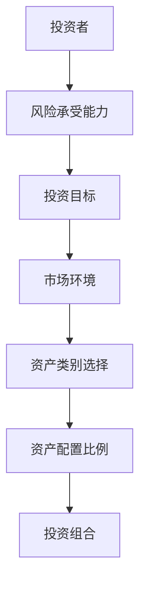
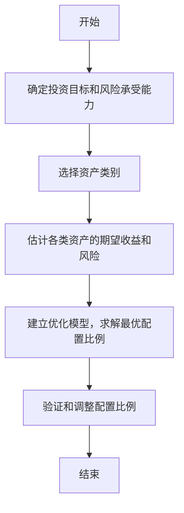
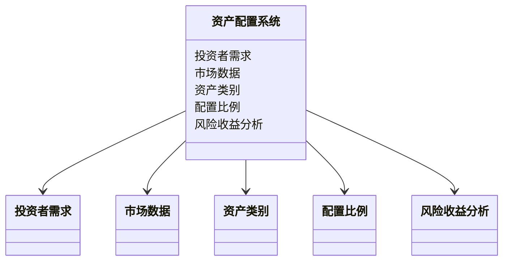

                 


# 《约翰邓普顿的全球资产配置》

> 关键词：全球资产配置、投资策略、约翰·邓普顿、资产组合优化、风险管理

> 摘要：本文详细探讨了约翰·邓普顿的全球资产配置理念，结合投资策略、资产组合优化和风险管理等方面，通过理论分析和实战案例，深入解读如何在全球化经济背景下实现有效的资产配置。

---

## 第一部分: 全球资产配置的背景与重要性

### 第1章: 全球资产配置的概述

#### 1.1 全球资产配置的背景介绍
- **全球化经济的兴起**：随着全球经济一体化的加深，投资者需要考虑全球范围内的资产配置，以分散风险并抓住不同市场的增长机会。
- **资产配置在投资中的核心地位**：资产配置决定了投资组合的收益和风险特征，是投资成功的关键。
- **约翰·邓普顿的投资理念与方法**：邓普顿是全球资产配置的先驱，他强调通过分散投资和长期持有来实现稳定收益。

#### 1.2 资产配置的核心概念与联系
- **资产配置的原理与方法**：资产配置是将资金分配到不同资产类别（股票、债券、房地产等）中，以实现风险和收益的平衡。
- **不同资产类别之间的关系**：资产类别之间存在相关性，但不同类型资产在不同市场环境下的表现差异较大。
- **资产配置与投资组合的对比表格**：下表展示了资产配置和投资组合的区别与联系。

| 比较维度 | 资产配置 | 投资组合 |
|----------|-----------|----------|
| 定义     | 资金分配到不同资产类别的比例 | 具体的投资品种和比例 |
| 目标     | 优化风险和收益 | 具体实现资产配置的结果 |
| 灵活性   | 长期战略决策 | 短期战术调整 |

### 第2章: 资产配置的核心概念与联系

#### 2.1 资产配置的原理与方法
- **资产配置的原理**：通过分散投资，降低特定资产类别带来的风险，同时捕捉不同市场的收益机会。
- **资产配置的方法**：基于投资者的风险承受能力、投资目标和市场环境，制定合理的资产分配策略。

#### 2.2 资产配置的核心概念与联系
- **资产配置的核心要素**：风险承受能力、投资目标、市场环境、资产类别选择。
- **ER实体关系图架构的 Mermaid 流程图**：下图展示了资产配置的核心要素之间的关系。



---

## 第二部分: 资产配置的算法原理讲解

### 第3章: 资产配置的算法原理

#### 3.1 资产配置的算法原理
- **均值-方差优化模型**：通过优化投资组合的收益和风险，找到最优资产配置比例。
- **风险调整后的收益最大化方法**：在给定风险水平下，最大化收益，或者在给定收益下，最小化风险。

#### 3.2 资产配置算法的 Mermaid 流程图


---

## 第三部分: 资产配置的数学模型与公式

### 第4章: 资产配置的数学模型

#### 4.1 现代投资组合理论的优化公式
- **目标函数**：最小化投资组合的方差（风险）。
$$ \text{目标函数：} \quad \min_w \, w^T \Sigma w $$
- **约束条件**：投资权重之和为1。
$$ \sum_{i=1}^n w_i = 1 $$

#### 4.2 资产配置的风险-收益权衡公式
- **收益**：投资组合的预期收益。
$$ \text{收益} = \sum_{i=1}^n w_i r_i $$
- **风险**：投资组合的风险，通常用标准差衡量。
$$ \text{风险} = \sqrt{\sum_{i=1}^n \sum_{j=1}^n w_i w_j \sigma_{ij}} $$

---

## 第四部分: 资产配置的系统分析与架构设计方案

### 第5章: 资产配置系统的功能设计

#### 5.1 领域模型 Mermaid 类图


---

## 第五部分: 资产配置的项目实战

### 第6章: 资产配置的实现与案例分析

#### 6.1 项目环境安装
- **Python环境**：安装Python和相关库（如NumPy、Pandas、Scipy）。
- **工具安装**：安装Jupyter Notebook或其他数据分析工具。

#### 6.2 核心代码实现
```python
import numpy as np
import pandas as pd
from scipy.optimize import minimize

def portfolio_variance(weights, covariance_matrix):
    return np.dot(weights.T, np.dot(covariance_matrix, weights))

def portfolio_optimization(returns, covariance_matrix, target_return):
    n = len(weights)
    constraints = [{'type': 'eq', 'fun': lambda w: np.sum(w) - 1}]
    result = minimize(portfolio_variance, np.ones(n)/n, args=covariance_matrix, method='SLSQP', constraints=constraints)
    return result.x

# 示例数据
returns = pd.DataFrame({
    '股票': [0.1, 0.05, 0.07],
    '债券': [0.03, 0.04, 0.06],
    '房地产': [0.08, 0.05, 0.09]
})

covariance_matrix = returns.cov()
weights = portfolio_optimization(returns, covariance_matrix, target_return=0.06)
print("最优权重：", weights)
```

#### 6.3 案例分析
- **案例背景**：假设投资者希望获得6%的预期收益，风险承受能力中等。
- **分析步骤**：计算不同资产类别的预期收益和风险，优化资产配置比例。
- **结果解读**：根据优化结果，建议投资者将资金分配到股票、债券和房地产的不同比例。

---

## 第六部分: 最佳实践与总结

### 第7章: 最佳实践与小结

#### 7.1 最佳实践 tips
- **定期调整资产配置**：根据市场变化和个人财务状况，定期调整资产配置比例。
- **分散投资**：避免过度集中在某一种资产类别，降低风险。
- **监控市场变化**：及时关注全球经济和市场的变化，做出相应的调整。

#### 7.2 小结
- 本文详细介绍了约翰·邓普顿的全球资产配置理念，结合投资策略、资产组合优化和风险管理等方面，通过理论分析和实战案例，深入解读了如何在全球化经济背景下实现有效的资产配置。

#### 7.3 注意事项
- 资产配置需要结合个人的财务状况和风险承受能力，不能盲目跟风。
- 在实际操作中，建议结合专业的投资工具和数据分析方法，提高配置的科学性和有效性。

#### 7.4 拓展阅读
- 《投资学》——课本中的资产配置章节。
- 《投资组合管理》——深入理解资产配置的数学模型和优化方法。

---

通过以上详细分析和实战案例，读者可以全面理解约翰·邓普顿的全球资产配置理念，并能够在实际投资中灵活应用这些方法，实现稳健的投资收益。

