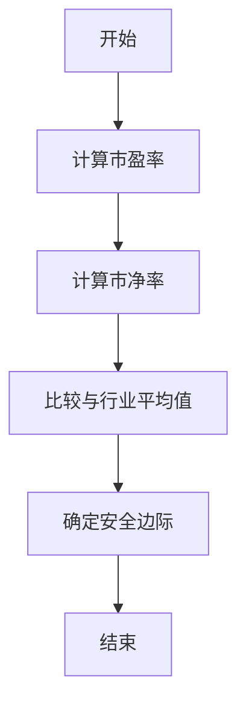
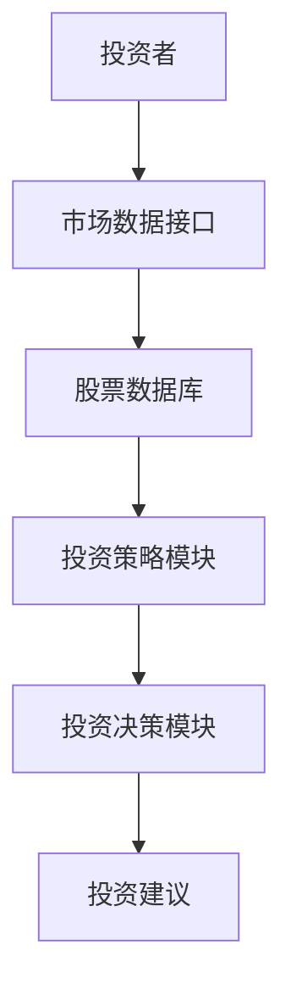
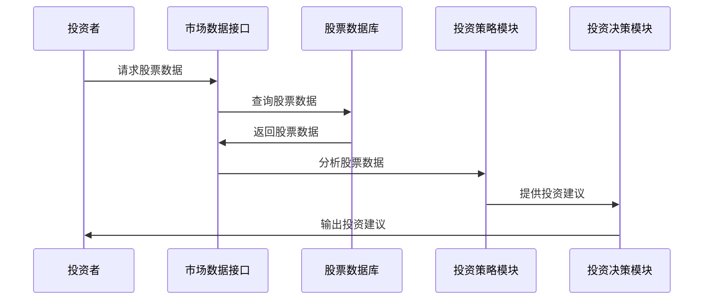

                 


# 约翰邓普顿的危机投资机会

## 关键词：约翰·邓普顿, 危机投资, 价值投资, 投资策略, 安全边际

## 摘要：本文深入分析了约翰·邓普顿的危机投资策略，探讨了他在市场危机中的投资机会和成功案例。通过详细阐述他的投资理念、估值方法和安全边际，结合数学模型和算法，帮助读者理解如何在危机中发现投资机会，并提供实际案例分析和系统设计，帮助投资者在危机中做出明智的投资决策。

---

# 第一部分: 约翰·邓普顿投资理念与危机投资概述

## 第1章: 约翰·邓普顿的生平与投资哲学

### 1.1 约翰·邓普顿的生平简介

#### 1.1.1 约翰·邓普顿的早年经历
约翰·邓普顿（John Templeton）于1912年出生于加拿大，早年在英国接受教育，后移居美国。他在1930年代开始投资生涯，初期专注于股票市场，并在1939年建立了自己的投资公司。

#### 1.1.2 约翰·邓普顿的投资生涯
邓普顿以其独特的投资策略闻名，尤其是在市场危机时期。他主张寻找被市场低估的股票，并在市场恐慌时进行投资。他的投资风格以价值投资为核心，注重安全边际和长期回报。

#### 1.1.3 约翰·邓普顿的声誉与成就
邓普顿被认为是20世纪最伟大的投资者之一，他的投资理念影响了后来的许多投资者。他的成功案例包括在1930年代大萧条时期的投资，以及在1970年代石油危机期间的投资。

### 1.2 约翰·邓普顿的投资哲学

#### 1.2.1 价值投资的核心理念
邓普顿的价值投资理念强调购买被市场低估的股票，并在市场恐慌时进行逆向投资。他认为，市场的波动性为投资者提供了廉价买入的机会。

#### 1.2.2 约翰·邓普顿的投资策略
邓普顿的投资策略包括：
1. 寻找具有强大基本面但被市场低估的公司。
2. 在市场恐慌时进行投资，利用市场的非理性定价。
3. 分散投资，降低风险。

#### 1.2.3 约翰·邓普顿的成功案例
邓普顿在1930年代大萧条时期投资于被低估的股票，获得了高额回报。他还成功地在1970年代石油危机期间投资于能源公司，进一步巩固了他的声誉。

## 第2章: 危机投资的背景与定义

### 2.1 危机投资的定义与特征

#### 2.1.1 危机的定义
危机是指市场或经济中的重大负面事件，如经济衰退、市场崩盘或行业危机。这些事件通常导致市场的剧烈波动和资产价格的大幅下跌。

#### 2.1.2 危机投资的特点
危机投资的特点包括：
1. 市场恐慌导致资产价格低估。
2. 投资者情绪低落，市场流动性下降。
3. 危机中的投资机会通常具有高风险和高回报。

#### 2.1.3 危机投资的类型
危机投资可以分为以下几种类型：
- 市场危机投资：如经济衰退或市场崩盘。
- 行业危机投资：如能源危机或科技泡沫破裂。
- 地缘政治危机投资：如战争或政治动荡。

### 2.2 危机投资的机会与风险

#### 2.2.1 危机投资的机会
- 低估的资产价格为投资者提供了廉价买入的机会。
- 市场恐慌导致的投资机会可以带来高回报。

#### 2.2.2 危机投资的风险
- 市场波动性高，投资风险大。
- 危机中的投资机会可能具有高度不确定性。
- 投资者可能因市场恐慌而做出错误决策。

#### 2.2.3 危机投资的边界与外延
危机投资的边界包括市场波动、投资者情绪和市场流动性。其外延包括不同类型的投资机会，如股票、债券和房地产。

## 第3章: 约翰·邓普顿的危机投资策略

### 3.1 约翰·邓普顿的危机投资方法

#### 3.1.1 寻找便宜货的原则
邓普顿强调寻找被市场低估的股票，尤其是那些具有强大基本面但被市场忽视的公司。

#### 3.1.2 逆向投资的策略
邓普顿的逆向投资策略是在市场恐慌时进行投资，利用市场的非理性定价。

#### 3.1.3 约翰·邓普顿的估值方法
邓普顿使用市盈率（P/E）和市净率（P/B）等指标来评估股票的估值。他寻找那些市盈率和市净率低于行业平均水平的公司。

### 3.2 约翰·邓普顿的危机投资案例

#### 3.2.1 20世纪大萧条时期的案例
在1929年大萧条期间，邓普顿投资于被低估的股票，获得了高额回报。

#### 3.2.2 石油危机时期的案例
在1970年代石油危机期间，邓普顿投资于能源公司，利用市场恐慌带来的低估机会。

#### 3.2.3 其他危机时期的案例
邓普顿在1980年代储蓄与贷款协会危机期间，投资于被低估的金融机构，获得了成功。

---

# 第二部分: 危机投资的核心概念与分析

## 第4章: 危机投资的核心概念与联系

### 4.1 危机投资的核心概念

#### 4.1.1 投资价值的评估
投资价值的评估是危机投资的核心，邓普顿使用市盈率和市净率等指标来评估股票的估值。

#### 4.1.2 市场情绪与价格波动
市场情绪与价格波动密切相关，邓普顿利用市场的恐慌情绪进行逆向投资。

#### 4.1.3 估值与安全边际
邓普顿强调安全边际的重要性，即在购买股票时，应确保其估值低于其内在价值。

### 4.2 危机投资的核心原理

#### 4.2.1 价值与价格的关系
价值与价格的关系是危机投资的核心，邓普顿寻找那些价值被低估的股票。

#### 4.2.2 市场周期的波动
市场周期的波动为投资者提供了危机中的投资机会，邓普顿利用市场的周期性波动进行投资。

#### 4.2.3 安全边际的重要性
安全边际是邓普顿投资策略的核心，他确保在购买股票时，其估值低于其内在价值，从而降低投资风险。

## 第5章: 危机投资的数学模型与算法

### 5.1 危机投资的数学模型

#### 5.1.1 市场估值模型
市场估值模型包括市盈率（P/E）和市净率（P/B）等指标，用于评估股票的估值。

#### 5.1.2 安全边际计算公式
安全边际 = 内在价值 - 市场价格

#### 5.1.3 投资组合优化模型
投资组合优化模型旨在在危机中分散投资风险，通过优化投资组合来最大化回报。

### 5.2 算法原理与流程图

#### 5.2.1 简单市场估值算法


#### 5.2.2 安全边际计算公式
$$ 安全边际 = 内在价值 - 市场价格 $$

#### 5.2.3 投资组合优化模型
$$ 最优化投资组合 = \min(w^T Q w) \quad \text{在约束} \quad \mathbb{E}[r_p] = \mu \text{和} \mathbb{P}(r_p \geq r_{min}) \geq \beta $$

### 5.3 算法实现与Python代码

#### 5.3.1 环境安装
为了实现市场估值模型，我们需要安装以下Python库：
```bash
pip install pandas numpy matplotlib
```

#### 5.3.2 核心实现代码
```python
import pandas as pd
import numpy as np
import matplotlib.pyplot as plt

# 假设我们有一个包含股票数据的DataFrame df
# 计算市盈率和市净率
df['市盈率'] = df['股价'] / df['每股收益']
df['市净率'] = df['股价'] / df['每股净资产']

# 绘制市盈率和市净率的散点图
plt.scatter(df['市盈率'], df['市净率'])
plt.xlabel('市盈率')
plt.ylabel('市净率')
plt.title('市盈率与市净率关系图')
plt.show()
```

#### 5.3.3 代码应用解读
上述代码计算了市盈率和市净率，并绘制了它们的散点图。通过分析散点图，我们可以找到那些市盈率和市净率低于行业平均水平的股票，从而识别出被低估的投资机会。

---

# 第三部分: 危机投资的系统分析与架构设计

## 第6章: 系统分析与架构设计方案

### 6.1 问题场景介绍
在市场危机中，投资者需要快速识别被低估的股票，并制定有效的投资策略。为此，我们需要构建一个基于约翰·邓普顿投资理念的系统。

### 6.2 项目介绍
本项目旨在构建一个基于约翰·邓普顿投资理念的危机投资系统，帮助投资者在市场危机中发现投资机会。

### 6.3 系统功能设计

#### 6.3.1 领域模型


#### 6.3.2 系统架构


#### 6.3.3 系统接口设计
- 投资者输入：股票列表、市场数据
- 系统输出：投资建议、风险评估

#### 6.3.4 系统交互


### 6.4 项目实战

#### 6.4.1 环境安装
安装所需的Python库：
```bash
pip install pandas numpy matplotlib
```

#### 6.4.2 核心实现代码
```python
import pandas as pd
import numpy as np
import matplotlib.pyplot as plt

# 从数据库获取股票数据
df = pd.read_csv('stock_data.csv')

# 计算市盈率和市净率
df['市盈率'] = df['股价'] / df['每股收益']
df['市净率'] = df['股价'] / df['每股净资产']

# 找出市盈率和市净率低于行业平均值的股票
mean_pe = df['市盈率'].mean()
mean_pb = df['市净率'].mean()

undervalued_stocks = df[(df['市盈率'] < mean_pe) & (df['市净率'] < mean_pb)]

# 输出投资建议
print("以下股票被低估：")
print(undervalued_stocks['股票名称'])
```

#### 6.4.3 代码应用解读
上述代码从数据库获取股票数据，计算市盈率和市净率，并找出那些市盈率和市净率低于行业平均值的股票，从而识别出被低估的投资机会。

### 6.5 项目小结
通过构建基于约翰·邓普顿投资理念的系统，投资者可以在市场危机中快速识别被低估的股票，并制定有效的投资策略。

---

# 第四部分: 危机投资的数学模型与算法

## 第7章: 危机投资的数学模型与算法

### 7.1 数学模型

#### 7.1.1 市场估值模型
$$ \text{市盈率} = \frac{\text{股价}}{\text{每股收益}} $$
$$ \text{市净率} = \frac{\text{股价}}{\text{每股净资产}} $$

#### 7.1.2 安全边际计算
$$ \text{安全边际} = \text{内在价值} - \text{市场价格} $$

### 7.2 算法实现

#### 7.2.1 投资组合优化
$$ \min w^T Q w \quad \text{在约束} \quad \mathbb{E}[r_p] = \mu \text{和} \mathbb{P}(r_p \geq r_{min}) \geq \beta $$

#### 7.2.2 代码实现
```python
import pandas as pd
import numpy as np

# 假设我们有一个包含股票数据的DataFrame df
# 计算市盈率和市净率
df['市盈率'] = df['股价'] / df['每股收益']
df['市净率'] = df['股价'] / df['每股净资产']

# 找出市盈率和市净率低于行业平均值的股票
mean_pe = df['市盈率'].mean()
mean_pb = df['市净率'].mean()

undervalued_stocks = df[(df['市盈率'] < mean_pe) & (df['市净率'] < mean_pb)]

# 输出投资建议
print("以下股票被低估：")
print(undervalued_stocks['股票名称'])
```

### 7.3 案例分析

#### 7.3.1 投资组合优化
通过优化投资组合，我们可以分散投资风险，并在危机中获得更高的回报。

#### 7.3.2 投资决策
通过分析市盈率和市净率，我们可以识别出被低估的股票，并制定相应的投资策略。

---

# 第五部分: 总结与展望

## 第8章: 总结与展望

### 8.1 总结
本文深入分析了约翰·邓普顿的危机投资策略，探讨了他在市场危机中的投资机会和成功案例。通过详细阐述他的投资理念、估值方法和安全边际，结合数学模型和算法，帮助读者理解如何在危机中发现投资机会。

### 8.2 投资的关键点
- 理解市场周期和波动性
- 寻找被低估的股票
- 利用市场的恐慌情绪进行逆向投资

### 8.3 注意事项
- 危机投资具有高风险和高回报
- 投资者应具备足够的知识和经验
- 投资者应保持耐心和纪律

### 8.4 拓展阅读
- 《约翰·邓普顿的投资哲学》
- 《价值投资：邓普顿的方法》
- 《危机投资：理论与实践》

---

# 结语
通过本文的分析，读者可以更好地理解约翰·邓普顿的危机投资策略，并在实际投资中应用这些理念和方法。危机投资需要投资者具备耐心和纪律，只有在市场恐慌时保持冷静，才能抓住投资机会，实现长期的财富增长。

