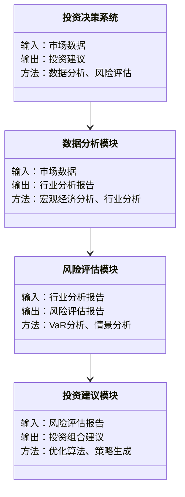
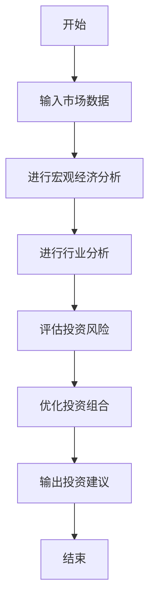

                 


# 《约翰邓普顿的新兴市场投资》

---

## 关键词：
约翰·邓普顿，新兴市场，投资策略，风险管理，案例分析，投资组合优化

---

## 摘要：
本文深入探讨了约翰·邓普顿在新兴市场投资中的独特理念和策略。通过分析他的投资哲学、新兴市场的特点、行业分析方法以及风险控制措施，我们揭示了如何在新兴市场中实现长期稳定的收益。文章结合数学模型和实际案例，详细阐述了投资组合优化的原理和实践，并提供了实用的系统架构设计和投资决策流程。最后，我们总结了约翰·邓普顿的投资智慧，并提出了在实际投资中需要注意的关键点和建议。

---

## 正文：

### 第一部分：约翰·邓普顿的投资理念与新兴市场概述

#### 第1章：约翰·邓普顿的投资哲学

##### 1.1 约翰·邓普顿的生平简介
约翰·邓普顿（John Templeton）是20世纪著名的投资家之一，被誉为“投资界的先知”。他出生于英国，后移居美国，并在投资领域取得了卓越成就。邓普顿的投资哲学以“长期投资、价值投资”为核心，强调在市场波动中寻找低估资产，并通过分散投资降低风险。

**约翰·邓普顿的投资理念总结**  
邓普顿认为，投资不仅是对市场的理解，更是对人性的洞察。他强调在市场恐慌时寻找机会，在市场狂热时保持冷静。这种逆向思维是他在新兴市场投资中取得成功的关键。

##### 1.2 新兴市场的定义与特点
**新兴市场的定义**  
新兴市场是指那些经济增长迅速、但市场机制尚未完全成熟的国家或地区，如中国、印度、巴西等。

**新兴市场的特点**  
- 经济增长快，但波动性大。  
- 市场流动性相对不足，价格波动剧烈。  
- 政治和经济政策变化对市场影响显著。  

---

#### 第2章：约翰·邓普顿的新兴市场投资策略

##### 2.1 约翰·邓普顿的投资原则
**长期投资原则**  
邓普顿主张长期持有优质资产，避免频繁交易，以降低交易成本并捕捉长期增长。

**价值投资原则**  
他强调寻找那些市场价格低于其内在价值的资产，尤其在市场恐慌时买入低估资产。

**分散投资原则**  
通过分散投资于不同行业和地区的资产，降低特定风险。

##### 2.2 新兴市场的投资策略
**新兴市场的行业选择**  
邓普顿倾向于投资那些在新兴市场中具有竞争优势的行业，如科技、消费和金融行业。

**新兴市场的公司分析**  
他强调对公司基本面的深入分析，包括财务状况、管理层能力和行业地位。

**新兴市场的风险控制**  
邓普顿通过设定止损点和分散投资来应对新兴市场的高波动性风险。

---

### 第二部分：新兴市场的经济与行业分析

#### 第3章：新兴市场的宏观经济分析

##### 3.1 宏观经济环境对投资的影响
**经济周期与投资策略**  
在经济扩张期，应增加对周期性行业的投资；在经济衰退期，应转向防御性行业。

**利率与货币政策对投资的影响**  
低利率环境通常有利于股市表现，而高利率可能导致市场估值下降。

**通货膨胀与通货紧缩的影响**  
通货膨胀会侵蚀资产的实际回报，而通货紧缩可能导致市场低估。

##### 3.2 新兴市场的经济结构分析
**产业结构**  
新兴市场的产业结构以制造业和服务业为主，尤其是科技行业的崛起。

**消费结构**  
随着中产阶级的扩大，消费行业（如零售、食品饮料）成为投资重点。

**金融结构**  
新兴市场的金融体系逐步完善，但与发达市场相比仍存在差距。

---

#### 第4章：新兴市场的行业分析

##### 4.1 新兴市场的重点行业
**高科技行业**  
新兴市场的科技公司往往具有高增长潜力，尤其是互联网和人工智能领域。

**消费行业**  
随着人口增长和消费习惯的变化，消费行业（如电商、家电）具有较大投资价值。

**金融行业**  
新兴市场的金融行业正在快速发展，银行、保险等领域的投资机会显著。

##### 4.2 行业分析方法
**行业生命周期分析**  
通过分析行业的生命周期阶段，选择处于成长期或成熟期的行业。

**行业竞争分析**  
研究行业内的主要竞争对手，选择具有竞争优势的企业。

**行业财务分析**  
通过财务指标（如ROE、净利润率）评估行业的盈利能力。

---

### 第三部分：约翰·邓普顿投资策略的数学模型与系统分析

#### 第5章：投资组合优化的数学模型

##### 5.1 投资组合优化的基本原理
**投资组合的期望收益与风险**  
投资组合的收益可以用期望值表示，而风险则通过方差衡量。

**马科维茨的有效前沿理论**  
马科维茨提出，通过优化投资组合的收益与风险关系，可以找到最优投资组合。

##### 5.2 投资组合优化的数学模型
**均值-方差优化模型**  
$$ \text{目标：} \min \sigma^2 \quad \text{约束：} \sum w_i r_i = R, \sum w_i = 1 $$
其中，\( w_i \) 是资产 \( i \) 的权重，\( r_i \) 是资产 \( i \) 的期望收益，\( R \) 是投资组合的期望收益，\( \sigma^2 \) 是投资组合的风险。

---

#### 第6章：系统架构设计与投资决策流程

##### 6.1 投资决策系统架构
**系统功能设计（领域模型）**  


##### 6.2 投资决策流程图


---

### 第四部分：项目实战与案例分析

#### 第7章：新兴市场的投资实战

##### 7.1 环境安装与数据准备
**环境安装**  
- 安装Python和相关库（如pandas、numpy、scipy）。
- 数据来源：新兴市场的宏观经济数据和行业数据。

##### 7.2 核心实现代码
```python
import numpy as np
import pandas as pd

# 示例数据：新兴市场的行业指数
index_data = pd.read_csv('em_indices.csv')

# 计算行业风险
def calculate_risk(data):
    return np.std(data['returns'])

# 优化投资组合
def optimize_portfolio(data, target_return):
    n = len(data.columns)
    returns = data.cov()
    returns = returns.values
    weights = np.zeros(n)
    weights[0] = 1.0
    for i in range(100):
        # 计算当前权重下的收益和风险
        current_return = np.dot(weights, returns)
        current_risk = np.sqrt(np.dot(weights.T, returns @ weights))
        # 调整权重以匹配目标收益
        if current_return < target_return:
            weights += 0.1 * (1 - weights.sum())
        else:
            weights *= 0.9
    return weights

# 应用优化算法
target_return = 0.15
weights = optimize_portfolio(index_data, target_return)
print("最优权重：", weights)
print("最优风险：", calculate_risk(weights))
```

---

#### 第8章：案例分析与策略解读

##### 8.1 理论与实践的结合
通过具体案例分析，邓普顿在新兴市场的投资策略如何在实际操作中得以实现，包括行业选择、风险控制和投资组合优化。

##### 8.2 投资策略的数学模型应用
结合案例数据，使用上述优化算法，展示如何在实际投资中选择最优权重并实现目标收益。

---

### 第五部分：总结与展望

#### 第9章：总结与启示

##### 9.1 约翰·邓普顿的投资智慧
- 长期投资与价值投资的重要性。
- 在新兴市场中，行业分析与风险管理是关键。

##### 9.2 对投资者的建议
- 保持对市场的长期关注，避免短期波动干扰。
- 在新兴市场中，行业选择和公司基本面分析是核心。

#### 第10章：未来趋势与投资展望

##### 10.1 新兴市场的未来趋势
随着全球经济的变化，新兴市场将继续在全球化和科技革命中扮演重要角色。

##### 10.2 投资者的最佳实践
- 持续学习，关注新兴市场的最新动态。
- 灵活调整投资策略，适应市场变化。

---

## 最佳实践 Tips:
- 在新兴市场投资时，一定要关注宏观经济环境和行业趋势。
- 使用数学模型和系统分析工具，优化投资组合。
- 保持对市场的敏感性，灵活调整投资策略。

---

通过本文的系统分析和实际案例，我们深入探讨了约翰·邓普顿在新兴市场投资中的智慧和策略。希望读者能够从中获得启发，并在实际投资中取得成功。

--- 

如果需要进一步了解投资策略，可以参考以下书籍：
1. 《The Intelligent Investor》
2. 《新兴 Markets》

