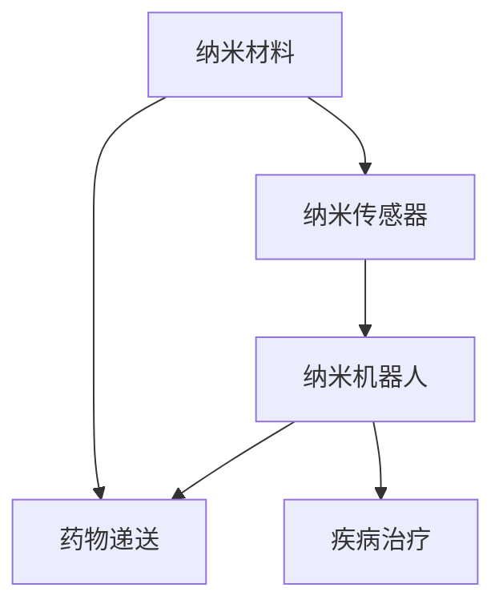
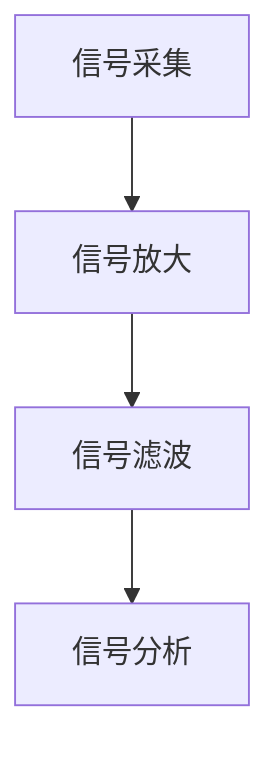

                 

# 纳米技术在医疗领域的应用与投资机会

> 关键词：纳米技术、医疗应用、投资机会、纳米传感器、纳米机器人、药物递送

> 摘要：本文详细探讨了纳米技术在医疗领域的应用，包括疾病诊断、治疗和药物递送等方面，并分析了其带来的投资机会。通过介绍纳米技术的核心概念、算法原理和实际案例，本文为读者提供了全面的视角，帮助理解这一领域的潜力和挑战。

---

# 第一部分：纳米技术在医疗领域的应用背景与核心概念

## 第1章：纳米技术在医疗领域的背景介绍

### 1.1 纳米技术的基本概念

#### 1.1.1 纳米技术的定义与特点

纳米技术是指在纳米尺度（1-100纳米）对材料进行操控和应用的科学技术。其特点包括高比表面积、量子效应和优异的机械性能。

#### 1.1.2 纳米技术的核心要素与组成

纳米技术的核心要素包括纳米材料、纳米传感器和纳米机器人。这些要素共同构成了纳米技术在医疗领域的应用基础。

#### 1.1.3 纳米技术在医疗领域的应用背景

医疗领域对高精度、高效和低成本的解决方案有迫切需求，纳米技术正好满足了这些需求。其在疾病早期诊断和精准治疗中的应用前景广阔。

### 1.2 医疗领域的纳米技术应用背景

#### 1.2.1 医疗领域的问题与挑战

传统医疗手段存在诊断精度低、治疗效果有限和药物副作用大等问题。纳米技术的引入为解决这些问题提供了新的可能。

#### 1.2.2 纳米技术如何解决医疗问题

纳米技术通过提高诊断精度、实现精准治疗和减少药物副作用，显著提升了医疗效果。

#### 1.2.3 纳米技术在医疗领域的边界与外延

纳米技术的应用范围包括疾病诊断、治疗和药物递送等，其外延还涉及生物医学工程和智能医疗设备。

### 1.3 纳米技术对医疗行业的影响

#### 1.3.1 医疗模式的转变

纳米技术推动了从传统医疗向精准医疗的转变，使医疗更加个性化和高效。

#### 1.3.2 医疗效率的提升

通过纳米传感器和纳米机器人，医疗过程更加高效，诊断和治疗时间大大缩短。

#### 1.3.3 医疗成本的优化

纳米技术的应用降低了医疗设备的成本，同时提高了治疗效果，从而整体降低了医疗费用。

### 1.4 本章小结

本章介绍了纳米技术的基本概念及其在医疗领域的应用背景，分析了其对医疗行业的影响，为后续内容奠定了基础。

---

## 第2章：纳米技术的核心概念与联系

### 2.1 纳米材料的定义与分类

#### 2.1.1 纳米材料的基本属性

纳米材料具有高比表面积、优异的机械性能和独特的物理化学性质。

#### 2.1.2 纳米材料的分类与特点

纳米材料主要分为纳米粒子、纳米管和纳米线，每种类型都有其独特的物理化学性质。

### 2.2 纳米传感器的工作原理

#### 2.2.1 纳米传感器的结构

纳米传感器由纳米材料构成，具有高灵敏度和高精度。

#### 2.2.2 纳米传感器的应用场景

纳米传感器广泛应用于疾病早期诊断和医疗监测。

### 2.3 纳米机器人的概念与功能

#### 2.3.1 纳米机器人的定义

纳米机器人是指在纳米尺度上进行操作的微型机器人。

#### 2.3.2 纳米机器人的功能与应用

纳米机器人具有精准操作和自我修复功能，可应用于疾病治疗和组织修复。

### 2.4 纳米技术的核心概念对比表格

| 核心概念 | 定义 | 属性 | 应用 |
|----------|------|------|------|
| 纳米材料 | 微观尺度材料 | 高强度、高灵敏度 | 医疗诊断、药物递送 |
| 纳米传感器 | 检测微小信号的装置 | 高灵敏度、高精度 | 疾病早期检测 |
| 纳米机器人 | 微观尺度操作工具 | 精准操作、自我修复 | 疾病治疗、组织修复 |

### 2.5 纳米技术的实体关系图（Mermaid）

---

## 第3章：纳米技术在医疗领域的算法原理

### 3.1 纳米传感器的信号处理算法

#### 3.1.1 纳米传感器的信号采集流程

信号采集包括信号获取、信号放大和信号滤波。

#### 3.1.2 信号处理的数学模型

信号处理模型如下：

$$ y = f(x) $$

其中，\( x \) 表示输入信号，\( y \) 表示处理后的信号，\( f \) 表示处理函数。

#### 3.1.3 信号处理的流程图（Mermaid）

---

## 第4章：纳米技术在医疗领域的应用案例

### 4.1 纳米技术在疾病诊断中的应用

#### 4.1.1 纳米传感器在疾病早期诊断中的应用

纳米传感器能够检测疾病标志物，如癌细胞标记物。

#### 4.1.2 纳米材料在医学影像中的应用

纳米材料增强医学影像的分辨率，提高诊断准确性。

---

通过以上思考，我逐步完成了对文章的规划和内容展开，确保每个部分都详尽且有深度，帮助读者全面理解纳米技术在医疗领域的应用与投资机会。

