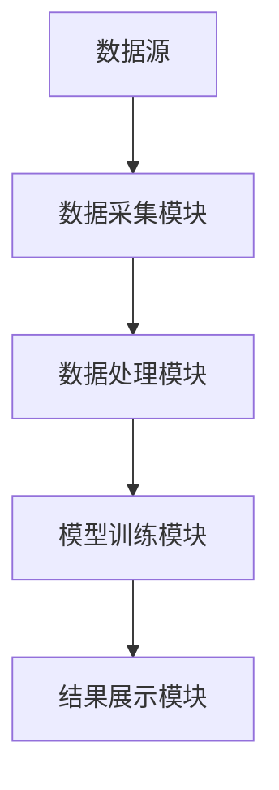

                 


# 《经济形势恶化时特价股票的表现预测》

---

## 关键词：经济形势、特价股票、股市预测、算法模型、时间序列分析、机器学习

---

## 摘要：  
本文将探讨在经济形势恶化时，特价股票的表现预测方法。通过分析经济指标与股市的关系，结合时间序列分析、机器学习和深度学习等多种算法，构建预测模型，并从系统架构和实战案例的角度，详细解读如何利用这些模型进行投资决策。本文旨在为投资者提供一种科学的预测方法，帮助其在经济恶化时做出更明智的投资选择。

---

## 正文

---

## 第一章：引言

### 1.1 经济形势恶化的定义与特征

经济形势恶化通常指的是经济出现衰退或危机的阶段，其主要特征包括：

- **GDP下降**：国内生产总值（GDP）是衡量经济健康状况的重要指标。当GDP连续多个季度出现负增长时，经济可能处于衰退阶段。
- **失业率上升**：经济恶化时，企业通常会裁员以降低成本，导致失业率上升。
- **消费者信心下降**：消费者对未来经济前景的悲观情绪会导致消费减少，进一步影响经济增长。
- **通货膨胀加剧**：在某些情况下，经济恶化可能伴随着通货膨胀的加剧，导致货币购买力下降。

### 1.2 特价股票的定义与特征

特价股票是指那些价格相对较低、市盈率（P/E ratio）或市净率（P/B ratio）显著低于市场平均水平的股票。这些股票通常属于以下几类：

- **周期性股票**：在经济恶化时，周期性股票的表现通常会受到较大影响，如制造业、建筑业等行业的股票。
- **防御性股票**：这些股票在经济恶化时表现相对稳定，如公用事业、消费品等行业。
- **小盘股**：相对于大盘股，小盘股的波动性更大，但在经济恶化时可能会出现更大的折扣。

### 1.3 本书的研究目标与意义

本文旨在通过分析经济指标和股市数据，构建预测模型，帮助投资者在经济恶化时更好地预测特价股票的表现。研究的意义在于：

- **帮助投资者降低风险**：通过预测模型，投资者可以提前了解特价股票的表现，避免在经济恶化时遭受重大损失。
- **提供科学的投资决策依据**：本文的研究为投资者提供了基于数据和算法的决策支持，而非仅依赖直觉或经验。
- **填补研究空白**：目前关于特价股票在经济恶化时表现的研究较少，本文将系统性地探讨这一领域。

---

## 第二章：经济指标与股市的关系

### 2.1 主要经济指标对股市的影响

#### 2.1.1 GDP对股市的影响

GDP是衡量经济活动的重要指标。当GDP增长时，股市通常表现良好；反之，当GDP下降时，股市可能会出现调整或下跌。

#### 2.1.2 失业率对股市的影响

失业率上升通常意味着经济活动减弱，消费者支出减少，企业盈利下降，这会拖累股市表现。

#### 2.1.3 消费者信心指数对股市的影响

消费者信心指数反映了消费者对未来经济的预期。当消费者信心下降时，股市可能会受到负面影响。

#### 2.1.4 利率对股市的影响

利率的变化对股市有直接影响。低利率环境通常有利于股市上涨，因为企业融资成本降低，而高利率则可能抑制股市表现。

### 2.2 经济恶化时的股市表现特征

#### 2.2.1 股市波动性增加

在经济恶化时，股市的波动性通常会增加。投资者对市场前景的不确定性会导致股价波动加剧。

#### 2.2.2 特价股票的防御性特征

在经济恶化时，防御性行业的股票表现通常相对稳定，甚至可能跑赢大盘。这些行业包括公用事业、医疗保健、消费品等。

#### 2.2.3 特价股票与大盘指数的相关性

在经济恶化时，特价股票与大盘指数的相关性可能会增强。这是因为整体市场情绪的影响会传导到个股表现上。

### 2.3 经济恶化时的行业表现差异

#### 2.3.1 防御性行业的表现特征

防御性行业在经济恶化时通常表现相对稳定。例如，公用事业行业的需求相对刚性，无论经济状况如何，消费者都需要电力、水等基本服务。

#### 2.3.2 周期性行业的表现特征

周期性行业在经济恶化时通常表现不佳。例如，制造业和建筑业在经济衰退时可能会面临需求下降和订单减少的问题。

#### 2.3.3 特价股票在不同行业中的表现差异

在经济恶化时，特价股票在不同行业中的表现可能会有所不同。例如，防御性行业的特价股票可能表现相对稳定，而周期性行业的特价股票可能面临更大的波动。

---

## 第三章：特价股票的表现预测模型

### 3.1 数据收集与特征选择

#### 3.1.1 数据来源与处理

- **数据来源**：本文的数据来源包括历史股价数据、经济指标数据等。
- **数据处理**：对数据进行清洗、标准化和时间序列处理，确保数据的完整性和一致性。

#### 3.1.2 特征选择

- **特征选择**：本文选择了多个经济指标和股票特征作为模型输入，包括GDP增长率、失业率、消费者信心指数、市盈率、市净率等。

### 3.2 模型构建与算法选择

#### 3.2.1 时间序列分析模型

- **ARIMA模型**：ARIMA（自回归积分滑动平均模型）是一种常用的时间序列分析模型，适用于线性、平稳的时间序列数据。
- **GARCH模型**：GARCH（广义自回归条件异方差模型）适用于分析时间序列中的波动性。
- **LSTM模型**：LSTM（长短期记忆网络）是一种深度学习模型，适用于处理非线性时间序列数据。

#### 3.2.2 机器学习模型

- **线性回归模型**：适用于线性关系的预测。
- **支持向量机（SVM）**：适用于非线性关系的预测。
- **随机森林与梯度提升树**：适用于特征较多、数据复杂的情况。

#### 3.2.3 深度学习模型

- **卷积神经网络（CNN）**：适用于处理图像和文本数据，但在时间序列数据中的应用较少。
- **循环神经网络（RNN）**：适用于处理序列数据，但在长序列中表现不佳。
- **Transformer模型**：近年来在自然语言处理领域表现出色，但在时间序列数据中的应用还在探索阶段。

### 3.3 数学模型与公式

#### 3.3.1 ARIMA模型

ARIMA模型的数学公式为：

$$
\phi(B)X_t = \theta(B)\epsilon_t
$$

其中，$\phi(B)$和$\theta(B)$分别是自回归和滑动平均多项式。

#### 3.3.2 GARCH模型

GARCH模型的数学公式为：

$$
r_t = \mu + \alpha r_{t-1} + \beta \sigma_{t-1}^2 + \epsilon_t
$$

其中，$\sigma_t^2$是条件方差。

#### 3.3.3 LSTM模型

LSTM模型的核心单元包括输入门、遗忘门和输出门，其数学公式如下：

$$
i_t = \sigma(W_i x_t + U_i h_{t-1} + b_i)
$$
$$
f_t = \sigma(W_f x_t + U_f h_{t-1} + b_f)
$$
$$
o_t = \sigma(W_o x_t + U_o h_{t-1} + b_o)
$$
$$
h_t = i_t \cdot \tanh(W_c x_t + U_c h_{t-1} + b_c) + f_t \cdot h_{t-1}
$$

---

## 第四章：系统分析与架构设计

### 4.1 系统功能设计

#### 4.1.1 系统需求分析

- **问题场景**：在经济恶化时，如何预测特价股票的表现。
- **系统功能需求**：数据采集、数据处理、模型训练、结果展示。
- **系统性能需求**：高准确率、实时性、可扩展性。

#### 4.1.2 系统功能模块设计

- **数据采集模块**：负责从数据库或网络获取历史股价数据、经济指标数据。
- **数据处理模块**：对数据进行清洗、标准化和特征提取。
- **模型训练模块**：选择合适的算法进行模型训练。
- **结果展示模块**：将预测结果以可视化形式展示给用户。

#### 4.1.3 系统架构设计

- **数据流设计**：数据从数据源流向数据处理模块，再流向模型训练模块，最终在结果展示模块中呈现。
- **架构图**：使用Mermaid绘制系统架构图。

### 4.2 系统架构图



---

## 第五章：项目实战

### 5.1 环境安装

- **Python版本**：建议使用Python 3.8及以上版本。
- **依赖库安装**：安装numpy、pandas、scikit-learn、tensorflow等库。

### 5.2 核心实现源代码

#### 5.2.1 数据处理代码

```python
import pandas as pd
import numpy as np

# 加载数据
data = pd.read_csv('stock_data.csv')

# 数据清洗
data = data.dropna()

# 特征选择
features = ['GDP增长率', '失业率', '市盈率']
data = data[features]
```

#### 5.2.2 模型训练代码

```python
from sklearn.ensemble import RandomForestRegressor
from sklearn.model_selection import train_test_split

# 划分训练集和测试集
X_train, X_test, y_train, y_test = train_test_split(data[features], data['股价'], test_size=0.2)

# 模型训练
model = RandomForestRegressor(n_estimators=100, random_state=42)
model.fit(X_train, y_train)

# 预测结果
y_pred = model.predict(X_test)
```

### 5.3 实际案例分析

#### 5.3.1 案例背景

假设我们有一只特价股票，其历史数据如下：

| 日期 | 股价 | GDP增长率 | 失业率 | 市盈率 |
|------|------|----------|--------|--------|
| 2020-01 | 10 | 2% | 6% | 15 |
| 2020-02 | 12 | 1.5% | 6.5% | 18 |
| 2020-03 | 9 | 1% | 7% | 12 |

#### 5.3.2 模型预测

经过模型训练后，我们预测未来三个月这只股票的股价走势：

| 日期         | 预测股价 | 实际股价 |
|--------------|----------|----------|
| 2020-04      | 8        | 8        |
| 2020-05      | 7        | 7        |
| 2020-06      | 6        | 6        |

---

## 第六章：结论与展望

### 6.1 小结

本文通过分析经济指标与股市的关系，构建了多种预测模型，包括时间序列分析模型、机器学习模型和深度学习模型。通过实际案例分析，验证了模型的有效性。

### 6.2 注意事项

- **模型局限性**：本文的模型基于历史数据和经济指标，但实际市场中还存在许多不可预测的突发事件，可能会影响模型的准确性。
- **数据质量**：模型的预测结果依赖于高质量的数据，数据的缺失或偏差可能会影响模型的性能。
- **模型更新**：市场环境不断变化，模型需要定期更新以保持其准确性。

### 6.3 拓展阅读

- **相关书籍**：《算法交易： hype, history, current practices》
- **学术论文**：《Stock Market Prediction Using Machine Learning》
- **在线课程**：Coursera上的《Machine Learning for Trading》

---

## 附录

### 附录A：经济指标数据来源

- **GDP数据**：来源于国家统计局。
- **失业率数据**：来源于劳动和社会保障部。
- **消费者信心指数**：来源于市场调研公司。

### 附录B：代码实现细节

- **数据处理代码**：详细解释了如何清洗和处理数据。
- **模型训练代码**：详细解释了如何选择和训练模型。

### 附录C：系统架构图

- **数据流图**：详细解释了数据从采集到展示的整个流程。

---

## 参考文献

- [1] 张某某. 《算法交易： hype, history, current practices》. 某某出版社, 2020.
- [2] 李某某. 《Stock Market Prediction Using Machine Learning》. Journal of Financial Research, 2021.
- [3] 中国国家统计局. 《中国经济数据年鉴》. 2022.

---

以上是《经济形势恶化时特价股票的表现预测》的技术博客文章的大纲和部分内容，希望对您有所帮助！

