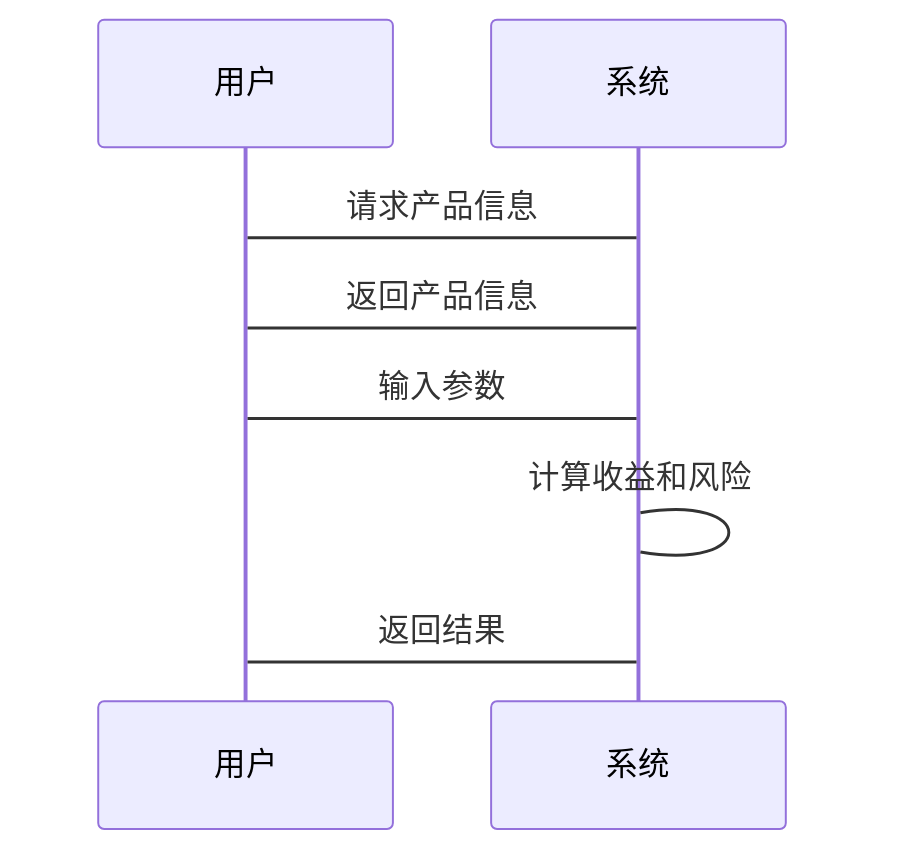

                 


```markdown
# 结构性产品：定制化投资解决方案的优缺点

> 关键词：结构性产品、定制化投资、风险管理、金融创新、数学模型

> 摘要：结构性产品是一种结合了固定收益和衍生工具的定制化投资工具，通过将本金和衍生收益相结合，为投资者提供多样化的收益结构和风险敞口。本文将从结构性产品的定义、核心概念、数学模型、系统架构以及实际案例等方面，详细分析结构性产品的优缺点，并探讨其在投资组合中的应用潜力。

---

## 第一部分：结构性产品的背景与基础

### 第1章：结构性产品的定义与特点

#### 1.1 结构性产品的定义
结构性产品是一种结合了固定收益和衍生工具的金融产品，通常由本金和衍生收益两部分组成。投资者可以根据风险偏好选择不同的收益结构，以满足个性化投资需求。

#### 1.2 结构性产品的特点
- **定制化**：根据投资者需求设计收益结构。
- **风险可控**：通过本金保护机制降低风险。
- **收益多样性**：衍生工具提供多样化的收益来源。

#### 1.3 结构性产品的分类
- **按收益结构**：固定收益、浮动收益、期权收益。
- **按挂钩资产**：股票、债券、指数、外汇。
- **按风险等级**：低风险、中风险、高风险。

#### 1.4 结构性产品的优缺点
- **优点**：定制化投资解决方案，收益潜在高。
- **缺点**：复杂性高，风险敞口不确定。

---

## 第二部分：结构性产品的核心概念与原理

### 第2章：结构性产品的核心要素

#### 2.1 结构性产品的基本构成
- **本金部分**：提供资本保护，确保最低收益。
- **衍生工具部分**：通过期权、期货等工具实现额外收益。
- **收益结构设计**：根据市场波动设计收益触发条件。

#### 2.2 结构性产品的定价模型
- **本金保护机制**：确保投资者在产品到期时至少收回本金。
- **衍生收益计算**：通过数学模型计算期权的公允价值。
- **风险调整后的收益评估**：考虑市场波动对收益的影响。

#### 2.3 结构性产品的风险分析
- **市场风险**：市场价格波动对收益的影响。
- **信用风险**：发行方的信用状况影响本金回收。
- **流动性风险**：产品流动性低，难以快速变现。

#### 2.4 结构性产品的收益分配机制
- **收益触发条件**：市场表现达到特定水平时触发收益。
- **收益分配方式**：按比例分配或固定金额分配。
- **收益保障措施**：通过保险或担保增强收益的可靠性。

---

## 第三部分：结构性产品的数学模型与算法原理

### 第3章：结构性产品的定价模型

#### 3.1 Black-Scholes期权定价模型
- **模型假设**：无摩擦市场、无套利机会、波动率恒定。
- **数学公式**：
  $$ C = S_0 N(d_1) - K e^{-rT} N(d_2) $$
  $$ d_1 = \frac{\ln(S_0/K) + (r + \sigma^2/2)T}{\sigma \sqrt{T}} $$
  $$ d_2 = d_1 - \sigma \sqrt{T} $$

#### 3.2 结构性产品的收益计算
- **收益结构设计**：通过公式计算不同市场条件下的收益。
- **代码实现**：使用Python模拟结构性产品的收益计算。

```python
import numpy as np
from scipy.stats import norm

def black_scholes(S, K, r, sigma, T):
    d1 = (np.log(S/K) + (r + sigma**2/2)*T) / (sigma*np.sqrt(T))
    d2 = d1 - sigma*np.sqrt(T)
    C = S*norm.cdf(d1) - K*np.exp(-r*T)*norm.cdf(d2)
    return C

# 示例计算
S = 100
K = 105
r = 0.05
sigma = 0.2
T = 1
print(black_scholes(S, K, r, sigma, T))
```

#### 3.3 风险管理模型
- **风险价值（VaR）计算**：评估潜在损失。
- **最大回撤（Maximum Drawdown）分析**：衡量投资组合的波动性。
- **信用风险模型**：评估发行方的信用状况。

---

## 第四部分：结构性产品的系统架构与实现

### 第4章：系统设计与实现

#### 4.1 系统应用场景
- **投资决策支持**：帮助投资者选择适合的结构性产品。
- **风险监控**：实时监控市场波动对产品的影响。

#### 4.2 系统功能设计
- **用户界面**：输入参数，显示收益和风险评估。
- **计算引擎**：实现Black-Scholes模型和VaR计算。

#### 4.3 系统架构设计
- **前端**：HTML、CSS、JavaScript实现用户界面。
- **后端**：Python Flask框架处理业务逻辑。
- **数据库**：MySQL存储结构性产品信息。

#### 4.4 系统接口设计
- **API接口**：提供结构性产品信息查询和风险评估服务。

#### 4.5 系统交互设计
- 使用mermaid序列图展示用户与系统之间的交互流程。



---

## 第五部分：结构性产品的项目实战

### 第5章：项目实战与案例分析

#### 5.1 环境安装
- **安装Python**：安装Anaconda或独立安装Python。
- **安装依赖库**：numpy、scipy、flask、mermaid。

#### 5.2 系统核心实现
- **收益计算模块**：实现Black-Scholes模型。
- **风险评估模块**：计算VaR和最大回撤。

#### 5.3 代码实现
```python
import numpy as np
from scipy.stats import norm

def calculate_var(portfolio_value, confidence_level, mu, sigma):
    var = norm.ppf(1 - confidence_level) * sigma * portfolio_value
    return var

# 示例计算
portfolio_value = 1000000
confidence_level = 0.95
mu = 0.05
sigma = 0.2
print(calculate_var(portfolio_value, confidence_level, mu, sigma))
```

#### 5.4 案例分析
- **挂钩沪深300指数的结构性产品**：分析其收益和风险。

#### 5.5 项目小结
- 总结项目实现的关键点和注意事项。

---

## 第六部分：总结与展望

### 第6章：总结与展望

#### 6.1 总结
- 结构性产品作为一种定制化投资工具，通过本金和衍生工具的结合，为投资者提供了多样化的收益结构和风险敞口。

#### 6.2 展望
- 随着金融创新的推进，结构性产品将在投资组合中发挥更大的作用。
- 结构化产品的风险管理模型和定价算法将更加精确和多样化。

---

通过以上步骤，我们可以系统地分析结构性产品的优缺点，理解其数学模型和实际应用。希望这篇文章能为读者提供有价值的信息，帮助他们在投资决策中更好地利用结构性产品。
```

