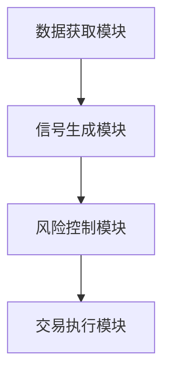

                 


# 统计套利：利用价格偏离进行中性市场投资

## 关键词：统计套利，市场中性，价格偏离，投资策略，风险控制

## 摘要：统计套利是一种利用资产价格短期偏离均值的交易策略，通过市场中性投资来捕捉价格恢复的收益。本文详细介绍了统计套利的核心概念、算法原理、系统架构以及实战应用，帮助读者理解如何在金融市场中运用统计套利进行投资。

---

## 第1章: 统计套利的背景与核心概念

### 1.1 统计套利的定义与背景

统计套利是一种利用资产价格短期偏离均值的交易策略，通过市场中性投资来捕捉价格恢复的收益。它结合了统计学和金融学，旨在降低市场风险，专注于价格偏离带来的套利机会。

#### 1.1.1 统计套利的基本概念
统计套利的核心在于利用资产价格的短期波动，通过市场中性策略消除Beta风险，专注于Alpha收益。其基本假设是价格偏离均值的现象会逆转，从而为套利者提供机会。

#### 1.1.2 统计套利与传统套利的区别
| 特性                | 统计套利            | 传统套利           |
|---------------------|---------------------|---------------------|
| 基础假设            | 均值回归            | 价格差异           |
| 风险类型            | 市场中性，降低Beta    | 利率差异           |
| 适用场景            | 股票、期货等         | 跨市场或资产       |

#### 1.1.3 统计套利在金融市场中的地位
统计套利是量化投资的重要组成部分，通过算法交易和大数据分析，帮助投资者在复杂市场中寻找稳定收益。

### 1.2 统计套利的历史发展

统计套利起源于20世纪，随着计算机技术的发展逐渐成熟。它从简单的配对交易扩展到复杂的算法套利，成为现代金融的重要工具。

### 1.3 统计套利的理论基础

统计套利基于均值回归理论，认为价格偏离均值是暂时的，最终会回归。市场中性策略通过多空对冲，消除系统性风险。

### 1.4 统计套利的优势与局限性

- **优势**：风险低、收益稳定。
- **局限性**：依赖假设，市场深度不足。

---

## 第2章: 统计套利的核心概念

### 2.1 市场中性投资策略

市场中性策略通过多空对冲，消除Beta风险，专注于Alpha收益。其实现方式包括配对交易和动量策略。

### 2.2 统计套利的数学模型

统计套利的核心模型包括CAPM和均值回归模型。CAPM公式为：
$$ E(r_i) = R_f + β_i (E(r_m) - R_f) $$

### 2.3 统计套利的核心要素

- **价格偏离度量**：计算资产价格与均值的偏离程度。
- **市场中性条件**：确保组合的Beta为零。
- **交易策略**：根据偏离程度决定买卖时机。

---

## 第3章: 统计套利的算法原理

### 3.1 统计套利的经典算法

- **配对交易**：通过配对资产进行多空对冲。
- **动量策略**：基于动量效应，投资动量高的资产。
- **均值回归模型**：利用价格回归均值的机会。

### 3.2 统计套利算法的实现步骤

1. 数据收集与预处理：获取历史价格数据，处理缺失值。
2. 计算价格偏离：使用z-score指标衡量偏离程度。
3. 生成交易信号：设定阈值，当偏离超过阈值时触发交易。
4. 风险控制：设置止损和止盈，控制仓位。

### 3.3 统计套利算法的优化与改进

- **参数优化**：调整窗口长度和偏离阈值。
- **模型改进**：引入机器学习算法，如回归分析。
- **策略组合**：结合多种策略降低风险。

---

## 第4章: 统计套利的系统架构设计

### 4.1 统计套利系统的功能模块

- **数据获取模块**：连接数据源，获取实时数据。
- **信号生成模块**：计算偏离度，生成交易信号。
- **风险控制模块**：评估风险，调整仓位。
- **交易执行模块**：下单交易，记录交易结果。

### 4.2 统计套利系统的架构图



### 4.3 统计套利系统的接口设计

- **数据接口**：与数据源对接，获取市场数据。
- **交易接口**：连接交易系统，执行订单。
- **用户接口**：提供操作界面，展示信号和结果。

---

## 第5章: 统计套利的项目实战

### 5.1 环境安装

安装Python、Pandas、NumPy、Matplotlib和QuantLib等工具。

### 5.2 核心实现代码

```python
import pandas as pd
import numpy as np

def calculate_zscore(prices, window=20):
    mean = prices.rolling(window).mean()
    std = prices.rolling(window).std()
    zscore = (prices - mean) / std
    return zscore

# 示例数据
prices = pd.DataFrame({'price': [100, 102, 98, 105, 95]})
window = 3
zscore = calculate_zscore(prices['price'], window)
print(zscore)
```

### 5.3 案例分析

以两只股票为例，计算它们的价格偏离，当Z-score超过1时买入，低于-1时卖出。

### 5.4 项目总结

通过实战，读者可以理解统计套利的实现过程，掌握关键算法和系统设计。

---

## 第6章: 统计套利的总结与展望

### 6.1 总结

统计套利通过市场中性策略，利用价格偏离进行套利，帮助投资者降低风险，实现稳定收益。

### 6.2 投资建议

- 理解均值回归理论，选择优质资产。
- 注意风险控制，避免过度交易。

### 6.3 未来展望

统计套利将结合AI和大数据，进一步提升交易效率和收益。

---

## 参考文献

- 股票投资策略相关书籍
- 统计套利算法的经典论文
- 金融市场分析的相关文献

---

通过本文，读者可以系统地理解统计套利的概念、算法和应用，掌握市场中性投资策略，实现稳健投资。

