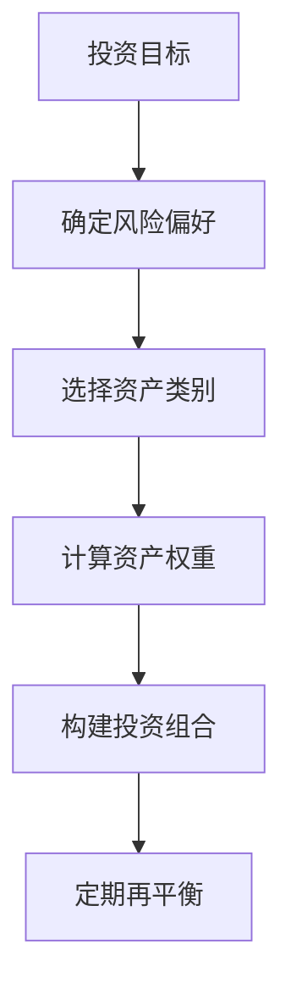
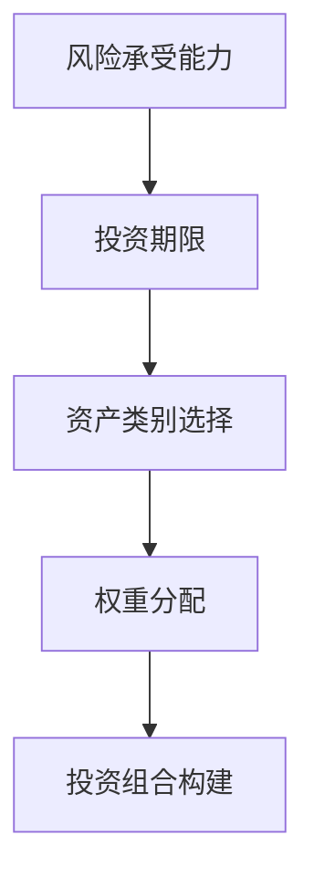
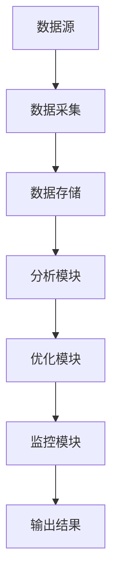

                 


# 综合四大师智慧：构建现代投资组合

## 关键词：投资组合，价值投资，成长股，长期投资，现代投资组合理论，风险管理

## 摘要：本文综合了四位投资大师的智慧，结合现代投资组合理论和风险管理，详细讲解如何构建一个科学、稳健的投资组合。通过理论分析、数学建模、系统设计和实战案例，帮助投资者掌握构建投资组合的核心方法。

---

## 第一部分：引言

### 第1章：投资组合的重要性

#### 1.1 投资组合的核心概念
- **1.1.1 投资组合的定义**
  - 投资组合是指将资金分配到不同资产（如股票、债券、房地产等）上的策略，以分散风险并最大化收益。
- **1.1.2 投资组合的目的**
  - 通过多样化投资降低风险，同时追求长期收益。
- **1.1.3 投资组合的风险与收益**
  - 风险与收益成正比，投资组合通过优化资产配置，平衡风险与收益。

---

## 第二部分：投资理论基础

### 第2章：本杰明·格雷厄姆的价值投资

#### 2.1 格雷厄姆的理论概述
- **2.1.1 价值投资的基本原则**
  - 买入低于内在价值的股票，长期持有。
- **2.1.2 股票的安全边际**
  - 安全边际 = 内在价值 - 市场价格，确保投资的安全性。
- **2.1.3 格雷厄姆的投资策略**
  - 专注于基本面分析，寻找被市场低估的企业。

### 第3章：菲利普·费雪的成长股投资

#### 3.1 费雪的理论概述
- **3.1.1 成长股的定义**
  - 成长股是指那些收入和利润持续增长的公司的股票。
- **3.1.2 投资成长股的策略**
  - 长期持有，耐心等待公司成长。
- **3.1.3 费雪的成功案例**
  - 如谷歌、微软等科技股。

### 第4章：约翰·邓普勒的长期投资

#### 4.1 邓普勒的理论概述
- **4.1.1 长期投资的基本原则**
  - 长期持有优质股票，忽略短期波动。
- **4.1.2 邓普勒的投资策略**
  - 选择那些具有持续竞争优势的公司。
- **4.1.3 邓普勒的成功案例**
  - 如可口可乐、强生公司等。

### 第5章：沃伦·巴菲特的综合投资

#### 5.1 巴菲特的理论概述
- **5.1.1 巴菲特的投资理念**
  - 结合格雷厄姆的价值投资和费雪的成长股投资，寻找具有安全边际和成长性的公司。
- **5.1.2 巴菲特的选股标准**
  - 高质量、持续增长、管理层可靠。
- **5.1.3 巴菲特的成功案例**
  - 如苹果、伯克希尔哈撒韦等。

---

## 第三部分：投资组合构建方法

### 第6章：现代投资组合理论（MPT）

#### 6.1 MPT的核心概念
- **6.1.1 风险与收益的权衡**
  - MPT通过分散投资降低非系统性风险。
- **6.1.2 资产配置的重要性**
  - 根据风险承受能力分配资产比例。
- **6.1.3 MPT的数学模型**
  - 使用方差和协方差矩阵优化投资组合。

#### 6.2 投资组合优化的数学模型
- **方差最小化模型**
  $$ \text{minimize } \sigma^2 \text{ subject to } \sum w_i = 1 $$
- **收益最大化模型**
  $$ \text{maximize } \mu \text{ subject to } \sum w_i = 1 $$

#### 6.3 MPT的mermaid流程图


### 第7章：风险调整后的收益

#### 7.1 风险调整后的收益计算
- **夏普比率**
  $$ \text{夏普比率} = \frac{\mu_p - \mu_f}{\sigma_p} $$
  其中，$\mu_p$是投资组合的期望收益，$\mu_f$是无风险利率，$\sigma_p$是投资组合的标准差。

#### 7.2 风险调整后的收益与投资组合的关系
- 风险调整后的收益越高，投资组合的性价比越好。

### 第8章：资产配置策略

#### 8.1 资产配置的基本原则
- **风险分散**
  - 通过不同资产类别降低风险。
- **长期视角**
  - 定期调整资产配置以适应市场变化。

#### 8.2 资产配置的类型
- **股票、债券、现金**
  - 股票：高风险高收益
  - 债券：低风险稳定收益
  - 现金：流动性高，低风险

#### 8.3 资产配置的mermaid流程图


---

## 第四部分：数学模型与算法

### 第9章：投资组合优化的数学模型

#### 9.1 投资组合优化算法
- **均值-方差优化**
  $$ \text{minimize } \sigma^2 \text{ subject to } \sum w_i = 1 \text{ 且 } \sum w_i r_i = \mu_p $$
  其中，$\sigma^2$是方差，$w_i$是资产权重，$r_i$是资产收益，$\mu_p$是期望收益。

#### 9.2 算法实现的Python代码
```python
import numpy as np

def portfolio_optimization(returns, weights):
    # 计算方差
    covariance_matrix = np.cov(returns)
    variance = np.dot(weights.T, np.dot(covariance_matrix, weights))
    return variance

# 示例数据
returns = np.array([[0.1, 0.12, 0.08], [0.15, 0.09, 0.1]])
weights = np.array([0.4, 0.4, 0.2])
print("方差:", portfolio_optimization(returns, weights))
```

---

## 第五部分：系统分析与架构设计

### 第10章：投资组合管理系统架构

#### 10.1 系统功能设计
- **数据采集模块**
  - 收集股票、债券等数据。
- **分析模块**
  - 计算收益、风险指标。
- **优化模块**
  - 应用优化算法生成投资组合。
- **监控模块**
  - 实时监控投资组合表现。

#### 10.2 系统架构图


---

## 第六部分：项目实战

### 第11章：投资组合实战案例

#### 11.1 环境搭建
- **工具：Python、Pandas、NumPy、Plotly**
- **数据来源：Yahoo Finance**

#### 11.2 核心代码实现
```python
import pandas as pd
import numpy as np

def calculate_sharpe_ratio(returns, risk_free_rate):
    excess_return = returns - risk_free_rate
    sharpe_ratio = np.mean(excess_return) / np.std(excess_return)
    return sharpe_ratio

# 示例数据
returns = pd.DataFrame({
    '股票': [0.1, 0.12, 0.08],
    '债券': [0.05, 0.06, 0.04]
})
risk_free_rate = 0.02

print("夏普比率:", calculate_sharpe_ratio(returns.values, risk_free_rate))
```

---

## 第七部分：总结与展望

### 第12章：总结与最佳实践

#### 12.1 最佳实践
- **定期再平衡**：根据市场变化调整资产配置。
- **分散投资**：避免过度集中。
- **长期视角**：耐心持有优质资产。

#### 12.2 注意事项
- **市场风险**：不可预测的市场波动可能影响投资组合。
- **流动性风险**：某些资产可能难以快速变现。

#### 12.3 拓展阅读
- 《投资学》：深入理解资产定价和投资组合理论。
- 《巴菲特致股东的信》：学习价值投资的实践智慧。

---

通过综合四大师的投资智慧，结合现代投资组合理论和风险管理，投资者可以构建一个科学、稳健的投资组合。本文通过理论分析、数学建模、系统设计和实战案例，帮助投资者掌握构建投资组合的核心方法。

