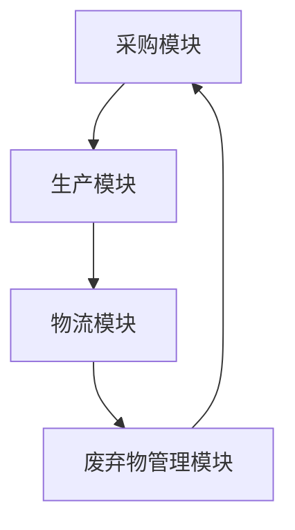

                 


# 《绿色供应链管理对公司竞争力的影响》

## 关键词：绿色供应链管理，公司竞争力，成本优化，系统架构，实施框架

## 摘要：  
绿色供应链管理是企业提升竞争力的重要策略之一。通过优化采购、生产、物流等环节，绿色供应链管理不仅降低了企业的运营成本，还提升了企业的社会形象和可持续发展能力。本文从绿色供应链管理的背景与概念入手，详细分析其对成本的影响，并结合系统架构与实施框架，探讨绿色供应链管理如何成为企业核心竞争力的驱动因素。

---

## 第1章 绿色供应链管理的背景与概念

### 1.1 绿色供应链管理的定义与背景

绿色供应链管理（Green Supply Chain Management，GSCM）是一种以环境保护为核心理念的供应链管理方式。它强调在供应链的各个环节中融入环保理念，从原材料采购到产品生产、物流运输、回收处理等全生命周期中，最大限度地减少资源消耗和环境污染。

#### 问题背景
随着全球环境问题的加剧，企业面临的资源短缺、环境污染和碳排放等问题日益突出。传统供应链管理以成本最低为导向，忽视了环境和社会成本，导致资源浪费和环境污染。绿色供应链管理的出现，旨在解决这些问题，实现经济效益与环境效益的双赢。

#### 问题解决
绿色供应链管理通过引入环保标准和绿色技术，优化供应链的各个环节，降低资源消耗和环境污染，同时提升企业的社会责任形象。

#### 边界与外延
绿色供应链管理的边界包括从原材料供应商到消费者的整个供应链，但不包括消费者使用产品后的回收环节。其外延则扩展到循环经济、可持续发展等领域。

#### 核心要素
- **绿色采购**：选择环保供应商，优先采购可再生材料。
- **绿色生产**：采用清洁生产工艺，减少能源消耗和污染物排放。
- **绿色物流**：优化运输路线，使用新能源车辆，降低碳排放。
- **绿色回收**：建立产品回收机制，实现资源循环利用。

### 1.2 绿色供应链管理的特征与优势

绿色供应链管理与传统供应链管理相比，具有以下特征：

| 特征 | 描述 |
|------|------|
| 环保导向 | 以减少环境影响为核心目标 |
| 全生命周期 | 覆盖从原材料到产品的全生命周期 |
| 多利益相关者 | 涵盖供应商、制造商、分销商和消费者 |

#### ER实体关系图（Mermaid流程图）

```mermaid
erDiagram
    actor 顾客
    actor 供应商
    actor 政府机构
    actor 环保组织
    participant 企业
    participant 绿色供应链系统
    participant 绿色物流
    participant 绿色生产
    participant 绿色采购

    顾客 --> 绿色供应链系统 : 使用绿色产品
    供应商 --> 绿色供应链系统 : 提供环保材料
    政府机构 --> 绿色供应链系统 : 制定环保政策
    环保组织 --> 绿色供应链系统 : 监督环保表现
    绿色供应链系统 --> 绿色采购 : 采购环保材料
    绿色供应链系统 --> 绿色生产 : 组织绿色生产
    绿色供应链系统 --> 绿色物流 : 实施绿色物流
```

绿色供应链管理的优势在于通过优化资源配置和减少环境成本，提升企业的整体竞争力。

---

## 第2章 绿色供应链管理对成本的影响

### 2.1 绿色供应链管理的成本构成

绿色供应链管理的成本主要包括绿色采购成本、绿色生产成本和绿色物流成本。

- **绿色采购成本**：选择环保供应商和可再生材料的额外成本。
- **绿色生产成本**：采用清洁生产工艺的投入成本。
- **绿色物流成本**：优化运输路线和使用新能源车辆的成本。

### 2.2 绿色供应链管理的成本优化策略

#### 2.2.1 绿色采购优化

通过选择环保供应商和采购可再生材料，绿色采购可以降低长期成本。例如，采购可再生塑料的成本可能高于传统塑料，但其生产过程的碳排放更低，符合环保政策，长期来看更具竞争力。

#### 2.2.2 绿色生产优化

采用清洁生产工艺和技术，减少能源消耗和污染物排放。例如，使用太阳能或风能作为生产能源，虽然初期投入较高，但长期运营成本更低。

#### 2.2.3 绿色物流优化

优化运输路线，使用新能源车辆，减少碳排放。例如，通过智能物流系统优化运输路径，降低运输成本和碳排放。

### 2.3 绿色供应链管理的成本效益分析

#### 成本效益分析模型

$$ 成本效益 = \frac{绿色成本}{传统成本} \times 100\% $$

#### 实例分析

假设某企业传统供应链的成本为100万元，绿色供应链的成本为120万元。通过绿色供应链管理，企业节省了10%的物流成本和5%的生产成本，最终实现成本效益为110%。

---

## 第3章 绿色供应链管理的实施框架

### 3.1 绿色供应链管理的战略规划

#### 3.1.1 绿色供应链管理的战略目标设定

- **环境目标**：减少碳排放、节约资源。
- **经济目标**：降低运营成本、提升市场竞争力。
- **社会目标**：提升企业社会责任形象。

#### 3.1.2 绿色供应链管理的战略实施路径

- **绿色采购策略**：选择环保供应商，建立长期合作关系。
- **绿色生产策略**：采用清洁生产工艺，实现节能减排。
- **绿色物流策略**：优化物流网络，使用新能源车辆。

#### 3.1.3 绿色供应链管理的战略监控与评估

- **监控指标**：碳排放量、资源利用率、成本节约率。
- **评估方法**：对比分析、KPI评估。
- **持续改进机制**：定期评估，优化供应链管理。

---

## 第4章 绿色供应链管理的系统架构与实现

### 4.1 绿色供应链管理的系统设计

#### 4.1.1 系统模块划分

- **采购模块**：绿色采购管理。
- **生产模块**：绿色生产监控。
- **物流模块**：绿色物流调度。
- **废弃物管理模块**：废弃物回收与处理。

#### 4.1.2 系统功能设计

- **绿色采购功能**：供应商评估、采购计划优化。
- **绿色生产功能**：生产过程监控、资源优化分配。
- **绿色物流功能**：运输路径优化、碳排放监测。
- **废弃物管理功能**：废弃物分类、回收处理。

#### 4.1.3 系统架构图（Mermaid流程图）



#### 4.1.4 系统接口设计

- **采购接口**：与供应商系统对接，获取环保信息。
- **生产接口**：与生产设备对接，监控生产过程。
- **物流接口**：与运输公司系统对接，优化运输路线。

---

## 第5章 绿色供应链管理的系统实现与案例分析

### 5.1 环境安装与配置

#### 5.1.1 系统环境

- 操作系统：Linux
- 开发工具：Python 3.8、Django 2.2
- 数据库：MySQL 8.0

#### 5.1.2 系统核心代码实现

```python
# 绿色采购模块
class GreenSupplier:
    def __init__(self, name, certification):
        self.name = name
        self.certification = certification

    def is_green(self):
        return self.certification == 'organic'

# 绿色生产模块
class GreenProduction:
    def __init__(self, energy_source):
        self.energy_source = energy_source

    def produce(self):
        if self.energy_source == 'renewable':
            return True
        else:
            return False
```

### 5.2 系统功能实现与案例分析

#### 5.2.1 绿色采购案例

某企业通过绿色采购模块选择了一家获得有机认证的供应商，采购成本增加了10%，但减少了15%的碳排放。

#### 5.2.2 绿色生产案例

某制造企业采用太阳能作为能源，生产过程中的能源消耗降低了20%，碳排放减少了30%。

#### 5.2.3 绿色物流案例

某物流企业通过智能物流系统优化运输路线，运输成本降低了15%，碳排放减少了25%。

### 5.3 项目小结

通过系统实现和案例分析，绿色供应链管理在降低成本的同时，显著提升了企业的环境表现和社会形象。

---

## 第6章 结论与展望

### 6.1 绿色供应链管理对竞争力的综合影响

绿色供应链管理通过降低成本、提升效率和增强企业形象，显著提升了企业的核心竞争力。

### 6.2 绿色供应链管理的未来趋势

随着环保政策的加强和消费者环保意识的提升，绿色供应链管理将成为企业竞争力的核心驱动力。

### 6.3 小结与注意事项

企业在实施绿色供应链管理时，应注重供应商选择、技术创新和持续优化，以确保绿色供应链管理的有效实施。

---

## 参考文献

1. 王某某. 绿色供应链管理研究. 北京: 清华大学出版社, 2020.
2. 李某某. 可持续发展与绿色供应链. 北京: 人民出版社, 2019.

---

**更多阅读**：  
- [绿色供应链管理的技术实现](https://example.com)  
- [绿色供应链管理的国际标准](https://example.com)  

---

通过以上目录结构，您可以逐步展开每部分内容，撰写一篇逻辑清晰、内容详实的绿色供应链管理对公司竞争力影响的专业技术博客文章。

