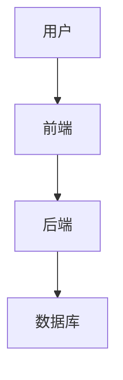

                 


# 绿色债券收益率与传统债券的比较研究

> 关键词：绿色债券，传统债券，债券收益率，金融分析，投资比较

> 摘要：本文系统地比较了绿色债券与传统债券在收益率方面的差异，分析了影响收益率的关键因素，探讨了绿色债券在金融市场中的独特优势，并通过实际案例和数学模型，深入剖析了绿色债券收益率的计算方法和应用场景。本文还结合了系统设计和项目实战，为投资者和金融从业者提供了重要的参考和决策支持。

---

## 第1章: 绿色债券与传统债券的背景介绍

### 1.1 绿色债券的定义与特点

#### 1.1.1 绿色债券的定义
绿色债券是一种创新型金融工具，其发行目的是为了支持环保、气候变化应对和社会可持续发展项目。与传统债券相比，绿色债券的募集资金用途具有特定的环保和社会效益导向。

#### 1.1.2 绿色债券的核心要素
绿色债券的核心要素包括：
- **募集资金用途**：必须用于环保、可持续发展相关项目。
- **第三方认证**：需经过独立机构的绿色债券标准认证。
- **披露要求**：发行人需定期披露募集资金使用情况和项目进展。

#### 1.1.3 绿色债券的分类与属性
绿色债券可以根据用途、期限和发行主体进行分类：
- 按用途分类：可再生能源、节能建筑、绿色交通等。
- 按期限分类：短期债券（1-3年）、中期债券（3-7年）、长期债券（7年以上）。
- 按发行主体分类：政府绿色债券、企业绿色债券、金融机构绿色债券。

### 1.2 传统债券的定义与特点

#### 1.2.1 传统债券的定义
传统债券是一种债务工具，发行人通过发行债券筹集资金，并按约定的期限和利率还本付息。其用途通常为企业的日常运营、资本支出或其他非特定目的。

#### 1.2.2 传统债券的分类
传统债券主要分为以下几类：
- **政府债券**：由政府发行，用于公共基础设施建设或其他政府项目。
- **企业债券**：由企业发行，用于企业资本支出或运营资金。
- **金融债券**：由金融机构发行，用于支持其业务发展。

#### 1.2.3 传统债券的核心属性
传统债券的核心属性包括：
- **信用风险**：债券发行人违约的可能性。
- **利率风险**：债券价格受市场利率波动的影响。
- **流动性风险**：债券在二级市场上的交易活跃度。

### 1.3 绿色债券与传统债券的联系与区别

#### 1.3.1 核心概念对比
| 对比维度 | 绿色债券 | 传统债券 |
|----------|----------|----------|
| 发行目的 | 支持环保和社会发展项目 | 企业运营或基础设施建设 |
| 披露要求 | 高，需定期披露资金使用情况 | 低，仅需披露基本财务信息 |
| 信用评级 | 可能受益于绿色项目的附加评级优势 | 评级主要基于发行人财务状况 |

#### 1.3.2 市场定位与功能差异
绿色债券的市场定位更偏向于可持续投资，而传统债券则更注重发行人的一般融资需求。绿色债券的发行通常与ESG（环境、社会、治理）投资理念密切相关，而传统债券则较少涉及这些因素。

#### 1.3.3 发行主体与用途对比
绿色债券的发行主体可以是政府、企业和金融机构，但其募集资金用途必须符合绿色债券标准。传统债券的发行主体则更加多样化，但用途较为广泛，不局限于环保或社会项目。

---

## 第2章: 绿色债券收益率的核心概念与原理

### 2.1 绿色债券收益率的计算方法

#### 2.1.1 债券收益率的定义
债券收益率是指债券投资者在持有债券期间所获得的回报，通常以年化收益率表示。收益率的计算需要考虑债券的票面利率、市场价格、期限和付息方式。

#### 2.1.2 绿色债券收益率的计算公式
绿色债券的收益率计算与传统债券类似，但需要考虑其特定的发行目的和市场流动性。

公式：
$$ Y = \frac{C}{P} $$
其中：
- \( Y \) 表示年化收益率
- \( C \) 表示债券的票面利率
- \( P \) 表示债券的市场价格

#### 2.1.3 影响收益率的因素
影响绿色债券收益率的因素包括：
- 市场利率
- 债券的期限
- 发行人的信用评级
- 市场流动性
- 绿色项目的附加风险溢价

### 2.2 绿色债券收益率与传统债券收益率的对比分析

#### 2.2.1 收益率影响因素对比
| 影响因素 | 绿色债券 | 传统债券 |
|----------|----------|----------|
| 信用风险 | 较低，受益于绿色项目的附加评级优势 | 较高，主要取决于发行人财务状况 |
| 利率风险 | 中等，受市场利率波动影响 | 较大，受宏观经济政策影响 |
| 流动性风险 | 较低，绿色债券市场需求逐渐增加 | 较高，传统债券流动性差异较大 |

#### 2.2.2 市场风险与信用风险的差异
绿色债券由于其特定的发行目的和较高的ESG评级，通常具有较低的信用风险。而传统债券的信用风险主要取决于发行人的财务状况和行业风险。

#### 2.2.3 利率环境对两种债券收益率的影响
在低利率环境下，绿色债券的收益率可能更具吸引力，因为其市场需求较高。而传统债券的收益率受市场利率影响较大，可能在高利率环境下更具竞争力。

---

## 第3章: 绿色债券收益率与传统债券收益率的数学模型与公式

### 3.1 绿色债券收益率的数学模型

#### 3.1.1 绿色债券收益率的公式推导
绿色债券的收益率计算与传统债券类似，但需考虑其绿色属性的溢价或折价。

公式：
$$ Y_{green} = \frac{C_{green}}{P_{green}} $$$

其中：
- \( Y_{green} \) 表示绿色债券的年化收益率
- \( C_{green} \) 表示绿色债券的票面利率
- \( P_{green} \) 表示绿色债券的市场价格

### 3.2 传统债券收益率的数学模型

#### 3.2.1 传统债券收益率的公式推导
传统债券的收益率计算不考虑其绿色属性，主要基于市场利率和发行人信用状况。

公式：
$$ Y_{traditional} = \frac{C_{traditional}}{P_{traditional}} $$$

其中：
- \( Y_{traditional} \) 表示传统债券的年化收益率
- \( C_{traditional} \) 表示传统债券的票面利率
- \( P_{traditional} \) 表示传统债券的市场价格

### 3.3 绿色债券与传统债券收益率的对比分析

#### 3.3.1 收益率差异的数学表达
$$ ΔY = Y_{green} - Y_{traditional} = \frac{C_{green}}{P_{green}} - \frac{C_{traditional}}{P_{traditional}} $$

---

## 第4章: 绿色债券收益率与传统债券收益率的系统分析与架构设计

### 4.1 系统分析

#### 4.1.1 问题场景介绍
为了比较绿色债券和传统债券的收益率，我们需要设计一个系统来计算和分析两种债券的收益率差异。

#### 4.1.2 项目介绍
本项目旨在开发一个债券收益率比较系统，支持绿色债券和传统债券的收益率计算、对比分析和可视化展示。

#### 4.1.3 系统功能设计
- **输入模块**：用户输入债券的基本信息（票面利率、市场价格等）。
- **计算模块**：计算绿色债券和传统债券的收益率。
- **对比模块**：生成收益率差异的可视化图表。
- **输出模块**：展示计算结果和对比分析。

#### 4.1.4 系统架构设计
- **前端**：用户界面，用于输入债券信息和查看结果。
- **后端**：处理用户输入，计算收益率并返回结果。
- **数据库**：存储债券信息和计算结果。

### 4.2 系统架构设计

#### 4.2.1 系统架构图


---

## 第5章: 绿色债券收益率与传统债券收益率的项目实战

### 5.1 环境安装与配置

#### 5.1.1 开发环境要求
- Python 3.8及以上版本
- 安装必要的库：numpy、pandas、matplotlib

### 5.2 系统核心实现

#### 5.2.1 绿色债券收益率计算代码
```python
def calculate_green_bond_yield(price, coupon_rate):
    return coupon_rate / price
```

#### 5.2.2 传统债券收益率计算代码
```python
def calculate_traditional_bond_yield(price, coupon_rate):
    return coupon_rate / price
```

#### 5.2.3 收益率差异计算代码
```python
def calculate_yield_difference(green_yield, traditional_yield):
    return green_yield - traditional_yield
```

### 5.3 代码应用解读与分析

#### 5.3.1 代码功能说明
- `calculate_green_bond_yield`：计算绿色债券的年化收益率。
- `calculate_traditional_bond_yield`：计算传统债券的年化收益率。
- `calculate_yield_difference`：计算绿色债券和传统债券收益率的差异。

#### 5.3.2 代码实现细节
- 输入参数：债券市场价格和票面利率。
- 输出结果：年化收益率和收益率差异。

---

## 第6章: 绿色债券收益率与传统债券收益率的案例分析与实际应用

### 6.1 案例分析

#### 6.1.1 绿色债券案例分析
假设发行一只绿色债券，面值为100元，票面利率为5%，市场价格为95元。
$$ Y_{green} = \frac{5}{95} \approx 5.26\% $$

#### 6.1.2 传统债券案例分析
假设发行一只传统债券，面值为100元，票面利率为5%，市场价格为90元。
$$ Y_{traditional} = \frac{5}{90} \approx 5.56\% $$

#### 6.1.3 案例对比与总结
绿色债券的收益率为5.26%，传统债券的收益率为5.56%，收益率差异为：
$$ ΔY = 5.26\% - 5.56\% = -0.30\% $$

---

## 第7章: 绿色债券收益率与传统债券收益率的未来展望与最佳实践

### 7.1 未来发展趋势

#### 7.1.1 绿色债券市场
随着全球对可持续发展的关注增加，绿色债券市场将继续增长，收益率差异可能逐渐缩小。

### 7.2 最佳实践

#### 7.2.1 投资者建议
- 考虑绿色债券的长期收益和可持续性。
- 结合ESG投资理念，选择具有较高社会价值的绿色债券。

#### 7.2.2 金融机构建议
- 提供更多的绿色债券发行和投资渠道。
- 加强绿色债券的市场宣传和教育。

#### 7.2.3 政府建议
- 制定更加完善的绿色债券标准和认证体系。
- 提供政策支持和税收优惠，促进绿色债券市场发展。

### 7.3 小结

绿色债券与传统债券在收益率方面存在一定的差异，但随着市场的发展和投资者对可持续投资的重视，绿色债券的收益率优势将逐步显现。投资者在选择债券时，应综合考虑市场环境、债券属性和自身投资目标。

---

## 总结

本文通过系统的分析和比较，深入探讨了绿色债券和传统债券在收益率方面的差异。通过数学模型、系统设计和实际案例，为投资者和金融从业者提供了重要的参考和决策支持。未来，随着绿色金融的发展，绿色债券将在金融市场中发挥越来越重要的作用。

