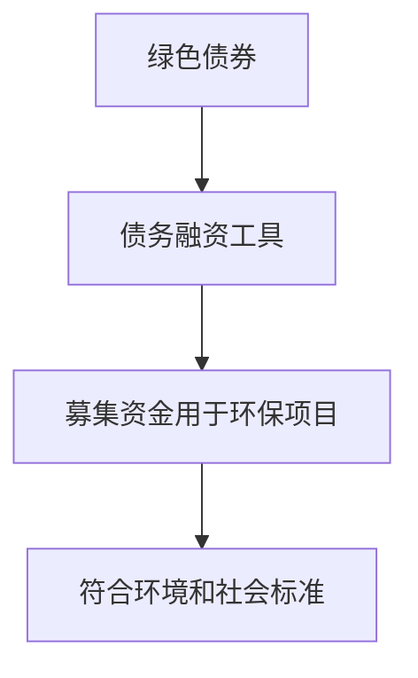

                 

# 绿色债券：可持续发展融资的投资机会

## 关键词：绿色债券, 可持续发展, 投资机会, 金融市场, 环境, 社会, 治理

## 摘要：绿色债券作为一种新兴的可持续发展融资工具，正在全球范围内迅速崛起。本文深入分析了绿色债券的定义、市场现状、发行与评级、定价与风险管理、投资者策略及其未来发展。通过系统的分析和实际案例，探讨了绿色债券在实现可持续发展目标中的重要作用，为投资者提供了有价值的投资机会和策略建议。

---

# 绿色债券：可持续发展融资的投资机会

## 第1章：绿色债券的定义与背景

### 1.1 绿色债券的核心概念

#### 1.1.1 绿色债券的定义

绿色债券是一种债务融资工具，其募集资金专门用于支持符合特定环境和社会标准的项目。这些项目包括可再生能源、能源效率、绿色交通、可持续农业和气候变化适应措施等。绿色债券的发行主体通常是政府、企业和国际组织。

**图1-1 绿色债券的定义**

#### 1.1.2 绿色债券的分类

绿色债券可以根据发行主体、期限和使用目的进行分类：

- **发行主体**：分为主权绿色债券（政府发行）和非主权绿色债券（企业或组织发行）。
- **期限**：分为短期债券（1-3年）和长期债券（5-10年或更长）。
- **使用目的**：分为可再生能源、能源效率、可持续交通等。

**表1-1 绿色债券的分类**

| 类别         | 分类标准                     | 例子                           |
|--------------|------------------------------|---------------------------------|
| 发行主体     | 主权绿色债券                 | 政府发行的绿色债券             |
|              | 非主权绿色债券               | 企业发行的绿色债券             |
| 期限         | 短期绿色债券                 | 期限为1-3年的绿色债券         |
|              | 长期绿色债券                 | 期限为5-10年的绿色债券        |
| 使用目的     | 可再生能源                   | 太阳能、风能项目               |
|              | 能源效率                     | 建筑节能项目                   |
|              | 可持续交通                   | 公共交通项目                   |

#### 1.1.3 绿色债券的发行目的与作用

绿色债券的发行旨在支持环保项目，促进可持续发展，同时为发行人提供低成本融资。其作用包括：

- **促进环保投资**：通过资金支持环保项目，推动绿色经济发展。
- **降低融资成本**：由于绿色债券需求旺盛，发行人通常能以较低利率发行。
- **提升企业形象**：发行绿色债券有助于提升企业的社会责任形象。

### 1.2 绿色债券的背景与发展趋势

#### 1.2.1 全球可持续发展的背景

全球气候变化、资源枯竭和环境污染等问题日益严重，各国政府和企业开始重视可持续发展。绿色债券作为一种重要的融资工具，成为推动可持续发展的重要手段。

#### 1.2.2 绿色债券的起源与发展历程

绿色债券的概念最早出现在20世纪90年代，但真正的发展始于2010年后。2016年，全球首只绿色债券发行，标志着绿色债券市场的正式启动。近年来，绿色债券市场规模迅速增长。

#### 1.2.3 绿色债券的未来发展趋势

预计未来绿色债券市场将继续增长，主要驱动因素包括政策支持、技术进步和投资者对ESG（环境、社会、治理）投资的关注增加。

### 1.3 绿色债券与传统债券的区别

#### 1.3.1 债务工具属性的对比

| 属性         | 绿色债券                     | 传统债券                     |
|--------------|------------------------------|--------------------------------|
| 募资用途     | 专门用于环保项目              | 用于一般用途                  |
| 利率         | 可能较低                     | 可能较高                     |
| 评级标准     | 包括环境和社会因素            | 仅考虑财务和信用状况          |

#### 1.3.2 投资者回报的差异

绿色债券的回报与传统债券相似，但由于其环保属性，通常能享受政策优惠和市场溢价。

#### 1.3.3 风险与收益的对比分析

绿色债券的风险主要来自发行人的信用风险和项目的执行风险。由于其环保属性，绿色债券的风险可能低于传统债券，但具体情况因项目而异。

---

## 第2章：绿色债券的市场现状与投资机会

### 2.1 全球绿色债券市场的现状分析

#### 2.1.1 全球绿色债券市场的规模与增长

近年来，全球绿色债券市场规模迅速增长。2022年，全球绿色债券发行规模超过5000亿美元，预计未来几年将继续增长。

#### 2.1.2 不同地区的市场发展情况

- **欧洲**：欧洲是全球最大的绿色债券市场，占全球发行量的50%以上。
- **亚洲**：中国、印度等国家的绿色债券市场增长迅速。
- **美洲**：美国和加拿大的绿色债券市场也在快速增长。

#### 2.1.3 绿色债券市场的参与者分析

主要参与者包括政府、企业和金融机构。政府通常发行主权绿色债券，企业发行非主权绿色债券，金融机构则提供发行和承销服务。

### 2.2 绿色债券的投资机会

#### 2.2.1 可持续投资的兴起

随着全球对可持续发展的关注增加，投资者越来越倾向于投资ESG（环境、社会、治理）项目。绿色债券作为ESG投资的重要组成部分，具有巨大的投资潜力。

#### 2.2.2 绿色债券的投资收益与风险

- **收益**：绿色债券的回报与传统债券相似，但由于其环保属性，通常能享受政策优惠和市场溢价。
- **风险**：绿色债券的风险主要来自发行人的信用风险和项目的执行风险。由于其环保属性，绿色债券的风险可能低于传统债券，但具体情况因项目而异。

#### 2.2.3 绿色债券与ESG投资策略的结合

ESG投资策略关注企业在环境、社会和治理方面的表现。绿色债券作为ESG投资的重要组成部分，可以帮助投资者实现可持续投资目标。

### 2.3 绿色债券市场的挑战与对策

#### 2.3.1 市场发展的主要挑战

- **缺乏统一标准**：目前绿色债券的评级标准不统一，导致市场信息不对称。
- **信用风险**：部分绿色债券发行人可能存在信用风险。
- **市场流动性**：绿色债券市场的流动性较低，可能影响投资者的退出能力。

#### 2.3.2 政策支持与监管框架的作用

各国政府和监管机构正在制定和完善绿色债券的相关政策和监管框架，以促进市场健康发展。

#### 2.3.3 投资者教育与市场推广的重要性

通过投资者教育和市场推广，可以提高绿色债券的认知度和吸引力。

---

## 第3章：绿色债券的发行与评级

### 3.1 绿色债券的发行流程

#### 3.1.1 发行主体的选择与准备

发行绿色债券的主体通常是政府、企业和国际组织。发行前需要进行尽职调查和环境影响评估。

#### 3.1.2 发行申请与审批流程

发行人需要向监管机构提交发行申请，包括详细的发行计划和资金使用计划。监管机构会对申请进行审批。

#### 3.1.3 发行规模与期限的确定

发行人根据资金需求和市场情况确定发行规模和期限。通常，绿色债券的期限为5-10年。

### 3.2 绿色债券的评级标准

#### 3.2.1 评级机构的定义与作用

评级机构对绿色债券进行评级，评估其信用风险和环境风险。评级结果为投资者提供参考。

#### 3.2.2 绿色债券评级的核心指标

- **信用评级**：评估债券的信用风险。
- **环境风险评级**：评估项目的环境影响和社会效益。

#### 3.2.3 评级结果的解读与应用

评级结果帮助投资者评估债券的风险和收益，指导投资决策。

### 3.3 第三方机构在绿色债券中的角色

#### 3.3.1 环境影响评估机构的作用

环境影响评估机构对绿色债券项目进行环境影响评估，确保资金的正确使用。

#### 3.3.2 评级机构的独立性与公正性

评级机构需要保持独立性和公正性，确保评级结果的客观性。

#### 3.3.3 监管机构的监督与指导

监管机构对绿色债券市场进行监督，确保市场健康发展。

---

## 第4章：绿色债券的定价与风险管理

### 4.1 绿色债券的定价模型

绿色债券的定价需要考虑市场利率、信用风险和环境风险等因素。常用的定价模型包括WIRS模型和CAPM模型。

#### 4.1.1 WIRS模型

WIRS模型（Weighted Impact Rating System）用于评估绿色债券的环境影响和社会效益。

**WIRS模型公式**

$$ WIRS = \frac{\sum (权重_i \times 评分_i)}{\sum 权重_i} $$

#### 4.1.2 CAPM模型

CAPM模型用于评估绿色债券的预期收益。

$$ E(R_i) = R_f + \beta_i (R_m - R_f) $$

### 4.2 绿色债券的市场风险

市场风险包括利率风险和流动性风险。绿色债券的市场风险通常较低，但由于市场流动性较低，投资者可能面临退出困难。

### 4.3 绿色债券的信用风险

信用风险主要来自发行人的财务状况和项目执行风险。绿色债券的信用风险通常低于传统债券，但具体情况因项目而异。

### 4.4 绿色债券的风险管理策略

- **分散投资**：通过投资不同类型的绿色债券分散风险。
- **密切关注发行人信用状况**：定期评估发行人的信用状况。
- **合理配置资产**：将绿色债券作为资产配置的一部分，平衡风险和收益。

---

## 第5章：绿色债券的投资者策略

### 5.1 绿色债券的投资者类型

- **机构投资者**：包括养老基金、保险公司和资产管理公司。
- **个人投资者**：个人投资者可以通过购买绿色债券参与可持续投资。

### 5.2 绿色债券的投资策略

- **长期投资**：绿色债券的期限较长，适合长期投资者。
- **ESG投资策略**：将绿色债券纳入ESG投资组合，实现可持续投资目标。

### 5.3 绿色债券的资产配置

- **资产配置比例**：根据风险承受能力和投资目标确定绿色债券在投资组合中的比例。
- **风险管理**：通过 diversification 和监控市场风险，降低投资风险。

---

## 第6章：绿色债券的未来发展

### 6.1 绿色债券的技术创新

- **区块链技术**：区块链技术可以提高绿色债券的透明度和安全性。
- **智能合约**：智能合约可以自动执行债券的发行和支付，提高效率。

### 6.2 绿色债券的政策变化

- **政策支持**：各国政府将继续出台支持绿色债券的政策。
- **监管框架**：监管机构将完善绿色债券的评级和信息披露标准。

### 6.3 绿色债券的市场趋势

- **市场规模增长**：随着可持续投资的兴起，绿色债券市场规模将继续增长。
- **产品创新**：新的绿色债券产品将不断推出，满足不同投资者的需求。

---

## 第7章：总结与展望

### 7.1 本章总结

绿色债券作为一种重要的可持续发展融资工具，正在全球范围内迅速崛起。本文系统分析了绿色债券的定义、市场现状、发行与评级、定价与风险管理、投资者策略及其未来发展。绿色债券在支持环保项目、促进可持续发展方面具有重要作用。

### 7.2 未来展望

未来，绿色债券市场将继续增长，技术创新和政策支持将推动其发展。投资者应密切关注市场动态，抓住投资机会，实现可持续投资目标。

---

## 关键词

绿色债券, 可持续发展, 投资机会, 金融市场, 环境, 社会, 治理

## 摘要

绿色债券是一种专门用于支持环保项目的债务融资工具，正在全球范围内迅速崛起。本文深入分析了绿色债券的定义、市场现状、发行与评级、定价与风险管理、投资者策略及其未来发展。通过系统的分析和实际案例，探讨了绿色债券在实现可持续发展目标中的重要作用，为投资者提供了有价值的投资机会和策略建议。

