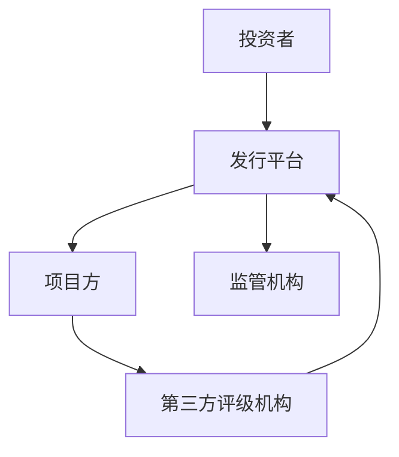
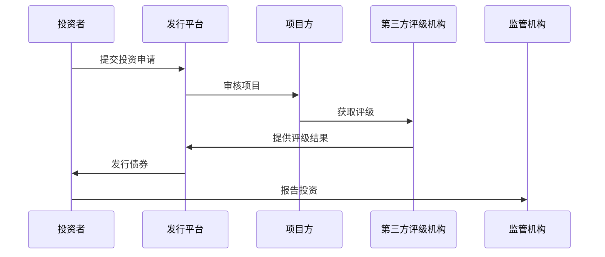

                 

# 绿色债券：可持续金融的新兴投资工具

## 关键词：
绿色债券, 可持续金融, 环境影响评估, 投资工具, 环保项目

## 摘要：
绿色债券是可持续金融领域的重要工具，用于支持环保项目。本文详细介绍了绿色债券的定义、历史、分类、发行流程、市场现状及与其他金融工具的关系。通过数学模型和实际案例分析，探讨了绿色债券的环境效益和投资价值，为投资者和相关机构提供了深入的见解。

---

## 第1章 绿色债券的基本概念

### 1.1 绿色债券的定义与特征

#### 1.1.1 绿色债券的定义
绿色债券是一种债务工具，募集资金专用于支持具有环境效益的项目，如可再生能源、节能建筑和可持续交通。

#### 1.1.2 绿色债券的特征
- **专用用途**：资金必须用于指定的环保项目。
- **透明披露**：发行人需定期报告资金使用情况和环境效益。
- **第三方评级**：由独立机构评估项目和债券的环境效益。

#### 1.1.3 绿色债券与传统债券的区别
| 特性 | 绿色债券 | 传统债券 |
|------|-----------|-----------|
| 资金用途 | 环保项目 | 企业一般用途 |
| 披露要求 | 高 | 低 |
| 评级标准 | 环境效益 | 财务状况 |

### 1.2 绿色债券的历史发展

#### 1.2.1 绿色债券的起源
绿色债券的概念最早出现在20世纪70年代，最初用于资助环保项目。

#### 1.2.2 绿色债券的发展历程
- 2000年代：市场逐渐形成，主要用于可再生能源。
- 2010年代：快速增长，成为主流投资工具。
- 2020年代：全球市场扩大，创新产品增多。

#### 1.2.3 当前绿色债券的市场现状
- 市场规模庞大，年发行量超过千亿美元。
- 投资者需求增加，推动市场持续增长。

---

## 第2章 绿色债券的结构与分类

### 2.1 绿色债券的结构

#### 2.1.1 绿色债券的发行流程
1. **评级**：第三方机构评估项目环境效益。
2. **注册**：在监管机构注册债券发行。
3. **发行**：通过市场发行债券，募集资金。
4. **监督**：定期报告资金使用情况。

#### 2.1.2 绿色债券的评级标准
- 由专业机构评估债券的环境效益，确保资金用于环保项目。

#### 2.1.3 绿色债券的资金使用要求
- 资金必须专用于指定的环保项目，如可再生能源、节能建筑等。

### 2.2 绿色债券的分类

#### 2.2.1 根据用途分类
- **可再生能源**：太阳能、风能等项目。
- **节能建筑**：绿色建筑、能效提升。
- **可持续交通**：公共交通、自行车道等。

#### 2.2.2 根据发行主体分类
- **政府债券**：由政府发行，用于公共环保项目。
- **企业债券**：由企业发行，用于企业环保项目。
- **金融机构债券**：由银行或保险公司发行，支持环保投资。

#### 2.2.3 根据期限分类
- **短期债券**：期限小于一年。
- **中期债券**：期限1至5年。
- **长期债券**：期限5年以上。

---

## 第3章 绿色债券与可持续金融的其他工具

### 3.1 绿色债券与ESG投资策略

#### 3.1.1 ESG的定义与作用
ESG（环境、社会、治理）是评估企业可持续发展能力的标准，包括环境表现、社会责任和公司治理。

#### 3.1.2 绿色债券在ESG投资中的作用
- 绿色债券为投资者提供了符合ESG标准的投资工具。
- 通过投资绿色债券，投资者支持环保项目，同时获得财务回报。

---

## 第4章 绿色债券的环境影响评估

### 4.1 环境影响评估的方法

#### 4.1.1 环境影响评估模型
$$ \text{环境效益} = \sum_{i=1}^{n} (\text{减排量}_i \times \text{单位减排价值}_i) $$

#### 4.1.2 评估步骤
1. **确定项目范围**：明确环保项目的类型和规模。
2. **收集数据**：收集项目相关的环境数据。
3. **评估环境效益**：计算项目的环境效益，如减排量和节约资源。
4. **验证和报告**：由第三方机构验证评估结果并公开报告。

---

## 第5章 绿色债券的数学模型与公式

### 5.1 绿色债券的发行模型

#### 5.1.1 绿色债券的定价公式
$$ P = \sum_{t=1}^{T} \frac{C}{(1 + r)^t} $$
其中：
- \( P \) 为债券价格
- \( C \) 为每年的现金流
- \( r \) 为市场利率
- \( T \) 为债券期限

#### 5.1.2 绿色债券的收益率计算
$$ YTM = \left( \frac{C - P}{n} \right) \times 100 $$
其中：
- \( YTM \) 为到期收益率
- \( C \) 为债券面值
- \( P \) 为债券价格
- \( n \) 为债券期限

---

## 第6章 绿色债券的系统架构与设计

### 6.1 系统功能设计

#### 6.1.1 系统架构

#### 6.1.2 系统交互

---

## 第7章 绿色债券的项目实战

### 7.1 案例分析：某国发行绿色债券支持可再生能源项目

#### 7.1.1 项目背景
- 项目目标：建设大型太阳能发电站。
- 资金需求：10亿美元。
- 项目期限：5年。

#### 7.1.2 发行流程
1. **评级**：第三方机构评估项目环境效益。
2. **注册**：在监管机构注册债券发行。
3. **发行**：通过公开市场发行债券，募集资金。
4. **监督**：定期报告资金使用情况和环境效益。

#### 7.1.3 实际应用
- 项目完成后，预计每年减少碳排放100万吨。
- 投资者获得稳定回报，同时支持环保事业。

---

## 第8章 绿色债券的最佳实践与小结

### 8.1 最佳实践
- **选择信誉良好的发行机构**：确保资金用于环保项目。
- **关注第三方评级**：选择高评级的绿色债券。
- **分散投资**：降低风险，提高收益稳定性。

### 8.2 小结
绿色债券是可持续金融的重要工具，为投资者提供了支持环保项目的机会。通过合理选择和管理，投资者可以在支持环保的同时获得财务回报。

### 8.3 注意事项
- 确保资金用于指定的环保项目。
- 关注项目的长期环境效益。
- 考虑市场的波动性和风险。

### 8.4 拓展阅读
- [参考文献1](#)
- [参考文献2](#)
- [参考文献3](#)

---

通过以上详细的内容，我们全面探讨了绿色债券的概念、结构、分类、发行流程及其在可持续金融中的作用。希望这篇文章能为投资者和相关机构提供有价值的见解，帮助他们在可持续金融领域做出明智的决策。

