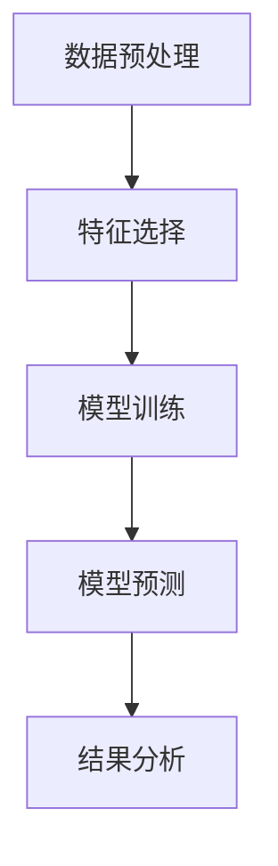
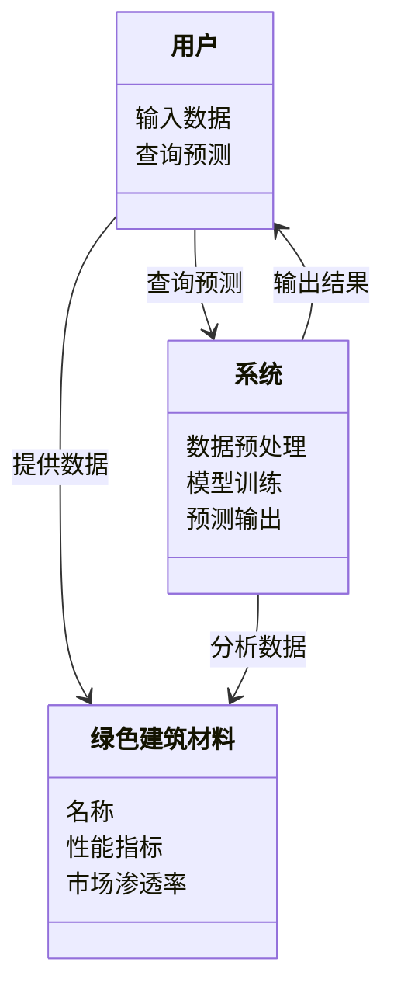

                 


# 绿色建筑材料创新的市场渗透率预测

> 关键词：绿色建筑材料、市场渗透率、创新、预测模型、可持续发展

> 摘要：本文探讨绿色建筑材料的创新及其在市场中的渗透率预测。通过分析绿色建筑材料的定义、创新方向、市场渗透率的影响因素以及预测模型，结合系统架构设计和项目实战案例，帮助读者理解如何通过技术创新和数据分析预测绿色建筑材料的市场渗透率。

---

## 第1章：绿色建筑材料创新的背景与意义

### 1.1 绿色建筑材料的基本概念

#### 1.1.1 绿色建筑材料的定义与特点

绿色建筑材料是指在生产、使用和废弃过程中具有较低环境影响的材料，包括可再生材料、节能材料和环保添加剂。其特点包括环保性、节能性、可循环性和经济性。

#### 1.1.2 绿色建筑材料与传统材料的对比

绿色建筑材料与传统材料相比，具有更低的碳排放、更高的资源利用效率和更好的环境友好性。例如，再生混凝土比传统混凝土减少了对自然资源的消耗，同时降低了碳排放。

#### 1.1.3 绿色建筑材料的环境与经济效益

绿色建筑材料的使用不仅有助于减少建筑行业的环境影响，还能降低能源消耗，提高建筑的使用寿命，从而带来经济收益。

### 1.2 建筑行业可持续发展的需求

#### 1.2.1 建筑行业面临的环境挑战

建筑行业是全球碳排放的主要来源之一，传统的建筑材料和施工方法对环境造成巨大压力。减少碳排放已成为建筑行业可持续发展的关键。

#### 1.2.2 可持续发展在建筑行业中的应用

可持续建筑强调在全生命周期内减少能源消耗和环境影响，绿色建筑材料是实现这一目标的重要组成部分。

#### 1.2.3 绿色建筑材料在建筑行业中的重要性

绿色建筑材料的创新和应用是建筑行业实现可持续发展的核心驱动力，能够有效降低建筑的环境足迹。

---

## 第2章：绿色建筑材料创新的核心概念

### 2.1 绿色建筑材料的创新方向

#### 2.1.1 可再生材料的应用

可再生材料如竹纤维和再生塑料的使用，减少了对自然资源的依赖，降低了建筑废弃物的产生。

#### 2.1.2 节能材料的开发

节能材料如低导热系数的隔热材料和高效保温材料，能够显著降低建筑物的能源消耗。

#### 2.1.3 环保添加剂的使用

环保添加剂如生物基颜料和无毒阻燃剂的应用，减少了有害物质的排放，提高了建筑的安全性和环保性。

### 2.2 市场渗透率预测的定义与方法

#### 2.2.1 市场渗透率的基本概念

市场渗透率是指绿色建筑材料在市场中的普及程度，通常以百分比表示，用于衡量其在市场中的占有率。

#### 2.2.2 市场渗透率预测的模型与方法

常用的预测模型包括线性回归模型、指数平滑模型和机器学习模型。这些模型能够帮助预测绿色建筑材料在未来市场中的发展趋势。

#### 2.2.3 绿色建筑材料市场渗透率的影响因素

影响市场渗透率的因素包括政策支持、技术进步、成本变化、消费者意识和市场竞争等。政策支持如绿色建筑补贴和税收优惠，能够显著提高绿色建筑材料的市场渗透率。

---

## 第3章：绿色建筑材料创新的核心概念与联系

### 3.1 核心概念原理

#### 3.1.1 绿色建筑材料的环境友好性

绿色建筑材料的生产过程减少了对环境的污染，使用过程中降低了能源消耗，废弃后能够被回收利用，形成了闭环的绿色产业链。

#### 3.1.2 创新材料的技术优势

创新材料如高性能复合材料和智能材料的应用，提高了建筑的耐久性和功能性，满足了现代建筑对高性能的需求。

#### 3.1.3 市场渗透率与技术创新的关系

技术创新能够降低绿色建筑材料的成本，提高其性能，从而增强市场竞争力，促进市场渗透率的提高。

### 3.2 概念属性特征对比表格

#### 表3-1：绿色建筑材料与传统材料的对比

| 特性             | 绿色建筑材料         | 传统材料           |
|------------------|--------------------|-------------------|
| 环境影响         | 低                 | 高                 |
| 可再生性         | 高                 | 低                 |
| 能耗             | 低                 | 高                 |
| 经济性           | 中高               | 低                 |
| 技术复杂性       | 高                 | 低                 |

### 3.3 ER实体关系图

```mermaid
er
  actor: 用户
  material: 材料
  attribute: 属性
  relation: 关系
  actor -|many> material: 选择
  material -|many> attribute: 具有
  material -|many> relation: 影响
```

---

## 第4章：绿色建筑材料市场渗透率预测的算法原理

### 4.1 算法原理讲解

#### 4.1.1 多元回归分析模型

多元回归分析模型通过分析多个自变量对因变量的影响，预测绿色建筑材料的市场渗透率。例如，可以用GDP、政策支持、消费者意识等变量作为自变量，市场渗透率作为因变量。

#### 4.1.2 机器学习模型（如随机森林、神经网络）

机器学习模型能够处理复杂的非线性关系，适用于市场渗透率的预测。随机森林通过集成学习提高预测准确性，而神经网络能够捕捉数据中的深层模式。

### 4.2 算法流程图



### 4.3 数学模型与公式

#### 多元线性回归模型

$$ y = \beta_0 + \beta_1x_1 + \beta_2x_2 + \ldots + \beta_nx_n + \epsilon $$

其中，$y$ 是市场渗透率，$x_i$ 是自变量，$\beta_i$ 是回归系数，$\epsilon$ 是误差项。

---

## 第5章：系统分析与架构设计

### 5.1 问题场景介绍

绿色建筑材料市场渗透率预测的业务场景包括数据收集、模型训练、预测分析和结果应用。企业需要通过预测结果优化市场策略，推动绿色建筑材料的广泛应用。

### 5.2 系统功能设计

#### 领域模型



---

## 第6章：项目实战

### 6.1 环境安装

#### 6.1.1 数据集准备

需要收集绿色建筑材料的市场数据，包括价格、销量、政策支持、消费者认知度等。

#### 6.1.2 数据预处理

处理缺失值、异常值和数据标准化，确保数据质量。

### 6.2 系统核心实现源代码

#### 6.2.1 数据预处理代码

```python
import pandas as pd
data = pd.read_csv('green_material_data.csv')
data.dropna(inplace=True)
data['price'].replace({ outliers: np.nan }, inplace=True)
```

#### 6.2.2 模型训练代码

```python
from sklearn.linear_model import LinearRegression
model = LinearRegression()
model.fit(X_train, y_train)
```

### 6.3 代码应用解读与分析

通过训练好的模型，可以预测未来绿色建筑材料的市场渗透率，为企业制定市场策略提供数据支持。

### 6.4 实际案例分析

以某地区为例，分析绿色建筑材料的市场渗透率变化趋势，验证模型的准确性。

### 6.5 项目小结

通过项目实战，验证了绿色建筑材料市场渗透率预测模型的有效性，为企业提供科学的决策依据。

---

## 第7章：最佳实践

### 7.1 小结

绿色建筑材料的创新和市场渗透率预测是实现建筑行业可持续发展的重要环节。通过技术创新和数据分析，可以有效提高市场渗透率，推动绿色建筑的发展。

### 7.2 注意事项

在实际应用中，需要注意数据的准确性和模型的适用性，避免因数据偏差导致预测结果不准确。

### 7.3 拓展阅读

推荐阅读《绿色建筑技术与可持续发展》和《数据分析与机器学习实战》等书籍，深入理解绿色建筑材料和数据分析的相关知识。

---

通过以上内容，我们系统地探讨了绿色建筑材料创新的市场渗透率预测，从背景分析到系统设计，再到项目实战，为读者提供了全面的视角和实用的方法。

