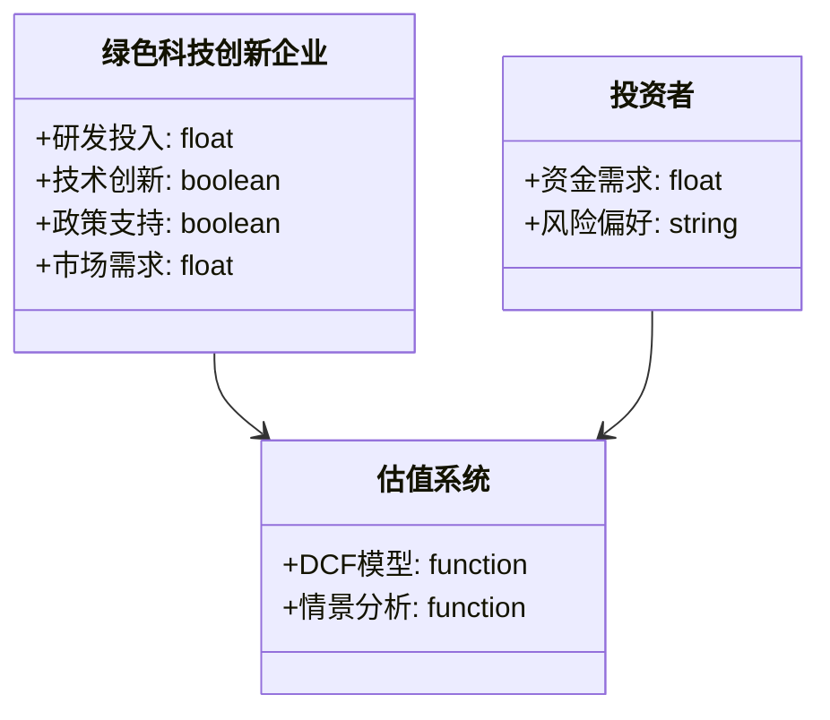

                 


# 绿色科技创新企业的估值挑战与机遇

> 关键词：绿色科技、创新企业、企业估值、DCF模型、情景分析、政策支持、风险管理

> 摘要：本文探讨了绿色科技创新企业在估值过程中面临的挑战与机遇。首先，介绍了绿色科技与创新企业的定义及其结合，分析了传统估值方法的局限性。接着，提出了基于绿色创新的估值模型和情景分析法，详细阐述了数学模型和算法原理。最后，通过具体案例分析，展示了如何在实际中应用这些方法，并讨论了绿色科技创新企业未来的发展趋势和估值的关键点。

---

## 第一部分: 绿色科技创新企业的背景与概念

### 第1章: 绿色科技与创新企业的定义与核心要素

#### 1.1 绿色科技的定义与内涵
绿色科技是指以环保、可持续发展为核心目标，通过技术创新解决环境问题的科技领域。其核心特征包括技术的环保性、资源的高效利用和对环境的积极影响。

#### 1.2 创新企业的定义与特点
创新企业是以技术创新为核心竞争力的企业，具有高研发投入、快速迭代和市场适应性强的特点。

#### 1.3 绿色科技创新企业的概念与核心要素
绿色科技创新企业是将绿色科技与创新相结合的企业，核心要素包括技术创新、可持续发展和社会价值。

### 第2章: 绿色科技创新企业的背景与发展趋势

#### 2.1 绿色科技发展的背景
全球气候变化和可持续发展的需求推动了绿色科技的发展，政策支持和市场驱动是其主要动力。

#### 2.2 创新企业在绿色科技发展中的角色
创新企业通过技术创新和商业模式创新推动绿色科技的发展，成为实现碳中和目标的重要力量。

#### 2.3 绿色科技创新企业的发展趋势
绿色科技领域的技术发展和创新企业在绿色科技中的未来定位是其发展趋势，全球化合作也是其重要方向。

---

## 第二部分: 绿色科技创新企业的估值理论与方法

### 第3章: 传统企业估值方法的局限性

#### 3.1 传统企业估值方法概述
包括净现值法（NPV）、内部收益率法（IRR）和现金流折现模型（DCF）等。

#### 3.2 传统估值方法在绿色科技企业中的局限性
绿色科技企业的研发投入高、不确定性大，传统方法难以准确评估其长期价值和外部性。

### 第4章: 绿色科技创新企业的特殊估值方法

#### 4.1 基于绿色创新的估值模型
绿色创新的经济价值评估和长期收益预测是其核心，通过数学模型量化其社会价值。

#### 4.2 绿色科技企业的情景分析法
情景分析法通过不同情景下的企业价值评估，帮助投资者理解绿色科技创新企业在不同环境下的表现。

---

## 第三部分: 系统分析与架构设计

### 第5章: 问题场景介绍

绿色科技创新企业的估值需要考虑技术不确定性、政策风险和市场接受度等因素，构建一个综合的估值系统。

### 第6章: 系统功能设计

#### 6.1 领域模型（Mermaid类图）


#### 6.2 系统架构设计（Mermaid架构图）
```mermaid
dataflow
    前端 --> 估值模块
    估值模块 --> 数据库
    数据库 --> 后端
    后端 --> 分析模块
    分析模块 --> 报告生成器
    报告生成器 --> 前端
```

---

## 第四部分: 项目实战

### 第7章: 环境安装与系统核心实现

#### 7.1 环境安装
需要安装Python、Mermaid和相关数据分析库。

#### 7.2 核心代码实现
```python
def greenDCF(revenue, cost, discount_rate):
    # 计算现金流
    cash_flow = revenue - cost
    # 计算现值
    present_value = cash_flow / (1 + discount_rate)**i
    return present_value.sum()

# 示例
revenue = [100, 150, 200]
cost = [50, 70, 90]
discount_rate = 0.1
print(greenDCF(revenue, cost, discount_rate))
```

---

## 第五部分: 总结与展望

### 第8章: 绿色科技创新企业的估值挑战与应对策略

#### 8.1 挑战
技术不确定性、政策风险和市场接受度是主要挑战。

#### 8.2 应对策略
通过风险管理、政策支持和市场推广应对挑战。

### 第9章: 未来展望与趋势

绿色科技创新企业将在技术融合和政策支持下继续发展，估值方法也将更加多元化和动态化。

---

通过以上分析，绿色科技创新企业的估值挑战与机遇得以全面探讨，未来的研究将进一步完善评估方法和推动技术创新。

