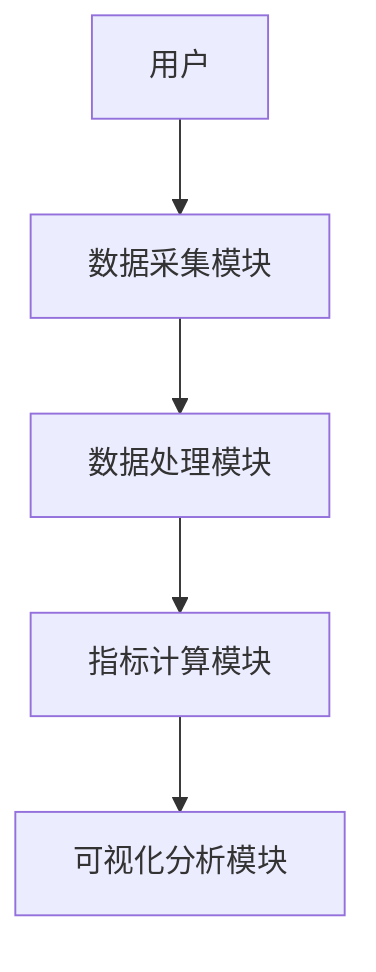
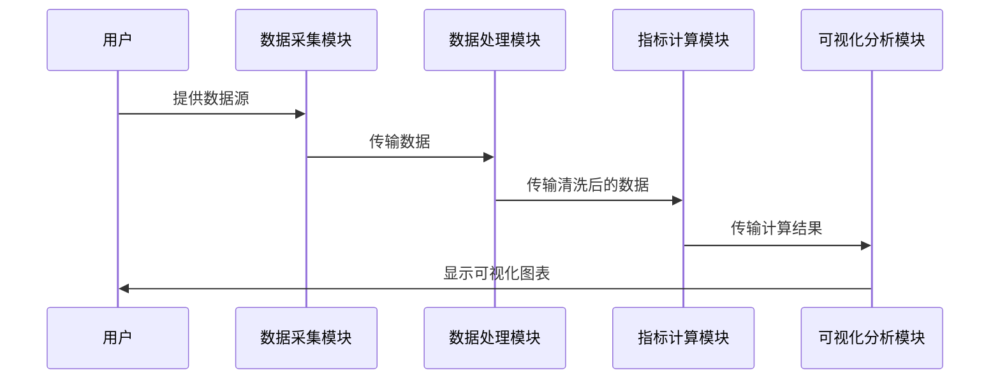

                 


# 罗伯特·希勒的周期调整市盈率：长期价值投资的指标

## 关键词：周期调整市盈率、长期投资、价值评估、经济周期、市场波动、投资决策

## 摘要：  
本文深入探讨了罗伯特·希勒提出的周期调整市盈率（CAPE）这一重要投资指标。文章从CAPE的定义、计算方法、经济意义及其在不同经济周期中的应用入手，结合数学模型和系统设计，详细分析了其在长期价值投资中的作用。通过实际案例和代码实现，展示了如何利用CAPE进行投资决策，为投资者提供了实用的指导和建议。

---

## 第一部分: 罗伯特·希勒的周期调整市盈率概述

### 第1章: 周期调整市盈率的背景与意义

#### 1.1 长期价值投资的必要性
##### 1.1.1 投资市场的周期性特征
投资市场具有明显的周期性，市场波动受到经济周期、政策变化和投资者情绪的影响。传统市盈率（P/E）在短期市场波动中可能失真，无法准确反映企业的长期价值。

##### 1.1.2 传统市盈率的局限性
传统市盈率仅考虑当前盈利数据，忽视了经济周期波动对企业收益的影响，导致在市场泡沫或衰退时期给出误导性信号。

##### 1.1.3 周期调整市盈率的提出背景
为解决传统市盈率的局限性，罗伯特·希勒提出了周期调整市盈率（CAPE），通过对企业收益的周期性调整，提供更准确的长期价值评估。

---

### 第2章: 周期调整市盈率的理论基础

#### 2.1 市盈率的基本概念与计算方法
##### 2.1.1 市盈率的定义
市盈率是衡量股票价格与每股收益之间关系的指标，公式为：
$$ P/E = \frac{\text{股价}}{\text{每股收益}} $$

##### 2.1.2 市盈率的计算公式
$$ P/E = \frac{\text{股价}}{\text{当前收益}} $$

##### 2.1.3 市盈率的局限性
- 仅考虑当前收益，忽视历史收益和未来收益。
- 在市场波动较大时，市盈率可能失真。

#### 2.2 周期调整市盈率的改进与创新
##### 2.2.1 周期调整市盈率的定义
周期调整市盈率（CAPE）通过对企业过去10年平均收益的调整，计算出更合理的估值指标，公式为：
$$ CAPE = \frac{\text{股价}}{\text{过去10年平均实际收益}} $$

##### 2.2.2 周期调整市盈率与传统市盈率的对比
| 指标 | 传统市盈率 | 周期调整市盈率 |
|------|------------|----------------|
| 数据基础 | 当前收益 | 过去10年平均收益 |
| 适用场景 | 短期分析 | 长期分析 |
| 优势 | 简单易用 | 更具稳定性 |

##### 2.2.3 市场周期与经济周期的关系
市场周期受经济周期影响，CAPE通过长期平均收益，能够更好地捕捉市场周期波动。

---

## 第二部分: 周期调整市盈率的系统分析与架构设计

### 第3章: 系统功能设计

#### 3.1 数据采集模块
- 采集历史股价和收益数据。
- 数据源：股票市场数据库、经济指标数据库。

#### 3.2 数据处理模块
- 清洗数据，处理缺失值。
- 计算过去10年平均收益。

#### 3.3 指标计算模块
- 计算传统市盈率和周期调整市盈率。
- 生成对比分析报告。

#### 3.4 可视化分析模块
- 绘制CAPE与P/E的对比图。
- 可视化展示经济周期与市场周期的关系。

### 第4章: 系统架构设计



### 第5章: 系统接口设计

#### 5.1 数据接口
- 输入接口：股价数据、收益数据。
- 输出接口：清洗后的数据。

#### 5.2 计算接口
- 输入接口：清洗后的数据。
- 输出接口：CAPE值、P/E值。

#### 5.3 可视化接口
- 输入接口：计算结果。
- 输出接口：可视化图表。

### 第6章: 系统交互设计



---

## 第三部分: 项目实战

### 第7章: 环境配置与代码实现

#### 7.1 环境配置
- 安装Python和相关库：pandas、numpy、matplotlib。

#### 7.2 代码实现
```python
import pandas as pd
import numpy as np
import matplotlib.pyplot as plt

# 示例数据
data = {
    'Year': [2013, 2014, 2015, 2016, 2017, 2018, 2019, 2020, 2021, 2022],
    'Earnings': [100, 105, 110, 115, 120, 125, 130, 135, 140, 145],
    'Price': [1000, 1050, 1100, 1150, 1200, 1250, 1300, 1350, 1400, 1450]
}

df = pd.DataFrame(data)

# 计算过去10年平均收益
average_earnings = df['Earnings'].mean()
# 计算传统市盈率
traditional_pe = df['Price'] / df['Earnings']
# 计算周期调整市盈率
cape = df['Price'] / average_earnings

print("传统市盈率:", traditional_pe.values)
print("周期调整市盈率:", cape.values)
```

#### 7.3 代码解读
- 数据读取：使用pandas读取数据。
- 数据处理：计算过去10年平均收益。
- 指标计算：分别计算传统市盈率和周期调整市盈率。
- 结果展示：打印计算结果。

### 第8章: 实际案例分析

#### 8.1 环境配置与数据准备
- 使用历史股价和收益数据。

#### 8.2 代码实现
```python
# 假设我们有一个股票的历史数据
# 计算过去10年的平均收益
average_earnings = df['Earnings'].mean()
# 计算周期调整市盈率
cape = df['Price'] / average_earnings
```

#### 8.3 结果分析
- 通过对比CAPE和传统市盈率，评估市场是否被高估或低估。
- 结合经济周期，判断当前市场的长期价值。

### 第9章: 项目总结

#### 9.1 小结
CAPE提供了更准确的长期价值评估，帮助投资者做出更明智的投资决策。

#### 9.2 注意事项
- 数据质量：确保数据的准确性和完整性。
- 市场周期：需结合经济周期分析。
- 适用场景：CAPE适用于长期投资，不适用于短期交易。

#### 9.3 拓展阅读
- 罗伯特·希勒的《金融与经济周期》。
- 其他长期投资指标的研究。

---

## 结语  
通过本文的分析，读者可以深入理解周期调整市盈率的理论基础和实际应用，掌握如何利用这一指标进行长期价值投资。

