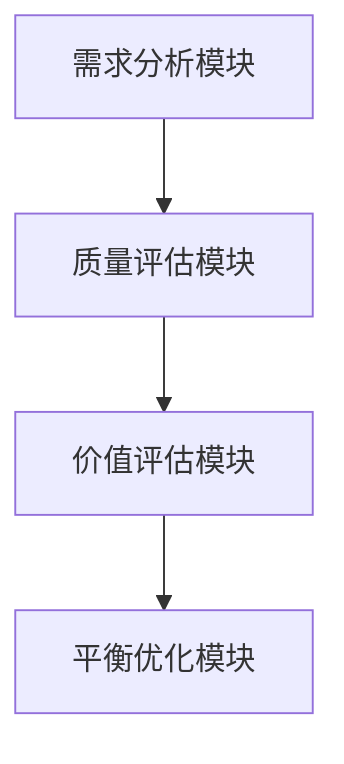
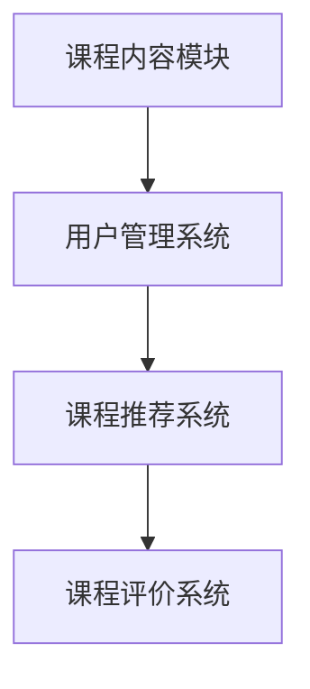

                 


---

# 罗伯特哈格斯特朗的质量价值结合

## 关键词：质量，价值，结合，系统架构，案例分析

## 摘要：  
本文探讨了质量与价值结合的重要性及其在实际项目中的应用。通过分析核心概念、理论基础、实现方法和系统架构，结合实际案例，详细阐述了如何在项目中平衡质量与价值，并提供了一系列最佳实践建议。

---

# 第一部分：质量价值结合的背景与概述

## 第1章：质量与价值的结合概述

### 1.1 质量与价值的定义与内涵

#### 1.1.1 质量的定义与核心要素  
质量是指产品或服务满足用户需求的程度。核心要素包括功能性、可靠性、可用性、效率、可维护性和可扩展性。

#### 1.1.2 价值的定义与核心要素  
价值是指产品或服务为用户创造的收益或满足感。核心要素包括功能价值、经济价值、社会价值和情感价值。

#### 1.1.3 质量与价值的关系分析  
质量是价值的基础，而价值是质量的外在表现。两者相辅相成，共同决定产品的市场竞争力。

### 1.2 质量与价值结合的重要性

#### 1.2.1 质量与价值结合的必要性  
在竞争激烈的市场环境中，仅关注单一维度（质量或价值）无法满足用户需求，必须两者兼顾。

#### 1.2.2 质量价值结合对企业的影响  
通过平衡质量与价值，企业可以提高产品竞争力，增强客户忠诚度，降低售后成本。

#### 1.2.3 质量价值结合对客户的价值  
客户获得高质量且高价值的产品，能够提升使用体验和满意度，增强品牌忠诚度。

### 1.3 质量价值结合的现状与挑战

#### 1.3.1 当前质量与价值结合的现状  
许多企业在追求高质量的同时忽视了成本，导致产品价格过高，竞争力下降。

#### 1.3.2 质量价值结合的主要挑战  
资源分配困难、技术限制、市场需求变化快、用户期望多样化。

#### 1.3.3 质量价值结合的未来趋势  
智能化、个性化、绿色可持续发展成为未来质量价值结合的关键方向。

## 第2章：质量与价值结合的核心概念与理论基础

### 2.1 质量与价值的核心概念

#### 2.1.1 质量的核心概念与属性  
质量不仅仅是产品的性能，还包括用户体验、安全性、环保性等多方面因素。

#### 2.1.2 价值的核心概念与属性  
价值不仅仅是产品的价格，还包括其带来的经济效益和社会效益。

#### 2.1.3 质量与价值的共同特征与差异  
共同特征：两者都关注用户需求和满意度。  
差异：质量强调产品本身的属性，而价值强调产品对外在的贡献。

### 2.2 质量与价值结合的理论基础

#### 2.2.1 质量管理理论基础  
全面质量管理（TQM）强调全过程管理，以客户为中心。

#### 2.2.2 价值管理理论基础  
价值主张（Value Proposition）强调从客户视角出发，提供独特价值。

#### 2.2.3 质量价值结合的理论框架  
构建质量-价值矩阵，通过平衡质量与价值的投入，实现最优匹配。

### 2.3 质量与价值结合的模型与方法

#### 2.3.1 质量与价值结合的模型构建  
通过质量-价值函数，量化质量与价值的关系，找到最佳平衡点。

#### 2.3.2 质量与价值结合的方法论  
采用系统工程方法，从需求分析、设计优化、实施监控到评估优化，全面覆盖。

#### 2.3.3 质量与价值结合的实现路径  
需求分析→方案设计→实施监控→评估优化。

## 第3章：质量与价值结合的实现方法与策略

### 3.1 质量与价值结合的实现方法

#### 3.1.1 质量优先的实现方法  
在项目初期优先保证质量，后期优化价值。

#### 3.1.2 价值优先的实现方法  
在项目初期优先创造价值，后期提升质量。

#### 3.1.3 质量与价值平衡的实现方法  
通过权衡分析，在不同阶段动态调整质量与价值的投入比例。

### 3.2 质量与价值结合的策略选择

#### 3.2.1 策略选择的原则与依据  
根据项目目标、资源限制、市场需求和团队能力，选择合适的策略。

#### 3.2.2 不同场景下的策略选择  
高风险项目：优先保证质量；高收益项目：优先创造价值。

#### 3.2.3 策略选择的优化与调整  
定期评估策略效果，及时调整以应对变化。

### 3.3 质量与价值结合的实现步骤

#### 3.3.1 明确目标与需求  
通过需求分析，明确项目的质量目标和价值目标。

#### 3.3.2 设计实现方案  
基于质量-价值矩阵，制定详细的设计方案。

#### 3.3.3 实施与监控  
在实施过程中，持续监控质量与价值的实现情况。

#### 3.3.4 评估与优化  
通过评估结果，优化质量与价值的实现策略。

---

# 第二部分：质量与价值结合的系统架构与实现

## 第4章：质量与价值结合的系统架构设计

### 4.1 系统功能模块设计

#### 4.1.1 功能模块划分  
需求分析模块、质量评估模块、价值评估模块、平衡优化模块。

#### 4.1.2 模块功能描述  
需求分析模块：收集用户需求，转化为质量与价值目标。  
质量评估模块：评估各模块的质量指标。  
价值评估模块：评估各模块的价值贡献。  
平衡优化模块：动态调整质量与价值的投入比例。

### 4.2 系统架构设计

#### 4.2.1 系统架构图  
使用Mermaid绘制系统架构图，展示各模块之间的交互关系。



### 4.3 系统接口设计

#### 4.3.1 接口定义  
明确各模块之间的接口，确保数据传递和功能调用的顺利进行。

#### 4.3.2 接口实现  
通过API接口实现模块之间的通信，确保系统的高效运行。

### 4.4 系统交互设计

#### 4.4.1 交互流程  
从需求分析到平衡优化的完整交互流程。

#### 4.4.2 交互示例  
用户输入需求，系统分析并生成质量与价值目标，调整优化后输出最终方案。

---

# 第三部分：质量与价值结合的项目实战

## 第5章：质量与价值结合的案例分析

### 5.1 项目背景与目标

#### 5.1.1 项目背景  
一个在线教育平台的开发项目，旨在提供高质量的课程内容，同时创造高价值的用户体验。

#### 5.1.2 项目目标  
在有限的预算内，开发出高质量的课程内容和平台功能，同时提升用户体验和市场占有率。

### 5.2 系统功能设计

#### 5.2.1 功能模块划分  
课程内容模块、用户管理系统、课程推荐系统、课程评价系统。

#### 5.2.2 功能设计  
课程内容模块：提供丰富的课程资源，确保内容质量。  
用户管理系统：实现用户注册、登录、课程购买功能，提升用户体验。  
课程推荐系统：基于用户行为推荐优质课程，增加用户粘性。  
课程评价系统：收集用户反馈，优化课程内容和平台功能。

### 5.3 系统架构实现

#### 5.3.1 系统架构图  
使用Mermaid绘制系统架构图，展示各功能模块的交互关系。



#### 5.3.2 核心代码实现  
课程推荐系统的实现代码，基于协同过滤算法的推荐逻辑。

```python
def recommend_courses(user_id):
    # 获取用户行为数据
    user_behavior = get_user_behavior(user_id)
    # 计算相似用户
    similar_users = find_similar_users(user_behavior)
    # 推荐课程
    recommended_courses = get_top_courses(similar_users)
    return recommended_courses
```

### 5.4 项目评估与优化

#### 5.4.1 项目评估  
通过用户满意度调查和数据分析，评估项目的质量和价值实现情况。

#### 5.4.2 项目优化  
根据评估结果，优化课程推荐算法和平台功能，提升用户体验和课程质量。

---

# 第四部分：质量与价值结合的最佳实践

## 第6章：质量与价值结合的最佳实践

### 6.1 最佳实践 tips

#### 6.1.1 明确目标  
在项目初期明确质量与价值的目标，确保团队一致。

#### 6.1.2 系统规划  
制定详细的质量与价值结合的实施计划，确保各阶段任务完成。

#### 6.1.3 持续优化  
定期评估项目进展，及时调整策略，持续优化质量与价值的实现。

### 6.2 项目小结

#### 6.2.1 成功经验  
通过质量与价值结合的方法，项目实现了高质量的产品和高价值的用户体验。

#### 6.2.2 遇到的挑战  
在实际项目中，资源分配和需求变化是主要的挑战，需要灵活应对。

#### 6.2.3 解决方案  
通过动态调整策略和持续优化，成功克服了各种挑战，确保了项目的顺利实施。

### 6.3 注意事项

#### 6.3.1 质量优先  
在资源有限的情况下，优先保证质量，再考虑价值的提升。

#### 6.3.2 价值驱动  
通过创造价值，提升产品的市场竞争力和客户满意度。

#### 6.3.3 综合平衡  
根据项目特点和市场需求，动态调整质量与价值的投入比例，实现最优结合。

### 6.4 拓展阅读

#### 6.4.1 推荐书籍  
《全面质量管理》、《价值主张设计》。

#### 6.4.2 相关技术博客  
推荐关注技术博客和行业动态，了解最新的质量与价值结合的实践案例。

---

# 结语

质量与价值的结合是现代项目管理中的重要课题，通过本文的探讨和分析，我们深刻认识到在实际项目中，如何平衡质量与价值，实现高质量且高价值的产品，是提升企业竞争力的关键。希望本文的理论和实践分享，能够为读者在质量与价值结合的实践中提供有价值的参考和启发。未来，随着技术的不断发展和市场需求的变化，质量与价值结合的方法和策略也将不断优化和创新，值得我们持续关注和深入研究。

--- 

**全文完**

