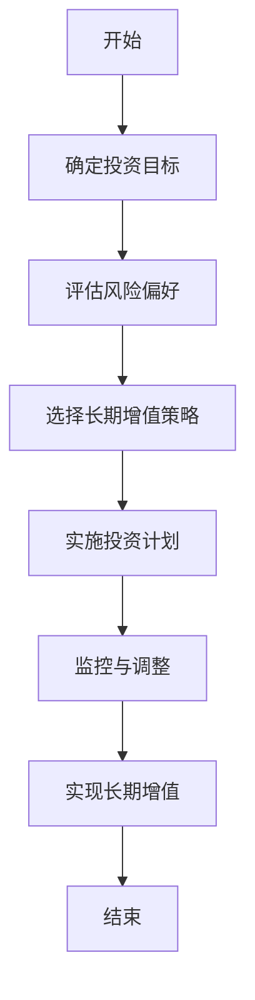
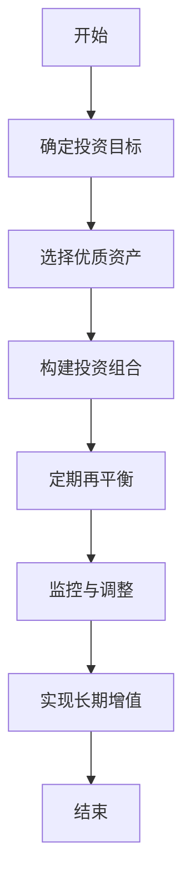
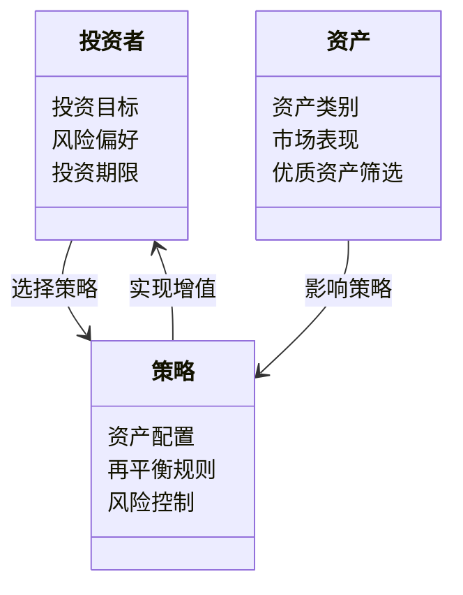
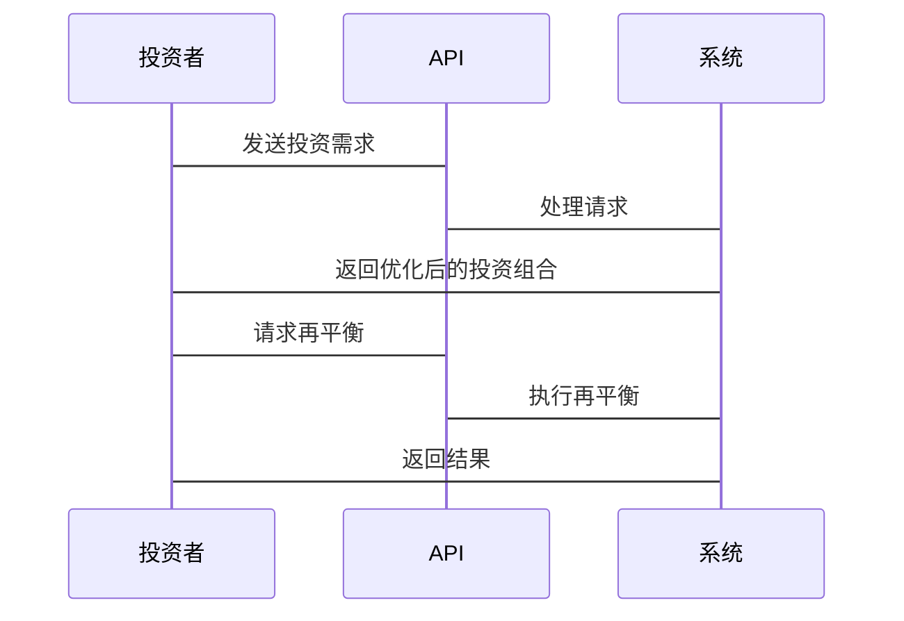

                 


# 罗伯特哈格斯特朗的长期增值策略

## 关键词：罗伯特·哈格斯特朗、长期增值策略、投资策略、资产配置、价值投资、系统化方法

## 摘要：  
本文深入探讨了罗伯特·哈格斯特朗的长期增值策略，从背景介绍、核心概念、算法原理到系统分析、项目实战及最佳实践，详细阐述了该策略的实施路径和应用价值。通过数学模型、系统架构和代码示例，展示了如何将长期增值策略系统化、具体化，为投资者提供实用的指导。

---

# 第1章: 长期增值策略的背景与问题背景

## 1.1 长期增值策略的背景

### 1.1.1 投资领域的发展历程  
投资领域历经百年发展，从传统的“买入并持有”策略到现代的量化投资，技术进步和市场演变推动了投资策略的多样化。  

### 1.1.2 长期增值策略的兴起  
20世纪末，罗伯特·哈格斯特朗提出长期增值策略，强调通过系统化的方法和耐心持有优质资产实现财富增长。  

### 1.1.3 现代投资理论与长期增值策略的关系  
现代投资组合理论（MPT）为长期增值策略提供了理论基础，而长期策略则通过时间复利效应最大化投资回报。  

## 1.2 问题背景与问题描述

### 1.2.1 投资者面临的长期增值挑战  
市场波动、通货膨胀、政策变化等因素增加了投资的不确定性，传统策略难以应对长期目标。  

### 1.2.2 现有投资策略的局限性  
短期交易频繁、缺乏系统性、忽视复利效应等问题使得传统策略难以实现长期增值。  

### 1.2.3 长期增值策略的核心问题  
如何在不确定性中选择优质资产并长期持有，通过复利效应实现财富增长。  

## 1.3 长期增值策略的解决思路

### 1.3.1 长期增值策略的核心理念  
通过系统化筛选优质资产，构建多元化投资组合，长期持有并定期再平衡。  

### 1.3.2 理解长期与短期的平衡  
短期波动不可预测，长期趋势可规划。长期策略注重资产质量而非短期收益。  

### 1.3.3 长期增值策略的实施路径  
资产配置、精选个股、定期再平衡、风险控制。  

## 1.4 长期增值策略的边界与外延

### 1.4.1 长期增值的适用范围  
适用于有长期财务目标的投资者，尤其是机构投资者和个人投资者。  

### 1.4.2 策略的边界条件  
市场深度、资产流动性、政策环境等。  

### 1.4.3 策略的外延与扩展  
与ESG投资、量化策略结合，适应不同市场环境。  

## 1.5 核心概念的结构与组成

### 1.5.1 核心要素的构成  
优质资产、时间、复利、再平衡。  

### 1.5.2 要素之间的关系  
资产质量决定增值潜力，时间是复利的基础，再平衡优化组合表现。  

### 1.5.3 核心概念的系统性分析  
系统化的方法确保策略的有效性和可操作性。  

---

# 第2章: 长期增值策略的核心概念与联系

## 2.1 核心概念的原理

### 2.1.1 长期增值的内在逻辑  
通过持有优质资产，时间复利效应实现财富增长。  

### 2.1.2 理解长期增值的核心要素  
优质资产、时间、复利、再平衡策略。  

### 2.1.3 核心概念的数学模型  
复利公式：$$A = P(1 + r)^t$$，其中A为终值，P为本金，r为年化收益率，t为时间。  

## 2.2 核心概念的属性对比

| 属性 | 长期增值策略 | 短期交易策略 | 备注 |
|------|--------------|--------------|------|
| 时间框架 | 长期（5年以上） | 短期（几天到几个月） | - |
| 风险承受 | 中高风险 | 高风险 | - |
| 资本要求 | 较低 | 较高 | - |

## 2.3 ER实体关系图与Mermaid流程图

### 2.3.1 实体关系图  
```mermaid
erDiagram
    投资者 {
        <属性> 投资目标
        <属性> 风险偏好
        <属性> 投资期限
    }
    资产 {
        <属性> 优质资产
        <属性> 资产类别
        <属性> 市场表现
    }
    策略 {
        <属性> 资产配置
        <属性> 再平衡规则
        <属性> 风险控制
    }
    投资者 --> 策略 : 选择策略
    资产 --> 策略 : 影响策略
    策略 --> 投资者 : 实现增值
```

### 2.3.2 流程图  


---

# 第3章: 长期增值策略的算法原理

## 3.1 长期增值策略的数学模型

### 3.1.1 复利公式  
$$A = P(1 + r)^t$$  

### 3.1.2 投资组合收益计算  
$$E(R_p) = \sum w_i E(R_i)$$  

### 3.1.3 风险调整后收益  
$$E(R_p) = R_f + \beta_p (R_m - R_f)$$  

## 3.2 算法步骤

### 3.2.1 确定投资目标  
- 设定投资期限、风险承受能力和收益目标。  

### 3.2.2 选择优质资产  
- 筛选具备竞争优势、良好治理和持续增长潜力的企业。  

### 3.2.3 构建投资组合  
- 按资产类别分配权重，分散风险。  

### 3.2.4 定期再平衡  
- 按预定频率调整持仓，维持目标配置。  

### 3.2.5 监控与调整  
- 定期评估市场变化，优化投资组合。  

## 3.3 Mermaid流程图



## 3.4 Python代码实现

```python
def compound_interest(principal, rate, time):
    return principal * (1 + rate) ** time

def portfolio_return(weights, returns):
    return sum(weights[i] * returns[i] for i in range(len(weights)))

def rebalance(portfolio, target_weights):
    rebalanced = {}
    total = sum(portfolio.values())
    for asset in target_weights:
        rebalanced[asset] = target_weights[asset] * total
    return rebalanced
```

---

# 第4章: 长期增值策略的系统分析

## 4.1 系统功能设计

### 4.1.1 领域模型  


### 4.1.2 系统架构设计  
```mermaid
rectangle 数据层 {
    数据库
    数据访问层
}
rectangle 业务逻辑层 {
    投资组合管理
    资产筛选
    再平衡逻辑
}
rectangle 用户界面层 {
    输入界面
    输出界面
}
```

### 4.1.3 接口设计  
- RESTful API：/api/portfolio, /api/rebalance  

### 4.1.4 交互序列图  


---

# 第5章: 长期增值策略的项目实战

## 5.1 环境安装

### 5.1.1 Python环境安装  
安装Python和必要的库（如Pandas、NumPy、Matplotlib）。  

### 5.1.2 代码实现  
实现资产筛选、投资组合优化和再平衡功能。  

## 5.2 核心代码实现

### 5.2.1 资产筛选  
```python
def screen_assets(assets, criteria):
    return [asset for asset in assets if meets_criteria(asset, criteria)]
```

### 5.2.2 投资组合优化  
```python
def optimize_portfolio(weights, returns, risk_free_rate):
    # 使用现代投资组合理论优化权重
    return optimized_weights
```

### 5.2.3 再平衡逻辑  
```python
def rebalance_portfolio(current_weights, target_weights):
    return adjusted_weights
```

## 5.3 代码解读与分析

### 5.3.1 资产筛选函数  
根据预设标准筛选优质资产，如ROE、债务率等。  

### 5.3.2 投资组合优化  
通过均值-方差优化，寻找最优风险收益比。  

### 5.3.3 再平衡逻辑  
定期调整持仓，维持目标配置，减少偏离成本。  

## 5.4 实际案例分析

### 5.4.1 案例背景  
假设投资者目标为5年，风险偏好中等。  

### 5.4.2 投资组合构建  
配置60%股票、30%债券、10%现金。  

### 5.4.3 再平衡实施  
每年末调整持仓，维持初始配置比例。  

## 5.5 项目小结

### 5.5.1 成功经验  
系统化方法确保策略的有效性和可操作性。  

### 5.5.2 可能的问题  
市场剧烈波动可能影响再平衡效果。  

### 5.5.3 改进方向  
引入动态再平衡策略，适应市场变化。  

---

# 第6章: 长期增值策略的最佳实践

## 6.1 最佳实践 tips

### 6.1.1 系统化方法  
制定明确的投资计划并严格执行。  

### 6.1.2 风险控制  
定期评估和调整投资组合，分散风险。  

### 6.1.3 持续学习  
关注市场变化，优化投资策略。  

## 6.2 小结与总结

### 6.2.1 核心思想  
通过系统化方法和长期持有优质资产实现财富增长。  

### 6.2.2 策略优势  
时间复利效应和系统化方法确保稳健回报。  

## 6.3 注意事项

### 6.3.1 短期波动影响  
长期策略需应对短期波动，保持耐心。  

### 6.3.2 再平衡成本  
频繁交易可能增加交易成本和税务负担。  

### 6.3.3 市场环境变化  
宏观经济和政策变化可能影响投资组合表现。  

## 6.4 拓展阅读

### 6.4.1 推荐书籍  
1. 《投资学基础》  
2. 《长期投资的艺术》  

### 6.4.2 网络资源  
- 投资策略博客  
- 金融数据分析平台  

---

# 附录

## 附录1: 长期增值策略相关术语表  
1. 时间复利效应：通过长期持有实现收益最大化。  
2. 资产配置：将资金分配到不同资产类别以分散风险。  

## 附录2: 参考文献  
1. 罗伯特·哈格斯特朗：《长期增值策略》  
2. 现代投资组合理论（MPT）的相关文献  

---

# 结束语

通过本文的详细阐述，我们深入探讨了罗伯特·哈格斯特朗的长期增值策略，从理论到实践，为投资者提供了系统的指导。希望本文能为读者在实现长期财务目标的过程中提供有价值的参考。

