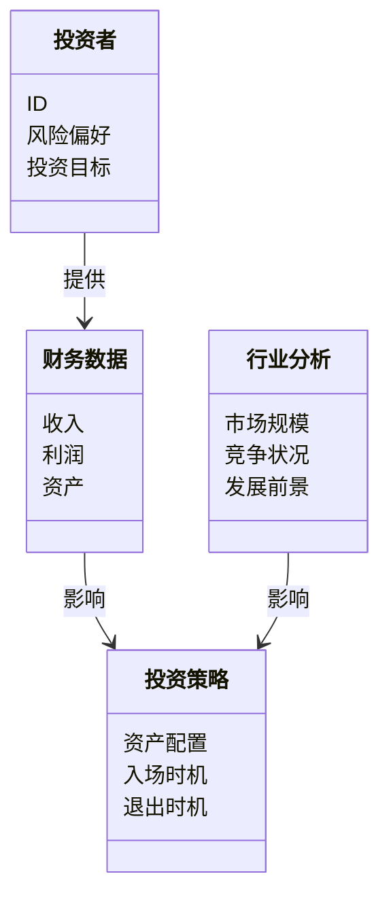

                 


# 罗杰·洛温斯坦的智慧型价值投资：避免价值陷阱

## 关键词：智慧型价值投资、价值陷阱、投资策略、风险管理、财务分析、投资组合优化

## 摘要：
本文深入探讨了罗杰·洛温斯坦的智慧型价值投资理念，分析了如何通过系统的方法识别和避免价值陷阱，帮助投资者在复杂的市场环境中实现稳健收益。文章结合理论与实践，详细讲解了价值投资的核心要素、数学模型、风险管理策略以及投资组合优化方法，为投资者提供了全面的指导。

---

## 第一部分：智慧型价值投资概述

### 第1章：价值投资的背景与基础

#### 1.1 价值投资的核心概念
- 1.1.1 投资的定义与分类
  - 投资是指将资金投入某个项目或资产，以期获得未来收益的行为。
  - 分类包括股票投资、债券投资、房地产投资等。
- 1.1.2 价值投资的起源与发展
  - 价值投资起源于20世纪初，由本杰明·格雷厄姆和戴维·多德提出。
  - 罗杰·洛温斯坦在此基础上发展出智慧型价值投资理念。
- 1.1.3 罗杰·洛温斯坦的智慧型价值投资理念
  - 强调深入分析企业的基本面，识别具有持续竞争优势的企业。

#### 1.2 智慧型价值投资的独特性
- 1.2.1 与传统价值投资的区别
  - 传统价值投资：主要关注低市盈率、低市净率等估值指标。
  - 智慧型价值投资：结合企业基本面、行业地位、竞争优势进行综合评估。
- 1.2.2 智慧型价值投资的核心要素
  - 企业盈利能力、财务健康状况、管理层质量、行业竞争环境。

---

## 第二部分：智慧型价值投资的核心要素

### 第2章：投资理念的演变

#### 2.1 从传统价值投资到智慧型投资的转变
- 2.1.1 传统价值投资的局限性
  - 过度依赖估值指标，忽视企业基本面。
  - 无法适应行业变化和企业转型。
- 2.1.2 智慧型投资的优势
  - 综合考虑企业内在价值和市场环境。
  - 强调长期投资，避免短期波动干扰。

### 第2.2 分析框架

#### 2.2.1 财务指标分析
- 2.2.1.1 主要财务指标
  - 净利润、营业收入、毛利率、ROE（净资产收益率）。
- 2.2.1.2 财务健康状况评估
  - 通过财务报表分析企业的盈利能力和偿债能力。

#### 2.2.2 行业分析与竞争优势
- 2.2.2.1 行业生命周期分析
  - 初期、成长期、成熟期、衰退期的特征。
- 2.2.2.2 企业竞争优势分析
  - 成本优势、技术优势、品牌优势。

#### 2.2.3 管理层评估
- 2.2.3.1 管理层的素质与战略
  - 管理层是否具有长期发展的战略眼光。
- 2.2.3.2 管理层的诚信与稳定性
  - 管理层是否稳定，是否存在道德风险。

---

## 第三部分：价值陷阱的识别与避免

### 第3章：价值陷阱的定义与特征

#### 3.1 价值陷阱的识别方法
- 3.1.1 低估值陷阱
  - 企业估值看似便宜，但实际盈利能力差。
- 3.1.2 行业周期陷阱
  - 行业处于衰退期，企业难以持续盈利。
- 3.1.3 管理层陷阱
  - 管理层决策失误或存在道德风险。

#### 3.2 避免价值陷阱的策略
- 3.2.1 财务数据分析法
  - 通过财务指标分析企业的盈利能力。
- 3.2.2 行业周期分析法
  - 选择成长期或成熟期的行业。
- 3.2.3 竞争优势评估法
  - 投资于具有持续竞争优势的企业。

---

## 第四部分：智慧型价值投资的数学模型与算法

### 第4章：投资价值评估的数学模型

#### 4.1 股票内在价值的计算公式
$$ V = \frac{CF}{r - g} $$
其中，\( V \) 是股票的内在价值，\( CF \) 是未来现金流，\( r \) 是折现率，\( g \) 是增长率。

#### 4.2 现金流折现模型（DCF）
- 4.2.1 模型步骤
  1. 预测未来现金流。
  2. 确定折现率。
  3. 计算现值。
  4. 评估企业内在价值。

#### 4.3 市盈率与市净率分析
- 4.3.1 市盈率（P/E）
  - 公式：\( P/E = \frac{P}{E} \)
  - 解释：市盈率低的企业可能具有投资价值。
- 4.3.2 市净率（P/B）
  - 公式：\( P/B = \frac{P}{B} \)
  - 解释：市净率低的企业可能具有投资价值。

### 第5章：投资组合优化的算法

#### 5.1 马科维茨均值-方差模型
- 5.1.1 模型简介
  - 马科维茨模型通过优化投资组合的预期收益和风险，找到最优投资组合。
- 5.1.2 实现步骤
  1. 确定资产的预期收益和方差。
  2. 计算协方差矩阵。
  3. 优化投资组合。

#### 5.2 现实投资组合优化的改进算法
- 5.2.1 考虑交易成本的优化模型
  - 引入交易成本，调整优化目标。
- 5.2.2 考虑流动性约束的优化模型
  - 考虑资产的流动性，调整优化权重。

---

## 第五部分：风险管理与投资策略

### 第6章：风险管理的核心原则

#### 6.1 风险的定义与分类
- 6.1.1 市场风险
  - 由于市场波动引起的资产价格波动。
- 6.1.2 信用风险
  - 由于债务人违约引起的损失。
- 6.1.3 流动性风险
  - 无法快速变现资产的风险。

#### 6.2 风险管理策略
- 6.2.1 分散投资
  - 通过投资不同资产降低风险。
- 6.2.2 止损策略
  - 设定止损点，避免重大损失。
- 6.2.3 风险对冲
  - 使用衍生工具对冲市场风险。

### 第7章：投资策略的制定与执行

#### 7.1 长期投资策略
- 7.1.1 长期投资的优点
  - 通过复利效应实现财富增长。
- 7.1.2 长期投资的风险
  - 短期内的市场波动可能导致亏损。

#### 7.2 短期投资策略
- 7.2.1 短期投资的优点
  - 可以抓住短期市场机会。
- 7.2.2 短期投资的风险
  - 市场波动大，难以预测。

#### 7.3 灵活调整策略
- 7.3.1 根据市场变化调整投资组合。
- 7.3.2 定期评估投资组合的表现。

---

## 第六部分：投资组合构建与优化

### 第8章：投资组合构建的原则

#### 8.1 资产配置的基本原则
- 8.1.1 资产分散化
  - 投资于不同类型的资产，降低风险。
- 8.1.2 风险与收益匹配
  - 根据风险承受能力选择资产。

#### 8.2 股票与债券的配置比例
- 8.2.1 根据市场环境调整比例。
- 8.2.2 根据个人风险偏好调整比例。

### 第9章：系统架构设计方案

#### 9.1 项目介绍
- 9.1.1 项目目标
  - 构建一个智慧型价值投资的分析系统。
- 9.1.2 项目范围
  - 包括数据收集、分析、策略制定等模块。

#### 9.2 系统功能设计（领域模型mermaid类图）


#### 9.3 系统架构设计（mermaid架构图）


---

## 第七部分：项目实战

### 第10章：环境安装与系统核心实现

#### 10.1 环境安装
- 10.1.1 安装Python
- 10.1.2 安装Pandas、NumPy等库
- 10.1.3 安装Matplotlib用于可视化

#### 10.2 核心实现源代码
```python
import pandas as pd
import numpy as np

# 示例代码：计算股票的内在价值
def calculate_intrinsic_value(eps, growth_rate, discount_rate):
    return eps / (discount_rate - growth_rate)

# 示例代码：计算投资组合的风险
def calculate_portfolio_risk(returns, covariance_matrix):
    # 计算方差
    variance = np.dot(returns, covariance_matrix)
    return np.sqrt(variance)
```

#### 10.3 代码应用解读与分析
- 10.3.1 计算股票内在价值的步骤
  1. 收集企业的EPS数据。
  2. 确定增长率和折现率。
  3. 计算内在价值。
- 10.3.2 计算投资组合风险的步骤
  1. 收集资产的收益数据。
  2. 计算资产的协方差矩阵。
  3. 计算投资组合的方差和标准差。

### 第11章：实际案例分析和详细讲解

#### 11.1 案例分析
- 11.1.1 某公司的价值陷阱识别
  - 通过财务数据分析识别企业是否存在价值陷阱。
- 11.1.2 投资组合优化案例
  - 根据市场环境优化投资组合配置。

#### 11.2 详细讲解剖析
- 11.2.1 价值陷阱的典型特征
- 11.2.2 投资策略的动态调整

### 第12章：项目小结

#### 12.1 项目总结
- 12.1.1 项目目标的实现情况
- 12.1.2 项目成果的应用前景

---

## 第八部分：最佳实践与拓展阅读

### 第13章：最佳实践 tips

#### 13.1 投资者的注意事项
- 13.1.1 避免情绪化投资
- 13.1.2 定期评估投资组合
- 13.1.3 学习行业知识，提升分析能力

#### 13.2 风险管理的注意事项
- 13.2.1 设置止损点
- 13.2.2 分散投资
- 13.2.3 定期审查投资组合

### 第14章：小结

#### 14.1 本文的核心思想
- 智慧型价值投资的核心在于深入分析企业基本面，识别具有持续竞争优势的企业，同时通过科学的方法避免价值陷阱，实现稳健的投资收益。

#### 14.2 未来展望
- 随着技术的进步，智慧型价值投资将更加依赖于数据分析和算法优化，投资者需要不断学习和适应新的投资环境。

---

## 第九部分：参考文献与拓展阅读

### 第15章：参考文献

#### 15.1 经典书籍
- 《The Intelligent Investor》 - 本杰明·格雷厄姆
- 《价值投资实战手册》 - 罗杰·洛温斯坦

#### 15.2 在线资源
- 投资分析工具和平台推荐
- 专业投资论坛和社区

### 第16章：拓展阅读

#### 16.1 其他相关投资策略
- 技术分析
- 主动投资与被动投资

#### 16.2 行业动态
- 最新投资趋势
- 技术创新对投资的影响

---

通过以上目录和内容设计，我们可以系统地理解和应用罗杰·洛温斯坦的智慧型价值投资理念，帮助投资者在复杂的市场环境中识别价值陷阱，制定科学的投资策略，实现稳健的投资收益。

