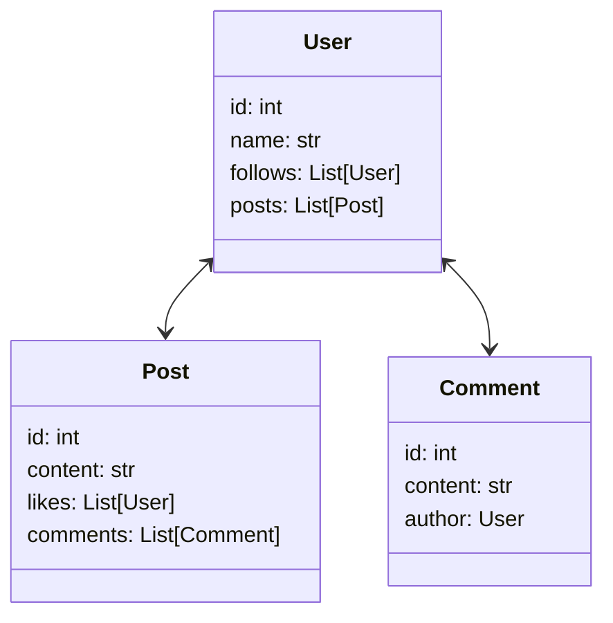

                 


# 羊群效应：理解并避免从众心理陷阱

## 关键词：羊群效应、从众心理、社会行为、群体决策、信息传播、独立思考

## 摘要：羊群效应是指个体在群体中容易受到他人影响，从而做出与多数人一致的行为。本文将从背景、原理、算法、系统设计、项目实战等多个角度深入剖析羊群效应，并提供避免其影响的方法和策略，帮助读者在决策中保持独立思考。

---

## # 引言

羊群效应是一种普遍存在于人类社会中的心理现象，它描述了个体在群体压力下倾向于跟随 majority 的行为模式。这种现象在日常生活、社会决策、市场营销等领域中随处可见，本文将通过系统的分析和实证研究，揭示羊群效应的本质，并提供避免其影响的方法。

---

## # 第一部分：羊群效应的背景与概念

### ## 1.1 羊群效应的定义与重要性

#### ### 1.1.1 什么是羊群效应
羊群效应（Herding Effect）是指个体在决策过程中，由于受到群体行为的影响，倾向于跟随大多数人的选择，从而放弃独立思考的现象。这种现象类似于羊群中的羊盲目跟随领头羊，导致整个群体的行为一致性。

#### ### 1.1.2 羊群效应在现代社会中的表现
在现代社会中，羊群效应的表现形式多样，例如：
- **消费领域**：许多人选择购买热销产品，而非真正适合自己的。
- **投资领域**：投资者盲目跟从市场趋势，导致泡沫的形成。
- **社交媒体**：用户倾向于转发热门话题，而非独立判断信息的真实性。

#### ### 1.1.3 理解羊群效应的意义
理解羊群效应有助于我们识别其潜在风险，并在决策中保持独立性。通过分析其成因和表现形式，我们可以更好地避免从众心理的负面影响。

---

### ## 1.2 羊群效应的历史与社会背景

#### ### 1.2.1 羊群效应的历史起源
羊群效应并非现代现象，其根源可以追溯到人类的原始社会。早期人类在狩猎和采集活动中，往往通过群体决策来提高生存率。然而，这种决策方式在现代社会中可能导致信息扭曲和决策失误。

#### ### 1.2.2 羊群效应在现代社会中的普遍性
随着信息传播速度的加快，羊群效应在现代社会中更加普遍。互联网和社交媒体的兴起，使得信息传播更加迅速，个体更容易受到群体行为的影响。

#### ### 1.2.3 羊群效应与其他集体行为的关系
羊群效应与其他集体行为（如从众行为、趋同心理）密切相关，但具有其独特的特征。羊群效应更强调个体在群体压力下的行为一致性，而其他行为则可能涉及更广泛的社会规范影响。

---

### ## 1.3 羊群效应的核心概念与特征

#### ### 1.3.1 羊群效应的定义与核心要素
羊群效应的核心要素包括：
- **群体压力**：个体感受到的来自群体的压力，促使他们跟随 majority。
- **信息不完整**：个体在决策时可能缺乏足够的信息，导致依赖群体判断。
- **趋同心理**：个体倾向于与群体保持一致，以避免孤立感。

#### ### 1.3.2 羊群效应的形成机制
羊群效应的形成机制包括：
- **信息传播**：信息在群体中的传播导致个体决策趋同。
- **社会认同**：个体通过与群体保持一致来获得认同感。
- **风险分担**：个体在群体中分散决策风险，降低个人责任。

#### ### 1.3.3 羊群效应的正反面影响
- **正面影响**：
  - 提高决策效率，减少信息收集成本。
  - 在某些情况下，群体决策可能优于个体决策。
- **负面影响**：
  - 可能导致决策偏差，忽略重要信息。
  - 影响个体创新能力和独立思考能力。

---

## # 第二部分：羊群效应的核心概念与社会网络

### ## 2.1 羊群效应的原理与社会网络分析

#### ### 2.1.1 羊群效应的传播机制
羊群效应的传播机制可以通过信息扩散模型来解释。信息在群体中通过社交网络传播，个体在接收到信息后，可能受到周围人的影响，从而改变自己的行为。

#### ### 2.1.2 社会网络对羊群效应的影响
社会网络的结构和密度对羊群效应的强度有重要影响。紧密的社交网络可能导致更强的羊群效应，而松散的网络则可能减弱其影响。

#### ### 2.1.3 群体决策中的羊群效应
在群体决策中，羊群效应可能导致决策趋同，忽略不同意见和潜在风险。

---

### ## 2.2 羊群效应与个体行为的关系

#### ### 2.2.1 个体行为的独立性与从众性
个体行为受到内在动机和外在群体压力的双重影响。内在动机促使个体追求独立判断，而外在群体压力则可能导致从众行为。

#### ### 2.2.2 羊群效应如何影响个体决策
羊群效应通过社会压力和信息不完整影响个体决策，导致个体放弃独立思考，跟随 majority。

#### ### 2.2.3 个体差异与羊群效应的关系
个体差异（如性格、认知风格）会影响其对羊群效应的敏感程度。某些人更容易受到群体影响，而另一些人则更具独立性。

---

## # 第三部分：羊群效应的算法原理

### ## 3.1 信息扩散模型

#### ### 3.1.1 信息扩散模型的定义
信息扩散模型（Information Diffusion Model）用于描述信息在群体中的传播过程。模型假设个体在接收到信息后，可能会受到周围人的影响，从而改变自己的行为或决策。

#### ### 3.1.2 信息扩散模型的数学表达
信息扩散模型可以用以下公式表示：
$$
P(i) = \frac{1}{1 + e^{-k(n_i - t)}}
$$
其中，$P(i)$ 表示个体 $i$ 采取某种行为的概率，$n_i$ 表示个体 $i$ 的邻居数量，$t$ 表示时间，$k$ 是比例常数。

#### ### 3.1.3 信息扩散模型的实现
以下是信息扩散模型的Python实现示例：

```python
import numpy as np
import networkx as nx

def information_diffusion(G, k=1):
    n = G.nodes()
    probabilities = {}
    for node in n:
        neighbors = list(G.neighbors(node))
        n_i = len(neighbors)
        t = 0
        probabilities[node] = 1 / (1 + np.exp(-k * (n_i - t)))
    return probabilities

# 示例网络
G = nx.complete_graph(5)
probabilities = information_diffusion(G)
print(probabilities)
```

---

## # 第四部分：系统分析与架构设计方案

### ## 4.1 问题场景介绍

#### ### 4.1.1 问题描述
在社交媒体平台上，用户容易受到热门话题的影响，从而转发未经验证的信息。这种行为可能导致虚假信息的快速传播。

#### ### 4.1.2 问题解决
通过设计一个信息验证系统，可以帮助用户识别虚假信息，减少羊群效应的影响。

---

### ## 4.2 系统功能设计

#### ### 4.2.1 领域模型（mermaid 类图）


---

## # 总结与最佳实践

### ## 5.1 最佳实践
- **保持独立思考**：在决策时，尽量基于事实和逻辑，而非跟随 majority。
- **信息验证**：在转发信息前，核实其真实性。
- **构建批判性思维**：培养批判性思维能力，避免盲目接受信息。

### ## 5.2 小结
通过理解和分析羊群效应，我们可以更好地识别其潜在风险，并采取措施避免其负面影响。保持独立思考和批判性思维是避免羊群效应的关键。

### ## 5.3 注意事项
- 羊群效应在不同情境下表现不同，需根据具体情况进行分析。
- 信息传播模型的参数设置可能影响结果，需谨慎调整。

### ## 5.4 拓展阅读
- 建议阅读《影响力》（影响力：说服的科学与实践）等书籍，深入了解社会影响力的相关知识。

---

## 附录

### ## 附录 A：常用工具与库
- **NetworkX**：用于社会网络分析。
- **Python**：用于算法实现。

### ## 附录 B：参考文献
- 群体决策与羊群效应的相关研究文献。

---

通过以上内容，我们系统地分析了羊群效应的背景、原理、算法、系统设计和项目实战，并提供了实用的建议和最佳实践，帮助读者在复杂的社会环境中保持独立思考，避免从众心理的陷阱。

