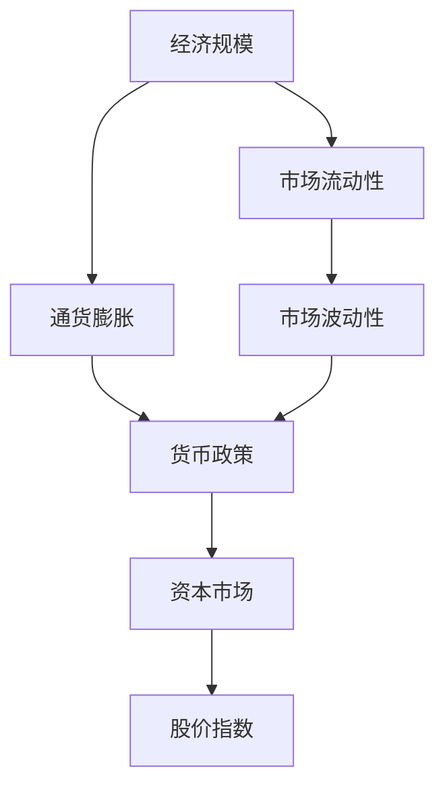
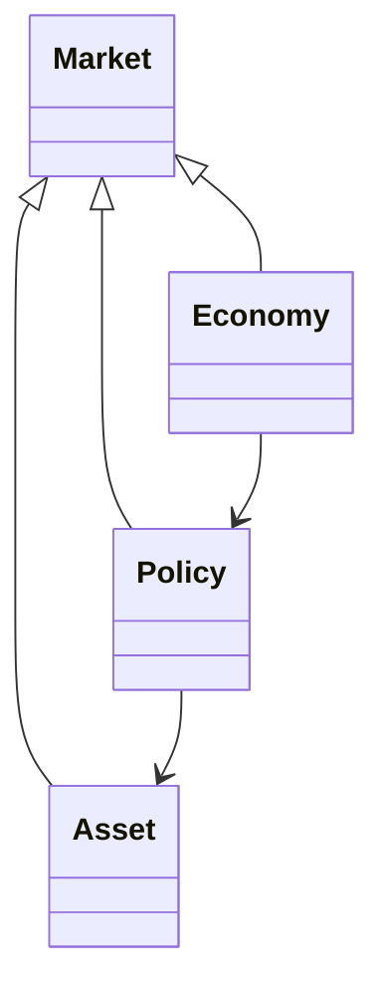
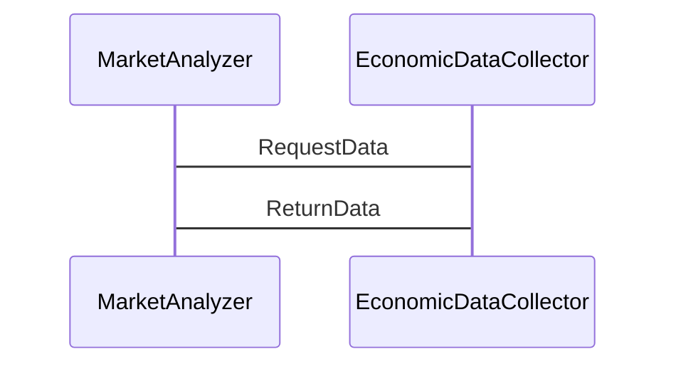
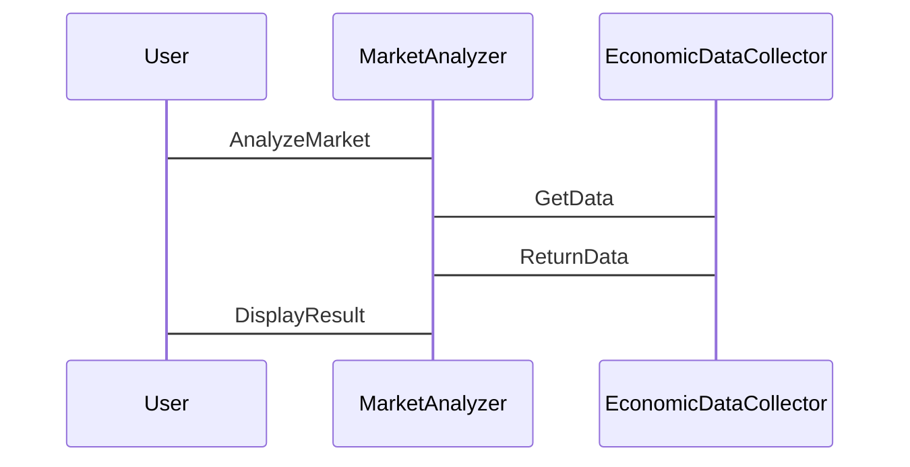

                 


# 美国作为全球最大经济体的市场估值特点

## 关键词：美国经济，市场估值，GDP，货币政策，资本市场

## 摘要：本文将探讨美国作为全球最大经济体的市场估值特点，从经济规模、市场结构、货币政策等多个维度进行分析。通过详细解读GDP、CPI、股价等关键指标，结合实际案例和数学模型，分析美国市场的估值方法和趋势，帮助读者全面理解其市场估值的核心逻辑和实际应用。

---

## 第一部分: 美国作为全球最大经济体的市场估值背景

### 第1章: 美国经济的全球地位与特点

#### 1.1 美国经济的全球地位
##### 1.1.1 美国经济的规模与影响力
美国作为全球最大的经济体，其GDP总量远超其他国家，占据了全球GDP总量的约四分之一。这种经济规模使得美国在全球贸易、投资和金融领域具有极强的影响力。

##### 1.1.2 美国经济的多元化特征
美国经济的多元化体现在其产业结构的多样性。从高科技产业到传统制造业，从服务业到农业，美国的经济结构涵盖了几乎所有的行业，这种多元化使得其经济具有很强的韧性和抗风险能力。

##### 1.1.3 美国在全球经济治理中的角色
美国不仅是全球最大的经济体，还是全球经济治理的核心国家。美元作为全球主要的储备货币和交易货币，美联储的货币政策对全球资本市场具有深远影响。

#### 1.2 美国市场的基本特点
##### 1.2.1 美国市场的开放性与竞争性
美国市场以其高度开放和竞争性的特点著称。无论是国内市场还是国际市场，美国企业都面临着激烈的竞争，这种竞争推动了技术创新和效率提升。

##### 1.2.2 美国市场的创新驱动力
作为全球科技创新的领导者，美国市场的企业研发投入巨大，创新成果丰硕。硅谷的科技公司引领着全球科技发展趋势，推动着市场的持续增长。

##### 1.2.3 美国市场的政策环境
美国的政策环境相对稳定，法律体系完善，为企业提供了良好的发展环境。同时，美国政府通过货币政策、财政政策等手段对市场进行宏观调控。

#### 1.3 市场估值的核心概念
##### 1.3.1 市场估值的基本定义
市场估值是指对某个市场或资产的价值进行评估的过程，通常通过一系列的经济指标和模型来估算市场的整体价值或资产的个体价值。

##### 1.3.2 市场估值的关键要素
市场估值的关键要素包括GDP、CPI、利率、股价指数等。这些指标能够反映市场的整体表现和经济运行状况。

##### 1.3.3 市场估值的边界与外延
市场估值的边界在于其覆盖的范围和时间跨度，而外延则涉及市场参与者的预期、政策变化等外部因素。

---

## 第二部分: 美国市场估值的核心概念与联系

### 第3章: 美国市场估值的核心概念

#### 3.1 市场估值的核心要素
##### 3.1.1 经济规模与增长
GDP是衡量经济规模和增长的核心指标。美国的GDP增长不仅反映了国内经济的活力，也影响着全球市场的信心。

##### 3.1.2 通货膨胀与货币政策
通货膨胀直接影响市场估值，美联储通过调整利率等货币政策工具来控制通胀，进而影响市场的整体估值。

##### 3.1.3 利率与资本市场
利率水平是影响资本市场估值的重要因素。低利率环境通常会推高资产价格，而高利率则可能抑制市场增长。

#### 3.2 美国市场估值的关键属性
##### 3.2.1 市场流动性
市场的流动性越高，资产的买卖越容易，价格发现越有效。美国市场的高流动性是其估值准确性的保障。

##### 3.2.2 市场波动性
市场波动性反映了市场的不确定性，高波动性可能导致估值的频繁变化，增加了投资的风险。

##### 3.2.3 市场风险
市场风险是投资者在估值过程中需要考虑的重要因素，包括系统性风险和非系统性风险。

#### 3.3 美国市场估值的概念结构
##### 3.3.1 经济体系的层次结构
经济体系由微观个体（企业、家庭）和宏观整体（GDP、就业）构成，市场的估值需要考虑个体行为和整体趋势的双重影响。

##### 3.3.2 市场主体的互动关系
市场主体包括消费者、企业和政府，它们的互动关系直接影响市场供需和价格形成。

##### 3.3.3 市场机制的运行逻辑
市场机制通过价格信号、供求关系和竞争机制，实现资源的优化配置和市场的自我调节。

### 第4章: 美国市场估值的核心要素对比

#### 4.1 美国市场估值的核心要素对比表
| 要素       | 定义                           | 特性                 | 影响                           |
|------------|--------------------------------|----------------------|--------------------------------|
| GDP         | 国民生产总值                 | 衡量经济规模         | 经济增长的主要指标             |
| CPI         | 消费者价格指数               | 衡量通货膨胀水平     | 影响货币政策和市场估值           |
| 利率         | 利息率                       | 影响借贷成本         | 影响资本市场和企业融资成本       |
| 股价指数     | 如标普500指数               | 衡量股市整体表现     | 反映市场信心和经济预期           |
| 就业率       | 失业率                       | 衡量劳动力市场状况   | 影响经济稳定和消费者信心         |

#### 4.2 美国市场估值的概念结构图


---

## 第三部分: 美国市场估值的算法原理

### 第5章: 美国市场估值的关键算法

#### 5.1 美国市场估值的数学模型
##### 5.1.1 GDP平减指数计算
GDP平减指数是用来衡量GDP价格水平的指数，计算公式为：
$$ GDP平减指数 = \frac{GDP\_current\ price}{GDP\_base\ price} \times 100 $$

##### 5.1.2 消费者价格指数（CPI）计算
CPI是衡量通货膨胀的重要指标，计算公式为：
$$ CPI = \frac{\sum (p_i \times q_i)}{\sum q_i} \times 100 $$

##### 5.1.3 利率与股价的关系
根据费雪方程式，利率与股价的关系可以表示为：
$$ (1 + r)^n = \frac{P_n}{P_0} $$
其中，\( r \) 是利率，\( P_n \) 和 \( P_0 \) 分别是n年后的股价和初始股价。

#### 5.2 市场估值的算法实现
##### 5.2.1 GDP平减指数计算
```python
def calculate_gdp_deflator(gdp_current, gdp_base):
    return (gdp_current / gdp_base) * 100
```

##### 5.2.2 CPI计算
```python
def calculate_cpi(price_weight, quantity):
    total_quantity = sum(quantity)
    total_cost = sum(p * q for p, q in zip(price_weight, quantity))
    cpi = (total_cost / total_quantity) * 100
    return cpi
```

##### 5.2.3 利率与股价关系
```python
def calculate_stock_price_future_value(initial_price, rate, years):
    return initial_price * (1 + rate) ** years
```

---

## 第四部分: 美国市场估值的系统分析与架构设计

### 第6章: 美国市场估值的系统分析

#### 6.1 问题场景介绍
在分析美国市场估值时，我们需要考虑GDP、CPI、利率等多因素的相互影响，以及它们对市场整体估值的综合效应。

#### 6.2 系统功能设计
##### 6.2.1 领域模型


##### 6.2.2 系统架构设计


#### 6.3 系统接口设计
##### 6.3.1 数据接口


##### 6.3.2 交互设计


---

## 第五部分: 项目实战

### 第7章: 美国市场估值的项目实战

#### 7.1 项目介绍
本项目旨在通过分析美国市场的实际数据，运用上述算法和模型，进行市场估值的实战演练。

#### 7.2 核心实现
##### 7.2.1 环境安装
需要安装Python和相关数据处理库，如Pandas和NumPy。

##### 7.2.2 核心代码实现
```python
import pandas as pd
import numpy as np

# 示例数据
data = {
    'Year': [2019, 2020, 2021, 2022],
    'GDP': [19, 20, 21, 22],
    'CPI': [100, 101, 102, 103]
}

df = pd.DataFrame(data)

# 计算GDP平减指数
gdp_deflator = df['GDP'].pct_change() * 100
df['GDP Deflator'] = gdp_deflator.round(2)

# 计算CPI
cpi_change = df['CPI'].pct_change() * 100
df['CPI Change'] = cpi_change.round(2)

print(df)
```

##### 7.2.3 代码解读与分析
上述代码展示了如何利用Pandas库处理经济数据，并计算GDP平减指数和CPI变化率。通过这些数据，可以进一步分析市场估值的变化趋势。

#### 7.3 实际案例分析
以苹果公司为例，分析其股价变化与宏观经济指标的关系。

#### 7.4 项目小结
通过本项目，读者可以掌握如何利用Python进行市场估值的实战分析，并能够将理论应用于实际。

---

## 第六部分: 最佳实践与小结

### 第8章: 最佳实践与小结

#### 8.1 小结
美国作为全球最大经济体，其市场估值的特点具有重要的研究意义。通过分析GDP、CPI、利率等关键指标，结合数学模型和实际案例，我们可以更深入地理解美国市场的估值逻辑和趋势。

#### 8.2 注意事项
在进行市场估值时，需要注意数据的准确性和模型的适用性，同时关注政策变化和市场波动带来的影响。

#### 8.3 拓展阅读
建议读者进一步阅读《宏观经济学》、《金融市场与投资》等相关书籍，以深入理解市场估值的理论和实践。

---

通过以上分析，我们可以全面了解美国作为全球最大经济体的市场估值特点，并能够将这些知识应用于实际的经济分析和投资决策中。

