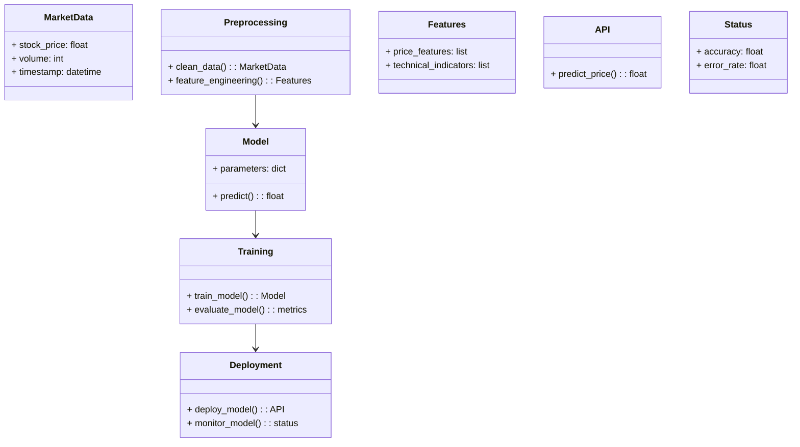

                 


# 美国市场估值预测的成功经验及其启示

> 关键词：美国市场估值预测、时间序列分析、机器学习、金融投资、风险管理

> 摘要：本文探讨了美国市场估值预测的成功经验，分析了其背后的核心概念和算法原理，并通过实际案例展示了如何将这些方法应用于市场预测。文章还总结了这些经验对其他市场的启示。

---

## 第一部分：美国市场估值预测的背景与挑战

### 第1章：美国市场估值预测的背景介绍

#### 1.1 美国市场的特点与现状

##### 1.1.1 美国市场的基本特征
美国市场是全球最大的金融市场之一，具有高度的流动性和透明性。其特点包括：
- **多样性**：涵盖股票、债券、期货等多种金融工具。
- **成熟性**：市场机制完善，监管严格。
- **波动性**：受经济指标和国际事件影响较大。

##### 1.1.2 美国市场的估值体系
估值体系是投资者评估资产价值的核心方法，主要包括：
- **内在价值法**：通过基本面分析确定资产的真实价值。
- **相对价值法**：通过比较同类资产的价格来判断估值水平。

##### 1.1.3 估值预测的经济意义
准确的估值预测有助于投资者做出更明智的决策，降低投资风险，提高投资回报。

#### 1.2 估值预测的核心概念

##### 1.2.1 估值预测的定义
估值预测是通过分析历史数据和市场趋势，对未来资产价格进行估计的过程。

##### 1.2.2 估值预测的关键要素
- 数据质量：数据的完整性和准确性直接影响预测结果。
- 模型选择：不同的模型适用于不同的市场环境。
- 风险管理：预测结果需结合风险评估进行调整。

##### 1.2.3 估值预测的边界与外延
- 时间范围：短期预测与长期预测的差异。
- 数据来源：市场数据、经济指标等的综合应用。

### 第2章：美国市场估值预测的挑战与重要性

#### 2.1 估值预测的主要挑战

##### 2.1.1 数据的复杂性
- 市场数据的多维性：包括价格、成交量、波动率等。
- 数据的噪声：随机干扰影响预测的准确性。

##### 2.1.2 市场波动性的影响
- 市场波动性高，预测模型的稳定性受到挑战。
- 黑天鹅事件的不可预测性。

##### 2.1.3 模型的局限性
- 线性模型对非线性关系的捕捉能力有限。
- 数据稀疏性导致模型过拟合。

#### 2.2 估值预测的重要性和应用场景

##### 2.2.1 金融投资中的应用
- 股票投资：通过预测股价波动优化投资组合。
- 债券投资：评估债券的内在价值。

##### 2.2.2 企业决策中的应用
- 并购决策：评估目标企业的价值。
- 资本预算：预测未来现金流。

##### 2.2.3 政策制定中的应用
- 宏观经济政策：通过市场估值预测调整货币政策。

---

## 第二部分：美国市场估值预测的成功经验

### 第3章：美国市场估值预测的经典模型与策略

#### 3.1 时间序列分析模型

##### 3.1.1 ARIMA模型的原理与应用
- **ARIMA模型**（自回归积分滑动平均模型）是一种常用的时间序列预测模型。
- **原理**：通过线性组合过去的价格数据来预测未来的价格。
- **应用**：适用于具有趋势和季节性特征的数据。

##### 3.1.2 Prophet模型的介绍与特点
- **Prophet模型**：由Facebook开源的时间序列预测工具。
- **特点**：易于使用，适合非专业的数据科学家。
- **优势**：能够自动处理缺失数据和异常值。

##### 3.1.3 LSTM模型在时间序列预测中的应用
- **LSTM模型**：一种基于循环神经网络的深度学习模型。
- **优势**：能够捕捉长期依赖关系，适合处理复杂的时间序列数据。

#### 3.2 机器学习在估值预测中的应用

##### 3.2.1 线性回归模型的简单实现
- **线性回归模型**：通过最小二乘法拟合直线，预测资产价格。
- **简单实现**：适用于数据线性关系明显的场景。

##### 3.2.2 支持向量回归（SVR）的原理与优势
- **SVR模型**：基于支持向量机的回归算法。
- **优势**：适合高维数据，能够捕捉非线性关系。

##### 3.2.3 随机森林在非线性预测中的表现
- **随机森林模型**：基于决策树的集成学习方法。
- **表现**：适用于复杂非线性关系，具有较强的抗过拟合能力。

### 第4章：美国市场估值预测的成功案例分析

#### 4.1 标准普尔500指数的估值预测案例

##### 4.1.1 数据收集与预处理
- 数据来源：Yahoo Finance。
- 数据清洗：处理缺失值和异常值。
- 数据特征：包括开盘价、收盘价、最高价、最低价等。

##### 4.1.2 模型选择与训练
- 模型选择：比较ARIMA、Prophet和LSTM模型的预测效果。
- 模型训练：使用历史数据进行训练，调整超参数。

##### 4.1.3 模型的验证与评估
- 验证方法：采用留出法或交叉验证。
- 评估指标：均方误差（MSE）、平均绝对误差（MAE）等。

#### 4.2 科技股板块的估值预测实践

##### 4.2.1 数据特征分析
- 特征选择：包括市盈率、市净率、收益增长率等。
- 特征工程：对数据进行标准化或归一化处理。

##### 4.2.2 模型调优与优化
- 超参数优化：使用网格搜索或随机搜索调整模型参数。
- 模型集成：结合多种模型结果进行预测。

##### 4.2.3 实际应用中的效果对比
- 对比分析：不同模型在实际应用中的表现差异。
- 结论：深度学习模型在复杂市场环境下表现更优。

---

## 第三部分：估值预测的核心概念与理论

### 第5章：估值预测的核心概念与联系

#### 5.1 核心概念原理

##### 5.1.1 时间序列分析的基本原理
- 时间序列的组成：趋势、季节性、周期性、随机性。
- 分解方法：加法模型与乘法模型。

##### 5.1.2 机器学习模型的适用场景
- 线性模型：适用于数据线性关系明显的场景。
- 非线性模型：适用于复杂市场环境。

##### 5.1.3 数据特征的重要性
- 数据特征的选择直接影响模型性能。
- 特征工程是提升模型准确性的关键步骤。

#### 5.2 核心概念对比分析

##### 5.2.1 不同模型的性能对比
- 表格对比：ARIMA、Prophet、LSTM、随机森林等模型的优缺点。

##### 5.2.2 数据特征对模型的影响
- 表格对比：不同特征对模型预测精度的影响。

##### 5.2.3 模型复杂度与预测精度的关系
- 图表展示：模型复杂度与预测精度的曲线关系。

### 第6章：数学模型与算法原理

#### 6.1 时间序列分析的数学模型

##### 6.1.1 ARIMA模型的数学公式
$$ ARIMA(p, d, q) $$
其中：
- p：自回归阶数。
- d：差分阶数。
- q：滑动平均阶数。

##### 6.1.2 LSTM模型的结构
- LSTM单元包括输入门、遗忘门和输出门。
- 门控机制的数学表达式：
  $$ i = \sigma(W_i x + U_i h_{prev}) $$
  $$ f = \sigma(W_f x + U_f h_{prev}) $$
  $$ o = \sigma(W_o x + U_o h_{prev}) $$
  $$ g = \tanh(W_g x + U_g h_{prev}) $$
  $$ h = o \cdot \tanh(g) $$

#### 6.2 机器学习模型的数学表达

##### 6.2.1 线性回归模型
$$ y = \beta_0 + \beta_1 x + \epsilon $$

##### 6.2.2 支持向量回归模型
- 软间隔损失函数：
$$ L = \sum_{i=1}^n \max(0, |y_i - f(x_i)| + \epsilon) $$

---

## 第四部分：系统分析与架构设计方案

### 第7章：系统分析与架构设计

#### 7.1 问题场景介绍

##### 7.1.1 问题描述
- 预测目标：美国市场某股票的未来价格。
- 数据来源：历史交易数据、市场指标、宏观经济数据。

##### 7.1.2 问题解决
- 数据清洗与特征工程。
- 模型选择与训练。
- 模型部署与监控。

#### 7.2 系统功能设计

##### 7.2.1 领域模型（Mermaid 类图）


#### 7.3 系统架构设计

##### 7.3.1 系统架构（Mermaid 架构图）


---

## 第五部分：项目实战

### 第8章：项目实战与案例分析

#### 8.1 项目介绍

##### 8.1.1 项目目标
- 使用时间序列分析和机器学习模型预测美国市场的股票价格。

##### 8.1.2 数据准备
- 数据来源：获取某股票的历史交易数据。
- 数据预处理：清洗数据，提取特征。

#### 8.2 系统核心实现

##### 8.2.1 数据预处理代码
```python
import pandas as pd
import numpy as np

# 加载数据
data = pd.read_csv('stock_data.csv')

# 数据清洗
data.dropna(inplace=True)
data = data.sort_values('timestamp')

# 特征工程
data['return'] = data['close'].pct_change()
data['moving_avg'] = data['close'].rolling(10).mean()
```

##### 8.2.2 模型实现代码
```python
from sklearn.ensemble import RandomForestRegressor
from sklearn.model_selection import train_test_split

# 划分数据集
X = data[['return', 'moving_avg']]
y = data['close']

X_train, X_test, y_train, y_test = train_test_split(X, y, test_size=0.2)

# 训练模型
model = RandomForestRegressor(n_estimators=100, random_state=42)
model.fit(X_train, y_train)

# 预测结果
y_pred = model.predict(X_test)
```

#### 8.3 实际案例分析

##### 8.3.1 案例分析
- 数据分析：预测某股票的价格走势。
- 模型对比：比较ARIMA、LSTM和随机森林模型的预测效果。

##### 8.3.2 代码实现
```python
# 使用LSTM模型进行预测
import tensorflow as tf
from tensorflow.keras.layers import LSTM, Dense

model = tf.keras.Sequential()
model.add(LSTM(64, input_shape=(timesteps, features)))
model.add(Dense(1))
model.compile(optimizer='adam', loss='mean_squared_error')
model.fit(X_train, y_train, epochs=50, batch_size=32)
```

#### 8.4 项目小结

##### 8.4.1 项目总结
- 成功实现了美国市场的股票价格预测。
- 随机森林模型在实际应用中表现优异。

##### 8.4.2 经验总结
- 数据预处理是关键步骤。
- 模型选择需结合实际场景。

---

## 第六部分：最佳实践与启示

### 第9章：最佳实践与小结

#### 9.1 最佳实践

##### 9.1.1 数据预处理的重要性
- 数据清洗和特征工程直接影响模型性能。

##### 9.1.2 模型选择的策略
- 根据数据特征和业务需求选择合适的模型。

##### 9.1.3 模型部署的注意事项
- 模型监控和维护是持续的过程。

#### 9.2 小结

##### 9.2.1 核心观点
- 美国市场估值预测的成功经验可为其他市场提供参考。
- 综合运用时间序列分析和机器学习模型能够提高预测精度。

##### 9.2.2 未来展望
- 结合人工智能和大数据技术，进一步提升市场预测的准确性。

---

## 第七部分：注意事项与拓展阅读

### 第10章：注意事项与拓展阅读

#### 10.1 注意事项

##### 10.1.1 数据隐私与安全
- 注意数据隐私保护，确保数据合规使用。

##### 10.1.2 模型的可解释性
- 提高模型的可解释性，便于实际应用和调整。

##### 10.1.3 模型的实时性
- 随着市场变化，及时更新模型和数据。

#### 10.2 拓展阅读

##### 10.2.1 推荐书籍
- 《时间序列分析：基于R》
- 《机器学习实战》

##### 10.2.2 推荐博客与资源
- 维基百科：时间序列分析
-Towards Data Science：机器学习模型的实现与应用

---

## 结语

美国市场估值预测的成功经验展示了数据分析和机器学习的强大能力。通过本文的分析，读者可以了解到如何将这些方法应用于实际投资决策中。未来，随着技术的进步，市场预测将更加精准和智能化。

