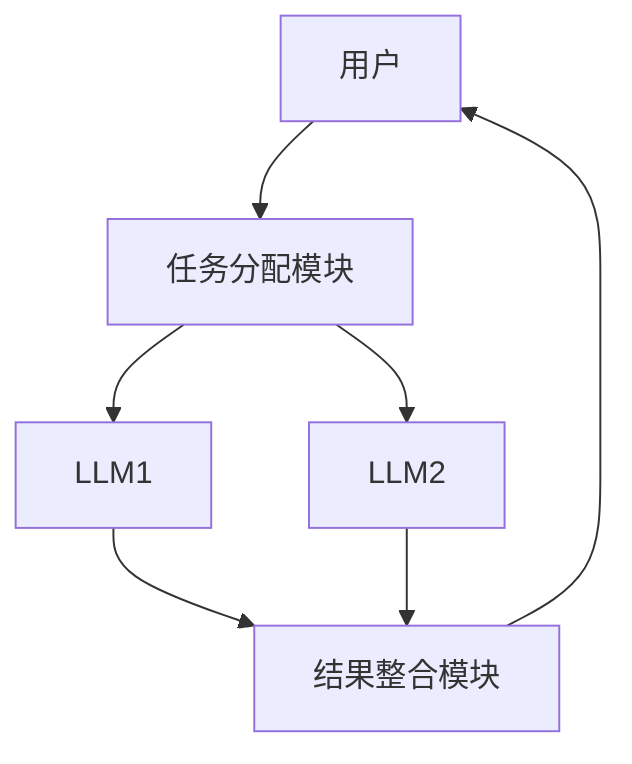
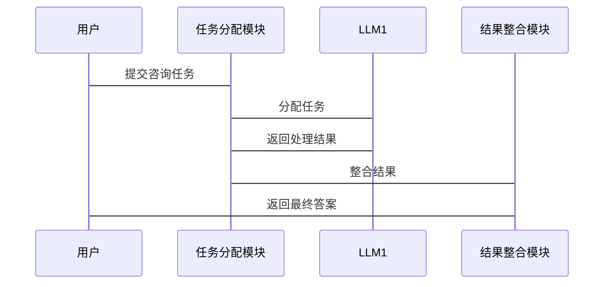

                 


# 群体智能AI Agent：多个LLM协作的分布式系统

---

## 关键词

- 群体智能
- AI Agent
- 大语言模型（LLM）
- 分布式系统
- 多模型协作

---

## 摘要

群体智能AI Agent是一种基于多个大语言模型协作的分布式系统，旨在通过分布式计算和协作机制，提升任务处理的效率和准确性。本文从背景、原理、系统架构到实战，全面解析群体智能AI Agent的核心思想和实现方法。

---

## 第一部分：群体智能AI Agent的背景与概念

### 第1章：群体智能AI Agent概述

#### 1.1 群体智能AI Agent的定义与背景

群体智能（Collective Intelligence）是指通过多个个体（人或机器）协作，共同完成复杂任务的过程。AI Agent（智能体）则是能够感知环境并采取行动以实现目标的实体。群体智能AI Agent结合了两者的优点，通过多个AI Agent协作，实现更强大的任务处理能力。

**问题背景：**  
随着AI技术的发展，单个大语言模型（LLM）的能力不断提升，但在复杂任务中仍存在局限性，例如处理时间过长、结果准确性不足等问题。通过将多个LLM协作，可以充分发挥每个模型的优势，提升整体性能。

**问题解决：**  
群体智能AI Agent通过分布式计算和任务分解，将复杂任务分配给多个LLM并行处理，最终整合结果，实现更高效和准确的任务完成。

**边界与外延：**  
群体智能AI Agent主要关注分布式系统中多个AI Agent的协作机制，不涉及单个AI Agent内部的具体实现。其外延包括任务分配算法、结果整合策略以及系统架构设计等。

#### 1.2 多个LLM协作的必要性

**单个LLM的局限性：**  
尽管单个LLM在特定任务上表现出色，但在复杂场景中，其处理速度和准确性可能无法满足需求。

**多个LLM协作的优势：**  
通过分布式协作，多个LLM可以并行处理任务，提升整体效率和准确性。例如，在电商客服场景中，多个LLM可以分别处理不同的客户咨询，提高响应速度。

**分布式系统的特点：**  
分布式系统通过任务分解和并行处理，避免单点故障，提升系统的容错性和扩展性。

---

## 第二部分：群体智能AI Agent的核心原理

### 第2章：群体智能AI Agent的核心原理

#### 2.1 多个LLM协作的核心要素

群体智能AI Agent的核心要素包括：任务分解、任务分配、结果整合、通信机制和监控管理。

**任务分解：**  
将复杂任务分解为多个子任务，每个子任务由不同的LLM处理。

**任务分配：**  
根据LLM的能力和负载情况，动态分配子任务。

**结果整合：**  
将多个LLM的子任务结果整合为最终输出。

**通信机制：**  
LLM之间通过特定协议进行通信，确保任务协调和结果共享。

**监控管理：**  
实时监控系统的运行状态，调整任务分配策略。

---

## 第三部分：算法原理讲解

### 第3章：算法原理与实现

#### 3.1 多个LLM协作的算法流程

**任务分配算法：**  
基于任务特性和LLM能力，采用贪心算法分配任务。

**结果整合算法：**  
使用加权融合方法，根据LLM的性能指标加权整合结果。

**数学模型：**  
优化目标：最大化任务完成效率，约束条件包括负载均衡和准确性。

$$ \text{最大化} \sum_{i=1}^{n} w_i x_i \text{，约束条件} \sum_{i=1}^{n} x_i \leq 1 $$

其中，$w_i$为第$i$个LLM的权重，$x_i$为任务分配给第$i$个LLM的比例。

#### 3.2 算法实现代码

```python
def task_allocation(weights, num_tasks):
    allocation = [0] * len(weights)
    for i in range(num_tasks):
        max_weight = max(weights)
        idx = weights.index(max_weight)
        allocation[idx] += 1/num_tasks
        weights[idx] -= 1/num_tasks
    return allocation
```

---

## 第四部分：系统分析与架构设计方案

### 第4章：系统架构设计

#### 4.1 问题场景介绍

以电商客服系统为例，多个LLM协作处理客户的咨询请求。

#### 4.2 系统功能设计

**任务分配模块：**  
负责将客户咨询任务分配给合适的LLM。

**结果整合模块：**  
整合多个LLM的回复，生成最终答案。

**监控管理模块：**  
实时监控系统运行状态，调整任务分配策略。

#### 4.3 系统架构图



#### 4.4 接口设计

**任务分配接口：**  
`POST /api/allocate_task`，接收任务信息，返回分配结果。

**结果查询接口：**  
`GET /api/results/{task_id}`，返回任务处理结果。

#### 4.5 系统交互图



---

## 第五部分：项目实战

### 第5章：项目实战与代码实现

#### 5.1 环境搭建

安装必要的Python库，例如`requests`和`numpy`。

#### 5.2 核心代码实现

```python
import requests
import numpy as np

def allocate_task(weights, num_tasks):
    allocation = np.zeros(len(weights))
    for i in range(num_tasks):
        max_weight = np.max(weights)
        idx = np.where(weights == max_weight)[0][0]
        allocation[idx] += 1/num_tasks
        weights[idx] -= 1/num_tasks
    return allocation

def main():
    weights = np.array([0.4, 0.3, 0.3])
    num_tasks = 3
    allocation = allocate_task(weights, num_tasks)
    print(allocation)

if __name__ == "__main__":
    main()
```

#### 5.3 实际案例分析

以电商客服系统为例，详细分析任务分配和结果整合的过程。

---

## 第六部分：最佳实践

### 第6章：最佳实践与小结

#### 6.1 小结

群体智能AI Agent通过多个LLM协作，提升任务处理效率和准确性。

#### 6.2 注意事项

- 确保任务分配策略的公平性和合理性。
- 定期监控系统性能，优化任务分配算法。
- 注意数据隐私和安全问题。

#### 6.3 拓展阅读

推荐相关书籍和论文，供读者深入学习。

---

## 总结

群体智能AI Agent通过多个LLM协作，构建高效、可靠的分布式系统。本文从背景、原理、架构到实战，全面解析了群体智能AI Agent的核心思想和实现方法，为读者提供了理论和实践的双重指导。

