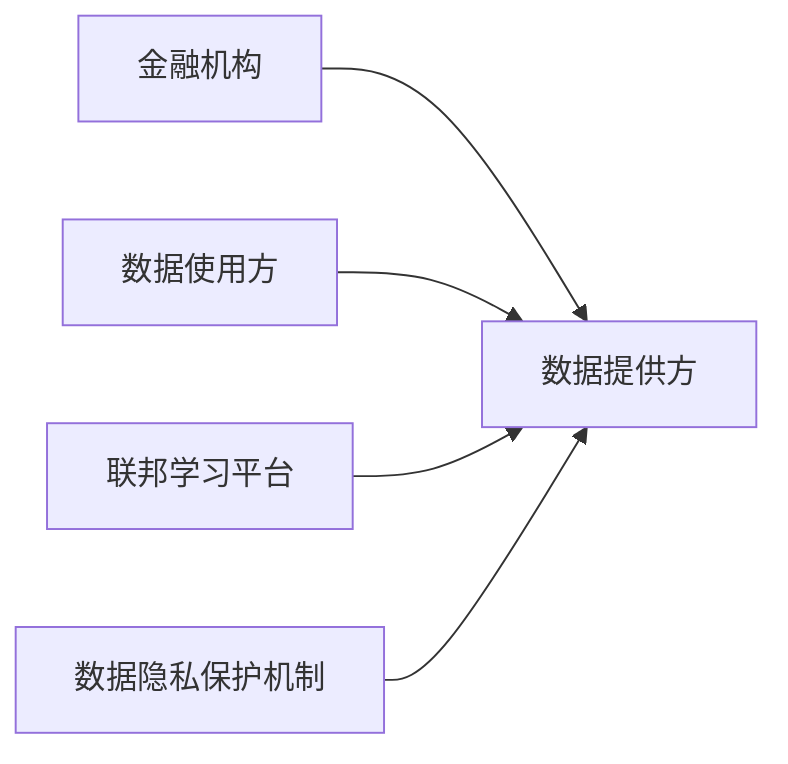
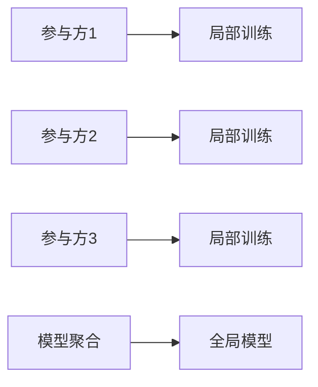
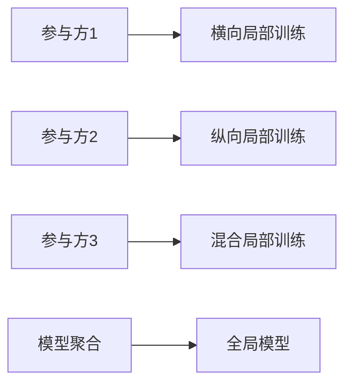
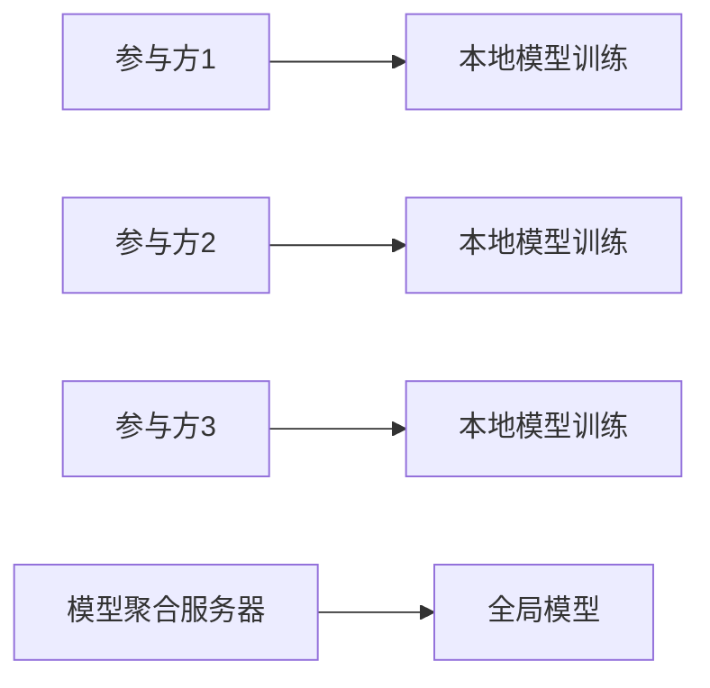
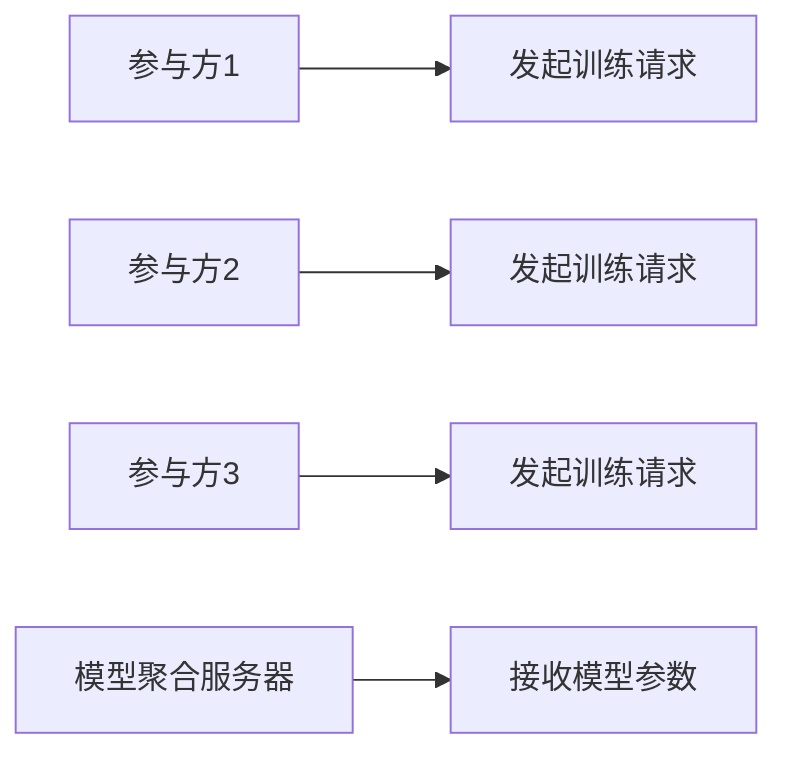

                 


# 联邦学习在金融机构间数据协作中的应用

> 关键词：联邦学习、数据协作、金融机构、隐私保护、数据安全、机器学习

> 摘要：本文深入探讨了联邦学习在金融机构间数据协作中的应用，分析了其核心概念、算法原理、系统架构设计以及实际案例，为金融机构间的高效、安全数据协作提供了理论支持和实践指导。

---

## 第一部分：联邦学习的背景与问题背景

### 第1章：联邦学习的背景与问题背景

#### 1.1 联邦学习的定义与核心概念
联邦学习（Federated Learning）是一种分布式机器学习技术，允许多个参与方在不共享原始数据的情况下，协同训练模型。其核心在于通过数据不出域的方式，实现模型参数的共享与更新，从而在保护数据隐私的同时，提升模型的泛化能力。

- **定义**：联邦学习通过在各个数据源上本地训练模型，并将模型更新的信息传递到一个中央服务器或多个协调节点，最终生成一个全局模型。
- **核心概念**：
  - 数据局部性：数据保留在原始来源，不进行跨机构传输。
  - 模型全局性：通过局部模型更新，构建全局模型。
  - 隐私保护：通过加密或隐私计算技术，确保数据在传输和计算过程中的安全性。

#### 1.2 金融机构间数据协作的挑战
金融机构在数据协作中面临以下主要挑战：

- **数据孤岛问题**：不同金融机构的数据往往分散在各自系统中，缺乏统一的数据标准和接口，导致数据无法有效共享。
- **数据隐私与安全问题**：金融机构的数据通常涉及用户隐私和商业机密，直接共享数据会带来极大的安全风险。
- **数据协作的效率与成本问题**：传统的数据共享方式往往需要大量的数据清洗、转换和存储，效率低下且成本高昂。

#### 1.3 联邦学习在金融机构间数据协作中的应用价值
联邦学习为金融机构间的数据协作提供了以下价值：

- **提高数据利用率**：通过联邦学习，金融机构可以在不共享原始数据的情况下，利用彼此的数据共同训练模型，提升模型的泛化能力。
- **保护数据隐私**：联邦学习通过局部模型更新的方式，避免了原始数据的直接传输，有效保护了数据隐私。
- **降低数据协作成本**：联邦学习通过分布式计算的方式，减少了数据传输和存储的需求，降低了协作成本。

#### 1.4 本章小结
本章从联邦学习的定义和核心概念出发，分析了金融机构间数据协作面临的挑战，并探讨了联邦学习在其中的应用价值，为后续章节的深入分析奠定了基础。

---

## 第二部分：联邦学习的核心概念与联系

### 第2章：联邦学习的核心概念与联系

#### 2.1 联邦学习的原理
联邦学习的实现过程可以分为以下几个步骤：

1. **初始化**：所有参与方初始化本地模型参数。
2. **局部训练**：每个参与方在本地数据上训练模型，更新本地模型参数。
3. **模型聚合**：将各个参与方的模型参数更新聚合起来，生成全局模型。
4. **模型分发**：将全局模型分发给所有参与方，供其继续训练或使用。

#### 2.2 联邦学习的核心要素
- **数据隐私保护**：通过加密或隐私计算技术，确保数据在传输和计算过程中的安全性。
- **数据安全与合规性**：遵循相关数据保护法规（如GDPR），确保数据的合法使用。
- **数据协作协议**：定义参与方之间的数据访问权限、模型更新频率等规则。

#### 2.3 联邦学习的实体关系图（ER图）


#### 2.4 本章小结
本章通过分析联邦学习的原理和核心要素，结合实体关系图（ER图），展示了联邦学习在金融机构间数据协作中的核心概念和联系。

---

## 第三部分：联邦学习的算法原理

### 第3章：联邦学习的算法原理

#### 3.1 联邦学习的算法分类
- **横向联邦学习**：适用于数据样本相同但特征不同的场景，通过水平分割数据进行模型训练。
- **纵向联邦学习**：适用于数据特征相同但样本不同的场景，通过垂直分割数据进行模型训练。
- **混合联邦学习**：结合横向和纵向联邦学习的优势，适用于复杂的数据分布场景。

#### 3.2 横向联邦学习算法的流程


#### 3.3 纵向联邦学习算法的流程


#### 3.4 混合联邦学习算法的流程


#### 3.5 本章小结
本章通过分析联邦学习的算法分类和流程，结合Mermaid图，详细讲解了横向、纵向和混合联邦学习的实现过程。

---

## 第四部分：系统分析与架构设计

### 第4章：系统分析与架构设计

#### 4.1 问题场景介绍
金融机构间数据协作的场景通常包括信用评估、风险控制、欺诈检测等，这些场景需要多个金融机构共享数据，但又不能直接交换原始数据。

#### 4.2 系统功能设计
- **数据预处理**：对数据进行清洗、转换和标准化。
- **模型训练**：在本地数据上训练模型，并更新模型参数。
- **模型聚合**：将各个参与方的模型参数更新聚合起来，生成全局模型。
- **模型分发**：将全局模型分发给所有参与方，供其继续训练或使用。

#### 4.3 系统架构设计


#### 4.4 系统接口设计
- **训练接口**：提供模型训练的API，用于局部模型训练。
- **聚合接口**：提供模型聚合的API，用于全局模型生成。
- **分发接口**：提供模型分发的API，用于全局模型的分发。

#### 4.5 系统交互设计


#### 4.6 本章小结
本章通过系统功能设计、架构设计和交互设计，详细讲解了联邦学习在金融机构间数据协作中的实现过程。

---

## 第五部分：项目实战

### 第5章：项目实战

#### 5.1 环境安装
- **安装Python**：确保Python版本为3.6及以上。
- **安装依赖库**：安装必要的库，如`tensorflow`、`keras`、`pandas`等。

#### 5.2 系统核心实现源代码
```python
import numpy as np
import tensorflow as tf

# 初始化模型参数
def initialize_model():
    return tf.keras.models.Sequential([
        tf.keras.layers.Dense(64, activation='relu'),
        tf.keras.layers.Dense(1, activation='sigmoid')
    ])

# 局部训练
def local_train(model, data, epochs=1):
    model.compile(optimizer='adam', loss='binary_crossentropy')
    model.fit(data, epochs=epochs, verbose=0)
    return model.get_weights()

# 模型聚合
def model_aggregation(weights_list):
    # 假设所有参与方的权重具有相同的结构
    avg_weights = []
    for i in range(len(weights_list[0])):
        avg_weights.append(np.mean([w[i] for w in weights_list], axis=0))
    return avg_weights

# 全局模型更新
def global_model_update(aggregated_weights):
    # 加载模型结构
    model = initialize_model()
    model.set_weights(aggregated_weights)
    return model
```

#### 5.3 代码应用解读与分析
- **初始化模型**：定义了一个简单的神经网络模型，用于分类任务。
- **局部训练**：在本地数据上训练模型，并返回模型权重。
- **模型聚合**：将所有参与方的模型权重进行平均，生成全局模型权重。
- **全局模型更新**：加载全局模型权重，生成最终的全局模型。

#### 5.4 实际案例分析
假设我们有三个金融机构，每个机构都有自己的客户数据，希望通过联邦学习共同训练一个信用评估模型。

1. **数据准备**：每个金融机构将本地数据进行预处理，确保数据格式一致。
2. **局部训练**：每个金融机构在本地数据上训练模型，得到模型权重。
3. **模型聚合**：将所有参与方的模型权重进行平均，生成全局模型权重。
4. **模型分发**：将全局模型分发给所有参与方，供其继续训练或使用。

#### 5.5 本章小结
本章通过实际案例分析和代码实现，详细讲解了联邦学习在金融机构间数据协作中的具体实现过程。

---

## 第六部分：未来趋势与挑战

### 第6章：未来趋势与挑战

#### 6.1 未来发展趋势
- **隐私计算技术的进一步发展**：随着隐私计算技术的不断进步，联邦学习的安全性和效率将进一步提升。
- **跨机构协作的标准化**：金融机构间数据协作的标准化将推动联邦学习的广泛应用。
- **多模态数据的融合**：未来的联邦学习将支持多模态数据的融合，提升模型的泛化能力。

#### 6.2 当前面临的主要挑战
- **数据质量的保障**：不同金融机构的数据质量参差不齐，如何确保数据的准确性是一个挑战。
- **模型的可解释性**：联邦学习生成的模型往往缺乏可解释性，影响其在金融领域的应用。
- **计算效率的提升**：联邦学习的计算效率需要进一步优化，以应对大规模数据的处理需求。

#### 6.3 本章小结
本章分析了联邦学习在金融机构间数据协作中的未来发展趋势和当前面临的主要挑战，为后续研究提供了方向。

---

## 总结与展望

联邦学习作为一种分布式机器学习技术，为金融机构间数据协作提供了新的思路和解决方案。通过联邦学习，金融机构可以在不共享原始数据的情况下，协同训练模型，提升数据利用率，同时保护数据隐私。未来，随着隐私计算技术的进一步发展和跨机构协作的标准化，联邦学习将在金融领域发挥更大的作用。

---

**注**：由于篇幅限制，本文仅展示了部分核心内容和代码片段。实际撰写时，需要根据具体需求扩展每个部分的内容，确保文章的完整性和深度。

