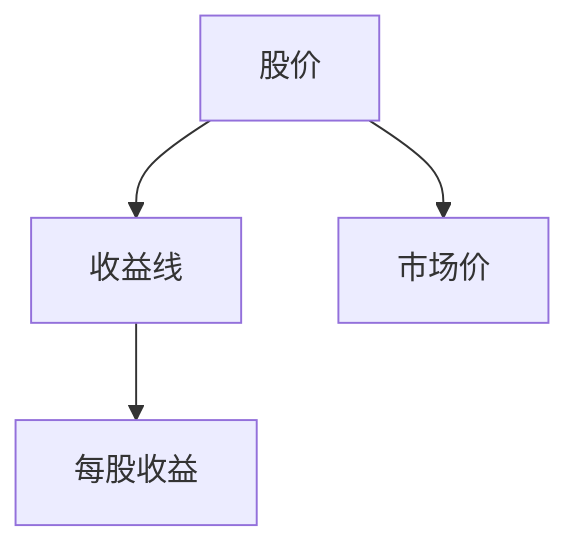
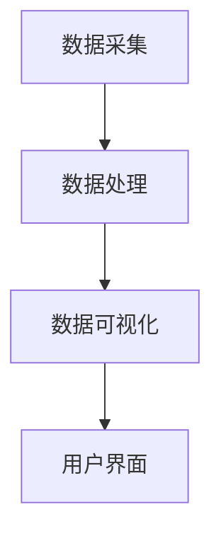

                 


# 股价与收益线的比较：彼得林奇的估值方法

## 关键词：股价，收益线，彼得林奇，估值方法，投资分析，财务指标

## 摘要：  
本文深入探讨了彼得·林奇的估值方法，并通过比较股价与收益线，揭示了如何利用这一方法进行有效的投资决策。通过详细分析股价和收益线的核心概念、算法原理、系统设计和项目实战，本文为投资者提供了一套实用的工具和方法，帮助他们在复杂的市场环境中做出明智的投资选择。

---

# 第一章: 引言

## 1.1 本书的目的
### 1.1.1 为什么比较股价与收益线  
股价是投资者关注的核心指标，而收益线则反映了企业的盈利能力。通过比较两者，可以更全面地评估企业的市场价值和成长潜力。

### 1.1.2 彼得·林奇估值方法的重要性  
彼得·林奇是全球知名的投资专家，他的估值方法以基本面分析为核心，强调对企业财务状况和行业地位的深入研究。

### 1.1.3 本书的结构安排  
本文将从核心概念、算法原理、系统设计到项目实战，逐步展开分析，帮助读者掌握彼得·林奇的估值方法。

## 1.2 本书的读者对象  
### 1.2.1 初级投资者  
适合对投资分析感兴趣但缺乏系统性方法的读者。

### 1.2.2 专业投资者  
适合希望深入理解彼得·林奇方法的投资者。

### 1.2.3 投资研究者  
适合从事投资研究的专业人士，帮助他们构建完整的分析框架。

## 1.3 本书的工具与方法  
### 1.3.1 财务分析工具  
包括市盈率、市净率等关键指标的计算。

### 1.3.2 数据可视化方法  
通过图表展示股价和收益线的变化趋势。

### 1.3.3 估值模型的选择  
介绍多种估值模型，并结合彼得·林奇的方法进行优化。

---

# 第二章: 股价与收益线的背景介绍

## 2.1 股价与收益线的定义  
### 2.1.1 股价的定义与计算  
股价是市场上买卖股票的价格，通常反映市场对企业的估值。

### 2.1.2 收益线的定义与计算  
收益线是将企业的每股收益（EPS）累计起来形成的曲线，用于分析企业的盈利能力。

### 2.1.3 两者的关系与区别  
股价和收益线都与企业盈利能力相关，但股价受市场情绪影响较大，而收益线更反映企业的实际业绩。

## 2.2 彼得·林奇估值方法的背景  
### 2.2.1 彼得·林奇的生平简介  
彼得·林奇是美国著名投资经理人，以管理富达麦哲伦基金而闻名。

### 2.2.2 林奇方法的核心思想  
林奇强调对企业基本面的深入分析，尤其是企业的财务状况和行业地位。

### 2.2.3 林奇方法的适用场景  
适用于分析成熟企业的估值，尤其在市场波动较大时，能够提供稳定的参考。

## 2.3 股价与收益线比较的必要性  
### 2.3.1 投资决策的重要性  
通过比较股价与收益线，投资者可以更准确地判断企业的市场价值。

### 2.3.2 林奇方法的优势  
林奇方法注重对企业基本面的分析，能够帮助投资者识别潜在的投资机会。

### 2.3.3 比较分析的意义  
通过比较股价与收益线，投资者可以更好地理解市场的定价机制。

---

# 第三章: 核心概念与联系

## 3.1 股价与收益线的对比分析  
### 3.1.1 对比表格  
| 比较维度 | 股价 | 收益线 |
|----------|------|--------|
| 定义     | 股票价格 | 每股收益的累计线 |
| 计算方式 | 当前市场价 | 累计收益线 |
| 用途     | 评估市场价值 | 评估收益趋势 |

### 3.1.2 对比图  


## 3.2 彼得·林奇估值方法的核心要素  
### 3.2.1 财务指标分析  
包括市盈率（P/E）、市净率（P/B）等。

### 3.2.2 行业地位分析  
分析企业在行业中的竞争优势。

### 3.2.3 管理团队评估  
关注企业的管理层能力和战略规划。

## 3.3 股价与收益线的联系  
### 3.3.1 股价反映市场对企业收益的预期  
### 3.3.2 收益线反映企业的实际盈利能力  
### 3.3.3 两者结合用于评估企业的市场价值  

---

# 第四章: 算法原理讲解

## 4.1 股价与收益线的比较算法  
### 4.1.1 算法步骤  
1. 收集企业的股价数据。
2. 计算企业的每股收益（EPS）。
3. 绘制收益线。
4. 对比股价和收益线的变化趋势。

### 4.1.2 Python代码实现  
```python
import pandas as pd
import matplotlib.pyplot as plt

# 示例数据
data = {
    '日期': ['2020-01', '2020-02', '2020-03', '2020-04'],
    '股价': [50, 52, 51, 55],
    '收益': [2, 3, 2, 4]
}

df = pd.DataFrame(data)

# 计算每股收益
df['累计收益'] = df['收益'].cumsum()

# 绘制股价和收益线
plt.figure(figsize=(10, 6))
plt.plot(df['日期'], df['股价'], label='股价', color='blue')
plt.plot(df['日期'], df['累计收益'], label='收益线', color='red')
plt.title('股价与收益线比较')
plt.xlabel('时间')
plt.ylabel('数值')
plt.legend()
plt.show()
```

### 4.1.3 数学公式  
股价与收益线的比较公式：  
$$ \text{股价} = \text{收益线} \times \text{市盈率} $$  

---

# 第五章: 系统分析与架构设计

## 5.1 问题场景介绍  
投资者需要通过股价和收益线的比较，评估企业的市场价值。

## 5.2 系统功能设计  
### 5.2.1 数据采集模块  
从数据库或API获取股价和收益数据。

### 5.2.2 数据处理模块  
计算累计收益线和相关指标。

### 5.2.3 数据可视化模块  
绘制股价和收益线的对比图。

## 5.3 系统架构设计  


## 5.4 接口设计  
### 5.4.1 数据接口  
提供API用于数据的输入和输出。

### 5.4.2 用户接口  
设计友好的用户界面，方便投资者进行分析。

## 5.5 交互流程图  
```mermaid
sequenceDiagram
参与者: 用户
系统: 股价收益线比较系统

参与者 -> 系统: 提交企业代码
系统 -> 参与者: 获取股价和收益数据
参与者 -> 系统: 请求比较分析
系统 -> 参与者: 提供对比图表和分析报告
```

---

# 第六章: 项目实战

## 6.1 环境安装  
### 6.1.1 安装Python和相关库  
```bash
pip install pandas matplotlib
```

## 6.2 系统核心实现  
### 6.2.1 核心代码  
```python
import pandas as pd
import matplotlib.pyplot as plt

# 读取数据
data = pd.read_csv('stock_data.csv')

# 计算累计收益
data['累计收益'] = data['收益'].cumsum()

# 绘制图表
plt.figure(figsize=(12, 6))
plt.plot(data['日期'], data['股价'], label='股价')
plt.plot(data['日期'], data['累计收益'], label='收益线')
plt.title('股价与收益线比较')
plt.xlabel('时间')
plt.ylabel('数值')
plt.legend()
plt.show()
```

### 6.2.2 代码解读  
- 数据读取：从CSV文件中读取股价和收益数据。
- 累计收益计算：使用Pandas的`cumsum`函数。
- 图表绘制：使用Matplotlib绘制股价和收益线的对比图。

## 6.3 案例分析  
以某企业为例，分析其股价和收益线的变化趋势，评估其市场价值。

## 6.4 项目小结  
总结项目实施过程中的关键点和经验教训。

---

# 第七章: 最佳实践

## 7.1 小结  
通过比较股价和收益线，结合彼得·林奇的估值方法，投资者可以更准确地评估企业的市场价值。

## 7.2 注意事项  
- 数据来源的可靠性
- 模型的适用性
- 市场环境的变化

## 7.3 拓展阅读  
推荐相关书籍和文章，帮助读者深入学习投资分析方法。

---

# 结语  
本文通过详细分析股价与收益线的比较，结合彼得·林奇的估值方法，为投资者提供了一套实用的分析工具和方法。希望读者能够通过本文的指导，在投资决策中取得更好的成绩。

