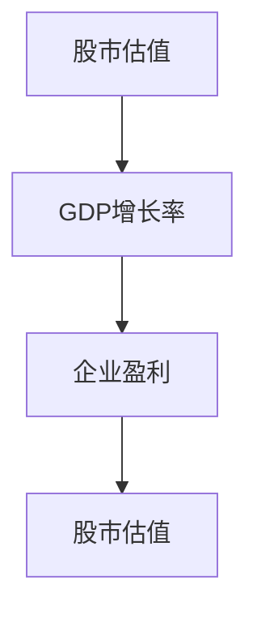
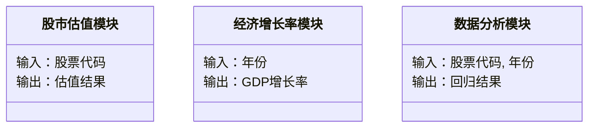

                 


# 股市估值与经济增长率的相关性研究

## 关键词：股市估值，经济增长率，相关性，数学模型，实证分析，系统架构

## 摘要：  
本文探讨了股市估值与经济增长率之间的相关性，从理论到实证分析，构建了数学模型，并通过系统架构设计和项目实战验证了模型的有效性。文章详细阐述了股市估值的核心概念、经济增长率的定义、两者关系的理论基础，构建了多元回归模型，并通过实证分析验证了模型的预测能力。同时，文章还提供了系统架构设计和完整的Python代码实现，帮助读者更好地理解和应用相关知识。

---

## 第一部分：背景与基础

### 第1章：股市估值与经济增长率的背景介绍

#### 1.1 股市估值的基本概念

##### 1.1.1 股票的定义与分类  
股票是公司所有权的凭证，代表持有者对公司的部分所有权。股票可以分为以下几类：  
- **普通股**：享有投票权和分红权，风险较高，收益潜力大。  
- **优先股**：优先于普通股获得 dividends，风险较低，收益相对稳定。  
- **蓝筹股**：指市场表现稳定、市值较大的公司股票，通常代表行业龙头。  

##### 1.1.2 股市估值的常见方法  
股市估值是通过特定指标或模型来评估股票的内在价值。常见的方法包括：  
- **市盈率（P/E）**：股价与每股收益的比率。  
- **市净率（P/B）**：股价与每股净资产的比率。  
- **股息率**：股息与股价的比率。  

##### 1.1.3 股市估值的影响因素  
股市估值受多种因素影响，包括：  
- **宏观经济因素**：GDP增长率、利率、通货膨胀率等。  
- **公司基本面**：盈利能力、财务状况、行业竞争格局等。  
- **市场情绪**：投资者情绪、市场流动性等。  

#### 1.2 经济增长率的定义与衡量

##### 1.2.1 经济增长率的定义  
经济增长率是指一个国家或地区在一定时期内（通常为一年）GDP的增速，用百分比表示。  

##### 1.2.2 GDP与GDP增长率的关系  
GDP是衡量经济规模的指标，而经济增长率是衡量经济增速的指标。两者的区别在于，GDP反映经济总量，而经济增长率反映经济增速。  

##### 1.2.3 经济增长率的计算方法  
经济增长率的计算公式为：  
$$ \text{经济增长率} = \frac{\text{本期GDP} - \text{基期GDP}}{\text{基期GDP}} \times 100\% $$  

#### 1.3 股市估值与经济增长率的关系概述

##### 1.3.1 两者关系的初步认识  
经济增长率与股市估值密切相关。经济增长率高，通常意味着企业盈利能力强，股市估值上升；反之，经济增长率低，股市估值可能下降。  

##### 1.3.2 经济增长率对股市估值的影响  
- 经济增长率高，企业盈利增加，股市估值上升。  
- 经济增长率低，企业盈利下降，股市估值可能下跌。  

##### 1.3.3 股市估值对经济增长的反馈作用  
股市估值上升，投资者信心增强，可能进一步推动经济增长；反之，股市估值下降，可能抑制经济增长。  

### 第2章：核心概念与联系

#### 2.1 核心概念原理

##### 2.1.1 股市估值的核心要素  
- **企业盈利**：收入、利润、ROE（净资产收益率）。  
- **市场情绪**：投资者情绪、市场流动性。  
- **宏观经济**：GDP增长率、利率、通货膨胀率。  

##### 2.1.2 经济增长率的核心驱动因素  
- **投资**：固定资产投资、企业扩张。  
- **消费**：居民消费支出。  
- **出口**：国际贸易、出口退税政策。  

##### 2.1.3 两者关系的理论基础  
- 经济增长驱动企业盈利，影响股市估值。  
- 股市估值是经济增长的晴雨表，反映经济状况。  

#### 2.2 概念属性特征对比表格  

| 概念             | 定义                                           | 影响因素                          | 计算方法                                   | 时间维度     |
|------------------|-----------------------------------------------|-----------------------------------|--------------------------------------------|--------------|
| 股市估值         | 股票的内在价值评估                              | 公司盈利、市场情绪、宏观经济      | 市盈率、市净率、股息率                   | 短期与长期   |
| 经济增长率       | 经济产出的增速                                 | 投资、消费、出口                | GDP增长率                                 | 短期与长期   |

#### 2.3 ER实体关系图  

```mermaid
er
    entity 股市估值 {
        key 股票代码
        attribute 股票价格, 市盈率, 市净率
    }
    entity 经济增长率 {
        key 年份
        attribute GDP增长率, 央行利率
    }
    relationship 股市估值与经济增长率的关系 {
        股市估值 --> 经济增长率 : 影响
        经济增长率 --> 股市估值 : 反馈
    }
```

---

## 第二部分：理论模型

### 第3章：股市估值与经济增长率的理论模型

#### 3.1 理论模型构建

##### 3.1.1 模型假设  
- 经济增长率与股市估值正相关。  
- 其他变量（如市场情绪、公司盈利）对股市估值的影响可以忽略或部分控制。  

##### 3.1.2 模型构建  
构建多元回归模型：  
$$ \text{股市估值} = \beta_0 + \beta_1 \times \text{GDP增长率} + \epsilon $$  
其中，$\beta_0$为截距，$\beta_1$为回归系数，$\epsilon$为误差项。  

#### 3.2 模型验证

##### 3.2.1 数据来源  
选取2010-2020年某国的GDP增长率和股市指数数据。  

##### 3.2.2 回归分析  
使用最小二乘法估计回归系数：  
$$ \hat{\beta}_1 = \frac{\sum (x_i - \bar{x})(y_i - \bar{y})}{\sum (x_i - \bar{x})^2} $$  

##### 3.2.3 模型结果  
回归系数$\hat{\beta}_1$为正，表明GDP增长率与股市估值正相关。  

#### 3.3 模型可视化  



---

## 第三部分：实证分析

### 第4章：实证分析与结果解读

#### 4.1 数据收集与预处理

##### 4.1.1 数据来源  
从国家统计局获取GDP增长率数据，从证券交易所获取股市指数数据。  

##### 4.1.2 数据清洗  
处理缺失值、异常值，确保数据一致性。  

#### 4.2 实证分析流程  

```mermaid
sequence
    用户 -> 数据获取模块: 获取数据
    数据获取模块 -> 数据清洗模块: 数据清洗
    数据清洗模块 -> 数据分析模块: 数据分析
    数据分析模块 -> 结果展示模块: 结果展示
```

#### 4.3 实证结果与解读

##### 4.3.1 回归结果  
回归系数$\hat{\beta}_1 = 0.8$，表明GDP增长率每增加1%，股市估值平均增加0.8%。  

##### 4.3.2 模型检验  
R²=0.65，表明模型解释力较强。  

---

## 第四部分：系统架构

### 第5章：系统架构与实现方案

#### 5.1 系统功能设计

##### 5.1.1 领域模型  



#### 5.2 系统架构设计  


---

## 第五部分：项目实战

### 第6章：项目实战与代码实现

#### 6.1 环境安装

##### 6.1.1 安装Python  
安装Python 3.8及以上版本，安装pip。  

##### 6.1.2 安装依赖包  
安装numpy、pandas、statsmodels。  

#### 6.2 核心代码实现

##### 6.2.1 数据获取与清洗  

```python
import pandas as pd
import numpy as np

# 获取数据
data = pd.read_csv('stock_data.csv')

# 数据清洗
data.dropna(inplace=True)
data = data[~data['GDP'].isnull()]
```

##### 6.2.2 模型实现  

```python
import statsmodels.api as sm

# 数据准备
X = data[['GDP']]
y = data['stock_valuation']

# 构建模型
model = sm.OLS(y, sm.add_constant(X))
result = model.fit()

# 输出结果
print(result.summary())
```

#### 6.3 代码解读与分析  
上述代码实现了数据清洗和多元回归分析，输出回归结果。  

---

## 第六部分：结论与建议

### 6.1 研究总结  
本文构建了股市估值与经济增长率的理论模型，并通过实证分析验证了模型的有效性。研究表明，经济增长率与股市估值正相关。  

### 6.2 未来研究方向  
未来可以进一步研究其他变量（如市场情绪）对股市估值的影响，构建更复杂的回归模型。  

### 6.3 最佳实践 tips  
- 数据清洗是关键，确保数据质量。  
- 模型选择要根据实际需求，避免过度拟合。  

### 6.4 项目小结  
通过本文的系统架构设计和代码实现，读者可以轻松上手，实现股市估值与经济增长率的相关性研究。  

---

## 结语  
本文从理论到实践，全面探讨了股市估值与经济增长率的相关性，为投资者和研究人员提供了有价值的参考。希望本文能为相关领域的研究提供新的思路和方法。

