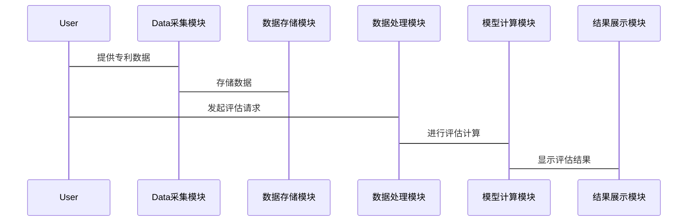

                 


# 股市估值在国际专利价值评估中的应用

## 关键词：
- 股市估值
- 国际专利
- 价值评估
- 专利评估
- 专利组合

## 摘要：
本文探讨了如何将股市估值的方法应用于国际专利价值评估中。通过对股市估值核心概念和国际专利评估的深入分析，结合算法模型和系统架构设计，展示了如何利用股市估值的原理和方法来提高专利价值评估的准确性和效率。文章还通过实际案例分析和项目实战，帮助读者理解和应用这些知识。

# 目录

## 第1章: 股市估值与国际专利价值评估的背景介绍

### 1.1 股市估值的核心概念与方法
#### 1.1.1 股市估值的基本原理
股市估值是通过对公司的财务数据、市场表现和行业状况等多方面因素进行分析，以确定股票的内在价值。常用的方法包括市盈率法、市净率法和股息率法等。

#### 1.1.2 股票价值的决定因素
股票价值受到公司盈利能力、成长性、行业地位、宏观经济环境等多种因素的影响。这些因素共同决定了市场的供需关系，从而影响股票的价格。

#### 1.1.3 常用的股市估值方法
- 市盈率法：市盈率（P/E）= 股价 / 每股净利润
- 市净率法：市净率（P/B）= 股价 / 每股净资产
- 股息率法：股息率 = 每股股息 / 股价

### 1.2 国际专利价值评估的必要性
#### 1.2.1 专利在现代经济中的地位
专利是企业创新的重要成果，是市场竞争的核心资产。随着全球化的发展，专利的价值在企业整体价值中的比重越来越大。

#### 1.2.2 专利价值评估的意义
专利的价值评估有助于企业制定合理的研发投资策略，优化资产配置，提升市场竞争力。此外，专利评估也是企业并购、专利交易和法律纠纷中的重要依据。

#### 1.2.3 专利评估的复杂性与挑战
专利的价值不仅取决于其技术含量，还受到法律保护强度、市场应用前景和行业竞争状况等多种因素的影响。这些复杂性使得专利评估成为一个具有挑战性的任务。

### 1.3 股市估值在专利评估中的应用背景
#### 1.3.1 股市估值方法的可迁移性
股市估值方法通过分析公司的财务数据和市场表现，评估其内在价值。这些方法在分析企业整体价值时，可以借鉴到专利评估中。

#### 1.3.2 专利价值与企业市值的关系
专利作为企业的一项无形资产，对企业的市值有着重要影响。通过分析企业的专利组合，可以更准确地评估其市场价值。

#### 1.3.3 国际专利市场的特点
国际专利市场具有法律复杂性高、技术覆盖面广和市场波动大的特点。这些特点使得专利评估需要综合考虑多种因素。

## 第2章: 股市估值与国际专利价值评估的核心概念与联系

### 2.1 股市估值的核心要素
#### 2.1.1 股票的内在价值
股票的内在价值是基于公司未来现金流的折现值。计算公式为：
$$
\text{内在价值} = \sum_{t=1}^{\infty} \frac{\text{现金流}_t}{(1 + r)^t}
$$
其中，r是折现率。

#### 2.1.2 市盈率与市净率
市盈率（P/E）和市净率（P/B）是常用的估值指标，分别反映了市场对公司盈利能力和资产质量的评估。

#### 2.1.3 股息率与股息支付率
股息率 = 每股股息 / 股价，反映了股票的分红回报能力。股息支付率 = 股息 / 净利润，反映了公司的分红政策。

### 2.2 国际专利价值评估的关键指标
#### 2.2.1 专利的数量与质量
专利的数量反映了企业的研发投入，而专利的质量则取决于其技术先进性和法律保护强度。

#### 2.2.2 专利的法律保护强度
专利的法律保护强度取决于专利的撰写质量、权利要求的范围以及申请的法律环境。这些因素直接影响专利的市场价值。

#### 2.2.3 专利的市场应用前景
专利的市场应用前景取决于其技术的产业化能力、市场需求和竞争状况。这些因素决定了专利的经济价值。

### 2.3 股市估值方法与专利价值评估的结合点
#### 2.3.1 股票估值方法的可借鉴性
股市估值方法中的DCF模型可以用于评估专利的未来现金流，从而计算其内在价值。

#### 2.3.2 专利价值评估的创新性
专利评估需要考虑技术的创新性和市场应用前景，而这些因素在股市估值中并不直接涉及。

#### 2.3.3 两者的异同点对比
- 相同点：都需要考虑资产的未来现金流和折现率。
- 不同点：专利评估更注重技术特性和市场应用，而股市估值更关注公司的整体财务表现。

### 2.4 核心概念的ER实体关系图
```mermaid
er
    actor: 投资者
    company: 企业
    patent: 专利
    stock_market: 股票市场
    relation1: 投资者对公司的投资影响其股票价格和专利价值
    relation2: 专利价值影响企业的整体市值
    relation3: 股票市场反映企业专利的市场价值
```

## 第3章: 股市估值在国际专利价值评估中的算法原理

### 3.1 股市估值算法在专利评估中的应用
#### 3.1.1 DCF模型的适应与调整
DCF模型可以用于评估专利的未来现金流。公式为：
$$
\text{专利价值} = \sum_{t=1}^{n} \frac{\text{现金流}_t}{(1 + r)^t}
$$
其中，r是折现率，n是专利的有效期限。

#### 3.1.2 股市估值方法的优化
为了适应专利评估的需要，可以对股市估值方法进行优化。例如，引入专利的质量指标作为调整因素。

### 3.2 国际专利价值评估算法的实现步骤
#### 3.2.1 收集专利数据
包括专利数量、专利类型、专利申请地、专利持有者等信息。

#### 3.2.2 确定评估模型
选择适合的评估模型，例如DCF模型或多元回归模型。

#### 3.2.3 估算现金流
根据专利的市场应用前景和法律保护强度，估算未来现金流。

#### 3.2.4 计算折现率
折现率可以基于市场利率和风险因素确定。

#### 3.2.5 计算专利价值
将未来现金流折现，得到专利的内在价值。

### 3.3 股市估值算法的流程图
```mermaid
graph TD
    A[开始] -> B[收集专利数据]
    B -> C[确定评估模型]
    C -> D[估算现金流]
    D -> E[计算折现率]
    E -> F[计算专利价值]
    F -> G[结束]
```

### 3.4 数学模型与公式
#### 3.4.1 现金流计算公式
$$
\text{现金流}_t = \text{收入}_t - \text{成本}_t
$$

#### 3.4.2 折现率计算公式
$$
r = \text{无风险利率} + \text{风险溢价}
$$

#### 3.4.3 专利价值计算公式
$$
\text{专利价值} = \sum_{t=1}^{n} \frac{\text{现金流}_t}{(1 + r)^t}
$$

## 第4章: 国际专利价值评估系统分析与架构设计

### 4.1 问题场景介绍
#### 4.1.1 企业专利评估需求
企业需要对其持有的专利组合进行价值评估，以支持决策。

#### 4.1.2 专利评估系统的功能需求
系统需要具备数据采集、模型计算、结果展示等功能。

### 4.2 系统功能设计
#### 4.2.1 数据采集模块
负责收集专利数据和市场数据。

#### 4.2.2 模型计算模块
实现专利价值评估算法。

#### 4.2.3 结果展示模块
以可视化的方式展示评估结果。

### 4.3 系统架构设计
```mermaid
graph LR
    User -> Data采集模块
    Data采集模块 -> 数据存储模块
    数据存储模块 -> 数据处理模块
    数据处理模块 -> 模型计算模块
    模型计算模块 -> 结果展示模块
    结果展示模块 -> User
```

### 4.4 系统接口设计
#### 4.4.1 数据接口
API接口用于数据的输入和输出。

#### 4.4.2 用户界面
提供友好的用户界面，方便用户进行数据输入和结果查看。

### 4.5 系统交互流程


## 第5章: 项目实战——国际专利价值评估系统实现

### 5.1 环境配置与工具安装
#### 5.1.1 开发环境
使用Python和相关库（如pandas、numpy、scikit-learn）进行开发。

#### 5.1.2 数据源
从公开的专利数据库获取专利数据。

### 5.2 核心代码实现
#### 5.2.1 数据预处理
```python
import pandas as pd

# 读取专利数据
patent_data = pd.read_csv('patent.csv')

# 数据清洗
patent_data.dropna(inplace=True)
```

#### 5.2.2 模型实现
```python
def calculate_patent_value(patent_data):
    # 计算现金流
    cash_flow = patent_data['收入'] - patent_data['成本']
    # 计算折现率
    r = patent_data['无风险利率'] + patent_data['风险溢价']
    # 折现现金流
    present_value = sum(cash_flow / (1 + r)**t for t in range(len(cash_flow)))
    return present_value

patent_value = calculate_patent_value(patent_data)
print(f"专利价值：{patent_value}")
```

#### 5.2.3 结果分析
通过代码实现，可以得到每个专利的内在价值，并进行比较和分析。

### 5.3 案例分析与详细解读
以苹果公司的专利组合为例，分析其专利的价值，并讨论评估结果的意义。

### 5.4 项目小结
总结项目实现的关键点和经验教训，为后续优化提供参考。

## 第6章: 总结与展望

### 6.1 最佳实践
- 数据质量是评估结果的关键，需要确保数据的准确性和完整性。
- 在实际应用中，需要考虑多种因素，如市场环境和法律风险。

### 6.2 小结
本文详细探讨了股市估值在国际专利价值评估中的应用，通过理论分析和实际案例，展示了如何利用股市估值的方法提高专利评估的准确性。

### 6.3 注意事项
- 专利评估需要结合具体的技术背景和市场环境。
- 数据的获取和处理是评估系统实现的关键环节。

### 6.4 拓展阅读
- 进一步研究其他估值模型，如情景分析法和实物期权法。
- 探讨如何结合大数据和人工智能技术，提升专利评估的效率和精度。

## 附录
- 附录A: 相关术语解释
- 附录B: 数据处理代码示例
- 附录C: 参考文献列表

---

通过以上目录，读者可以系统地了解股市估值在国际专利价值评估中的应用，从理论到实践，逐步掌握相关知识和技能。

