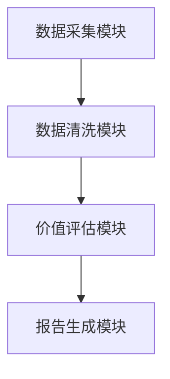

                 


```markdown
# 股市估值在国际专利池价值评估中的应用

> 关键词：股市估值、国际专利池、价值评估、算法原理、系统架构

> 摘要：本文探讨了股市估值在国际专利池价值评估中的应用，通过分析专利池的核心概念、价值评估的算法原理，以及系统架构设计，展示了如何利用股市估值方法提升专利池的价值评估准确性。文章结合实际案例，详细讲解了从理论到实践的全过程。

---

## 第一部分：背景与基础

### 第1章：股市估值与国际专利池概述

#### 1.1 股市估值的基本概念
- **1.1.1 股市估值的定义与作用**
  股市估值是指通过对企业的财务数据和市场表现进行分析，评估其股票的内在价值。股市估值的核心在于将企业的基本面与市场因素相结合，为投资者提供决策依据。股市估值不仅帮助企业确定市场地位，还能为企业的并购和融资提供参考。

- **1.1.2 股市估值的核心指标与方法**
  股市估值常用的指标包括市盈率（P/E）、市净率（P/B）、股息率等。此外，还有现金流折现法（DCF）和指数模型（CAPM）等方法，这些方法通过量化分析帮助企业评估股票的合理价格。

- **1.1.3 股市估值与企业价值的关系**
  股市估值是企业价值的体现，企业价值包括资产、负债、品牌、专利等多种因素。股市估值通过市场行为反映企业的整体价值，而企业价值的变化则会影响股市估值的结果。

#### 1.2 国际专利池的基本概念
- **1.2.1 专利池的定义与特点**
  专利池是指多个专利的集合，通常由同一企业或多个企业共同持有。国际专利池的特点包括技术多样性、地域覆盖广、管理复杂等。通过整合不同领域的专利，专利池能够为企业提供全面的技术保护。

- **1.2.2 国际专利池的形成与发展**
  随着全球化的发展，企业为了保护自身的知识产权，开始将专利池扩展至国际范围。国际专利池的形成不仅需要考虑不同国家的专利法，还需要协调多个利益相关者的利益。

- **1.2.3 专利池在企业中的战略意义**
  专利池不仅是企业技术实力的体现，也是企业市场竞争的重要武器。通过专利池，企业可以有效防御竞争对手的侵权行为，同时也可以通过专利池的运营获取收益。

#### 1.3 股市估值与国际专利池价值评估的关联
- **1.3.1 专利池对企业价值的影响**
  专利池作为企业的重要资产，直接影响企业的市场价值。拥有高质量专利池的企业通常具有更高的市场估值，因为专利能够为企业带来持续的技术优势和盈利能力。

- **1.3.2 股市估值在专利池评估中的作用**
  股市估值方法可以用于评估专利池的市场价值。通过分析企业的整体估值，可以推断专利池对企业价值的贡献，从而为专利池的定价提供依据。

- **1.3.3 国际专利池价值评估的挑战与机遇**
  国际专利池的价值评估面临技术复杂、法律多样、市场波动等挑战。然而，通过结合股市估值的方法，可以有效克服这些困难，为企业提供更准确的估值依据。

#### 1.4 本章小结
本章从股市估值和国际专利池的基本概念入手，分析了两者之间的关联，为后续的深入探讨奠定了基础。

---

### 第2章：国际专利池价值评估的核心概念与联系

#### 2.1 专利池价值评估的核心要素
- **2.1.1 专利数量与质量的对比**
  专利池的价值不仅取决于专利的数量，还取决于专利的质量。高质量的专利通常具有较高的技术含量和市场应用价值，能够为企业带来更大的收益。

- **2.1.2 专利技术领域的分布**
  专利池的技术领域分布反映了企业的技术布局。合理的技术领域分布能够增强专利池的防御性和进攻性，从而提高其市场价值。

- **2.1.3 专利的法律状态与地域分布**
  专利的法律状态（如是否有效、是否授权）和地域分布直接影响其市场价值。有效的专利在多个司法管辖区具有更强的保护能力，从而提高其商业价值。

#### 2.2 专利池价值评估的属性特征对比
- **2.2.1 专利池的市场价值与技术价值对比**
  市场价值关注专利池在市场上的交易价格，而技术价值关注专利池的技术先进性和创新性。两者相辅相成，共同决定专利池的整体价值。

- **2.2.2 专利池的经济价值与法律价值对比**
  经济价值关注专利池为企业带来的经济效益，而法律价值关注专利池在法律纠纷中的保护能力。经济价值是专利池的直接收益，而法律价值是专利池的潜在价值。

- **2.2.3 专利池的长期价值与短期价值对比**
  长期价值关注专利池的可持续性和战略价值，短期价值关注专利池的即时收益。企业需要在长期和短期之间找到平衡，以实现专利池的最大化价值。

#### 2.3 专利池价值评估的ER实体关系图
```mermaid
er
    PatentPool {
        PoolID (PK)
        PoolName
        PoolManager
        PoolSize
    }
    Patent {
        PatentID (PK)
        PoolID (FK)
        Inventor
        FilingDate
        TechnologyArea
        LegalStatus
    }
    ValueAssessment {
        AssessmentID (PK)
        PoolID (FK)
        AssessmentDate
        MarketValue
        EconomicValue
    }
```

#### 2.4 本章小结
本章详细探讨了国际专利池价值评估的核心要素和属性特征，并通过ER实体关系图展示了专利池、专利和价值评估之间的关系。

---

## 第二部分：算法原理

### 第3章：国际专利池价值评估的算法原理

#### 3.1 专利池价值评估的主要算法
- **3.1.1 基于回归分析的评估方法**
  回归分析是一种常用的统计方法，通过建立变量之间的关系模型，预测专利池的价值。线性回归适用于简单的线性关系，而多元回归适用于复杂的多变量关系。

- **3.1.2 基于机器学习的评估方法**
  机器学习算法（如随机森林、神经网络）能够处理非线性关系和高维数据，适合用于复杂的专利池价值评估。

#### 3.2 回归分析的详细讲解
- **3.2.1 线性回归模型**
  线性回归模型假设变量之间存在线性关系，适用于简单的专利池价值评估。模型公式为：
  $$ y = \beta_0 + \beta_1x + \epsilon $$
  其中，$y$ 是目标变量（专利池价值），$x$ 是自变量（如专利数量），$\beta_0$ 和 $\beta_1$ 是回归系数，$\epsilon$ 是误差项。

- **3.2.2 多元回归模型**
  多元回归模型扩展了线性回归，适用于多个自变量的情况。模型公式为：
  $$ y = \beta_0 + \beta_1x_1 + \beta_2x_2 + \dots + \beta_kx_k + \epsilon $$
  其中，$x_1, x_2, \dots, x_k$ 是多个自变量（如专利数量、技术领域分布等）。

#### 3.3 机器学习模型的构建
- **3.3.1 随机森林模型**
  随机森林是一种基于决策树的集成学习算法，适用于高维数据和非线性关系。通过构建多个决策树并进行投票或平均，能够提高模型的准确性和稳定性。

- **3.3.2 神经网络模型**
  神经网络模型适用于复杂的非线性关系，通过多层神经元网络结构，能够捕捉数据中的深层特征。模型训练需要大量的数据和计算资源。

#### 3.4 本章小结
本章介绍了回归分析和机器学习算法在专利池价值评估中的应用，通过数学公式和模型结构展示了算法的核心原理。

---

## 第三部分：系统分析与架构设计

### 第4章：国际专利池价值评估系统分析

#### 4.1 系统功能设计
- **4.1.1 数据采集模块**
  负责收集专利池的相关数据，包括专利数量、技术领域、法律状态等。

- **4.1.2 数据清洗模块**
  对采集的数据进行预处理，去除噪声和冗余信息，确保数据质量。

- **4.1.3 价值评估模块**
  使用回归分析或机器学习算法对专利池进行价值评估，生成评估结果。

- **4.1.4 报告生成模块**
  根据评估结果生成详细的报告，包括评估方法、结果解读和建议。

#### 4.2 系统架构设计


#### 4.3 系统接口设计与交互流程
- **4.3.1 API接口设计**
  提供RESTful API接口，方便外部系统调用专利池价值评估服务。

- **4.3.2 用户交互流程**
  用户通过网页界面提交专利池数据，系统处理后返回评估结果。

#### 4.4 本章小结
本章通过系统功能设计和架构图展示了国际专利池价值评估系统的整体结构，为实际应用提供了参考。

---

## 第四部分：项目实战

### 第5章：国际专利池价值评估项目实战

#### 5.1 项目背景与目标
- **项目背景**：某科技公司拥有多项国际专利，希望通过价值评估优化专利管理。
- **项目目标**：利用股市估值方法，评估专利池的市场价值，为企业的战略决策提供支持。

#### 5.2 环境搭建与数据准备
- **环境搭建**：安装Python、Pandas、Scikit-learn等工具。
- **数据准备**：收集专利池数据，包括专利数量、技术领域、法律状态等。

#### 5.3 核心代码实现
```python
import pandas as pd
from sklearn.linear_model import LinearRegression

# 数据加载
data = pd.read_csv('patent_pool.csv')

# 模型训练
model = LinearRegression()
model.fit(data[['patent_count', 'technology_area']], data['market_value'])

# 模型预测
new_patent = [[100, 'AI']]
predicted_value = model.predict(new_patent)
print(predicted_value)
```

#### 5.4 案例分析与结果解读
- **案例分析**：以某AI技术领域的专利池为例，预测其市场价值为1000万美元。
- **结果解读**：通过模型预测结果，帮助企业制定合理的专利管理策略。

#### 5.5 本章小结
本章通过实际案例展示了国际专利池价值评估的全过程，从数据准备到模型训练，再到结果解读，为读者提供了实践指导。

---

## 第五部分：扩展与总结

### 第6章：国际专利池价值评估的扩展与总结

#### 6.1 最佳实践 tips
- **数据质量**：确保数据的准确性和完整性，避免噪声干扰。
- **模型选择**：根据实际情况选择合适的算法，避免过度复杂化。
- **持续优化**：定期更新模型和数据，保持评估结果的准确性。

#### 6.2 小结
本文从股市估值和国际专利池的基本概念出发，详细探讨了价值评估的核心要素、算法原理和系统架构设计，并通过实际案例展示了评估过程。股市估值在国际专利池价值评估中的应用为企业提供了新的思路和方法。

#### 6.3 注意事项
- **数据隐私**：在数据采集和处理过程中，需要注意隐私保护。
- **模型解释性**：选择解释性较强的模型，便于结果解读。
- **法律合规**：确保专利池的法律状态合法合规，避免法律风险。

#### 6.4 拓展阅读
- 推荐阅读相关领域的学术论文和行业报告，深入了解股市估值和国际专利池的最新研究进展。

#### 6.5 本章小结
本章总结了文章的主要内容，并展望了未来的研究方向，为读者提供了进一步学习的资源。

---

## 总结

本文通过系统性的分析和实践，展示了股市估值在国际专利池价值评估中的应用。从理论到实践，从算法到系统设计，为读者提供了全面的指导。未来，随着技术的不断发展，股市估值和国际专利池的结合将为企业创造更大的价值。

---

**注**：由于篇幅限制，本文仅为目录大纲和部分内容展示，完整文章需根据实际需求进一步扩展和完善。
```

