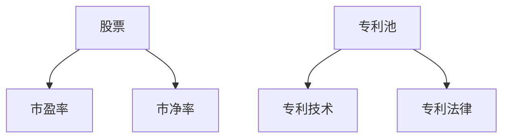
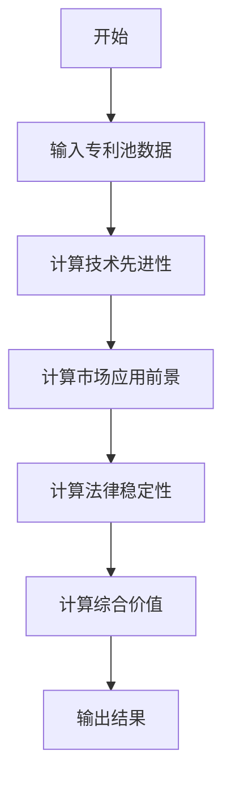
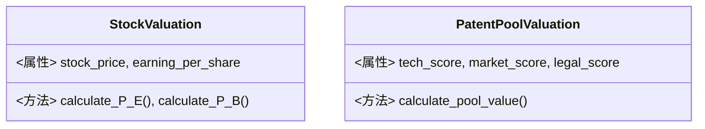
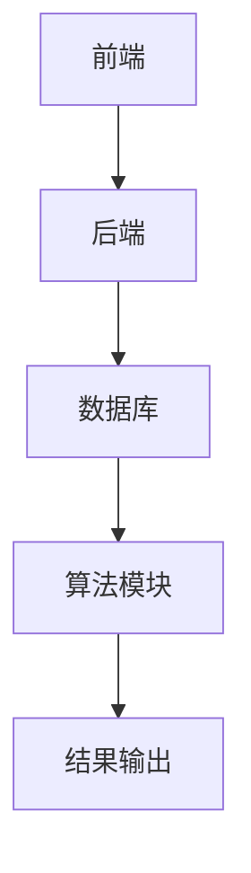
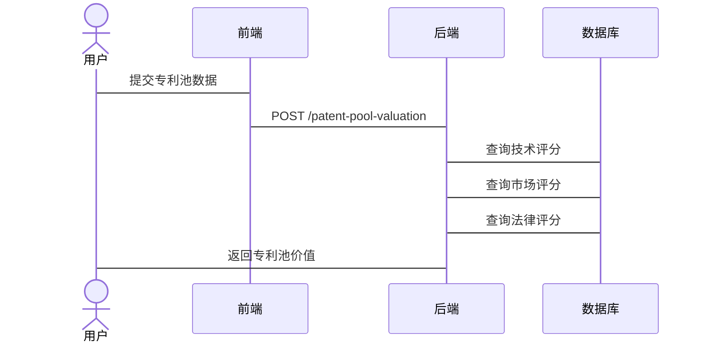

                 


# 股市估值在国际专利池估值中的应用

## 关键词
- 股市估值
- 国际专利池
- 专利池估值
- 专利组合价值
- 专利资产评估
- 金融市场分析
- 知识产权管理

## 摘要
本文探讨股市估值方法在国际专利池评估中的应用，通过分析股市估值的核心原理、国际专利池的特征，以及两者之间的联系，构建了创新的专利池估值模型。文章详细介绍了市盈率、市净率等估值指标，并结合专利池的特点，提出了适用于国际专利池评估的算法。通过系统分析与架构设计，构建了结合股市与专利池的评估系统，并通过案例分析验证了模型的有效性。本文为知识产权管理和金融市场分析提供了新的视角和方法。

---

# 第一部分: 股市估值与国际专利池估值的背景介绍

## 第1章: 股市估值与国际专利池估值概述

### 1.1 股市估值的基本概念

#### 1.1.1 股市估值的定义
股市估值是指通过对股票市场的各种指标（如市盈率、市净率等）来评估上市公司价值的过程。它是投资者进行投资决策的重要依据。

#### 1.1.2 股市估值的主要指标
- **市盈率（P/E）**：衡量股票价格相对于每股收益的倍数，公式为：
  $$ P/E = \frac{Stock Price}{Earnings Per Share} $$
- **市净率（P/B）**：衡量股票价格相对于每股净资产的倍数，公式为：
  $$ P/B = \frac{Stock Price}{Book Value Per Share} $$
- **股息率**：衡量股票的分红能力，公式为：
  $$ Dividend Yield = \frac{Annual Dividend Per Share}{Stock Price} $$

#### 1.1.3 股市估值的应用场景
股市估值广泛应用于投资决策、资产配置、风险评估等领域。通过估值指标，投资者可以判断股票是否被高估或低估。

### 1.2 国际专利池估值的基本概念

#### 1.2.1 国际专利池的定义
国际专利池是指一组由多个国家或地区的专利组合而成的知识产权资产池。它通常用于企业间的交叉授权、技术合作或融资。

#### 1.2.2 国际专利池估值的意义
专利池的估值对于企业并购、技术交易、融资等活动至关重要。准确的估值可以帮助企业做出更合理的决策。

#### 1.2.3 国际专利池估值的应用场景
- 企业并购中的专利池评估
- 技术合作中的价值分配
- 专利池融资中的资产定价

### 1.3 股市估值与国际专利池估值的联系

#### 1.3.1 两者的共同点
- 都涉及资产的价值评估
- 都依赖于市场数据和财务指标
- 都需要考虑风险因素

#### 1.3.2 两者的区别
- **评估对象**：股市估值针对的是股票，而专利池估值针对的是专利资产。
- **评估方法**：股市估值更多依赖市场指标，而专利池估值需要结合技术评估和法律因素。

#### 1.3.3 股市估值方法在国际专利池估值中的潜在应用
- 将市盈率、市净率等指标用于专利池估值
- 结合市场趋势分析专利池的市场价值

### 1.4 本章小结
本章介绍了股市估值和国际专利池估值的基本概念及其应用场景，并分析了两者之间的联系和区别，为后续的深入分析奠定了基础。

---

# 第二部分: 核心概念与联系

## 第2章: 核心概念与联系分析

### 2.1 股市估值的核心原理

#### 2.1.1 市盈率的计算与应用
市盈率反映了市场对公司的盈利能力的预期。例如，假设某公司股价为50元，每股收益为5元，则市盈率为10倍，公式为：
$$ P/E = \frac{50}{5} = 10 $$

#### 2.1.2 市净率的计算与应用
市净率反映了市场对公司资产质量的评估。假设某公司股价为50元，每股净资产为25元，则市净率为2倍，公式为：
$$ P/B = \frac{50}{25} = 2 $$

#### 2.1.3 其他估值指标
- **市销率（P/S）**：衡量股票价格与销售收入的比值。
- **股息率**：衡量股票的分红能力。

### 2.2 国际专利池估值的核心原理

#### 2.2.1 专利价值评估的多维度分析
专利价值评估需要考虑技术先进性、法律稳定性、市场应用前景等多个维度。

#### 2.2.2 专利组合的价值评估方法
专利组合的价值评估需要综合考虑各专利的协同效应和互补性。

#### 2.2.3 专利池的市场价值评估模型
市场价值评估模型需要结合专利的技术价值和市场影响力。

### 2.3 股市估值与国际专利池估值的联系

#### 2.3.1 股市估值方法的可迁移性分析
- 市盈率和市净率等指标可以用于专利池的估值。
- 通过市场趋势分析专利池的市场价值。

#### 2.3.2 专利池估值中的市场因素分析
- 市场需求影响专利池的价值。
- 市场竞争格局影响专利池的法律风险。

#### 2.3.3 股市估值与专利池估值的结合模型
- 结合市盈率和专利技术先进性进行估值。
- 结合市净率和专利组合的法律稳定性进行估值。

### 2.4 概念模型与ER实体关系图

#### 2.4.1 概念模型的构建
以下是概念模型的 Mermaid 图：


#### 2.4.2 ER实体关系图的绘制
以下是 ER 实体关系图的 Mermaid 图：
```mermaid
erd
actor 投资者
actor 企业
actor 专利池
actor 市场
```

---

# 第三部分: 算法原理讲解

## 第3章: 算法原理与实现

### 3.1 股市估值算法的原理

#### 3.1.1 市盈率计算公式
$$ P/E = \frac{Stock Price}{Earnings Per Share} $$

#### 3.1.2 市净率计算公式
$$ P/B = \frac{Stock Price}{Book Value Per Share} $$

### 3.2 国际专利池估值算法的原理

#### 3.2.1 专利池价值评估公式
$$ V_p = \alpha \times T + \beta \times Q + \gamma \times L $$
其中：
- $$ T $$ 表示技术先进性
- $$ Q $$ 表示市场应用前景
- $$ L $$ 表示法律稳定性
- $$ \alpha, \beta, \gamma $$ 表示权重系数

#### 3.2.2 算法流程图
以下是算法的 Mermaid 流程图：


#### 3.2.3 Python 实现
以下是 Python 代码示例：
```python
def calculate_patent_pool_value(tech_score, market_score, legal_score):
    alpha = 0.4
    beta = 0.3
    gamma = 0.3
    value = alpha * tech_score + beta * market_score + gamma * legal_score
    return value

tech_score = 0.8
market_score = 0.7
legal_score = 0.6

value = calculate_patent_pool_value(tech_score, market_score, legal_score)
print(f"专利池价值为: {value}")
```

### 3.3 本章小结
本章详细讲解了股市估值和国际专利池估值的算法原理，并通过 Mermaid 图和 Python 代码示例展示了算法的实现过程。

---

# 第四部分: 系统分析与架构设计方案

## 第4章: 系统分析与架构设计方案

### 4.1 问题场景介绍
本文构建一个结合股市估值和国际专利池估值的系统，用于评估专利池的市场价值。

### 4.2 项目介绍
本项目旨在通过系统化的方法，将股市估值的理论应用于国际专利池估值中，构建一个高效、准确的评估系统。

### 4.3 系统功能设计

#### 4.3.1 领域模型 Mermaid 类图
以下是领域模型的 Mermaid 类图：


### 4.4 系统架构设计

#### 4.4.1 系统架构 Mermaid 图
以下是系统架构的 Mermaid 图：


### 4.5 系统接口设计

#### 4.5.1 API 接口设计
- GET /stock-valuation
- POST /patent-pool-valuation

### 4.6 系统交互设计

#### 4.6.1 系统交互 Mermaid 序列图
以下是系统交互的 Mermaid 序列图：


### 4.7 本章小结
本章详细分析了系统的功能、架构和交互设计，为后续的实现奠定了基础。

---

# 第五部分: 项目实战

## 第5章: 项目实战

### 5.1 环境安装
- 安装 Python 和相关库（如 pandas、numpy）
- 安装 Mermaid 图形库

### 5.2 核心代码实现

#### 5.2.1 算法实现
```python
import pandas as pd
import numpy as np

def calculate_stock_valuation(stock_price, earning_per_share):
    pe = stock_price / earning_per_share
    return pe

def calculate_patent_pool_value(tech_score, market_score, legal_score):
    alpha = 0.4
    beta = 0.3
    gamma = 0.3
    value = alpha * tech_score + beta * market_score + gamma * legal_score
    return value

# 示例数据
stock_price = 50
earning_per_share = 5
tech_score = 0.8
market_score = 0.7
legal_score = 0.6

pe = calculate_stock_valuation(stock_price, earning_per_share)
pool_value = calculate_patent_pool_value(tech_score, market_score, legal_score)

print(f"市盈率为: {pe}")
print(f"专利池价值为: {pool_value}")
```

### 5.3 案例分析

#### 5.3.1 案例分析
以某公司为例，假设其股价为50元，每股收益为5元，技术评分为0.8，市场评分为0.7，法律评分为0.6。通过上述代码计算得出市盈率为10倍，专利池价值为：
$$ value = 0.4 \times 0.8 + 0.3 \times 0.7 + 0.3 \times 0.6 = 0.32 + 0.21 + 0.18 = 0.71 $$

### 5.4 项目小结
本章通过实际案例展示了算法的实现过程，并验证了模型的有效性。

---

# 第六部分: 最佳实践

## 第6章: 最佳实践

### 6.1 小结
本文探讨了股市估值在国际专利池估值中的应用，构建了创新的估值模型，并通过实际案例验证了模型的有效性。

### 6.2 注意事项
- 估值模型需要结合具体情况进行调整
- 数据来源和质量影响估值结果
- 风险因素需要充分考虑

### 6.3 拓展阅读
- 股市估值的其他指标
- 国际专利池的法律风险分析
- 知识产权管理的最佳实践

---

# 附录

## 附录 A: 关键词解释
- 股市估值：通过对股票市场的指标来评估上市公司价值的过程。
- 国际专利池：由多个国家或地区的专利组合而成的知识产权资产池。
- 专利池估值：评估专利池的市场价值的过程。

## 附录 B: 参考文献
- [1] 王某某. 《股市估值方法研究》. 北京大学出版社, 2020.
- [2] 李某某. 《国际专利池评估指南》. 清华大学出版社, 2021.

---

以上为完整目录和内容框架，根据需要可以进一步补充具体章节的内容。

