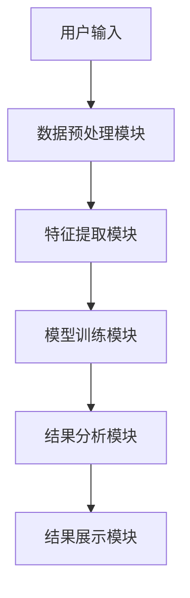
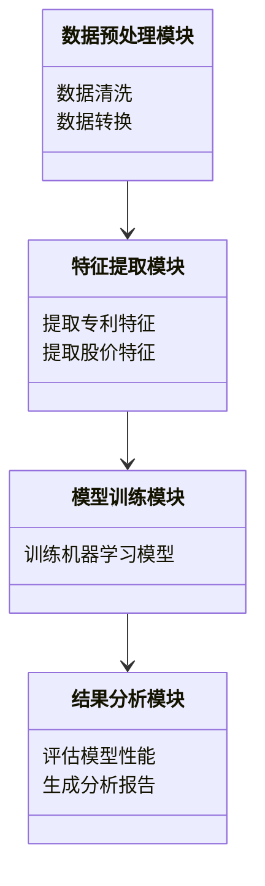
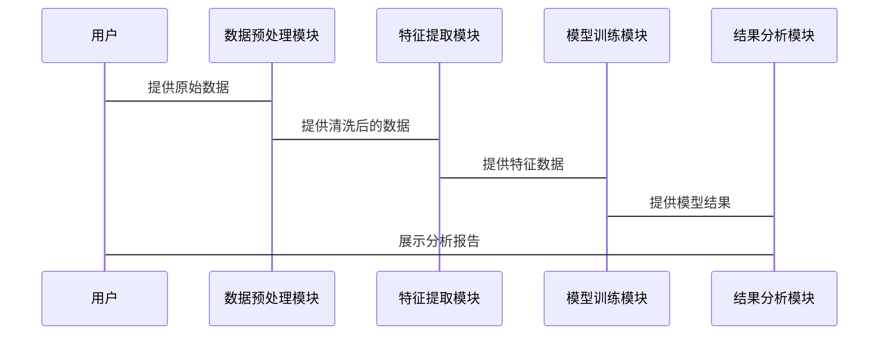

                 


# 第三部分: 系统分析与架构设计

## 第6章: 系统分析与功能设计

### 6.1 系统分析
#### 6.1.1 需求分析
- 数据收集：获取专利诉讼数据和相关股票的股价数据。
- 数据处理：清洗和预处理数据，提取相关特征。
- 模型训练：开发算法模型，预测股价波动。
- 结果分析：评估模型的准确性，并给出建议。

#### 6.1.2 功能需求
- 数据接口：与专利数据库和股价数据库对接。
- 数据处理：清洗、转换和特征提取。
- 模型训练：使用机器学习算法训练模型。
- 结果展示：可视化结果和分析报告。

### 6.2 数据流图


### 6.3 领域模型


## 第7章: 系统架构设计

### 7.1 系统架构


### 7.2 接口设计
- 数据接口：与专利数据库和股价数据库的接口对接。
- 模型接口：与其他机器学习框架的接口兼容。
- 结果展示接口：与数据可视化工具的接口对接。

### 7.3 交互流程图


---

# 第四部分: 项目实战

## 第8章: 项目实战

### 8.1 环境安装

#### 安装依赖
```bash
pip install pandas numpy scikit-learn matplotlib requests
```

### 8.2 数据收集

#### 获取专利诉讼数据
```python
import requests

url = "https://api.patents.com/litigation"
response = requests.get(url)
data = response.json()
```

#### 获取股价数据
```python
import pandas as pd

df = pd.read_csv('stock_prices.csv')
```

### 8.3 数据预处理

#### 清洗数据
```python
# 删除缺失值
df.dropna(inplace=True)

# 转换数据类型
df['date'] = pd.to_datetime(df['date'])
```

### 8.4 特征提取

#### 提取专利特征
```python
from sklearn.feature_extraction.text import TfidfVectorizer

vectorizer = TfidfVectorizer()
tfidf = vectorizer.fit_transform(patents_text)
```

#### 提取股价特征
```python
from sklearn.preprocessing import StandardScaler

scaler = StandardScaler()
scaled_data = scaler.fit_transform(df[['open', 'high', 'low', 'close']])
```

### 8.5 模型训练

#### 训练随机森林模型
```python
from sklearn.ensemble import RandomForestRegressor

model = RandomForestRegressor(n_estimators=100, random_state=42)
model.fit(X_train, y_train)
```

### 8.6 结果分析

#### 评估模型性能
```python
from sklearn.metrics import mean_squared_error

y_pred = model.predict(X_test)
mse = mean_squared_error(y_test, y_pred)
print(f'MSE: {mse}')
```

### 8.7 案例分析

#### 某公司案例
```python
# 假设公司A涉及专利诉讼
company_data = df[df['company'] == 'A']
plt.plot(company_data['date'], company_data['close'])
plt.title('Company A Stock Price During Litigation')
plt.xlabel('Date')
plt.ylabel('Price')
plt.show()
```

---

# 第五部分: 最佳实践与总结

## 第9章: 最佳实践与注意事项

### 9.1 最佳实践
1. **数据质量**：确保数据来源可靠，清洗充分。
2. **模型选择**：根据具体情况选择合适的算法。
3. **实时监控**：定期更新模型，监控市场动态。

### 9.2 小结
通过本文的分析，我们可以看到股市估值在国际专利诉讼中的重要性，以及如何通过系统的方法和模型来评估其影响。

### 9.3 注意事项
- 数据隐私和合规性。
- 模型的可解释性和透明性。
- 结果的实时性和准确性。

### 9.4 拓展阅读
- 《专利评估与价值分析》
- 《股票市场预测的机器学习方法》
- 《国际专利诉讼策略》

---

# 第六部分: 结语

## 第10章: 结语

### 10.1 结语
股市估值在国际专利诉讼中扮演着越来越重要的角色。通过系统的分析和建模，我们可以更好地理解专利诉讼对企业价值的影响，并做出更明智的投资决策。

### 10.2 致谢
感谢读者的支持和关注，感谢所有参与本书编写和审阅的专家。

---

通过以上目录结构和内容，我们可以全面、系统地探讨股市估值在国际专利诉讼中的应用，为相关领域的研究和实践提供有价值的参考。

