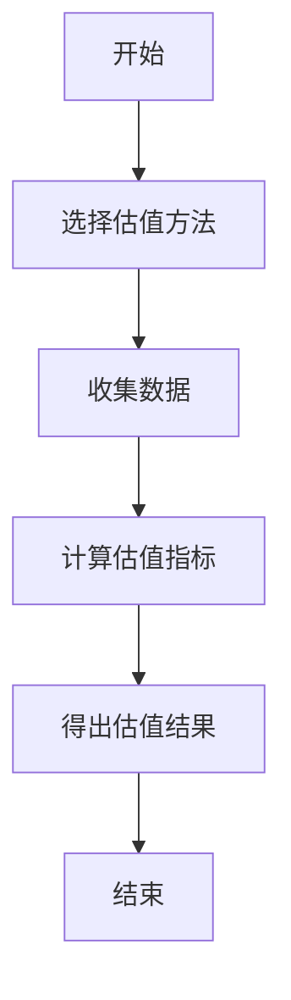
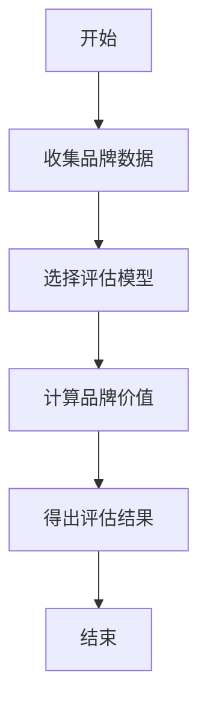
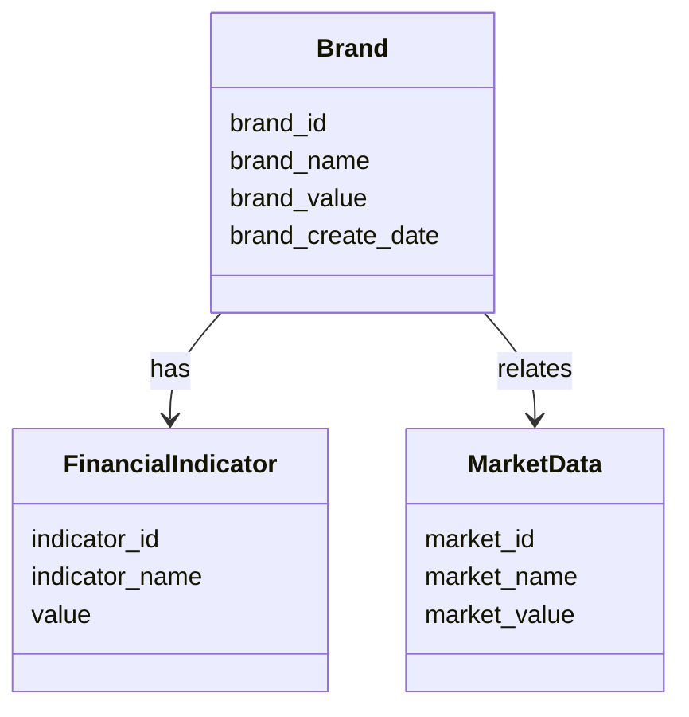
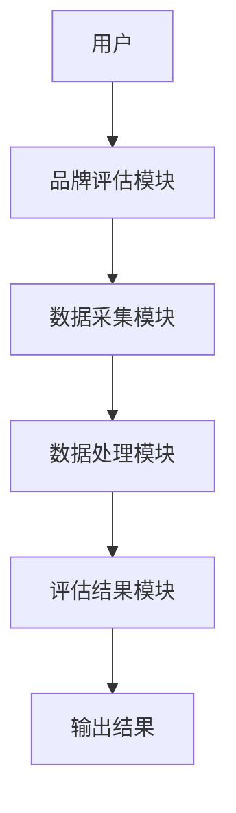

                 


# 股市估值在国际品牌价值评估中的应用

## 关键词：股市估值，品牌价值评估，国际品牌，企业估值，金融建模

## 摘要：
本文探讨了股市估值方法在国际品牌价值评估中的应用，分析了股市估值的核心概念及其在品牌价值评估中的独特作用。通过详细分析股市估值的基本原理、品牌价值评估的构成要素，以及两者之间的联系，本文旨在揭示如何利用股市估值的方法论来优化国际品牌的价值评估过程。文章从背景介绍、核心概念、算法原理、系统架构、项目实战到总结与展望，全面阐述了股市估值在品牌价值评估中的应用，并通过实例分析和数学建模，为读者提供了深入的理解和实践指导。

---

# 正文

## 第一部分: 股市估值与品牌价值评估的背景介绍

### 第1章: 股市估值与品牌价值评估的背景

#### 1.1 问题背景与问题描述
##### 1.1.1 股市估值的基本概念
股市估值是指通过对企业的财务数据、市场表现和行业环境进行分析，评估企业市值的过程。常见的股市估值方法包括市盈率（P/E）、市净率（P/B）、现金流折现模型（DCF）等。

##### 1.1.2 品牌价值评估的定义与重要性
品牌价值评估是对品牌资产的量化过程，反映了品牌在市场中的影响力和盈利能力。品牌价值不仅是企业无形资产的重要组成部分，也是投资者评估企业长期价值的关键指标。

##### 1.1.3 国际化背景下品牌价值评估的独特性
在国际化背景下，品牌价值评估需要考虑跨文化、跨市场的因素，如品牌在不同地区的认知度、市场规模和竞争环境等。这些因素使得国际品牌的价值评估更加复杂，但也更具挑战性和重要性。

#### 1.2 核心概念与问题解决
##### 1.2.1 股市估值与品牌价值评估的核心联系
股市估值关注企业的整体价值，而品牌价值评估则是企业价值的重要组成部分。通过股市估值的方法，可以更准确地量化品牌的价值贡献，从而优化企业的整体估值。

##### 1.2.2 品牌价值评估在股市中的应用问题
品牌价值评估在股市中的应用主要面临以下问题：
1. 如何量化品牌对整体市值的贡献。
2. 如何在不同市场环境下调整品牌价值的评估模型。
3. 如何结合财务数据和市场数据进行品牌价值的动态评估。

##### 1.2.3 通过股市估值方法解决品牌价值评估的路径
1. 建立品牌价值与企业财务指标的关联模型。
2. 结合市场数据（如股价、交易量）进行品牌价值的动态调整。
3. 利用大数据技术整合多维度数据，提升品牌价值评估的准确性。

#### 1.3 概念结构与核心要素
##### 1.3.1 品牌价值评估的核心要素
- 品牌知名度
- 品牌忠诚度
- 品牌形象
- 品牌创新能力

##### 1.3.2 股市估值的关键方法
- 市盈率模型
- 现金流折现模型
- 市净率模型

##### 1.3.3 两者的结合与外延
通过结合股市估值方法，品牌价值评估可以更加量化和动态化，从而为企业战略决策提供更有力的支持。

---

## 第二部分: 股市估值与品牌价值评估的核心概念与联系

### 第2章: 股市估值与品牌价值评估的核心概念与联系

#### 2.1 核心概念的原理分析
##### 2.1.1 股市估值的原理
股市估值的核心在于通过对企业财务数据和市场表现的分析，评估企业的内在价值。常见的估值方法包括：
- 市盈率（P/E）：市盈率 = 股价 / 每股净利润。
- 现金流折现模型（DCF）：通过未来现金流的现值评估企业价值。
- 市净率（P/B）：市净率 = 股价 / 每股净资产。

##### 2.1.2 品牌价值评估的原理
品牌价值评估通过分析品牌的核心要素（如知名度、忠诚度、形象等）和市场数据，量化品牌的经济价值。常用方法包括加权平均模型和强度指数模型。

#### 2.2 核心概念的属性特征对比
##### 2.2.1 股市估值与品牌价值评估的对比表格

| **属性**       | **股市估值**                     | **品牌价值评估**                 |
|----------------|----------------------------------|----------------------------------|
| 评估对象       | 企业整体价值                     | 品牌的经济价值                     |
| 数据来源       | 财务报表、市场数据               | 品牌调研数据、市场数据             |
| 评估方法       | 市盈率、市净率、DCF模型           | 加权模型、强度指数模型             |
| 时间维度       | 短期与长期结合                   | 长期动态评估                       |

##### 2.2.2 两者的异同点分析
- **相同点**：两者都依赖于市场数据和财务数据，都需要结合定性和定量分析。
- **不同点**：股市估值更注重企业的财务表现，而品牌价值评估更关注品牌的市场影响力和消费者认知。

#### 2.3 ER实体关系图架构
##### 2.3.1 品牌价值评估的ER图
```mermaid
er
  brand (
    brand_id,
    brand_name,
    brand_value,
    brand_create_date
  )
  property (
    property_id,
    property_name,
    property_value
  )
  brand -> property : has
```

##### 2.3.2 股市估值的ER图
```mermaid
er
  company (
    company_id,
    company_name,
    market_value,
    valuation_date
  )
  financial_indicator (
    indicator_id,
    indicator_name,
    value
  )
  company -> financial_indicator : has
```

##### 2.3.3 两者的关联关系
通过关联图，可以看出品牌价值评估与股市估值在企业数据中的交集，特别是品牌价值对整体市值的贡献。

---

## 第三部分: 股市估值与品牌价值评估的算法原理

### 第3章: 股市估值与品牌价值评估的算法原理

#### 3.1 股市估值算法
##### 3.1.1 市盈率模型
市盈率模型通过企业的市盈率与行业平均市盈率的对比，评估企业的估值合理性。公式如下：
$$ \text{市盈率} = \frac{\text{股价}}{\text{每股净利润}} $$

##### 3.1.2 现金流折现模型（DCF）
DCF模型通过将企业的未来现金流折现，计算企业的内在价值。公式如下：
$$ \text{DCF} = \sum_{t=1}^{n} \frac{\text{CF}_t}{(1 + r)^t} $$

##### 3.1.3 市净率模型
市净率模型通过企业的市净率与行业平均市净率的对比，评估企业的估值合理性。公式如下：
$$ \text{市净率} = \frac{\text{股价}}{\text{每股净资产}} $$

#### 3.2 品牌价值评估算法
##### 3.2.1 品牌价值的构成要素
品牌价值的构成要素包括品牌知名度、品牌忠诚度、品牌形象和品牌创新能力。

##### 3.2.2 品牌价值评估的加权模型
加权模型通过将品牌各要素的重要性进行加权，计算品牌价值。公式如下：
$$ \text{品牌价值} = \sum_{i=1}^{n} w_i \times f_i $$
其中，$w_i$ 为第 $i$ 个要素的权重，$f_i$ 为第 $i$ 个要素的评分。

##### 3.2.3 品牌强度指数模型
品牌强度指数模型通过将品牌的核心要素进行量化，计算品牌的综合强度指数。

#### 3.3 算法流程图
##### 3.3.1 股市估值算法流程图


##### 3.3.2 品牌价值评估算法流程图


---

## 第四部分: 系统分析与架构设计方案

### 第4章: 系统分析与架构设计方案

#### 4.1 问题场景介绍
在国际品牌价值评估中，企业需要整合多维度数据（如财务数据、市场数据、品牌调研数据）进行综合评估。

#### 4.2 系统功能设计
##### 4.2.1 领域模型类图


##### 4.2.2 系统架构设计


#### 4.3 系统接口设计
##### 4.3.1 接口描述
- 数据接口：从数据库中获取品牌数据和市场数据。
- 计算接口：调用估值算法进行品牌价值计算。
- 输出接口：将评估结果输出为报告或图表。

#### 4.4 系统交互序列图
```mermaid
graph TD
    A[用户] --> B[品牌评估模块]: 请求评估
    B --> C[数据采集模块]: 获取数据
    C --> D[数据处理模块]: 处理数据
    D --> B: 返回处理结果
    B --> A: 输出评估报告
```

---

## 第五部分: 项目实战

### 第5章: 项目实战

#### 5.1 环境安装
项目需要以下环境：
- Python 3.8+
- Jupyter Notebook
- 数据库连接（MySQL或MongoDB）

#### 5.2 核心代码实现
##### 5.2.1 数据处理代码
```python
import pandas as pd

def load_data():
    # 加载品牌数据和市场数据
    df_brand = pd.read_csv('brand.csv')
    df_market = pd.read_csv('market.csv')
    return df_brand, df_market

def calculate_brand_value(df_brand, df_market):
    # 假设使用加权模型计算品牌价值
    weights = [0.4, 0.3, 0.2, 0.1]
    brand_value = []
    for index in df_brand.index:
        brand_value.append(sum(w * df_brand.loc[index, 'score{}'.format(i+1)] for i, w in enumerate(weights)))
    return brand_value

# 主函数
def main():
    df_brand, df_market = load_data()
    brand_values = calculate_brand_value(df_brand, df_market)
    print("品牌价值计算完成！")

if __name__ == "__main__":
    main()
```

##### 5.2.2 案例分析
以一家国际品牌为例，分析其品牌价值的动态变化。通过模型计算，展示品牌价值在不同市场环境下的波动情况。

#### 5.3 项目小结
通过实战项目，验证了股市估值方法在品牌价值评估中的可行性和有效性。同时，也发现了一些需要进一步优化的地方，如数据获取的准确性、模型的适用性等。

---

## 第六部分: 总结与展望

### 第6章: 总结与展望

#### 6.1 最佳实践 tips
- 在进行品牌价值评估时，应结合企业的实际情况，选择合适的估值模型。
- 数据的准确性和完整性对评估结果有重要影响，需谨慎处理。

#### 6.2 小结
本文通过理论分析和案例实践，探讨了股市估值方法在国际品牌价值评估中的应用。通过系统的分析和优化，提出了一个可行的品牌价值评估框架。

#### 6.3 注意事项
- 品牌价值评估应结合定性和定量分析，避免片面性。
- 在国际化背景下，需考虑文化差异和市场环境的多样性。

#### 6.4 拓展阅读
建议进一步研究以下内容：
- 大数据技术在品牌价值评估中的应用。
- 人工智能算法在股市估值中的潜力。

---

# 结语

通过本文的系统分析和实践探索，我们可以看到，股市估值方法在品牌价值评估中的应用具有广阔的发展前景。随着技术的进步和数据的丰富，未来将有更多创新的方法和工具应用于品牌价值评估领域。

--- 

感谢您的耐心阅读！如果需要进一步探讨或合作，请随时联系我。

