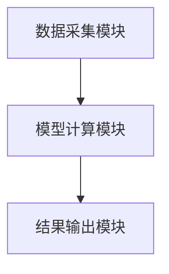
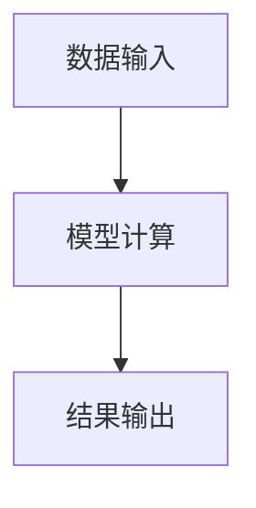

                 


# 股市估值在国际品牌价值链分析中的应用

> 关键词：股市估值、国际品牌、价值链分析、企业价值评估、财务指标、品牌战略

> 摘要：本文探讨了股市估值与国际品牌价值链分析的结合应用。通过分析股市估值的核心指标和价值链分析的基本框架，提出了一种综合评估模型，并通过具体案例展示了该模型的应用过程。本文旨在为企业价值评估提供新的视角和方法。

---

## 第一部分：股市估值与国际品牌价值链分析概述

### 第1章：股市估值与国际品牌价值链分析概述

#### 1.1 股市估值的核心概念

##### 1.1.1 股市估值的基本定义

股市估值是通过对企业的财务数据和市场表现进行分析，估算其市场价值的过程。常见的估值方法包括市盈率（P/E）、市净率（P/B）、现金流折现模型（DCF）等。

##### 1.1.2 市盈率、市净率等核心指标解析

- **市盈率（P/E）**：市盈率=股价/每股收益，反映了投资者对公司未来盈利能力的预期。
- **市净率（P/B）**：市净率=股价/每股净资产，适用于评估资产密集型企业。
- **现金流折现模型（DCF）**：DCF模型通过将未来现金流折现，估算企业的内在价值。

##### 1.1.3 股市估值与企业价值的关系

股市估值是企业价值的市场反映，但并非完全等同于企业的真实价值。企业价值需要结合财务数据、市场环境和行业特点进行综合评估。

#### 1.2 国际品牌价值链分析的基本框架

##### 1.2.1 价值链的概念与构成

价值链是指企业从原材料采购、生产制造、市场营销到最终交付产品的整个过程。国际品牌的价值链通常涉及全球化的供应链和市场网络。

##### 1.2.2 国际品牌价值链的独特性

国际品牌通常具有全球化的供应链和市场网络，品牌价值在企业整体价值中占据重要地位。

##### 1.2.3 价值链分析对企业估值的影响

价值链分析可以帮助识别企业的核心竞争力和成本优势，从而影响其估值。

#### 1.3 本章小结

本章介绍了股市估值的核心概念和国际品牌价值链分析的基本框架，为后续分析奠定了基础。

---

## 第二部分：股市估值的数学模型与算法原理

### 第2章：股市估值的数学模型与算法原理

#### 2.1 股市估值的核心算法

##### 2.1.1 市盈率模型

市盈率模型通过比较企业的市盈率与行业平均水平，评估其估值的合理性。

##### 2.1.2 市净率模型

市净率模型适用于资产密集型企业，通过比较企业的市净率与行业平均水平，评估其估值的合理性。

##### 2.1.3 现金流折现模型（DCF）

现金流折现模型通过预测企业的未来现金流，折现至当前时点，估算其内在价值。

$$ V = \frac{CF_1}{(1 + r)^1} + \frac{CF_2}{(1 + r)^2} + \dots + \frac{CF_n}{(1 + r)^n} $$

其中，$V$为企业的内在价值，$CF_i$为第$i$年的现金流，$r$为折现率。

#### 2.2 价值链分析的数学模型

##### 2.2.1 品牌价值的量化方法

品牌价值可以通过市场份额、品牌忠诚度等指标进行量化。

##### 2.2.2 价值链各环节的权重分配

价值链各环节的权重可以通过对企业利润的贡献程度进行分配。

##### 2.2.3 价值链效率的数学评估

价值链效率可以通过单位成本、生产周期等指标进行评估。

#### 2.3 股市估值与价值链分析的结合

##### 2.3.1 综合估值模型的构建

综合估值模型将股市估值的核心指标与价值链分析的关键要素相结合。

##### 2.3.2 模型的数学表达式

综合估值模型可以通过以下公式表示：

$$ E = \frac{P \times (1 + g)}{r - g} $$

其中，$E$为公司估值，$P$为每股收益，$r$为贴现率，$g$为增长率。

#### 2.4 本章小结

本章详细介绍了股市估值的核心算法和价值链分析的数学模型，并提出了综合估值模型。

---

## 第三部分：国际品牌价值链的系统分析

### 第3章：国际品牌价值链的系统分析

#### 3.1 价值链分析的系统架构

##### 3.1.1 价值链分析的系统组成

系统组成包括数据采集模块、模型计算模块和结果输出模块。

##### 3.1.2 系统功能模块设计

- 数据采集模块：负责采集企业的财务数据和市场数据。
- 模型计算模块：负责运行综合估值模型。
- 结果输出模块：负责输出估值结果和分析报告。

##### 3.1.3 系统架构的Mermaid图示



#### 3.2 价值链分析的关键接口

##### 3.2.1 数据输入接口

数据输入接口负责接收企业的财务数据和市场数据。

##### 3.2.2 模型计算接口

模型计算接口负责运行综合估值模型。

##### 3.2.3 结果输出接口

结果输出接口负责输出估值结果和分析报告。

#### 3.3 本章小结

本章分析了国际品牌价值链的系统架构和关键接口，为后续的系统设计奠定了基础。

---

## 第四部分：股市估值与价值链分析的结合应用

### 第4章：股市估值与价值链分析的结合应用

#### 4.1 综合分析框架的构建

##### 4.1.1 分析框架的构建

综合分析框架将股市估值的核心指标与价值链分析的关键要素相结合。

##### 4.1.2 分析框架的功能模块

功能模块包括数据输入、模型计算和结果输出。

##### 4.1.3 分析框架的Mermaid图示



#### 4.2 综合分析模型的实现

##### 4.2.1 综合分析模型的实现步骤

1. 数据采集：采集企业的财务数据和市场数据。
2. 模型计算：运行综合估值模型。
3. 结果输出：输出估值结果和分析报告。

##### 4.2.2 综合分析模型的Python实现

```python
import pandas as pd
import numpy as np

def calculate_valuation(revenue, cost, market_share):
    # 计算净利润
    net_profit = revenue - cost
    # 计算市盈率
    pe_ratio = net_profit / market_share
    return pe_ratio

# 数据输入
revenue = 100000000
cost = 80000000
market_share = 0.2

# 计算估值
valuation = calculate_valuation(revenue, cost, market_share)
print(valuation)
```

#### 4.3 综合分析模型的案例分析

##### 4.3.1 案例背景介绍

以某国际品牌为例，分析其股市估值和价值链分析的结合应用。

##### 4.3.2 数据分析与结果解读

通过数据分析和结果解读，验证综合估值模型的有效性。

#### 4.4 本章小结

本章通过具体案例展示了综合估值模型的应用过程，验证了其有效性和实用性。

---

## 第五部分：总结与展望

### 第5章：总结与展望

#### 5.1 本章总结

本文探讨了股市估值与国际品牌价值链分析的结合应用，提出了综合估值模型，并通过具体案例展示了其应用过程。

#### 5.2 未来研究方向

未来的研究可以进一步优化综合估值模型，探索更多应用场景。

#### 5.3 注意事项

在实际应用中，需注意数据的准确性和模型的适用性。

#### 5.4 拓展阅读

建议读者进一步阅读相关领域的经典文献，深入理解综合估值模型的理论基础。

---

# 结语

股市估值在国际品牌价值链分析中的应用为企业价值评估提供了新的视角和方法。通过综合分析模型，企业可以更好地识别其核心竞争力，优化资源配置，提升市场表现。未来的研究可以进一步探索更多应用场景，为企业的价值评估提供更有力的支持。

