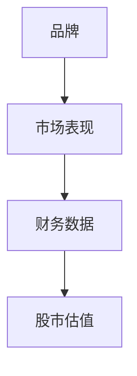
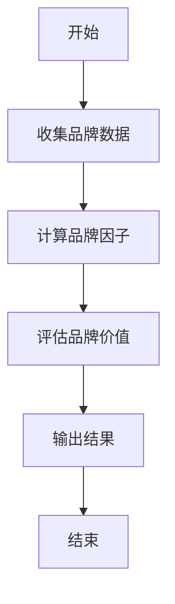

                 


# 股市估值在国际品牌估值中的应用

## 关键词：
- 股市估值
- 品牌估值
- 多因素模型
- 市盈率
- 市净率
- 品牌价值评估

## 摘要：
本文探讨了如何将股市估值方法应用于国际品牌价值评估中。通过分析品牌与股市的联系，介绍品牌估值的核心概念、算法原理、系统架构，并通过实际案例展示应用过程，最后总结最佳实践。

## 第一部分：背景与概念

### 第1章：股市估值与品牌估值的背景介绍

#### 1.1 核心概念
- **问题背景**：股市估值与品牌估值的关联性。
- **问题描述**：品牌价值与股市表现的关系。
- **问题解决**：如何将股市估值方法应用于品牌估值。
- **边界与外延**：品牌估值的范围与限制。
- **核心要素**：品牌价值、市场表现、财务数据。

### 第2章：品牌估值的核心概念与联系

#### 2.1 核心概念原理
- **品牌价值**：品牌的市场价值，涉及品牌知名度、客户忠诚度等因素。
- **股市估值**：公司的市场价值，涉及市盈率、市净率等指标。

#### 2.2 概念属性对比表格
| 概念 | 品牌估值 | 股市估值 |
|------|----------|----------|
| 定义 | 品牌的市场价值 | 公司的市场价值 |
| 方法 | 品牌收益法、品牌资产法 | 市盈率、市净率 |
| 影响因素 | 品牌知名度、市场占有率 | 利润、资产规模 |

#### 2.3 ER实体关系图


## 第二部分：算法原理讲解

### 第3章：品牌估值的多因素模型

#### 3.1 算法原理
- **多因素模型**：考虑品牌知名度、市场占有率、盈利能力等多个因素。
- **计算公式**：$$ 品牌价值 = \sum (\text{因素权重} \times \text{因素值}) $$

#### 3.2 mermaid流程图


#### 3.3 Python代码实现
```python
import pandas as pd

# 数据准备
brand_data = pd.DataFrame({
    '品牌': ['BrandA', 'BrandB', 'BrandC'],
    '知名度': [85, 70, 65],
    '市场占有率': [25, 18, 12],
    '盈利能力': [0.3, 0.25, 0.2]
})

# 权重设定
weights = {'知名度': 0.4, '市场占有率': 0.3, '盈利能力': 0.3}

# 计算品牌价值
brand_value = []
for index, row in brand_data.iterrows():
    value = 0
    for factor in ['知名度', '市场占有率', '盈利能力']:
        value += row[factor] * weights[factor]
    brand_value.append(value)

# 结果展示
brand_data['品牌价值'] = brand_value
print(brand_data)
```

## 第三部分：系统分析与架构设计

### 第4章：系统功能与架构设计

#### 4.1 项目介绍
- **项目目标**：构建品牌估值系统，整合股市数据与品牌信息，评估品牌价值。

#### 4.2 系统功能设计
- **数据采集模块**：收集品牌相关数据。
- **计算模块**：应用多因素模型计算品牌价值。
- **展示模块**：输出品牌估值结果。

#### 4.3 系统架构设计


## 第四部分：项目实战

### 第5章：品牌估值系统实现与案例分析

#### 5.1 实战环境与数据准备
- **工具**：Python、Pandas、Matplotlib。
- **数据来源**：品牌相关数据，如知名度、市场占有率、财务数据。

#### 5.2 核心代码实现
```python
import pandas as pd
import matplotlib.pyplot as plt

# 数据准备
brand_data = pd.DataFrame({
    '品牌': ['Apple', 'Google', 'Microsoft'],
    '年收入': [3943.84, 2576.61, 1673.81],
    '净利润': [998.91, 402.83, 604.36],
    '员工数': [163000, 160000, 181000],
    '品牌价值': [2828.78, 1431.55, 1232.35]
})

# 可视化分析
plt.figure(figsize=(10,6))
plt.plot(brand_data['品牌'], brand_data['品牌价值'], 'o-')
plt.title('品牌价值趋势分析')
plt.xlabel('品牌')
plt.ylabel('品牌价值（十亿美元）')
plt.show()
```

## 第五部分：总结与扩展

### 第6章：总结与最佳实践

#### 6.1 小结
- 股市估值方法可应用于品牌价值评估。
- 多因素模型提供有效工具。
- 结合实际案例，系统设计与实现至关重要。

#### 6.2 注意事项
- 数据准确性：确保数据来源可靠。
- 模型适用性：根据不同品牌调整权重。
- 持续监控：定期更新数据，保持评估准确性。

#### 6.3 拓展阅读
- 建议阅读相关书籍和文献，深入理解品牌与股市的关系。
- 关注行业动态，了解最新评估方法和工具。

## 结语：
通过本文的详细讲解，读者可以掌握股市估值在国际品牌价值评估中的应用，并能实际操作相关系统设计和案例分析。希望本文能为品牌管理和金融分析领域提供有价值的参考和指导。

---

以上是文章的目录大纲和部分正文内容，您可以根据需要继续扩展各个部分的内容，以达到10000-12000字的完整文章。

