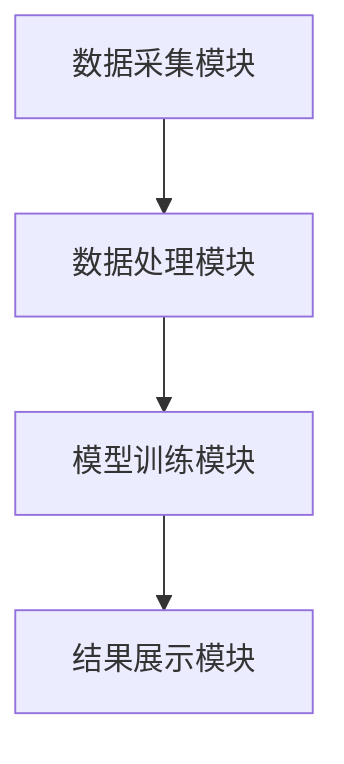
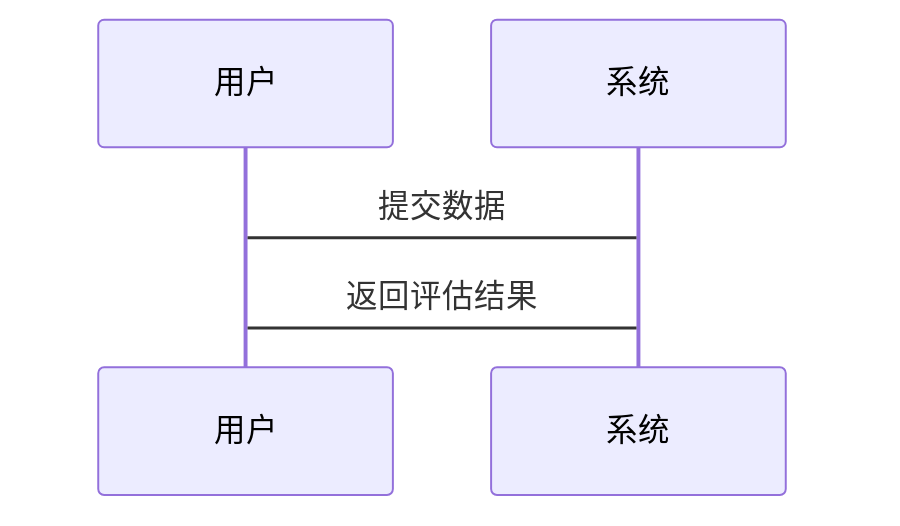

                 


# 股市估值在国际商标价值评估中的应用

## 关键词：股市估值、商标价值评估、企业价值、品牌评估、数据分析

## 摘要：
本文探讨了股市估值方法在国际商标价值评估中的应用，通过分析商标与企业价值的关系，结合股市数据，提出了一种基于回归分析的商标价值评估模型。文章详细解释了模型的构建过程，包括数据收集、特征选择、模型训练和验证，并通过实际案例展示了模型的应用效果。

---

# 第一部分: 股市估值与国际商标价值评估的背景与基础

## 第1章: 股市估值与商标价值评估的概述

### 1.1 股市估值的基本概念

#### 1.1.1 股市估值的定义与作用
股市估值是通过对企业的财务数据、市场表现和行业状况进行分析，估算其股票的内在价值。其作用在于帮助投资者做出合理的投资决策，避免因市场波动导致的盲目投资。

#### 1.1.2 股市估值的核心指标
- **市盈率（P/E）**：股价与每股收益的比率，反映市场对公司盈利能力的预期。
- **市净率（P/B）**：股价与每股净资产的比率，适用于评估资产密集型企业。
- **股息率**：股息与股价的比率，反映股票的分红能力。

#### 1.1.3 股市估值与企业价值的关系
股市估值是企业价值的体现，企业价值包括资产、负债和所有者权益等，而股票价格反映了市场对企业未来盈利能力的预期。

### 1.2 国际商标价值评估的基本概念

#### 1.2.1 商标的价值构成
商标价值由品牌知名度、市场影响力、品牌忠诚度等因素构成，是品牌在市场中的表现。

#### 1.2.2 商标评估的国际标准
国际上常用的品牌评估方法包括市场法、收益法和成本法，分别适用于不同情况。

#### 1.2.3 商标与企业品牌的关系
商标是企业品牌的象征，强大的品牌可以提升企业的市场地位和盈利能力。

### 1.3 股市估值与商标价值评估的关联性

#### 1.3.1 股市估值对商标价值的影响
股市估值反映了市场对品牌价值的认可，品牌价值高的企业通常有更高的股价。

#### 1.3.2 商标价值对企业市值的影响
强大的商标价值可以提升企业的市场地位，进而影响其市值。

#### 1.3.3 股市与商标价值评估的结合意义
通过结合股市估值和商标价值评估，可以更全面地评估企业的价值，帮助投资者做出更准确的决策。

---

## 第2章: 股市估值与商标价值评估的核心概念与联系

### 2.1 核心概念原理

#### 2.1.1 股市估值的核心模型
常用的股市估值模型包括DCF模型和相对估值模型，DCF模型基于企业的现金流预测其内在价值，相对估值模型通过比较类似企业的估值指标来确定股价。

#### 2.1.2 商标价值评估的框架
商标价值评估通常包括品牌强度、市场地位、财务表现等指标，通过定性和定量分析来确定商标价值。

#### 2.1.3 两者的联系与区别
股市估值和商标价值评估都关注企业的价值，但股市估值更关注整体企业价值，而商标价值评估更关注品牌资产。

---

## 第3章: 股市估值与商标价值评估的算法原理

### 3.1 算法原理概述

#### 3.1.1 股市估值的常用算法
- **DCF模型**：通过预测企业未来现金流，计算其现值。
- **相对估值法**：通过比较类似企业的估值指标，确定股价。

#### 3.1.2 商标价值评估的算法
- **回归分析**：通过历史数据，建立商标相关指标与股价的关系模型。
- **机器学习**：利用神经网络等方法，预测商标价值。

### 3.2 算法实现

#### 3.2.1 数据收集
收集企业的商标价值、财务数据、股价数据等。

#### 3.2.2 数据预处理
清洗数据，处理缺失值和异常值。

#### 3.2.3 模型训练
使用回归分析或机器学习方法训练模型。

#### 3.2.4 模型验证
通过回测和交叉验证评估模型的准确性。

### 3.3 数学模型

#### 3.3.1 回归分析模型
$$ \text{商标价值} = \beta_0 + \beta_1 \times \text{品牌强度} + \beta_2 \times \text{市场地位} + \epsilon $$

#### 3.3.2 DCF模型
$$ \text{企业价值} = \sum_{t=1}^{n} \frac{\text{现金流}_t}{(1+r)^t} $$

---

## 第4章: 系统分析与架构设计

### 4.1 系统功能设计

#### 4.1.1 数据采集模块
负责收集商标和股市数据。

#### 4.1.2 数据处理模块
对数据进行清洗和预处理。

#### 4.1.3 模型训练模块
训练回归模型或机器学习模型。

#### 4.1.4 结果展示模块
输出商标价值评估结果。

### 4.2 系统架构设计



### 4.3 接口设计

#### 4.3.1 数据接口
提供API用于数据的导入和导出。

#### 4.3.2 用户接口
提供友好的用户界面，方便用户输入和查看结果。

### 4.4 交互流程



---

## 第5章: 项目实战

### 5.1 环境安装

```bash
pip install pandas numpy scikit-learn
```

### 5.2 核心代码实现

```python
import pandas as pd
from sklearn.linear_model import LinearRegression
from sklearn.metrics import mean_squared_error

# 数据加载
data = pd.read_csv('商标数据.csv')

# 特征选择
features = ['品牌强度', '市场地位']
target = '商标价值'

# 数据分割
X = data[features]
y = data[target]

# 模型训练
model = LinearRegression()
model.fit(X, y)

# 模型预测
y_pred = model.predict(X)

# 模型评估
mse = mean_squared_error(y, y_pred)
print(f"均方误差: {mse}")
```

### 5.3 案例分析
以某企业为例，利用上述代码计算其商标价值，评估模型的准确性。

### 5.4 项目总结
总结项目实施过程中的经验教训，提出改进建议。

---

## 第6章: 总结与展望

### 6.1 总结
本文通过分析股市估值和商标价值评估的联系，提出了一种基于回归分析的商标价值评估模型，并通过实际案例验证了模型的有效性。

### 6.2 未来展望
未来可以进一步研究其他机器学习算法，如神经网络，提高模型的准确性。

### 6.3 最佳实践 tips
- 数据质量是模型准确性的关键。
- 模型需定期更新以适应市场变化。

---

通过以上步骤，我们详细探讨了股市估值在国际商标价值评估中的应用，为投资者和企业提供了新的评估思路。

