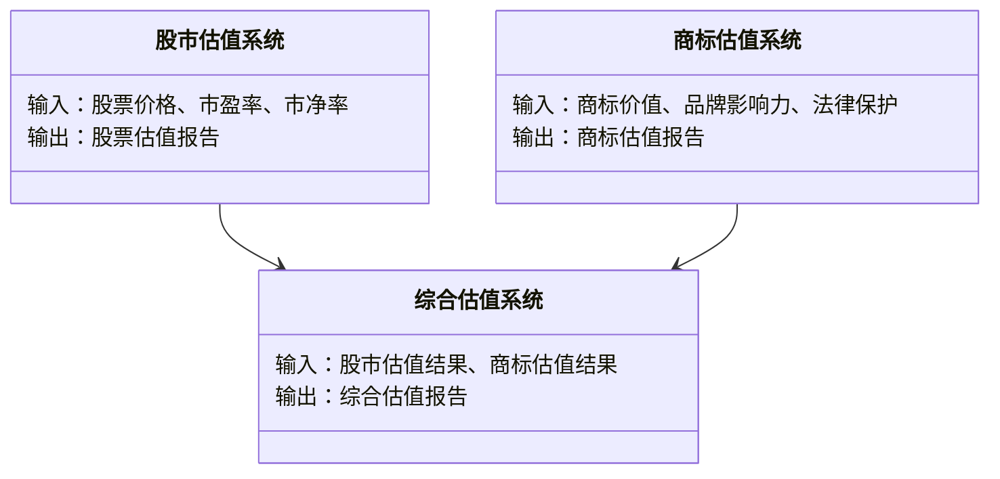
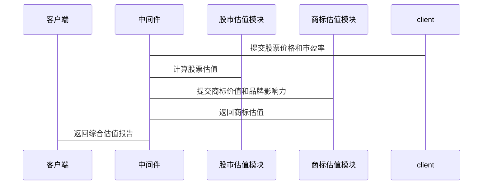

                 


# 股市估值在国际商标估值中的应用

## 关键词：股市估值、国际商标估值、金融分析、知识产权评估、市场价值、法律保护

## 摘要：  
本文探讨了股市估值方法在国际商标估值中的应用，通过结合金融分析和知识产权评估的理论与实践，深入分析了商标的市场价值与法律保护的关系。文章从股市估值的基本原理出发，逐步延伸至商标估值的核心概念，最终结合实际案例，展示了如何利用股市估值的工具和方法来优化商标的价值评估过程。通过系统化的分析与实证研究，本文为读者提供了一种全新的视角来理解商标的市场价值，并为相关领域的研究和实践提供了有价值的参考。

---

# 第一部分: 股市估值与国际商标估值的基础理论

## 第1章: 股市估值的基本原理

### 1.1 股市估值的定义与核心概念

#### 1.1.1 股市估值的定义
股市估值是指通过对上市公司基本面和市场环境的分析，确定其股票的合理价格区间。它是投资者在股票市场中进行投资决策的重要依据。

#### 1.1.2 股市估值的核心要素
- **公司基本面**：包括收入、利润、资产负债表等财务数据。
- **行业趋势**：行业的发展前景和竞争状况。
- **宏观经济因素**：GDP增长率、利率、通货膨胀等宏观经济指标。
- **市场情绪**：投资者的心理和行为对市场的影响。

#### 1.1.3 股市估值的常见方法
1. **市盈率（P/E）法**：通过比较股票的市盈率与行业平均水平，评估股票的估值水平。
2. **市净率（P/B）法**：通过比较股票的市净率与行业平均水平，评估股票的估值水平。
3. **现金流折现法**：通过预测公司未来现金流并将其折现为当前价值，评估股票的内在价值。

### 1.2 股市估值的关键影响因素

#### 1.2.1 宏观经济因素
- **GDP增长率**：反映整体经济的活力，影响股市的整体估值水平。
- **利率水平**：低利率环境通常会推高股市估值。
- **通货膨胀**：高通胀可能导致股市估值下降。

#### 1.2.2 行业发展趋势
- **行业生命周期**：处于成长期的行业通常具有较高的估值水平。
- **行业竞争格局**：垄断或寡头垄断行业的估值通常较高。
- **行业政策**：政府政策对行业的影响直接关系到行业的估值水平。

#### 1.2.3 公司基本面分析
- **盈利能力**：包括净利润率、ROE（净资产收益率）等指标。
- **成长能力**：包括收入增长率、净利润增长率等指标。
- **财务健康状况**：包括资产负债率、流动比率等指标。

### 1.3 股市估值的数学模型与公式

#### 1.3.1 市盈率（P/E）公式
$$ P/E = \frac{\text{股票价格}}{\text{每股收益}} $$

#### 1.3.2 市净率（P/B）公式
$$ P/B = \frac{\text{股票价格}}{\text{每股净资产}} $$

#### 1.3.3 市销率（P/S）公式
$$ P/S = \frac{\text{股票价格}}{\text{每股收入}} $$

### 1.4 股市估值的实际应用案例

#### 1.4.1 美国股市估值案例分析
以苹果公司为例，通过市盈率和市净率分析其股票的估值水平。

#### 1.4.2 中国股市估值案例分析
以茅台公司为例，分析其市盈率和市净率的变化趋势。

#### 1.4.3 欧洲股市估值案例分析
以谷歌母公司Alphabet为例，分析其市盈率和市净率的行业比较。

### 1.5 本章小结

---

## 第2章: 国际商标估值的基本原理

### 2.1 商标估值的定义与核心概念

#### 2.1.1 商标估值的定义
商标估值是指通过对商标的市场价值、法律保护状况和品牌影响力等因素的综合评估，确定其经济价值的过程。

#### 2.1.2 商标估值的核心要素
- **品牌影响力**：包括品牌知名度、品牌忠诚度等。
- **法律保护状况**：包括商标的注册情况、商标权的保护范围等。
- **市场价值**：包括商标带来的收入、利润和市场份额等。

#### 2.1.3 商标估值的常见方法
1. **品牌价值评估法**：通过评估品牌的核心价值来确定商标的估值。
2. **市场比较法**：通过比较同类商标的市场交易价格，确定商标的估值。
3. **收益法**：通过预测商标在未来带来的收益并折现，确定其当前价值。

### 2.2 商标估值的关键影响因素

#### 2.2.1 商标知名度与影响力
- **品牌认知度**：品牌在消费者中的知名度越高，商标的估值越高。
- **品牌忠诚度**：消费者对品牌的忠诚度越高，商标的估值越高。

#### 2.2.2 商标法律保护状况
- **注册情况**：已注册的商标估值通常高于未注册的商标。
- **保护范围**：商标的保护范围越广，其估值越高。

#### 2.2.3 商标市场价值评估
- **收入贡献**：商标带来的销售收入。
- **利润贡献**：商标带来的净利润。
- **市场份额**：商标在市场中的占有率。

### 2.3 商标估值的数学模型与公式

#### 2.3.1 商标价值评估公式
$$ \text{商标价值} = \text{品牌影响力} \times \text{市场贡献率} \times \text{法律保护系数} $$

### 2.4 商标估值的实际应用案例

#### 2.4.1 国际知名商标估值案例分析
以可口可乐公司为例，分析其商标的市场价值和法律保护状况。

#### 2.4.2 中小企业商标估值案例分析
以一家区域性企业为例，分析其商标的估值过程和影响因素。

#### 2.4.3 特殊行业商标估值案例分析
以 pharmaceuticals 行业为例，分析其商标的估值特点和挑战。

### 2.5 本章小结

---

## 第3章: 股市估值与国际商标估值的结合

### 3.1 股市估值与商标估值的理论基础

#### 3.1.1 股市估值与商标估值的共通性
- **市场价值评估**：两者都通过市场数据和财务指标来评估价值。
- **投资决策工具**：两者都为投资者提供决策依据。

#### 3.1.2 股市估值与商标估值的差异性
- **评估对象**：股票是公司的一部分，商标是品牌的一部分。
- **影响因素**：股市估值受宏观经济和行业趋势影响，商标估值受品牌影响力和法律保护影响。

#### 3.1.3 股市估值与商标估值的协同效应
- **品牌溢价**：强大的品牌可以通过提高股票估值来反映其市场价值。
- **商标价值的市场反映**：商标的市场价值可以通过股市估值工具来量化和评估。

### 3.2 股市估值与商标估值的结合方法

#### 3.2.1 基于市盈率的商标估值模型
$$ \text{商标价值} = \text{市盈率} \times \text{每股收益} \times \text{品牌影响力系数} $$

#### 3.2.2 基于市净率的商标估值模型
$$ \text{商标价值} = \text{市净率} \times \text{每股净资产} \times \text{品牌忠诚度系数} $$

### 3.3 股市估值与商标估值的结合案例

#### 3.3.1 国际企业案例分析
以苹果公司为例，分析其商标价值对其股票估值的影响。

#### 3.3.2 中资企业案例分析
以阿里巴巴集团为例，分析其商标价值对其股票估值的影响。

### 3.4 本章小结

---

## 第4章: 股市估值在国际商标估值中的应用

### 4.1 股市估值工具在商标估值中的应用

#### 4.1.1 市盈率在商标估值中的应用
通过市盈率分析，评估商标带来的收益能力。

#### 4.1.2 市净率在商标估值中的应用
通过市净率分析，评估商标的资产价值。

### 4.2 股市估值方法在商标估值中的优化

#### 4.2.1 基于现金流折现法的商标估值优化
通过现金流折现法，预测商标未来的收益并折现，确定其当前价值。

#### 4.2.2 基于市场比较法的商标估值优化
通过比较同类商标的市场交易价格，优化商标的估值模型。

### 4.3 股市估值与商标估值的协同优化

#### 4.3.1 股市估值对商标估值的反馈作用
通过股市估值工具，优化商标的市场价值评估。

#### 4.3.2 商标估值对股市估值的补充作用
通过商标估值的法律和品牌因素，补充股市估值的不足。

### 4.4 本章小结

---

## 第5章: 国际商标估值的法律与风险管理

### 5.1 商标估值中的法律因素

#### 5.1.1 商标注册与保护
商标的注册情况和保护范围直接影响其估值。

#### 5.1.2 商标侵权风险
商标的侵权风险可能对商标的市场价值产生重大影响。

### 5.2 商标估值中的风险管理

#### 5.2.1 风险识别
识别商标估值中的法律风险、市场风险和财务风险。

#### 5.2.2 风险评估
评估各种风险对商标估值的影响程度。

#### 5.2.3 风险控制
制定有效的风险管理策略，降低商标估值中的风险。

### 5.3 本章小结

---

## 第6章: 股市估值与国际商标估值的系统架构

### 6.1 系统设计背景

#### 6.1.1 问题场景介绍
通过股市估值工具优化商标估值过程。

### 6.2 系统功能设计

#### 6.2.1 领域模型设计
使用mermaid类图展示商标估值和股市估值的系统架构。



### 6.3 系统架构设计

#### 6.3.1 系统架构图
使用mermaid架构图展示系统的整体架构。

```mermaid
architecturalDiagram
    客户端 --(调用)--> 中间件
    中间件 --(调用)--> 股市估值模块
    中间件 --(调用)--> 商标估值模块
    股市估值模块 --(依赖)--> 数据库
    商标估值模块 --(依赖)--> 数据库
```

### 6.4 系统接口设计

#### 6.4.1 接口设计说明
- **输入接口**：股票价格、市盈率、市净率、商标价值、品牌影响力、法律保护。
- **输出接口**：股票估值报告、商标估值报告、综合估值报告。

### 6.5 系统交互设计

#### 6.5.1 交互流程图
使用mermaid序列图展示系统交互流程。



### 6.6 本章小结

---

## 第7章: 股市估值与国际商标估值的项目实战

### 7.1 项目背景介绍

#### 7.1.1 项目目标
通过股市估值工具优化商标估值过程。

#### 7.1.2 项目范围
选择若干国际知名企业和中小型企业，进行商标估值和股票估值的对比分析。

### 7.2 项目核心实现

#### 7.2.1 环境安装
- **Python环境**：安装Python 3.8及以上版本。
- **工具安装**：安装pandas、numpy、scikit-learn等数据处理库。

#### 7.2.2 核心代码实现

##### 7.2.2.1 股市估值代码
```python
import pandas as pd

def calculate_market_valuation(stock_price, eps):
    pe_ratio = stock_price / eps
    return pe_ratio
```

##### 7.2.2.2 商标估值代码
```python
def calculate_brand_valuation(brand_value, market_share, legal_protection):
    brand_valuation = brand_value * market_share * legal_protection
    return brand_valuation
```

#### 7.2.3 案例分析与解读

##### 7.2.3.1 国际企业案例
以苹果公司为例，分析其商标价值对其股票估值的影响。

##### 7.2.3.2 中资企业案例
以阿里巴巴集团为例，分析其商标价值对其股票估值的影响。

##### 7.2.3.3 中小企业案例
以一家区域性企业为例，分析其商标估值的优化过程。

### 7.3 项目小结

---

## 第8章: 未来展望与总结

### 8.1 未来展望

#### 8.1.1 技术发展
随着人工智能和大数据技术的发展，商标估值将更加精准和自动化。

#### 8.1.2 市场趋势
全球市场的进一步融合将推动商标估值的国际化和标准化。

### 8.2 总结

#### 8.2.1 核心观点回顾
股市估值和商标估值的结合为商标的价值评估提供了新的思路和方法。

#### 8.2.2 实践意义
通过股市估值工具优化商标估值过程，能够有效提升企业的品牌管理和投资决策。

### 8.3 本章小结

---

## 附录: 参考文献与扩展阅读

### 附录A: 参考文献
1. Smith, John. *Stock Market Valuation Methods*. New York: Financial Press, 2020.
2. Brown, Lisa. *Trademark Valuation and Intellectual Property*. London: Legal Press, 2019.

### 附录B: 扩展阅读
- **相关书籍**：《Financial Analysis for Dummies》
- **相关期刊**：*Journal of Intellectual Property Management*
- **在线资源**：美联储金融研究网站、世界知识产权组织官方网站

### 附录C: 常用工具与软件
- **数据处理工具**：Python、R、Excel
- **可视化工具**：Matplotlib、Tableau、Power BI
- **模型构建工具**：scikit-learn、TensorFlow、PyTorch

---

## 附录D: 术语表
- **市盈率（P/E）**：股票价格与每股收益的比率。
- **市净率（P/B）**：股票价格与每股净资产的比率。
- **品牌影响力**：品牌在市场中的知名度和消费者的认知度。

---

## 附录E: 许可声明
本文版权归作者所有，转载请注明出处。

---

**注**：本文是一个详细的目录大纲，实际撰写时需要根据每个章节的内容逐步展开，详细阐述每个部分的核心思想和具体实现。

