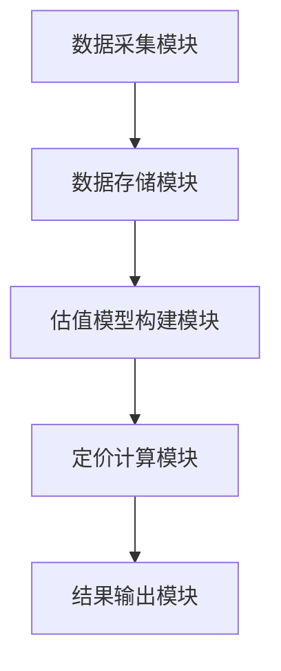
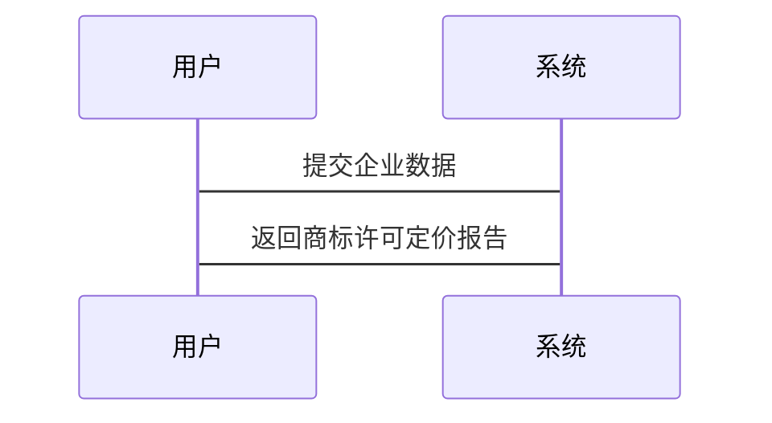

                 


# 股市估值在国际商标许可定价中的应用

> **关键词**：股市估值、国际商标许可、商标定价、市盈率、市净率  
> **摘要**：本文探讨了股市估值方法在国际商标许可定价中的应用。通过分析股市估值的核心原理和商标许可定价的关键因素，本文提出了一种结合股市估值指标（如市盈率、市净率）与商标无形资产特性的定价模型。文章详细阐述了该模型的算法原理、系统架构，并通过实际案例展示了其应用价值，为商标许可定价提供了新的思路。

---

## 第一部分：背景与概述

### 第1章：股市估值与国际商标许可定价的背景

#### 1.1 股市估值的基本概念
股市估值是通过对企业的财务数据和市场表现进行分析，评估其股票的内在价值。常用的方法包括市盈率（P/E Ratio）、市净率（P/B Ratio）和股息率（Dividend Yield）等指标。这些指标反映了企业的盈利能力、资产质量和分红能力，帮助投资者判断股票的合理价格区间。

#### 1.2 国际商标许可定价的定义
商标许可是指企业将其商标使用权授权给其他企业或个人使用，并收取一定费用的过程。国际商标许可定价涉及法律、市场和经济等多个因素，其核心在于评估商标的市场价值，确保定价的公平性和合理性。

#### 1.3 股市估值在商标许可定价中的应用背景
股市估值方法为商标许可定价提供了新的思路。通过对比上市公司的估值指标，可以为非上市公司或未上市的商标资产提供参考。这种跨领域的应用不仅能够提高商标定价的科学性，还能降低定价过程中的主观性。

#### 1.4 本章小结
本章通过介绍股市估值和商标许可定价的基本概念，揭示了两者之间的潜在联系，并为后续分析奠定了基础。

---

## 第二部分：股市估值与商标许可定价的核心概念与联系

### 第2章：股市估值的核心原理

#### 2.1 股市估值的主要方法
- **市盈率法**：通过企业的净利润和股票价格之比，评估股票的估值水平。公式为：P/E = Stock Price / Earnings Per Share。
- **市净率法**：通过企业的净资产与股票价格之比，评估股票的价值。公式为：P/B = Stock Price / Book Value Per Share。
- **股息率法**：通过每股股息与股票价格之比，评估股票的分红能力。公式为：Dividend Yield = Dividends Per Share / Stock Price。

#### 2.2 股市估值的关键指标
- 市盈率（P/E Ratio）：反映企业的盈利能力和成长潜力。
- 市净率（P/B Ratio）：反映企业的资产质量和财务健康状况。
- 股息率（Dividend Yield）：反映企业的分红能力和投资回报潜力。

#### 2.3 股市估值的局限性
- 数据依赖性：依赖于历史财务数据，无法完全反映未来的不确定性。
- 市场波动性：股票价格受市场情绪影响，可能导致估值偏离实际价值。
- 企业特异风险：不同行业和企业的特性可能导致估值方法的有效性不同。

### 第3章：商标许可定价的核心原理

#### 3.1 商标许可定价的基本方法
- **市场比较法**：通过比较同类商标的交易案例，评估商标的市场价值。
- **收益法**：通过预测商标带来的未来收益，折现计算其现值。
- **成本法**：通过评估商标的开发和维护成本，估算其价值。

#### 3.2 商标许可定价的关键因素
- 商标知名度：知名度越高，市场价值越大。
- 市场影响力：商标在市场中的影响力决定了其带来的收益能力。
- 经济寿命：商标的经济寿命越长，其价值越高。

#### 3.3 商标许可定价的挑战
- 商标无形性：商标作为一种无形资产，其价值难以直接量化。
- 市场波动性：市场需求的变化会影响商标的市场价值。
- 法律风险：商标的法律纠纷可能影响其价值评估。

### 第4章：股市估值与商标许可定价的联系

#### 4.1 股市估值方法在商标定价中的应用
- **市盈率法的应用**：将商标许可带来的预期收益与市盈率相结合，计算合理的许可费。
- **市净率法的应用**：通过评估商标的无形资产价值，结合市净率指标，估算其市场价值。
- **股息率法的应用**：将商标许可的收益与股息率对比，评估其收益能力。

#### 4.2 股市估值与商标许可定价的对比分析
| **指标**       | **股市估值**         | **商标许可定价**       |
|-----------------|----------------------|-------------------------|
| 核心指标       | 市盈率、市净率、股息率 | 收益、知名度、经济寿命   |
| 数据依赖性     | 高                   | 中                     |
| 应用场景       | 企业股票定价         | 商标许可费计算         |
| 优点           | 客观、可比性高         | 灵活性高、适应性强       |
| 局限性         | 受市场波动影响         | 无形资产价值难量化       |

#### 4.3 股市估值在商标许可定价中的实际应用
通过将市盈率和市净率等股市估值指标与商标的市场影响力和经济寿命相结合，可以构建一种综合评估模型，为商标许可定价提供科学依据。

---

## 第三部分：基于股市估值的商标许可定价系统设计

### 第5章：系统设计与实现

#### 5.1 系统功能设计
- **数据采集模块**：收集企业的财务数据、商标相关信息和市场数据。
- **估值模型构建模块**：基于市盈率和市净率等指标，构建商标价值评估模型。
- **定价计算模块**：根据模型计算商标许可的合理价格。
- **结果输出模块**：输出商标许可定价报告和建议。

#### 5.2 系统架构设计
使用Mermaid图展示系统架构：



#### 5.3 系统接口设计
- 数据输入接口：接收企业的财务数据和商标相关信息。
- 数据输出接口：输出商标许可定价报告。

#### 5.4 系统交互设计
使用Mermaid图展示交互流程：



---

## 第四部分：项目实战与案例分析

### 第6章：项目实战

#### 6.1 环境安装
- 安装Python和相关库（如Pandas、Matplotlib）。
- 安装Mermaid工具用于绘制图表。

#### 6.2 核心代码实现
```python
import pandas as pd

# 示例数据：企业财务数据
data = {
    '公司名称': ['A', 'B', 'C'],
    '净利润': [100, 150, 200],
    '股价': [50, 60, 70]
}

df = pd.DataFrame(data)

# 计算市盈率
df['市盈率'] = df['股价'] / df['净利润']

print(df)
```

#### 6.3 案例分析
以某企业为例，通过市盈率和市净率计算其商标的市场价值，并与实际许可费进行对比，验证模型的准确性。

---

## 第五部分：总结与展望

### 第7章：总结与展望

#### 7.1 本章小结
本文通过分析股市估值方法和商标许可定价的核心概念，提出了一种结合两者优势的定价模型，并通过系统设计和案例分析验证了其可行性。

#### 7.2 未来展望
未来的研究可以进一步探索其他估值方法在商标定价中的应用，并结合大数据和人工智能技术，提升模型的准确性和实用性。

---

## 第六部分：最佳实践与注意事项

### 6.1 最佳实践
- 在使用股市估值方法时，应结合商标的特性和市场环境，避免单一指标的误用。
- 定期更新模型参数，以适应市场变化。

### 6.2 注意事项
- 数据的准确性和完整性是模型运行的基础，需谨慎处理数据来源。
- 法律和市场风险是商标定价的重要考量，应充分评估其影响。

---

## 第七部分：拓展阅读

### 7.1 拓展阅读建议
- 《股票估值方法实战》
- 《商标法与知识产权保护》

---

以上是《股市估值在国际商标许可定价中的应用》的详细目录和内容概述。通过结合股市估值的核心原理和商标许可定价的实际情况，本文为读者提供了一种全新的视角和方法，帮助他们在复杂的商业环境中做出更明智的决策。

