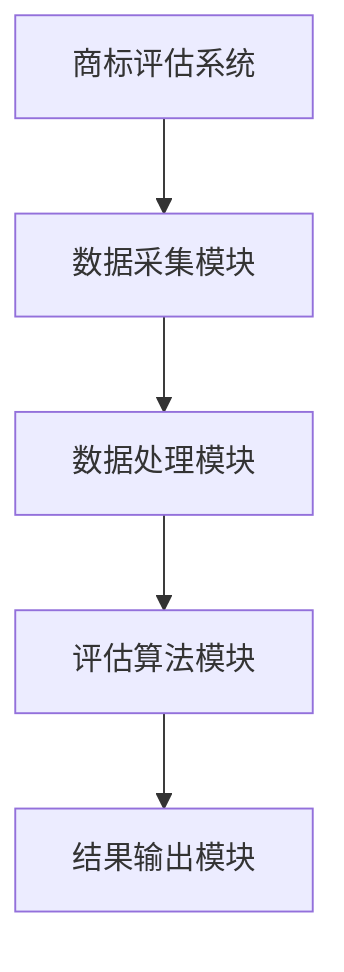
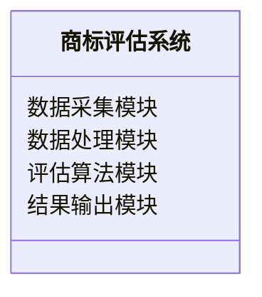
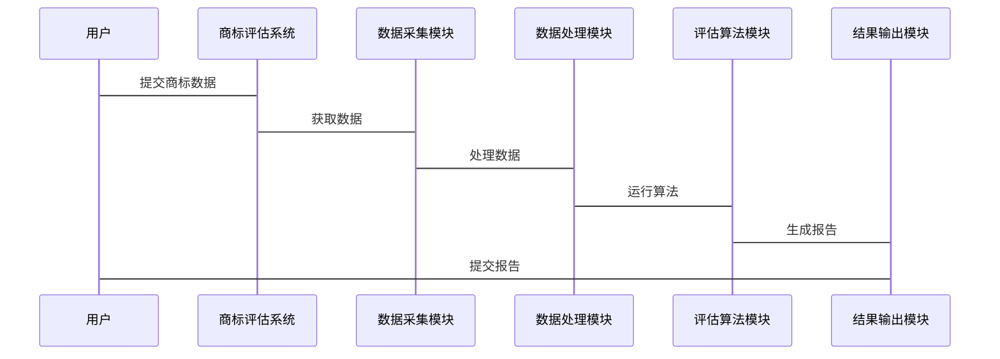

                 


# 股市估值在国际商标诉讼中的应用

> 关键词：股市估值、国际商标诉讼、商标价值评估、算法原理、系统设计

> 摘要：本文探讨了股市估值方法在国际商标诉讼中的应用，分析了商标价值评估的核心概念与算法原理，展示了如何通过系统设计和项目实战将股市估值应用于商标诉讼，提供了详细的数学模型和代码实现。

---

## 第1章: 股市估值与国际商标诉讼的背景介绍

### 1.1 股市估值的基本概念

#### 1.1.1 股市估值的定义与核心要素
股市估值是指通过分析公司财务数据、市场趋势和行业环境，对股票的内在价值进行评估的过程。其核心要素包括：
- 公司财务状况（收入、利润、资产等）
- 行业竞争格局
- 宏观经济环境
- 市场情绪

#### 1.1.2 股市估值的主要方法
常用的股市估值方法包括：
- 市盈率（P/E）：市价与每股收益的比率
- 市净率（P/B）：市价与每股净资产的比率
- 现金流折现法（DCF）：基于未来现金流的贴现值

#### 1.1.3 股市估值在金融领域的应用
股市估值是投资决策的重要依据，广泛应用于股票定价、投资组合优化和风险评估。

### 1.2 国际商标诉讼的基本概念

#### 1.2.1 商标的基本定义与法律保护
商标是区分商品或服务来源的标识，包括文字、图形、符号等。国际商标诉讼涉及跨国商标注册、侵权和争议解决。

#### 1.2.2 国际商标诉讼的特点与挑战
- 跨国法律差异
- 商标价值评估的复杂性
- 诉讼过程中的证据收集与保护

#### 1.2.3 商标价值评估的法律依据
商标价值与品牌影响力、市场地位、盈利能力等因素密切相关，需结合法律和经济因素综合评估。

### 1.3 股市估值与国际商标诉讼的联系

#### 1.3.1 股市估值在商标价值评估中的作用
- 通过DCF方法评估商标的未来收益
- 利用市场倍数（如P/E）分析商标的市场价值

#### 1.3.2 国际商标诉讼中商标价值的法律意义
- 商标价值影响侵权赔偿的计算
- 商标价值影响商标权的转让价格

#### 1.3.3 股市估值方法在商标诉讼中的潜在应用
- 将商标视为资产，评估其市场价值
- 通过市场倍数分析同类商标的估值

## 第2章: 股市估值与商标价值评估的核心概念

### 2.1 股市估值的核心原理

#### 2.1.1 股票定价的理论基础
股票价格反映公司的内在价值和市场情绪。

#### 2.1.2 股市估值的主要指标与公式
- 市盈率（P/E）= 市价 / 每股收益
- 市净率（P/B）= 市价 / 每股净资产

### 2.2 商标价值评估的核心原理

#### 2.2.1 商标价值的构成要素
- 品牌知名度
- 市场占有率
- 盈利能力

#### 2.2.2 商标价值评估的方法与模型
- 市场法：基于市场交易案例
- 收益法：基于未来收益的折现值

### 2.3 股市估值与商标价值评估的对比分析

#### 2.3.1 核心概念的对比
| 股市估值 | 商标价值评估 |
|----------|---------------|
| 股票价格 | 商标市场价值 |
| 每股收益 | 品牌影响力 |

#### 2.3.2 评估方法的异同
- 共同点：都涉及折现法和市场倍数法
- 差异点：股市估值考虑整体公司，商标评估侧重品牌因素

#### 2.3.3 应用场景的差异
股市估值用于投资决策，商标评估用于法律争议和商业决策。

### 2.4 本章小结
通过对比分析，明确了股市估值方法在商标价值评估中的适用性。

---

## 第3章: 股市估值在国际商标诉讼中的算法原理

### 3.1 算法原理概述

#### 3.1.1 算法的数学模型
$$ V = \sum_{t=1}^{n} \frac{CF_t}{(1+r)^t} $$
其中，\( V \) 为商标价值，\( CF_t \) 为未来现金流，\( r \) 为折现率。

#### 3.1.2 算法步骤
1. 确定商标的未来现金流
2. 选择合适的折现率
3. 计算现值
4. 调整市场倍数

### 3.2 算法实现

#### 3.2.1 Python代码实现
```python
def calculate商标价值(现金流, 折现率):
    现值 = 0
    for t in range(len(现金流)):
        现值 += 现金流[t] / (1 + 折现率) ** t
    return 现值

现金流 = [100, 150, 200]
折现率 = 0.1
商标价值 = calculate商标价值(现金流, 折现率)
print(商标价值)
```

#### 3.2.2 代码解读与分析
- 现金流表示商标未来每年的收益
- 折现率反映市场风险

### 3.3 算法的适用性与局限性

#### 3.3.1 适用性
- 适用于商标价值的定量分析
- 可结合市场倍数法进行调整

#### 3.3.2 局限性
- 假设未来现金流可预测
- 忽略市场情绪的影响

---

## 第4章: 股市估值在国际商标诉讼中的系统设计

### 4.1 系统架构设计

#### 4.1.1 系统架构图


### 4.2 功能设计

#### 4.2.1 功能模块
- 数据采集：获取商标历史数据和市场信息
- 数据处理：清洗和转换数据
- 评估算法：应用DCF和市场倍数法
- 结果输出：生成评估报告

#### 4.2.2 类图设计


### 4.3 系统接口设计

#### 4.3.1 接口描述
- 输入：商标历史数据
- 输出：评估报告

### 4.4 系统交互流程

#### 4.4.1 序列图


---

## 第5章: 项目实战

### 5.1 环境安装

#### 5.1.1 安装Python和相关库
```bash
pip install numpy pandas matplotlib
```

### 5.2 代码实现

#### 5.2.1 核心代码
```python
import numpy as np
import pandas as pd

def商标价值评估(现金流, 折现率):
    return np.npv(折现率,现金流)

现金流 = [100, 150, 200]
折现率 = 0.1
价值 = 商标价值评估(现金流, 折现率)
print(价值)
```

### 5.3 案例分析

#### 5.3.1 案例背景
某国际商标面临侵权诉讼，需评估其市场价值。

#### 5.3.2 分析过程
- 确定未来现金流
- 应用DCF方法计算现值
- 结合市场倍数调整

#### 5.3.3 结果解读
评估出的商标价值为X万元，为侵权赔偿提供依据。

### 5.4 项目总结

#### 5.4.1 经验教训
- 数据质量至关重要
- 方法选择需结合实际

---

## 第6章: 总结与展望

### 6.1 本章小结
本文探讨了股市估值在国际商标诉讼中的应用，提出了评估算法和系统设计。

### 6.2 最佳实践 tips
- 数据驱动决策
- 结合法律与经济因素

### 6.3 展望
未来可结合人工智能技术，提升商标价值评估的精度和效率。

---

## 第7章: 注意事项与拓展阅读

### 7.1 注意事项
- 数据隐私保护
- 方法的局限性

### 7.2 拓展阅读
- 《商标法》相关书籍
- 《股市分析与投资策略》

---

通过以上结构，文章系统地阐述了股市估值在国际商标诉讼中的应用，从理论到实践，为读者提供了全面的视角。

