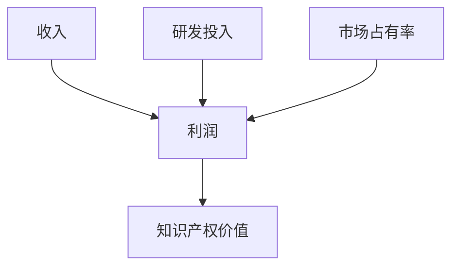
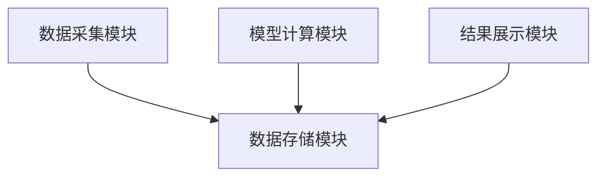

                 


# 股市估值在国际知识产权价值评估中的应用

## 关键词：股市估值、知识产权、价值评估、多元回归分析、系统架构、项目实战

## 摘要：  
知识产权作为企业核心竞争力的重要组成部分，其价值评估对于企业战略决策、投融资活动以及法律纠纷具有重要意义。然而，传统的知识产权价值评估方法往往缺乏动态性和数据支持，难以满足现代金融市场的需求。本文从股市估值的角度出发，探讨其在国际知识产权价值评估中的应用，结合多元回归分析模型、系统架构设计以及项目实战案例，系统性地分析知识产权价值评估的核心要素、算法原理和实际应用。通过本文的研究，读者将能够理解股市估值与知识产权价值评估的内在联系，并掌握如何利用这些方法提升企业价值和投资决策的科学性。

---

## 第一部分: 股市估值与知识产权价值评估的背景介绍

### 第1章: 股市估值的基本概念

#### 1.1 股市估值的定义与意义
股票市场估值是通过对公司财务数据、行业地位、市场表现等多维度因素的分析，对企业的整体价值或股票价格进行评估的过程。股市估值不仅是投资者决策的重要依据，也是企业自身优化管理和吸引投资的关键工具。在现代金融市场中，股市估值的方法和技术日益复杂，尤其是在面对知识产权这种无形资产时，其重要性更加凸显。

#### 1.2 股市估值的核心要素
- **财务数据**：包括收入、利润、资产负债表等财务指标。
- **行业地位**：企业的市场占有率、竞争优势和行业发展趋势。
- **市场表现**：股票价格波动、成交量、市场情绪等。
- **宏观经济因素**：GDP增长率、利率、通货膨胀等宏观经济指标。

#### 1.3 股市估值的意义
股市估值不仅是企业价值的体现，也是投资者评估投资回报的重要工具。通过合理的股市估值方法，投资者可以更准确地判断企业的成长潜力和风险水平，从而做出科学的投资决策。

---

### 第2章: 知识产权价值评估的基本概念

#### 2.1 知识产权的定义与分类
知识产权是指依法保护的智力成果和标记，主要包括专利权、商标权、著作权、商业秘密等。知识产权的价值不仅体现在其法律保护上，更体现在其对企业竞争力和市场价值的贡献上。

#### 2.2 知识产权的价值评估方法
- **收益法**：基于知识产权为企业带来的未来收益进行评估。
- **市场法**：通过比较类似知识产权的市场交易价格进行评估。
- **成本法**：基于知识产权的开发和维护成本进行评估。

#### 2.3 知识产权价值评估的意义
知识产权作为企业的核心资产，其价值直接影响企业的市场估值。通过科学的知识产权价值评估，企业可以更好地制定战略规划、优化资产配置，并在投融资活动中获得更有利的条件。

---

### 第3章: 股市估值与知识产权价值评估的关联性

#### 3.1 知识产权对股市估值的影响
- **企业价值提升**：知识产权是企业核心竞争力的体现，直接影响企业的市场估值。
- **股价波动**：重大知识产权的获得或损失往往引发股价的大幅波动。
- **投资决策**：投资者在评估企业时，会重点关注其知识产权的市场价值和未来潜力。

#### 3.2 股市估值在知识产权价值评估中的作用
- **动态评估**：股市估值能够提供实时的市场反馈，帮助评估知识产权的动态价值。
- **数据支持**：通过分析股市数据，可以为知识产权价值评估提供丰富的数据支持。
- **模型优化**：结合股市估值的方法，可以优化知识产权价值评估的模型和方法。

#### 3.3 知识产权与股市估值的协同发展
知识产权和股市估值的协同发展，不仅能够提升企业的市场竞争力，还能够促进资本市场的健康发展。通过将知识产权价值评估纳入股市估值体系，投资者和企业可以更好地实现双赢。

---

## 第二部分: 知识产权价值评估的核心概念与联系

### 第4章: 知识产权价值评估的核心要素

#### 4.1 知识产权的法律属性
- **法律保护**：知识产权的法律保护是其价值的重要保障。
- **权利期限**：知识产权的保护期限直接影响其市场价值。

#### 4.2 知识产权的经济属性
- **市场竞争力**：知识产权是企业在市场竞争中的核心武器。
- **收益能力**：知识产权通过授权使用、许可转让等方式为企业创造收益。

#### 4.3 知识产权的市场环境
- **行业竞争**：行业内的竞争格局直接影响知识产权的价值。
- **市场需求**：市场对知识产权的需求量和需求结构是评估其价值的重要依据。

---

### 第5章: 知识产权价值评估的算法原理

#### 5.1 多元回归分析模型
多元回归分析是一种常用的统计方法，可以通过多个自变量（如收入、利润、研发投入等）来预测因变量（知识产权价值）。以下是多元回归分析的流程图：



#### 5.2 算法的数学模型
多元回归分析的数学公式如下：

$$
y = \beta_0 + \beta_1x_1 + \beta_2x_2 + \beta_3x_3 + \epsilon
$$

其中：
- $y$ 是知识产权价值（因变量）
- $x_1, x_2, x_3$ 是自变量（如收入、研发投入、市场占有率）
- $\beta_0, \beta_1, \beta_2, \beta_3$ 是回归系数
- $\epsilon$ 是误差项

#### 5.3 算法的代码实现
以下是用Python实现多元回归分析的代码示例：

```python
import numpy as np
from sklearn.linear_model import LinearRegression

# 数据准备
X = np.array([[100, 50],  # 收入=100, 研发投入=50
              [200, 80],  # 收入=200, 研发投入=80
              [150, 60],  # 收入=150, 研发投入=60
              [250, 100]]) # 收入=250, 研发投入=100

y = np.array([60, 80, 70, 90])  # 知识产权价值

# 建立模型
model = LinearRegression()
model.fit(X, y)

# 预测
predicted_value = model.predict([[220, 90]])  # 预测收入=220, 研发投入=90
print("预测的知识产权价值为：", predicted_value)
```

---

## 第三部分: 知识产权价值评估的系统分析

### 第6章: 系统架构设计

#### 6.1 系统功能模块
- **数据采集模块**：收集企业的财务数据、知识产权信息等。
- **模型计算模块**：利用多元回归分析模型进行计算。
- **结果展示模块**：将评估结果以可视化的方式展示。

#### 6.2 系统架构图


#### 6.3 系统接口设计
- 数据接口：提供API用于数据的输入和输出。
- 模型接口：提供API用于模型的调用和计算。

---

### 第7章: 项目实战

#### 7.1 环境安装
- 安装Python和相关库（如numpy、sklearn）。

#### 7.2 核心代码实现
```python
# 数据准备
import pandas as pd
import numpy as np
from sklearn.linear_model import LinearRegression

data = pd.DataFrame({
    '收入': [100, 200, 150, 250],
    '研发投入': [50, 80, 60, 100],
    '知识产权价值': [60, 80, 70, 90]
})

X = data[['收入', '研发投入']]
y = data['知识产权价值']

# 建立模型
model = LinearRegression()
model.fit(X, y)

# 预测
predicted_value = model.predict([[220, 90]])
print("预测的知识产权价值为：", predicted_value)
```

#### 7.3 案例分析
以某科技公司为例，通过上述代码可以预测其知识产权价值，并为企业制定战略决策提供依据。

---

## 第四部分: 总结与展望

### 第8章: 总结

#### 8.1 核心内容回顾
- 知识产权价值评估的核心要素。
- 多元回归分析模型的应用。
- 系统架构设计和项目实战。

#### 8.2 最佳实践
- 在进行知识产权价值评估时，应结合企业的实际情况选择合适的评估方法。
- 定期更新评估模型，以适应市场环境的变化。

### 第9章: 展望

#### 9.1 未来研究方向
- 结合人工智能技术进一步优化知识产权价值评估模型。
- 探讨区块链技术在知识产权价值评估中的应用。

#### 9.2 拓展阅读
- 推荐阅读《知识产权管理与评估》和《股市估值分析》等相关书籍。

---

通过本文的分析，我们深入探讨了股市估值在国际知识产权价值评估中的应用，并结合实际案例展示了如何利用多元回归分析模型进行评估。希望本文能够为读者提供有价值的参考，帮助企业在激烈的市场竞争中更好地管理和评估知识产权价值。

