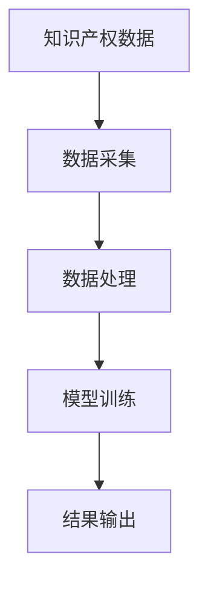

                 


# 股市估值在国际知识产权价值链中的应用

## 关键词：股市估值，知识产权价值链，知识产权评估，企业价值，数学模型

## 摘要：本文探讨了知识产权在国际股市估值中的应用，分析了知识产权如何影响企业的市场价值，以及如何通过数学模型和系统架构将知识产权评估整合到股市估值体系中。文章从背景介绍、核心概念、算法原理、系统架构、项目实战到总结，全面解析了知识产权对股市估值的影响，并提供了具体的案例分析和未来展望。

---

# 第一部分: 股市估值与国际知识产权价值链的背景介绍

## 第1章: 股市估值的基本概念与方法

### 1.1 股市估值的定义与重要性

#### 1.1.1 什么是股市估值
股市估值是指对上市公司股票的内在价值进行评估的过程，旨在确定其合理的价格范围。常见的估值方法包括市盈率、市净率、股息率等。

#### 1.1.2 股市估值的重要性
准确的股市估值帮助企业合理定价，投资者据此做出投资决策，影响资本市场的资源配置效率。

#### 1.1.3 股市估值的核心要素
- 盈利能力
- 资产状况
- 市场地位
- 竞争优势
- 管理团队

### 1.2 国际知识产权价值链的基本概念

#### 1.2.1 知识产权的定义与类型
知识产权包括专利、商标、版权、商业秘密等，是企业核心竞争力的重要组成部分。

#### 1.2.2 知识产权价值链的构成
- 创造：研发新知识和技术创新
- 保护：通过法律手段保护知识产权
- 运用：将知识产权应用于商业活动
- 转化：将知识产权转化为实际产品或服务
- 价值实现：通过市场交易实现知识产权的价值

#### 1.2.3 知识产权在国际经济中的作用
- 促进技术创新
- 提升企业竞争力
- 优化资源配置
- 推动经济增长

## 第2章: 知识产权与股市估值的关系

### 2.1 知识产权对股市估值的影响

#### 2.1.1 知识产权如何影响企业价值
- 提升企业市场竞争力
- 增加企业盈利能力
- 降低企业经营风险

#### 2.1.2 知识产权在企业竞争力中的作用
- 技术壁垒：防止竞争对手模仿
- 市场垄断：获取超额利润
- 持续创新：保持竞争优势

#### 2.1.3 知识产权对企业市场价值的贡献
- 增强投资者信心
- 提高企业估值倍数
- 降低融资成本

### 2.2 知识产权价值链中的关键环节

#### 2.2.1 知识产权的创造与保护
- 研发投入：技术创新的核心
- 法律保护：确保知识产权的有效性

#### 2.2.2 知识产权的运用与转化
- 技术授权：许可他人使用知识产权
- 技术转让：出售知识产权
- 技术合作：共同开发新技术

#### 2.2.3 知识产权的商业化与价值实现
- 产品化：将知识产权转化为商品
- 服务化：提供知识产权相关的服务
- 资本化：通过资本市场实现知识产权的价值

---

# 第二部分: 知识产权对股市估值的核心影响因素

## 第3章: 知识产权的价值评估模型与方法

### 3.1 知识产权的数量与质量

#### 3.1.1 知识产权数量对企业价值的影响
- 数量多：显示企业的研发实力
- 数量少：可能影响市场竞争力

#### 3.1.2 知识产权质量的评估标准
- 技术先进性：是否具有创新性
- 法律保护力度：是否具有较强的法律保护
- 市场应用前景：是否具有商业价值

#### 3.1.3 知识产权组合对企业价值的综合影响
- 组合的多样性：覆盖多个技术领域
- 组合的均衡性：各知识产权的互补性

### 3.2 知识产权的市场竞争力与风险

#### 3.2.1 知识产权的市场竞争力评估
- 技术领先性：是否处于行业领先地位
- 市场需求：是否符合市场需求
- 竞争对手情况：是否具有竞争优势

#### 3.2.2 知识产权风险的分类与影响
- 法律风险：知识产权无效或被挑战
- 市场风险：市场需求变化导致知识产权贬值
- 经营风险：知识产权管理不当导致的价值损失

#### 3.2.3 知识产权风险管理对企业估值的影响
- 健全的知识产权管理体系：降低风险，提升估值
- 风险评估与应对策略：合理评估风险，制定应对措施

---

# 第三部分: 知识产权价值链中的关键参与者与利益相关者

## 第4章: 知识产权价值链中的价值评估模型与方法

### 4.1 知识产权创造者与持有者

#### 4.1.1 知识产权创造者的角色
- 研发人员：技术创新的核心力量
- 法律顾问：确保知识产权的有效性

#### 4.1.2 知识产权持有者的权利与义务
- 权利：独占使用权、许可他人使用、转让等
- 义务：维护知识产权的有效性，防止侵权

#### 4.1.3 知识产权创造者与持有者的关系
- 创造者提供技术支持，持有者负责保护和运用

### 4.2 知识产权价值链中的中间商与服务提供者

#### 4.2.1 知识产权代理机构的作用
- 代理申请：帮助申请专利、商标等
- 维护管理：监控知识产权状态

#### 4.2.2 知识产权评估机构的职能
- 评估价值：确定知识产权的市场价值
- 提供建议：协助企业制定知识产权战略

#### 4.2.3 知识产权法律服务机构的角色
- 侵权诉讼：为企业提供法律保护
- 无效宣告：应对竞争对手的挑战

### 4.3 知识产权价值链中的最终用户与消费者

#### 4.3.1 知识产权最终用户的分类
- 企业用户：购买技术授权或转让
- 消费者：购买包含知识产权的产品或服务

#### 4.3.2 知识产权最终用户的需求与偏好
- 技术先进性：用户希望使用最新的技术
- 成本效益：用户希望以合理的价格获得高质量的技术

#### 4.3.3 知识产权最终用户对市场价值的影响
- 需求驱动：市场需求影响知识产权的价值
- 市场反馈：用户反馈影响知识产权的改进和优化

---

# 第四部分: 知识产权价值链中的价值评估模型与方法

## 第5章: 知识产权价值评估模型与方法

### 5.1 知识产权价值评估的基本原理

#### 5.1.1 知识产权价值的影响因素
- 技术先进性
- 市场需求
- 法律保护力度
- 维护成本

#### 5.1.2 价值评估的方法
- 市场法：参考类似知识产权的市场价格
- 成本法：基于知识产权的开发和维护成本
- 收益法：预测未来收益，折现至现值

### 5.2 知识产权价值评估的数学模型

#### 5.2.1 多元回归模型
$$ V = \beta_0 + \beta_1 x_1 + \beta_2 x_2 + \dots + \beta_n x_n $$

其中：
- \( V \) 是知识产权的价值
- \( x_i \) 是影响价值的因素，如技术先进性、市场需求等
- \( \beta_i \) 是回归系数

#### 5.2.2 博弈论模型
$$ V = \max_{i} \min_{j} \{ v_{ij} \} $$

其中：
- \( v_{ij} \) 是不同参与者在不同策略下的价值

#### 5.2.3 实例分析
以某高科技公司为例，分析其专利数量、技术先进性、市场需求等因素对其股市估值的影响。

### 5.3 知识产权价值评估的系统架构

#### 5.3.1 系统功能设计
- 数据采集：收集专利、商标等知识产权数据
- 数据处理：清洗和预处理数据
- 模型训练：训练价值评估模型
- 结果输出：生成评估报告

#### 5.3.2 系统架构图


#### 5.3.3 系统接口设计
- 数据接口：与数据库或其他数据源对接
- 用户接口：供用户输入参数和查看结果

### 5.4 知识产权价值评估的系统实现

#### 5.4.1 环境配置
- 安装Python、机器学习库（如scikit-learn）、数据分析工具（如Pandas）

#### 5.4.2 核心代码实现
```python
import pandas as pd
from sklearn.linear_model import LinearRegression

# 假设df是包含知识产权数据的DataFrame，'value'是目标变量
features = df[['patents', 'technology_advancement', 'market_demand']]
target = df['value']

model = LinearRegression()
model.fit(features, target)
predictions = model.predict(features)

print("预测值:", predictions)
```

---

# 第五部分: 项目实战与总结

## 第6章: 项目实战

### 6.1 项目介绍

#### 6.1.1 项目背景
分析某高科技公司知识产权对股市估值的影响。

#### 6.1.2 数据收集
收集该公司的专利数量、技术先进性、市场需求等数据，以及其股价数据。

#### 6.1.3 数据处理
清洗数据，处理缺失值和异常值。

### 6.2 系统功能设计

#### 6.2.1 数据采集
使用爬虫或其他工具获取知识产权数据和股价数据。

#### 6.2.2 数据分析
使用回归分析等方法分析知识产权对股价的影响。

#### 6.2.3 模型训练
训练一个预测股价的模型，考虑知识产权的相关因素。

### 6.3 系统实现

#### 6.3.1 环境配置
安装必要的Python库，如Pandas、NumPy、Scikit-learn。

#### 6.3.2 核心代码实现
```python
import pandas as pd
from sklearn.linear_model import LinearRegression
from sklearn.metrics import mean_squared_error

# 假设df是包含知识产权和股价数据的DataFrame
features = df[['patents', 'technology_advancement', 'market_demand']]
target = df['stock_price']

model = LinearRegression()
model.fit(features, target)
predictions = model.predict(features)

 mse = mean_squared_error(target, predictions)
 print("均方误差:", mse)
```

### 6.4 案例分析与详细讲解

#### 6.4.1 数据分析结果
展示回归分析的结果，解释各因素对股价的影响。

#### 6.4.2 模型预测结果
展示预测股价与实际股价的对比，评估模型的准确性。

### 6.5 项目小结

#### 6.5.1 项目总结
知识产权对股市估值有显著影响，建立有效的价值评估模型对企业估值至关重要。

#### 6.5.2 经验教训
数据质量、模型选择和参数调优对结果影响重大，需谨慎处理。

---

## 第7章: 总结与展望

### 7.1 总结

#### 7.1.1 核心观点回顾
知识产权是影响股市估值的重要因素，企业应重视知识产权的保护和运用。

#### 7.1.2 研究成果总结
本文通过分析知识产权对股市估值的影响，提出了有效的价值评估模型和方法。

### 7.2 未来展望

#### 7.2.1 拓展研究方向
- 研究不同类型的知识产权对股市估值的影响差异
- 探索人工智能在知识产权价值评估中的应用

#### 7.2.2 实际应用建议
企业应加强知识产权管理，投资者应关注知识产权对企业的长期价值。

---

## 参考文献

（此处列出相关书籍、论文、研究报告等参考资料）

---

# 结语

通过本文的详细分析，我们可以看到知识产权在国际股市估值中的重要性。准确评估知识产权的价值，不仅有助于企业合理定价，还能帮助投资者做出更明智的投资决策。未来，随着技术的进步和市场的变化，知识产权的价值评估将更加复杂，但也充满了机遇。企业需要不断优化其知识产权战略，以在竞争激烈的市场中立于不败之地。

