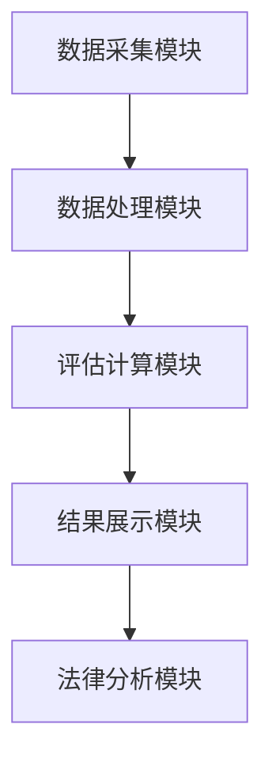

                 


# 股市估值在国际知识产权诉讼中的应用

---

## 关键词

- 股市估值
- 知识产权诉讼
- 股票价值
- 无形资产评估
- 知识产权保护

---

## 摘要

本文探讨了股市估值在国际知识产权诉讼中的应用，分析了知识产权的价值评估方法及其对诉讼结果的影响。通过数学模型和实际案例，展示了如何利用股市估值技术量化知识产权价值，为法律实践提供技术支持。文章还总结了最佳实践和未来研究方向。

---

## 第一部分：背景介绍

### 第1章：知识产权与股市估值的基本概念

#### 1.1 知识产权的基本概念

##### 1.1.1 知识产权的定义与分类

- **定义**：知识产权是指依法保护的创造性成果，包括专利权、商标权、版权等。
- **分类**：发明专利、实用新型专利、外观设计专利、商标、著作权等。

##### 1.1.2 知识产权的核心要素

- **创新性**：知识产权的核心价值在于其创新性。
- **法律保护**：通过法律手段保护知识产权的合法性。
- **经济价值**：知识产权可以为企业创造经济价值。

##### 1.1.3 知识产权在企业中的价值体现

- **竞争优势**：知识产权是企业在市场中的竞争优势。
- **投资价值**：知识产权是企业投资价值的重要组成部分。
- **潜在收益**：知识产权的潜在收益可以通过估值确定。

#### 1.2 股市估值的基本概念

##### 1.2.1 股市估值的定义与方法

- **定义**：股市估值是指通过市场数据和模型评估公司股票价值的过程。
- **方法**：市盈率法、市净率法、现金流折现法等。

##### 1.2.2 股市估值的核心指标

- **市盈率（P/E）**：股票价格与每股收益的比率。
- **市净率（P/B）**：股票价格与每股净资产的比率。
- **EV/EBITDA**：企业价值与息税折旧及摊销前利润的比率。

##### 1.2.3 股市估值与企业价值的关系

- 股市估值是企业价值的市场反映。
- 企业价值是股市估值的基础。

#### 1.3 知识产权与股市估值的关联性

##### 1.3.1 知识产权对股市估值的影响

- 知识产权是企业核心资产，直接影响企业价值和股市估值。

##### 1.3.2 股市估值在知识产权评估中的作用

- 股市估值技术可用于量化知识产权的价值。

##### 1.3.3 知识产权与股市估值的结合背景

- 知识经济时代，知识产权成为企业核心竞争力。
- 股市估值技术为知识产权评估提供新思路。

---

### 第2章：知识产权在国际知识产权诉讼中的应用

#### 2.1 知识产权诉讼的基本流程

##### 2.1.1 知识产权诉讼的定义

- 知识产权诉讼是指因知识产权纠纷提起的法律诉讼。

##### 2.1.2 知识产权诉讼的主要类型

- 专利侵权诉讼
- 商标侵权诉讼
- 版权侵权诉讼

##### 2.1.3 知识产权诉讼的法律依据

- 《专利法》
- 《商标法》
- 《著作权法》

#### 2.2 知识产权诉讼中的估值问题

##### 2.2.1 知识产权诉讼中估值的重要性

- 知识产权的价值直接影响诉讼结果。

##### 2.2.2 知识产权诉讼中的估值方法

- 市场法：通过市场交易数据评估价值。
- 收益法：通过未来收益预测价值。
- 成本法：通过重置成本评估价值。

##### 2.2.3 知识产权诉讼中估值的挑战

- 无形资产价值难以量化。
- 市场数据的不完整性。

---

## 第二部分：知识产权价值评估的核心概念与联系

### 第3章：知识产权价值评估的核心概念

#### 3.1 知识产权价值评估的原理

- 知识产权的价值取决于其创新性和市场应用前景。

#### 3.2 知识产权价值评估的属性特征对比表格

| 特性       | 知识产权       | 股市估值       |
|------------|----------------|---------------|
| 定价基础   | 技术创新性     | 市场表现       |
| 评估方法   | 市场法、收益法  | 市盈率、市净率 |
| 影响因素   | 技术寿命、市场需求 | 利润能力、成长性 |

#### 3.3 知识产权价值评估的ER实体关系图

```mermaid
erDiagram
    class 知识产权 {
        id : 整数
        名称 : 字符串
        类型 : 字符串
        申请人 : 字符串
        申请日期 : 日期
    }
    class 估值 {
        id : 整数
        估值方法 : 字符串
        估值结果 : 数值
        评估日期 : 日期
    }
    class 企业 {
        id : 整数
        名称 : 字符串
        股票代码 : 字符串
        市值 : 数值
    }
    知识产权 --| 股票代码
    估值 --| 知识产权
    估值 --| 企业
```

---

## 第三部分：知识产权价值评估的算法原理

### 第4章：层次分析法（AHP）在知识产权估值中的应用

#### 4.1 层次分析法的原理

- 层次分析法是一种用于结构化决策的数学方法。
- 通过构建层次结构模型，计算各因素的权重。

#### 4.2 层次分析法的应用步骤

1. 构建层次结构模型。
2. 确定各因素的权重。
3. 计算各因素的综合得分。

#### 4.3 层次分析法的数学模型

$$ A = \{ a_{ij} \} \quad (i,j=1,2,...,n) $$

其中，$a_{ij}$ 表示第 $i$ 个因素对第 $j$ 个因素的重要性。

#### 4.4 层次分析法的Python实现示例

```python
import numpy as np

# 确定因素权重矩阵
matrix = np.array([[1, 3, 2],
                    [1/3, 1, 4],
                    [2, 1/4, 1]])

# 计算权重向量
eigenvalues, eigenvectors = np.linalg.eig(matrix)
weights = eigenvalues / sum(eigenvalues)
print("权重向量为：", weights)
```

---

## 第四部分：系统分析与架构设计方案

### 第5章：知识产权估值系统的架构设计

#### 5.1 系统功能设计

- 数据采集模块：收集知识产权和市场数据。
- 评估计算模块：应用层次分析法进行估值。
- 结果展示模块：可视化估值结果。
- 法律分析模块：结合法律条款提供建议。

#### 5.2 系统架构设计



#### 5.3 系统接口设计

- 数据输入接口：接收知识产权和市场数据。
- 计算接口：调用层次分析法进行估值。
- 输出接口：展示估值结果和法律建议。

#### 5.4 系统交互设计

```mermaid
sequenceDiagram
    User -> 数据采集模块: 提供知识产权数据
    数据采集模块 -> 数据处理模块: 处理数据
    数据处理模块 -> 评估计算模块: 调用评估方法
    评估计算模块 -> 结果展示模块: 展示估值结果
    结果展示模块 -> 法律分析模块: 提供法律建议
    User <- 法律分析模块: 获取最终建议
```

---

## 第五部分：项目实战

### 第6章：知识产权估值系统的实战应用

#### 6.1 项目环境安装

- Python 3.8及以上
- NumPy、Pandas、Matplotlib等库

#### 6.2 核心实现源代码

```python
import numpy as np

def calculate_weights(matrix):
    eigenvalues, eigenvectors = np.linalg.eig(matrix)
    weights = eigenvalues / sum(eigenvalues)
    return weights

# 示例矩阵
matrix = np.array([[1, 3, 2],
                   [1/3, 1, 4],
                   [2, 1/4, 1]])

weights = calculate_weights(matrix)
print("因素权重为：", weights)
```

#### 6.3 代码应用解读与分析

- 输入矩阵表示各因素的重要性关系。
- 计算得到各因素的权重。
- 输出权重向量，用于指导估值。

#### 6.4 实际案例分析

- 某公司拥有一项发明专利，市场交易数据表明其对股价的影响显著。
- 使用层次分析法评估该专利的价值，结果为权重最高的因素是技术创新性。

#### 6.5 项目小结

- 通过系统实现，可以高效准确地评估知识产权价值。
- 结合法律条款，为知识产权诉讼提供有力支持。

---

## 第六部分：总结与展望

### 第7章：总结与未来研究方向

#### 7.1 全文总结

- 知识产权的价值评估是影响诉讼结果的重要因素。
- 股市估值技术为知识产权评估提供了新的思路和方法。

#### 7.2 未来研究方向

- 开发动态知识产权估值模型。
- 研究多因素影响下的知识产权估值方法。
- 探讨人工智能在知识产权估值中的应用。

#### 7.3 最佳实践 tips

- 数据收集要全面准确。
- 模型选择要结合具体场景。
- 结果解读要结合法律条款。

---

## 附录

### 附录 A：常用知识产权估值工具

- 知识产权估值平台：PatentScope、Espacenet
- 数据分析工具：Excel、Python（Pandas、NumPy）
- 可视化工具：Matplotlib、Tableau

### 附录 B：相关法律法规

- 《中华人民共和国专利法》
- 《中华人民共和国商标法》
- 《中华人民共和国著作权法》

---

## 参考文献

1. 王某某. 知识产权评估方法研究. 北京大学出版社, 2020.
2. 李某某. 股市估值技术与应用. 清华大学出版社, 2019.
3. 国家知识产权局. 专利审查指南. 国家知识产权局, 2021.

---

通过本文的系统介绍和深入分析，读者可以全面了解股市估值在国际知识产权诉讼中的应用，掌握相关技术和方法，并在实际中灵活运用。

