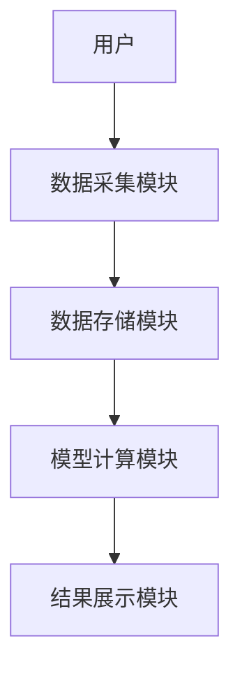
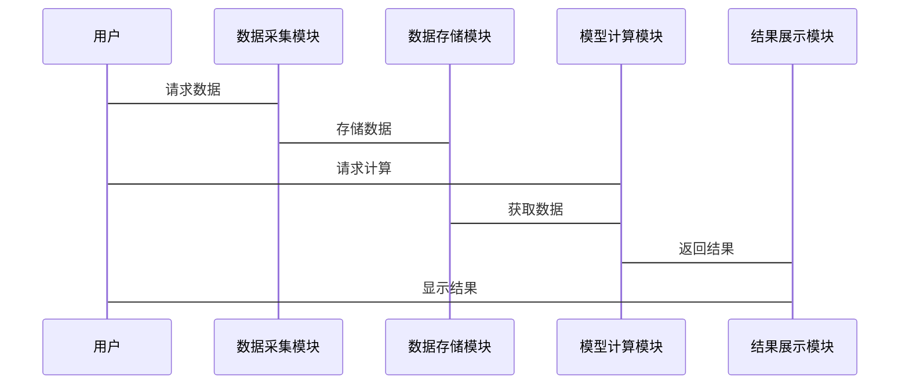

                 


# 股市估值在跨境技术标准谈判中的应用

> 关键词：股市估值、跨境技术标准、谈判策略、博弈论模型、多因素分析模型

> 摘要：本文探讨了股市估值在跨境技术标准谈判中的应用，分析了股市估值的核心概念及其在技术标准谈判中的重要性。通过博弈论模型和多因素分析模型，展示了如何将股市估值应用于实际谈判策略中。最后，结合系统架构设计和实际案例，详细说明了如何利用股市估值优化跨境技术标准谈判的过程。

---

# 第一部分：股市估值与跨境技术标准谈判的背景与基础

## 第1章：股市估值的基本概念

### 1.1 股市估值的定义与意义

#### 1.1.1 股市估值的定义
股市估值是指通过对公司财务数据、市场环境和行业趋势等多方面因素的分析，确定股票的内在价值或市场价格的过程。股市估值是投资者评估股票投资价值的重要工具。

#### 1.1.2 股市估值的意义
股市估值在投资决策中起着关键作用。它不仅帮助投资者判断股票是否被高估或低估，还能为企业提供定价参考，帮助企业在技术标准谈判中制定合理的估值策略。

#### 1.1.3 股市估值的核心要素
- **财务数据**：收入、利润、现金流等。
- **市场环境**：宏观经济、行业趋势、政策法规。
- **公司基本面**：行业地位、竞争优势、管理团队。

### 1.2 股市估值的主要方法

#### 1.2.1 市盈率法
市盈率（P/E）= 股价 / 每股净利润。市盈率反映了市场对公司未来盈利能力的预期。

#### 1.2.2 市净率法
市净率（P/B）= 股价 / 每股净资产。市净率适用于重资产行业，如银行、房地产。

#### 1.2.3 现金流折现法
现金流折现法（DCF）通过将未来现金流折现，计算股票的内在价值。

#### 1.2.4 其他估值方法
- 市销率（P/S）
- 企业价值倍数（EV/EBITDA）

## 第2章：跨境技术标准谈判的背景

### 2.1 技术标准谈判的定义
技术标准谈判是指在国际贸易中，为确保产品符合目标市场的技术标准而进行的谈判。技术标准包括产品质量、安全、环保等多个方面。

### 2.2 跨境技术标准谈判的背景

#### 2.2.1 全球化背景下的技术标准
全球化促进了国际贸易的繁荣，但也带来了技术标准差异的问题。不同国家和地区有不同的技术标准，企业需要通过谈判解决这些差异。

#### 2.2.2 跨境贸易中的技术标准问题
技术标准问题可能导致贸易壁垒，影响企业的市场准入。企业需要通过谈判与合作伙伴达成一致的技术标准，以降低贸易成本。

#### 2.2.3 技术标准谈判的重要性
技术标准谈判直接影响企业的市场竞争力和盈利能力。成功的谈判可以帮助企业进入新市场，扩大市场份额。

## 第3章：股市估值与跨境技术标准谈判的结合

### 3.1 股市估值在技术标准谈判中的应用

#### 3.1.1 技术标准对企业估值的影响
技术标准的制定和认可直接影响企业的市场地位和盈利能力。符合国际标准的企业通常具有更高的估值。

#### 3.1.2 技术标准谈判对企业股价的影响
技术标准谈判的结果会影响企业的市场预期和投资者信心，从而影响股价。

#### 3.1.3 股市估值在技术标准谈判中的作用
股市估值为企业提供了一个参考框架，帮助企业在谈判中确定合理的估值区间。

### 3.2 股市估值与跨境技术标准谈判的关系

#### 3.2.1 股市估值是技术标准谈判的重要工具
股市估值帮助企业量化技术标准的价值，为谈判提供数据支持。

#### 3.2.2 技术标准谈判影响股市估值
技术标准的达成或失败会影响企业的市场地位和盈利能力，从而影响股市估值。

---

# 第二部分：股市估值与跨境技术标准谈判的核心概念与联系

## 第4章：核心概念与联系

### 4.1 股市估值的核心概念

#### 4.1.1 股票的内在价值
股票的内在价值是基于公司基本面的未来现金流折现值。$$\text{内在价值} = \sum_{t=1}^{n} \frac{\text{现金流}_t}{(1 + r)^t}$$

#### 4.1.2 市场价值
市场价值是股票在二级市场的交易价格，受市场情绪和投资者预期的影响。

### 4.2 技术标准谈判的核心概念

#### 4.2.1 技术标准的制定过程
技术标准的制定通常涉及多个利益相关方，包括企业、政府和行业协会。制定过程包括需求分析、起草、征求意见和最终批准。

#### 4.2.2 技术标准的实施与监督
技术标准的实施需要通过认证、检测和执法机构的监督。企业需要通过技术标准认证才能进入市场。

### 4.3 股市估值与技术标准谈判的联系

#### 4.3.1 股市估值为技术标准谈判提供量化依据
通过股市估值，企业可以量化技术标准的价值，为谈判提供数据支持。

#### 4.3.2 技术标准谈判影响股市估值
技术标准的达成或失败会影响企业的市场地位和盈利能力，从而影响股市估值。

#### 4.3.3 技术标准与股市估值的互动关系
技术标准的制定和实施会影响股市估值，而股市估值又为技术标准谈判提供参考。

---

## 第5章：股市估值与技术标准谈判的博弈论模型

### 5.1 博弈论模型在技术标准谈判中的应用

#### 5.1.1 博弈论的基本概念
博弈论研究战略互动，适用于技术标准谈判中的多方利益平衡问题。

#### 5.1.2 技术标准谈判的博弈模型
- **纳什均衡**：各方在均衡状态下无法通过单方面改变策略而获得更好的结果。
- **合作博弈**：各方通过合作达成技术标准共识。

### 5.2 博弈论模型的数学表达

#### 5.2.1 纳什均衡的数学表达
$$\text{纳什均衡} \Rightarrow \forall i, u_i(s_i, s_{-i}) \geq u_i(s'_i, s_{-i})$$

#### 5.2.2 合作博弈的数学表达
$$\text{合作收益} = \sum_{i=1}^{n} u_i(s_i, s_{-i})$$

### 5.3 博弈论模型在技术标准谈判中的应用案例

#### 5.3.1 某国际技术标准谈判案例
通过博弈论模型，企业可以预测谈判结果，制定合理的谈判策略。

#### 5.3.2 模拟谈判过程
使用博弈论模型模拟谈判过程，分析各方的策略选择和利益平衡。

---

## 第6章：股市估值与技术标准谈判的多因素分析模型

### 6.1 多因素分析模型的介绍

#### 6.1.1 多因素分析模型的基本概念
多因素分析模型考虑多个因素对股市估值的影响，适用于技术标准谈判的复杂环境。

#### 6.1.2 多因素分析模型的数学表达
$$\text{股价} = \beta_0 + \beta_1 \times r_f + \beta_2 \times \text{市场风险溢价} + \cdots + \beta_n \times \text{其他因素} + \epsilon$$

### 6.2 多因素分析模型在技术标准谈判中的应用

#### 6.2.1 技术标准对企业估值的影响
技术标准的制定和实施对企业估值的影响可以通过多因素分析模型量化。

#### 6.2.2 技术标准谈判的多因素分析
考虑宏观经济、行业趋势、政策法规等多个因素，制定合理的谈判策略。

### 6.3 多因素分析模型的实现

#### 6.3.1 数据收集与处理
收集相关数据，包括股价、宏观经济指标、行业趋势等。

#### 6.3.2 模型建立与验证
使用统计软件建立多因素分析模型，并验证模型的准确性。

#### 6.3.3 模型的应用
通过模型预测技术标准谈判的结果，制定合理的谈判策略。

---

# 第三部分：股市估值与技术标准谈判的系统架构设计

## 第7章：系统架构设计

### 7.1 系统功能设计

#### 7.1.1 系统功能概述
系统功能包括数据采集、模型计算、结果展示和决策支持。

#### 7.1.2 数据采集模块
通过API接口采集股票数据、宏观经济指标和行业趋势数据。

#### 7.1.3 模型计算模块
使用博弈论模型和多因素分析模型计算技术标准谈判的结果。

#### 7.1.4 结果展示模块
以可视化方式展示谈判结果和股市估值的变化。

### 7.2 系统架构设计

#### 7.2.1 系统架构图


#### 7.2.2 接口设计
- 数据采集模块接口：`GET /api/data`
- 模型计算模块接口：`POST /api/model`

#### 7.2.3 交互流程


### 7.3 系统实现

#### 7.3.1 环境安装
安装Python、Pandas、Matplotlib和Scikit-learn。

#### 7.3.2 核心代码实现
```python
import pandas as pd
from sklearn import linear_model

# 数据采集
data = pd.read_csv('data.csv')

# 模型计算
model = linear_model.LinearRegression()
model.fit(data[['feature1', 'feature2']], data['target'])
```

---

# 第四部分：项目实战与案例分析

## 第8章：项目实战

### 8.1 模拟谈判案例

#### 8.1.1 案例背景
某企业计划进入国际市场，需要与合作伙伴达成技术标准共识。

#### 8.1.2 案例分析
使用博弈论模型和多因素分析模型分析谈判结果，制定合理的谈判策略。

### 8.2 环境安装与代码实现

#### 8.2.1 环境安装
安装必要的Python库，如Pandas、NumPy和Matplotlib。

#### 8.2.2 核心代码实现
```python
import pandas as pd
import numpy as np

# 数据处理
data = pd.read_csv('negotiation.csv')

# 博弈论模型计算
def nash_equilibrium(payoff_matrix):
    n = payoff_matrix.shape[0]
    strategies = payoff_matrix.columns.tolist()
    players = payoff_matrix.index.tolist()
    equilibrium = []
    for i in range(n):
        for j in range(len(strategies)):
            current_payoff = payoff_matrix.iloc[i][j]
            for other_strat in range(len(strategies)):
                if other_strat != j:
                    if payoff_matrix.iloc[i][other_strat] > current_payoff:
                        current_payoff = payoff_matrix.iloc[i][other_strat]
                        j = other_strat
            if payoff_matrix.iloc[i][j] == max(payoff_matrix.iloc[i]):
                equilibrium.append((players[i], strategies[j]))
    return equilibrium

payoff_matrix = pd.DataFrame({
    '策略1': [3, 1, 2],
    '策略2': [1, 2, 3],
    '策略3': [2, 3, 1]
}, index=['玩家1', '玩家2', '玩家3'])

equilibrium = nash_equilibrium(payoff_matrix)
print("纳什均衡：", equilibrium)
```

### 8.3 案例分析与解读

#### 8.3.1 案例分析
通过博弈论模型计算纳什均衡，确定最优谈判策略。

#### 8.3.2 案例解读
纳什均衡为企业在技术标准谈判中提供了稳定的策略选择，帮助企业在复杂环境中制定合理的谈判策略。

---

# 第五部分：总结与展望

## 第9章：总结与展望

### 9.1 全文总结
本文探讨了股市估值在跨境技术标准谈判中的应用，分析了股市估值的核心概念及其在技术标准谈判中的重要性。通过博弈论模型和多因素分析模型，展示了如何将股市估值应用于实际谈判策略中。最后，结合系统架构设计和实际案例，详细说明了如何利用股市估值优化跨境技术标准谈判的过程。

### 9.2 未来展望
未来的研究可以进一步探索股市估值与技术标准谈判的动态关系，开发更加智能化的谈判支持系统，利用人工智能和大数据技术提高谈判效率和成功率。

---

# 第六部分：最佳实践与小结

## 第10章：最佳实践与小结

### 10.1 最佳实践

#### 10.1.1 理解股市估值的核心概念
理解股市估值的基本原理和技术标准谈判的核心要素，为实际应用打下基础。

#### 10.1.2 熟练掌握博弈论模型
熟练掌握博弈论模型和多因素分析模型，能够应用于实际谈判策略中。

#### 10.1.3 系统架构设计
设计合理的系统架构，确保技术标准谈判和股市估值的高效结合。

### 10.2 小结
股市估值在跨境技术标准谈判中的应用是一个复杂但重要的领域，需要结合多学科知识和技术手段，才能制定出最优的谈判策略。

---

通过以上详细的内容，我们可以看到股市估值在跨境技术标准谈判中的重要性。股市估值不仅为企业提供了一个参考框架，还为技术标准谈判提供了量化依据。未来，随着技术的进步和全球化的发展，股市估值在技术标准谈判中的应用将更加广泛和深入。

