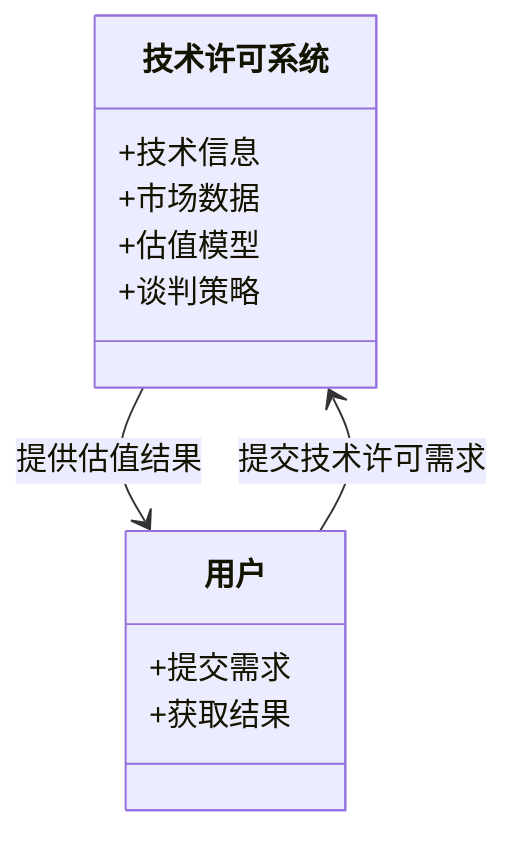
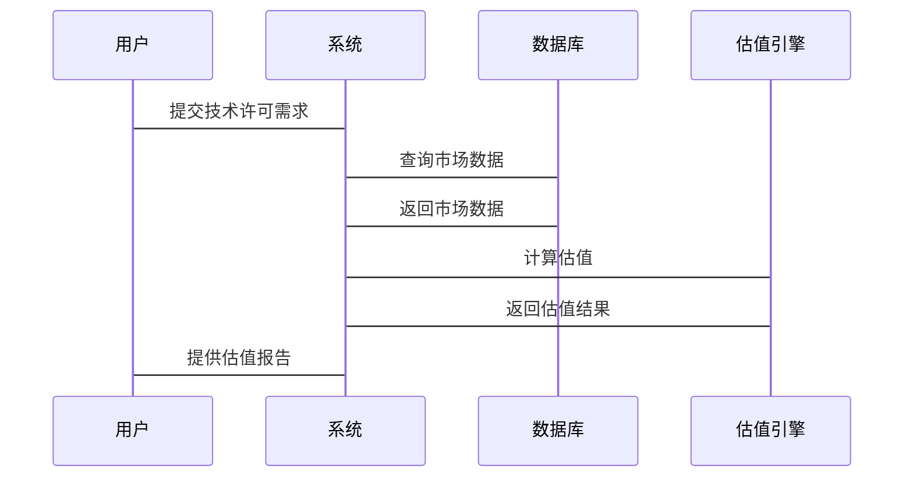

                 


# 股市估值在跨境技术许可谈判中的应用

## 关键词：股市估值，技术许可，跨境谈判，DCF模型，WACC，知识产权

## 摘要：  
在跨境技术许可谈判中，股市估值是一项关键工具，用于评估技术的价值并确定合理的许可费用。本文探讨了股市估值的核心概念、技术许可谈判中的法律与商业考量，以及如何将股市估值应用于实际谈判。通过详细分析DCF模型、WACC等算法，结合系统架构设计和项目实战，本文为读者提供了全面的理解和实践指南。  

---

## 第1章：股市估值与技术许可谈判的背景

### 1.1 股市估值的基本概念  
股市估值是通过分析公司财务数据和市场表现，确定其股票价值的过程。技术许可是指将技术使用权授权给另一方，涉及知识产权的转移和商业利益的分配。  

#### 1.1.1 股市估值的定义与作用  
股市估值通过分析公司盈利能力、成长潜力和市场地位，确定其股票的内在价值。在技术许可谈判中，股市估值帮助确定技术的市场价值，为谈判提供数据支持。  

#### 1.1.2 技术许可在商业中的重要性  
技术许可是企业获取技术资源、拓展市场的重要手段。通过技术许可，企业可以快速获得技术优势，降低研发成本。  

#### 1.1.3 股市估值与技术许可的结合点  
股市估值的核心是评估资产价值，技术许可的核心是确定技术使用权的价值。两者的结合点在于通过股市估值方法，确定技术的市场价值，为技术许可谈判提供科学依据。  

### 1.2 技术许可谈判的核心问题  
#### 1.2.1 技术许可的定义与特点  
技术许可是技术使用权的授权，具有排他性、地域性和时间性等特点。  

#### 1.2.2 股市估值在技术许可中的应用背景  
在跨境技术许可谈判中，技术的市场价值需要通过股市估值方法进行评估，以确定合理的许可费用。  

#### 1.2.3 技术许可谈判的关键要素  
技术许可谈判涉及技术价值、许可范围、支付方式和法律条款等关键要素。  

### 1.3 股市估值与技术许可的关联性  
#### 1.3.1 股市估值对技术价值的影响  
股市估值通过分析技术的市场表现和行业地位，评估其价值。  

#### 1.3.2 技术许可谈判中的估值挑战  
技术许可谈判中的估值挑战包括技术的不确定性、市场波动性和法律风险。  

#### 1.3.3 股市估值在跨境谈判中的特殊性  
跨境谈判涉及不同国家的法律、税收政策和市场环境，增加了估值的复杂性。  

---

## 第2章：股市估值的核心概念与模型  

### 2.1 股市估值的基本原理  

#### 2.1.1 股票价值的决定因素  
股票价值由公司的盈利能力、成长潜力、行业地位和市场环境决定。  

#### 2.1.2 主要估值方法概述  
常用估值方法包括市盈率法（P/E）、市净率法（P/B）和现金流折现法（DCF）。  

#### 2.1.3 股市估值的核心模型（如DCF模型）  
DCF模型通过将未来现金流折现，计算公司的内在价值。  

### 2.2 技术许可的估值方法  

#### 2.2.1 技术价值的评估维度  
技术价值评估包括技术的创新性、市场应用前景和竞争优势。  

#### 2.2.2 技术许可的定价策略  
技术许可的定价策略包括基于收入分成、固定费用和期权定价。  

#### 2.2.3 技术生命周期对估值的影响  
技术生命周期的不同阶段（导入期、成长期、成熟期、衰退期）会影响其估值。  

### 2.3 股市估值与技术许可的结合模型  

#### 2.3.1 股市估值模型在技术许可中的应用  
将DCF模型应用于技术许可谈判，评估技术的未来现金流。  

#### 2.3.2 技术许可谈判中的动态估值调整  
根据市场变化和技术发展，动态调整技术的估值。  

#### 2.3.3 股市估值对技术谈判结果的反馈机制  
股市估值结果为技术许可谈判提供数据支持，帮助确定合理的许可费用。  

---

## 第3章：技术许可谈判中的法律与商业考量  

### 3.1 技术许可的法律框架  

#### 3.1.1 技术许可合同的基本要素  
技术许可合同应包括许可范围、许可期限、支付方式和知识产权条款。  

#### 3.1.2 知识产权在技术许可中的作用  
知识产权是技术许可的核心，涉及专利权、商标权和版权。  

#### 3.1.3 跨境谈判中的法律差异  
不同国家的法律差异影响技术许可谈判，需考虑税收政策和知识产权保护。  

### 3.2 技术许可的商业策略  

#### 3.2.1 技术许可的商业模式分析  
技术许可的商业模式包括直接许可、分成模式和混合模式。  

#### 3.2.2 技术许可谈判中的商业谈判技巧  
谈判技巧包括价格谈判、条款谈判和风险管理。  

#### 3.2.3 技术许可对企业发展的影响  
技术许可是企业获取技术资源、拓展市场的重要手段。  

### 3.3 股市估值与技术许可的法律结合  

#### 3.3.1 股市估值对技术许可合同的影响  
股市估值结果为技术许可合同的定价提供依据。  

#### 3.3.2 技术许可谈判中的法律风险评估  
法律风险包括知识产权纠纷和技术侵权风险。  

#### 3.3.3 股市估值在法律纠纷中的应用  
股市估值结果可作为法律纠纷中的参考依据。  

---

## 第4章：股市估值在技术许可谈判中的算法原理  

### 4.1 股市估值的核心算法  

#### 4.1.1 现金流折现模型（DCF模型）  
DCF模型通过折现未来现金流，计算公司的内在价值。  

#### 4.1.2 加权平均资本成本（WACC）  
WACC是公司资本成本的加权平均，用于折现率的计算。  

#### 4.1.3 股市估值的关键公式  
- 企业价值（EV）= 现金流现值  
- WACC = (权益资本成本 × 权益权重) + (债务资本成本 × 债务权重 × (1 - 税率))  

### 4.2 技术许可谈判中的算法应用  

#### 4.2.1 DCF模型在技术许可中的应用  
通过DCF模型评估技术的未来现金流，计算其内在价值。  

#### 4.2.2 WACC在技术许可中的应用  
WACC用于确定技术的折现率，帮助评估技术的市场价值。  

#### 4.2.3 技术许可谈判中的算法挑战  
技术许可谈判中的算法挑战包括数据不足和市场不确定性。  

### 4.3 算法实现与案例分析  

#### 4.3.1 DCF模型的Python实现  
```python
import numpy as np

# 假设未来现金流
CF = [100, 150, 200, 250, 300]
discount_rate = 0.1

# 计算现值
PV = np.npv(discount_rate, CF)
print("企业价值：", PV)
```

#### 4.3.2 WACC的计算与应用  
假设某技术的WACC为8%，未来现金流为$100万，折现后的现值为$92万。  

#### 4.3.3 技术许可谈判中的案例分析  
通过案例分析，展示如何利用DCF模型和WACC进行技术许可谈判。  

---

## 第5章：技术许可谈判的系统分析与架构设计  

### 5.1 系统功能设计  

#### 5.1.1 领域模型（Mermaid类图）  


#### 5.1.2 系统架构设计（Mermaid架构图）  


### 5.2 系统接口设计  

#### 5.2.1 技术许可系统的接口  
技术许可系统提供API接口，供用户提交技术信息和市场数据。  

#### 5.2.2 估值引擎的接口  
估值引擎接受输入数据，返回估值结果。  

### 5.3 系统交互设计  

#### 5.3.1 用户与系统的交互流程（Mermaid序列图）  


---

## 第6章：技术许可谈判的项目实战  

### 6.1 项目环境与工具安装  

#### 6.1.1 环境要求  
需要安装Python、Pandas、NumPy等工具。  

#### 6.1.2 工具安装  
通过pip安装相关库：  
```bash
pip install pandas numpy
```

### 6.2 系统核心实现  

#### 6.2.1 技术许可估值的Python实现  
```python
import pandas as pd
import numpy as np

# 数据输入
CF = [100, 150, 200, 250, 300]
discount_rate = 0.1

# 计算现值
PV = np.npv(discount_rate, CF)
EV = PV

print("企业价值：", EV)
```

#### 6.2.2 算法实现与解读  
解释代码实现的DCF模型，展示如何计算企业价值。  

### 6.3 项目实战分析  

#### 6.3.1 技术许可谈判的案例分析  
以某技术为例，展示如何利用DCF模型进行估值。  

#### 6.3.2 技术许可谈判的实施步骤  
1. 收集市场数据  
2. 确定估值模型  
3. 计算技术价值  
4. 制定谈判策略  

### 6.4 项目小结  

#### 6.4.1 最佳实践 tips  
- 数据准确性是估值的关键  
- 结合市场环境进行动态调整  
- 注重法律和商业风险  

#### 6.4.2 小结  
通过项目实战，读者可以掌握股市估值在技术许可谈判中的实际应用。  

---

## 第7章：总结与展望  

### 7.1 核心观点总结  
股市估值是技术许可谈判的重要工具，通过DCF模型和WACC等算法，可以帮助确定技术的市场价值。  

### 7.2 未来研究方向  
- 研究更复杂的估值模型  
- 探讨人工智能在估值中的应用  
- 分析更多跨境技术许可案例  

### 7.3 展望  
随着技术的不断进步，股市估值在技术许可谈判中的应用将更加广泛和深入。  

---

## 结语  

股市估值在跨境技术许可谈判中的应用是一个复杂而重要的领域，通过本文的详细分析和项目实战，读者可以掌握相关的理论和实践技能。希望本文能为读者提供有价值的参考和指导。

