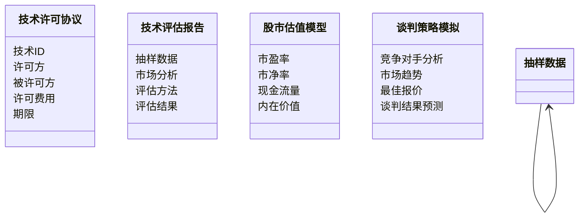
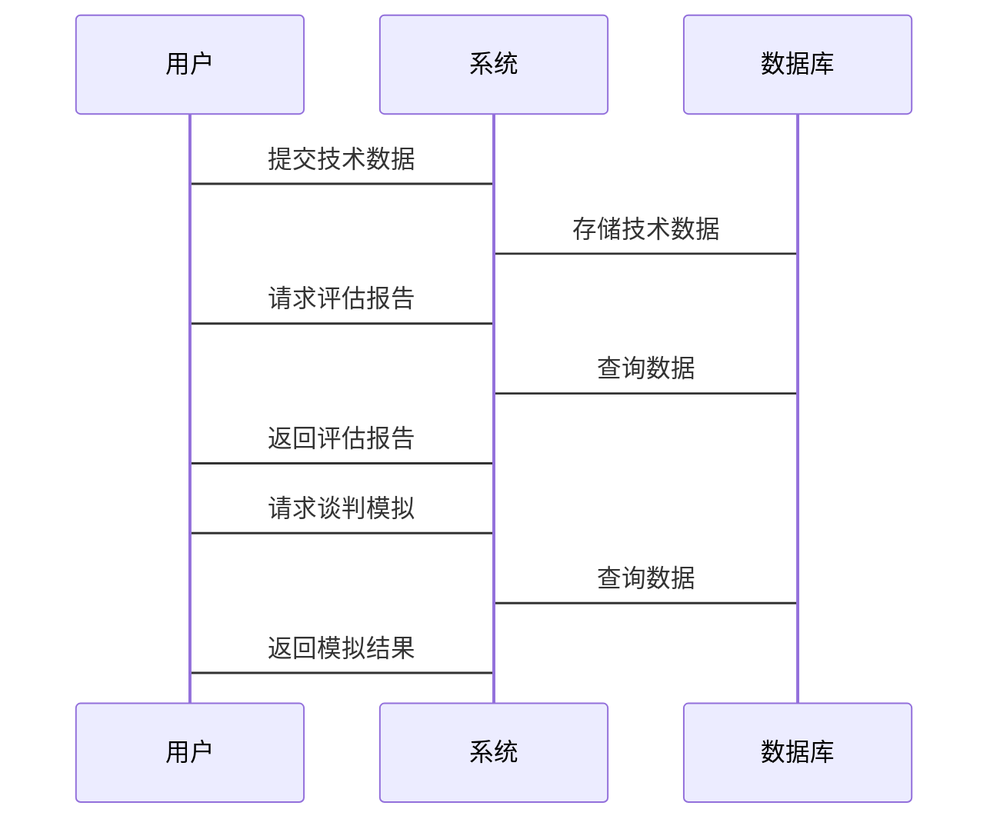

                 

# 股市估值在跨境技术许可谈判策略中的应用

## 关键词：股市估值，技术许可，谈判策略，跨境交易，数学模型

## 摘要：本文详细探讨了股市估值在跨境技术许可谈判中的应用，通过建立数学模型和系统架构，结合实际案例，展示了如何利用股市估值方法优化技术许可谈判策略，为企业的跨国技术交易提供科学依据和实践指导。

---

## 第1章: 股市估值的基本概念与方法

### 1.1 股市估值的定义与作用
#### 1.1.1 什么是股市估值
股市估值是指通过分析公司财务数据和市场因素，评估其股票的内在价值或市场价值。  
公式：$$股票价值 = \frac{未来现金流}{折现率}$$

#### 1.1.2 股市估值的基本作用
- 帮助投资者做出投资决策
- 为公司提供合理的市值参考
- 用于企业并购和资产重组

#### 1.1.3 股市估值的核心要素
- 财务数据：收入、利润、现金流
- 市场因素：行业趋势、宏观经济状况
- 风险因素：利率变动、政策风险

---

## 第2章: 技术许可谈判的背景与特点

### 2.1 技术许可谈判的背景
- 技术交易的全球化趋势
- 跨境技术交易的复杂性
- 技术价值评估的必要性

### 2.2 技术许可谈判的特点
- 跨境性：涉及不同国家的法律、税务和文化差异
- 复杂性：技术价值、市场环境、谈判策略的综合考量
- 协商性：双方利益的平衡与博弈

---

## 第3章: 股市估值与技术许可谈判的核心联系

### 3.1 股市估值的核心原理
- 技术价值的多维度评估
- 市场价值与内在价值的动态平衡
- 股市估值的可迁移性

### 3.2 技术许可谈判的核心要素
- 技术的可量化价值
- 谈判中的博弈论应用
- 跨境因素对谈判的影响

### 3.3 股市估值与技术许可谈判的联系
- 股市估值模型的可借鉴性
- 技术价值的动态评估
- 股市估值在谈判中的实际应用案例

---

## 第4章: 股市估值与技术许可谈判的数学模型

### 4.1 股市估值的数学模型
#### 4.1.1 DCF模型
公式：$$DCF = \sum_{t=1}^{n} \frac{CF_t}{(1+r)^t} + \frac{FV}{(1+r)^n}$$

#### 4.1.2 P/E模型
公式：$$P/E = \frac{股票价格}{每股收益}$$

#### 4.1.3 P/B模型
公式：$$P/B = \frac{股票价格}{每股净资产}$$

### 4.2 技术许可谈判的数学模型
#### 4.2.1 技术价值评估模型
公式：$$技术价值 = \alpha \times 技术性能 + \beta \times 市场需求$$

#### 4.2.2 谈判博弈论模型
公式：$$最佳报价 = \max \{ V_i - c, 0 \}$$

#### 4.2.3 跨境风险评估模型
公式：$$风险系数 = \gamma \times 法律风险 + \delta \times 税务风险$$

---

## 第5章: 系统分析与架构设计方案

### 5.1 问题场景介绍
#### 5.1.1 跨境技术许可谈判的复杂性
- 涉及多个国家的法律和税务政策
- 文化差异影响谈判策略

#### 5.1.2 股市估值在谈判中的应用需求
- 提供技术价值的客观评估标准
- 帮助确定公平的许可费用

#### 5.1.3 系统设计的目标与范围
- 建立一个结合股市估值模型的谈判辅助系统
- 覆盖技术价值评估、谈判策略模拟等功能

### 5.2 系统功能设计
#### 5.2.1 领域模型设计

#### 5.2.2 系统架构设计

---

## 第6章: 算法原理与实现

### 6.1 股市估值算法
#### 6.1.1 DCF模型
公式：$$DCF = \sum_{t=1}^{n} \frac{CF_t}{(1+r)^t} + \frac{FV}{(1+r)^n}$$

#### 6.1.2 P/E模型
公式：$$P/E = \frac{股票价格}{每股收益}$$

### 6.2 技术许可谈判算法
#### 6.2.1 技术价值评估算法
公式：$$技术价值 = \alpha \times 技术性能 + \beta \times 市场需求$$

#### 6.2.2 谈判策略模拟算法
公式：$$最佳报价 = \max \{ V_i - c, 0 \}$$

---

## 第7章: 项目实战与案例分析

### 7.1 项目环境安装
- 安装Python、Pandas、NumPy等工具。

### 7.2 核心代码实现
- 编写技术价值评估和谈判策略模拟的Python代码。

### 7.3 案例分析
- 以具体的技术许可谈判案例为例，展示系统的实际应用。

---

## 第8章: 最佳实践与小结

### 8.1 关键点总结
- 股市估值在技术许可谈判中的重要性
- 数学模型的应用价值
- 系统设计的实用性和可扩展性

### 8.2 小结
- 总结全文内容，强调系统的实用性和价值

### 8.3 注意事项
- 提醒用户在实际应用中需要注意的问题

### 8.4 拓展阅读
- 推荐进一步学习的相关资料

---

通过以上结构，文章详细探讨了股市估值在跨境技术许可谈判中的应用，结合数学模型和系统架构，为读者提供了理论支持和实践指导。

