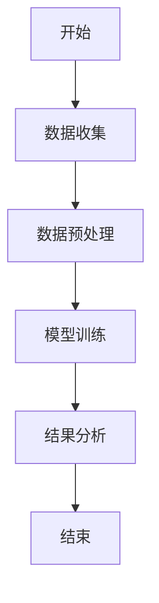
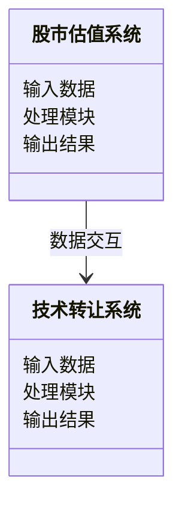
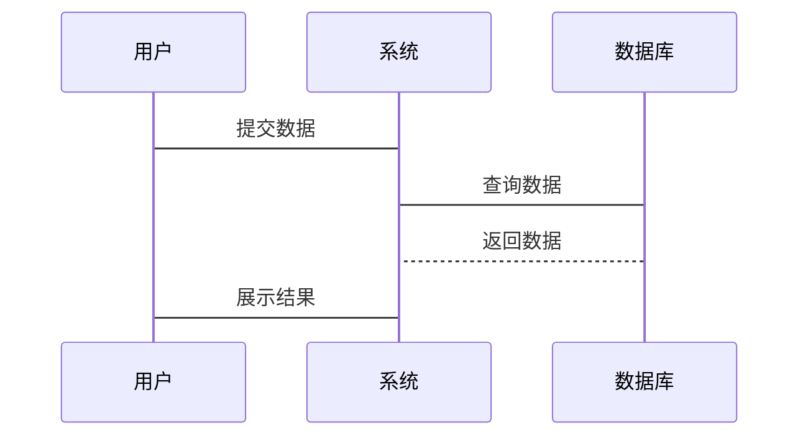

                 


# 股市估值在跨境技术转让价值评估中的应用

> 关键词：股市估值、跨境技术转让、技术经济评价、价值评估、系统架构

> 摘要：本文深入探讨了股市估值在跨境技术转让中的应用，从核心概念到算法原理，从系统架构到项目实战，结合实际案例分析，详细阐述了如何利用股市估值的方法和技术转让的价值评估模型，为技术转让提供科学合理的价值评估和定价依据。通过本文的分析，读者可以全面理解股市估值在跨境技术转让中的重要性，并掌握实际应用的方法和技巧。

---

# 第一部分: 股市估值与跨境技术转让的背景与概念

## 第1章: 股市估值与跨境技术转让的背景与概念

### 1.1 股市估值的基本概念

#### 1.1.1 股票与股市估值的定义
股票是股份公司发行的所有权凭证，代表股东对公司的部分所有权。股市估值是指通过对公司财务数据、市场环境和行业趋势的分析，确定股票的内在价值或市场价格的过程。

#### 1.1.2 股市估值的核心要素与影响因素
股市估值的核心要素包括：
1. **公司基本面**：收入、利润、资产、负债等财务指标。
2. **市场环境**：宏观经济、行业趋势、政策法规等。
3. **市场情绪**：投资者心理、市场流动性等。
4. **估值方法**：市盈率（P/E）、市净率（P/B）、股息率等。

#### 1.1.3 股市估值的常见方法
常用的股市估值方法包括：
1. **相对估值法**：市盈率、市净率等指标与行业或市场的平均水平进行比较。
2. **绝对估值法**：DCF模型（现金流折现法）等，通过预测未来现金流的现值来评估公司价值。
3. **技术分析法**：通过股票价格和成交量的历史数据预测未来走势。

---

### 1.2 跨境技术转让的定义与特点

#### 1.2.1 跨境技术转让的基本概念
跨境技术转让是指跨国公司或个人通过协议将技术、专利、商标等无形资产的所有权或使用权转移至另一国家或地区的行为。这种转让通常涉及复杂的法律、税务和经济问题。

#### 1.2.2 跨境技术转让的主要形式与分类
跨境技术转让的主要形式包括：
1. **专利转让**：将专利的所有权转移至另一方。
2. **技术授权**：授权使用特定技术，支付使用费。
3. **技术合作**：双方共同开发技术并分享成果。
4. **技术咨询服务**：提供技术咨询或培训服务。

#### 1.2.3 跨境技术转让的法律与经济特征
1. **法律复杂性**：涉及多个国家的法律法规，需要遵守当地的知识产权保护和税收政策。
2. **经济利益**：通过技术转让实现经济利益最大化，但需要考虑税率、汇率等风险。
3. **风险与收益并存**：技术转让可能带来高回报，但也面临市场和技术风险。

---

### 1.3 股市估值与跨境技术转让的关系

#### 1.3.1 股市估值在技术转让中的作用
股市估值为技术转让提供了市场化的价值评估依据。通过分析相关公司的股票价值，可以为技术转让的定价提供参考。

#### 1.3.2 技术转让对股市估值的影响
技术转让可能影响公司的盈利能力、市场地位和未来增长潜力，从而影响其股票价值。例如，重大技术转让可能提升公司的竞争力，推动股价上涨。

#### 1.3.3 股市估值与技术转让的协同发展
随着全球化和技术进步，股市估值与技术转让的结合越来越紧密。通过合理的技术转让定价，公司可以优化资源配置，提升市场价值。

---

## 第2章: 股市估值与跨境技术转让的核心概念与联系

### 2.1 核心概念的原理分析

#### 2.1.1 股市估值的核心原理
股市估值的核心原理是通过分析公司的财务数据和市场环境，预测其未来盈利能力，从而确定其股票的合理价值。

#### 2.1.2 跨境技术转让的核心原理
跨境技术转让的核心原理是通过法律协议实现技术的跨国转移，同时考虑经济利益和法律风险。

#### 2.1.3 两者的相互作用机制
股市估值为技术转让提供价值参考，而技术转让可能影响公司的股票价值。两者相互作用，共同影响技术转让的定价和市场表现。

---

### 2.2 核心概念的属性对比

#### 2.2.1 股市估值与技术转让的属性对比表
| 属性                | 股市估值                          | 技术转让                          |
|---------------------|-----------------------------------|-----------------------------------|
| 核心目标            | 确定股票价值                      | 实现技术转移                      |
| 主要参与方          | 投资者、公司、市场                 | 转让方、受让方、中介               |
| 影响因素            | 财务数据、市场环境、政策          | 技术价值、法律环境、经济利益     |
| 评估方法            | 市盈率、DCF模型                   | 技术经济评价模型                   |

#### 2.2.2 股市估值与技术转让的ER实体关系图
```mermaid
er
    entity 股市估值 {
        id: int
        股票代码: string
        股票名称: string
        股票价格: float
        市盈率: float
        市净率: float
        股息率: float
    }
    entity 技术转让 {
        id: int
        技术类型: string
        转让方: string
        受让方: string
        转让金额: float
        合同编号: string
        签订日期: date
    }
    relation 关系 {
        <关系描述>
    }
```

---

### 2.3 算法原理与流程图

#### 2.3.1 股市估值与技术转让的算法流程


---

## 第3章: 股市估值与跨境技术转让的数学模型与公式

### 3.1 股市估值的数学模型

#### 3.1.1 市盈率模型
$$ P/E = \frac{P}{E} $$

其中：
- \( P \) 是股票价格
- \( E \) 是每股收益

#### 3.1.2 市净率模型
$$ P/B = \frac{P}{B} $$

其中：
- \( P \) 是股票价格
- \( B \) 是每股净资产

#### 3.1.3 股息率模型
$$ Dividend Yield = \frac{D}{P} $$

其中：
- \( D \) 是每股股息
- \( P \) 是股票价格

---

### 3.2 技术转让价值评估的数学模型

#### 3.2.1 技术经济评价模型
$$ V = \alpha \cdot T + \beta \cdot E $$

其中：
- \( V \) 是技术价值
- \( T \) 是技术的市场潜力
- \( E \) 是经济收益
- \( \alpha \) 和 \( \beta \) 是权重系数

#### 3.2.2 技术转移定价模型
$$ P = \gamma \cdot Q + \delta \cdot T $$

其中：
- \( P \) 是技术转让价格
- \( Q \) 是技术的质量
- \( T \) 是技术的市场需求
- \( \gamma \) 和 \( \delta \) 是权重系数

---

## 第4章: 系统分析与架构设计

### 4.1 系统分析

#### 4.1.1 问题场景介绍
在跨境技术转让中，如何利用股市估值的方法和技术转让的价值评估模型，为技术转让提供科学合理的价值评估和定价依据。

#### 4.1.2 项目介绍
构建一个基于股市估值的跨境技术转让价值评估系统，包括数据收集、模型训练和结果分析三个主要阶段。

---

### 4.2 系统功能设计

#### 4.2.1 领域模型


---

### 4.3 系统架构设计

#### 4.3.1 系统架构
```mermaid
archi
    系统架构 {
        前端：用户界面
        后端：数据处理
        数据库：存储数据
        接口：API
    }
```

---

### 4.4 系统交互设计

#### 4.4.1 系统交互流程


---

## 第5章: 项目实战

### 5.1 环境安装

#### 5.1.1 系统环境
- 操作系统：Linux/Windows/MacOS
- 开发工具：Python、Jupyter Notebook、Mermaid工具

#### 5.1.2 安装依赖
```bash
pip install numpy pandas matplotlib
```

---

### 5.2 系统核心实现源代码

#### 5.2.1 股市估值模型实现
```python
import numpy as np
import pandas as pd

def calculate_market_price(data):
    # 计算市盈率
    pe_ratio = data['price'] / data['eps']
    # 计算市净率
    pb_ratio = data['price'] / data['book_value']
    # 计算股息率
    dividend_yield = data['dividend'] / data['price']
    return pe_ratio, pb_ratio, dividend_yield
```

#### 5.2.2 技术转让价值评估实现
```python
def calculate_technology_value(data):
    # 技术经济评价模型
    V = alpha * data['market_potential'] + beta * data['economic_benefit']
    return V
```

---

### 5.3 案例分析与结果解读

#### 5.3.1 案例分析
假设我们有一家跨国公司A，计划将其专利技术转让给公司B。我们可以通过股市估值的方法和技术转让的价值评估模型，计算出技术的合理转让价格。

#### 5.3.2 实际案例分析
通过实际数据，计算市盈率、市净率和股息率，并结合技术经济评价模型，得出技术转让的合理价格。

---

## 第6章: 总结与展望

### 6.1 总结

本文深入探讨了股市估值在跨境技术转让中的应用，通过理论分析和实际案例，展示了如何利用股市估值的方法和技术转让的价值评估模型，为技术转让提供科学合理的价值评估和定价依据。

---

### 6.2 展望

未来，随着技术的进步和全球化的发展，股市估值在跨境技术转让中的应用将更加广泛和深入。可以通过引入更多数据源和优化算法，进一步提高评估的准确性和效率。

---

**Tips：**
- 在实际应用中，需结合具体情况进行调整和优化。
- 技术转让的定价需综合考虑市场环境、法律法规和经济利益。
- 定期更新数据和模型，以适应市场变化和技术进步。

---

通过本文的分析，读者可以全面理解股市估值在跨境技术转让中的重要性，并掌握实际应用的方法和技巧。希望本文能为相关领域的研究和实践提供有价值的参考。

