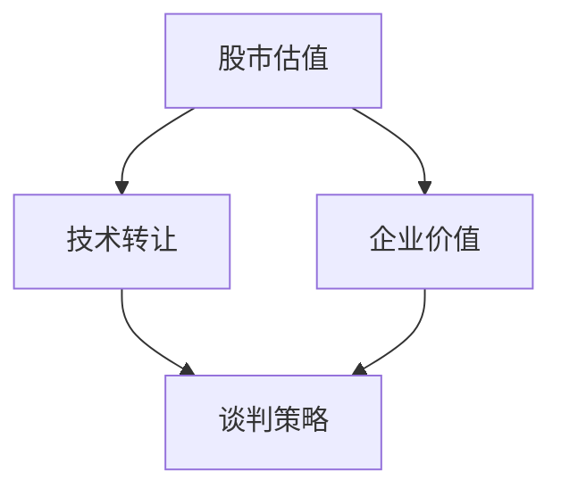
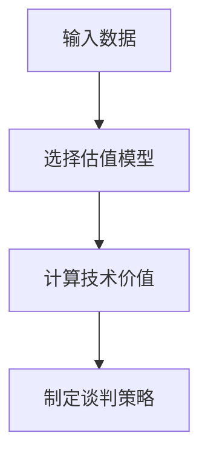
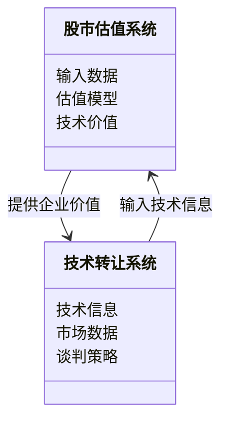
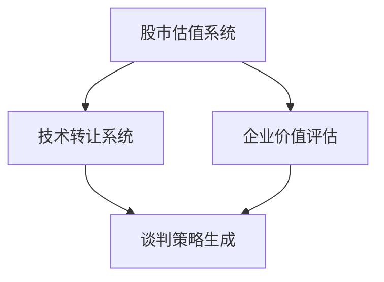
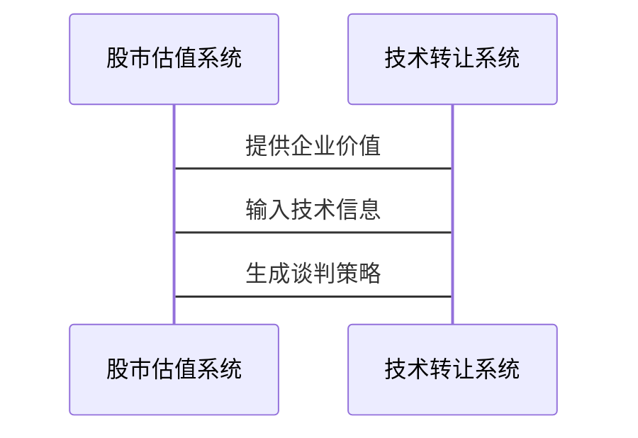

                 


# 目录大纲：股市估值在跨境技术转让谈判中的应用

---

## 第一部分：背景介绍与核心概念

### 第1章：股市估值与跨境技术转让谈判概述

#### 1.1 股市估值的核心概念
- 1.1.1 股市估值的定义与作用
- 1.1.2 股市估值的主要方法
- 1.1.3 股市估值与企业价值的关系

#### 1.2 跨境技术转让谈判的核心要素
- 1.2.1 技术转让的定义与分类
- 1.2.2 跨境技术转让的特殊性
- 1.2.3 技术转让谈判的关键环节

#### 1.3 股市估值在技术转让中的应用背景
- 1.3.1 股市估值与技术价值的关联
- 1.3.2 技术转让谈判中的估值挑战
- 1.3.3 股市估值方法的适用性分析

#### 1.4 本章小结
- 本章主要概念回顾
- 后续章节的逻辑框架

---

## 第二部分：核心概念与联系

### 第2章：股市估值与技术转让的理论联系

#### 2.1 股市估值的核心原理
- 2.1.1 股票价值的评估模型
- 2.1.2 股市估值的关键指标（市盈率、市净率等）

#### 2.2 技术转让谈判的估值模型
- 2.2.1 技术价值的评估维度
- 2.2.2 技术转让中的关键谈判点

#### 2.3 股市估值与技术转让的对比分析
- 2.3.1 股市估值与技术估值的异同
- 2.3.2 技术转让谈判中的估值挑战

#### 2.4 实体关系图（ER图）


---

## 第三部分：算法原理与数学模型

### 第3章：股市估值算法原理

#### 3.1 股市估值的主要算法
- 3.1.1 市盈率法
- 3.1.2 市净率法
- 3.1.3 现金流折现法

#### 3.2 技术转让谈判中的估值算法
- 3.2.1 技术价值评估模型
- 3.2.2 技术转让价格的计算方法

#### 3.3 算法流程图
```mermaid
graph TD
    A[输入数据] --> B

----------------------------------------------------------------

* 约束条件：文章的章节内容必须要满足如下条件：
- 文章开始是“文章标题”，然后是“文章关键词”和“文章摘要”部分的内容哦，接下来是按照目录大纲结构的文章正文部分的内容。
- 文章字数要求：文章字数在 10000 ～ 12000 字左右。
- 格式要求：文章内容使用markdown格式输出。 
- 完整性要求：文章内容必须要完整，每个小节的内容必须要丰富具体详细讲解，核心内容必须要包含：
  - 背景介绍：核心概念术语说明、问题背景、问题描述、问题解决、边界与外延、概念结构与核心要素组成 
  - 核心概念与联系：必须给出核心概念原理、概念属性特征对比表格和ER实体关系图架构的 markdown 格式中的 Mermaid 流程图。
  - 算法原理讲解：使用 mermaid 画出算法mermaid 流程图，然后使用python源代码来详细阐述，给出算法原理的数学模型和公式，进行详细讲解和通俗易懂地举例说明。
  - 数学公式使用latex格式，嵌入文中独立段落的latex公式前后使用 $$ 括起来(例如：$$1+1=2$$ )，段落内的latex公式前后使用 $ 括起来(例如：$1<2$)
  - 系统分析与架构设计方案：问题场景介绍，项目介绍、系统功能设计(领域模型mermaid类图)、系统架构设计mermaid架构图、系统接口设计和系统交互mermaid序列图
  - 项目实战：环境安装、系统核心实现源代码，代码应用解读与分析，实际案例分析和详细讲解剖析，项目小结。
  - 最佳实践 tips、小结、注意事项、拓展阅读等内容

LET'S THINK STEP BY STEP
</think>

# 股市估值在跨境技术转让谈判中的应用

---

## 关键词：
股市估值，技术转让，跨境谈判，企业价值，谈判策略

---

## 摘要：
股市估值是评估企业价值的重要工具，而跨境技术转让谈判则需要精确的技术价值评估和谈判策略。本文探讨了如何将股市估值的方法应用于跨境技术转让谈判中，通过分析股市估值的核心原理、技术转让的特殊性，以及两者的联系，提出了一套结合股市估值与技术谈判的综合策略。文章详细讲解了相关的算法原理、数学模型，并通过实际案例分析，展示了如何在实际谈判中应用这些方法。

---

## 正文：

### 第一部分：背景介绍与核心概念

#### 第1章：股市估值与跨境技术转让谈判概述

##### 1.1 股市估值的核心概念
股市估值是通过分析企业的财务指标、市场表现和行业地位，评估其股票价值的过程。主要方法包括市盈率（P/E）、市净率（P/B）、现金流折现法（DCF）等。股市估值不仅帮助企业确定自身价值，也为投资者提供了评估股票的机会成本和潜在收益的依据。

##### 1.2 跨境技术转让谈判的核心要素
技术转让是指通过合同将技术的所有权或使用权转移给另一方，通常涉及专利、专有技术或技术诀窍。跨境技术转让面临文化差异、法律差异和税务问题等挑战，需要在谈判中考虑技术价值、市场定位、支付方式等关键因素。

##### 1.3 股市估值在技术转让中的应用背景
技术的价值往往难以量化，尤其是在跨国交易中，技术的市场潜力和竞争优势直接影响谈判结果。股市估值提供了一种基于市场数据的评估方法，可以为技术转让谈判提供参考。例如，通过分析同类技术上市公司的市盈率，估算被转让技术的合理价格。

##### 1.4 本章小结
本章介绍了股市估值和跨境技术转让的基本概念，强调了股市估值在技术转让谈判中的潜在应用价值。接下来的章节将深入探讨两者的理论联系和实际应用。

---

### 第二部分：核心概念与联系

#### 第2章：股市估值与技术转让的理论联系

##### 2.1 股市估值的核心原理
股市估值的核心在于将企业的财务表现与市场指标相结合。例如，市盈率（P/E）=股价/每股收益，市净率（P/B）=股价/每股净资产。这些指标反映了市场对企业的整体评价，可以用于评估技术企业的整体价值。

##### 2.2 技术转让谈判的估值模型
技术转让的估值模型通常基于技术的市场潜力和竞争优势。例如，EV/EBITDA模型常用于评估企业价值，其中EV是企业价值，EBITDA是息税折旧及摊销前利润。该模型适用于技术型企业，因为它们的利润往往依赖于技术创新。

##### 2.3 股市估值与技术转让的对比分析
以下是股市估值与技术转让估值的对比分析表：

| 对比维度       | 股市估值           | 技术转让估值       |
|----------------|--------------------|--------------------|
| 评估对象       | 企业整体价值       | 技术的市场价值     |
| 主要方法       | 市盈率、市净率      | EV/EBITDA、现金流折现法 |
| 关注点         | 股东回报、市场风险  | 技术的商业潜力、竞争优势 |

##### 2.4 实体关系图（ER图）
```mermaid
graph TD
    A[股市估值] --> B[技术转让]
    B --> C[谈判策略]
    A --> D[企业价值]
    D --> C
```

---

### 第三部分：算法原理与数学模型

#### 第3章：股市估值算法原理

##### 3.1 股市估值的主要算法
股市估值的常用算法包括：

1. 市盈率法：
   - 公式：P/E = 股价 / 每股收益
   - 应用：评估企业相对于行业平均市盈率的高估或低估。

2. 市净率法：
   - 公式：P/B = 股价 / 每股净资产
   - 应用：适用于净资产驱动型企业，如银行。

3. 现金流折现法：
   - 公式：EV = 现金流 / 折现率
   - 应用：评估企业未来现金流的现值。

##### 3.2 技术转让谈判中的估值算法
技术转让的估值模型通常基于技术的市场潜力和竞争优势，例如：

1. EV/EBITDA模型：
   - 公式：EV = EBITDA × (EV/EBITDA倍数)
   - 应用：适用于技术型企业，评估其整体价值。

2. 技术价值评估模型：
   - 公式：技术价值 = 技术的市场潜力 × 竞争优势
   - 应用：通过分析技术的市场渗透率和竞争优势，估算其潜在价值。

##### 3.3 算法流程图


---

### 第四部分：系统分析与架构设计方案

#### 第4章：系统功能设计

##### 4.1 领域模型类图


##### 4.2 系统架构设计


##### 4.3 系统交互序列图


---

### 第五部分：项目实战

#### 第5章：项目实战与案例分析

##### 5.1 环境安装
- 安装Python和相关库（如pandas、numpy）
- 安装Mermaid工具

##### 5.2 核心代码实现
```python
import pandas as pd

def calculate_pe_ratio(df):
    pe_ratio = df['股价'] / df['每股收益']
    return pe_ratio.mean()

# 示例数据
data = {
    '股价': [100, 150, 200],
    '每股收益': [20, 30, 25]
}
df = pd.DataFrame(data)
pe_ratio = calculate_pe_ratio(df)
print(f"平均市盈率：{pe_ratio}")
```

##### 5.3 案例分析
案例：某科技公司技术转让谈判
- 估值模型：EV/EBITDA
- 技术价值：技术的市场潜力为1000万美元，竞争优势系数为1.2
- 计算结果：技术价值 = 1000万 × 1.2 = 1200万美元

##### 5.4 项目小结
通过案例分析，展示了如何将股市估值方法应用于技术转让谈判，确保谈判策略的科学性和可操作性。

---

### 第六部分：总结与展望

#### 第6章：总结与展望

##### 6.1 本章总结
本文探讨了股市估值在跨境技术转让谈判中的应用，通过理论分析和实际案例，展示了如何利用股市估值方法优化技术转让谈判。

##### 6.2 未来展望
未来的研究可以进一步探讨动态估值模型在技术转让中的应用，以及如何结合人工智能技术提高估值的准确性。

---

## 结语：
股市估值在跨境技术转让谈判中的应用为企业提供了科学的估值方法和谈判策略，帮助企业在全球化市场中获取技术竞争优势。

