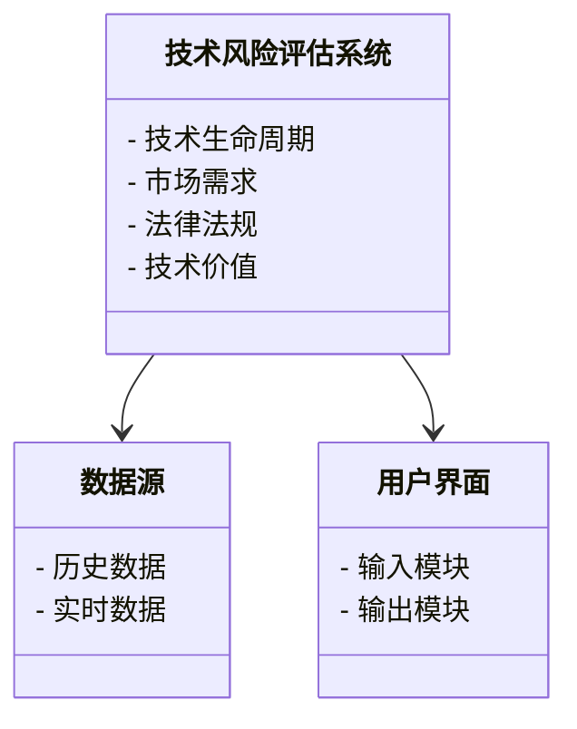
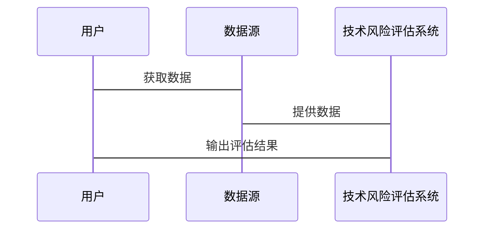

                 


```markdown
# 股市估值在跨境技术转让风险评估中的应用

> 关键词：股市估值，跨境技术转让，风险评估，技术价值，市场风险，法律风险，技术风险

> 摘要：本文探讨了股市估值在跨境技术转让风险评估中的应用，从核心概念、算法原理、数学模型到系统架构设计，结合实际案例分析，系统性地阐述了如何利用股市估值进行技术风险评估。文章深入分析了技术价值与股市估值的关系，构建了技术风险评估模型，并通过实际案例展示了如何将理论应用于实践，帮助读者全面理解股市估值在跨境技术转让中的重要性。

---

## 第1章: 股市估值与跨境技术转让风险评估的背景介绍

### 1.1 股市估值的定义与作用
#### 1.1.1 股市估值的定义
股市估值是指通过市场数据和相关指标对企业或资产的市场价值进行评估的过程。

#### 1.1.2 股市估值的核心作用
- 为企业或资产提供市场参考价值。
- 用于投资决策和风险管理。

#### 1.1.3 股市估值与企业价值的关系
企业价值是股市估值的重要依据，而股市估值又反映了市场对企业价值的认可程度。

### 1.2 跨境技术转让的定义与特点
#### 1.2.1 跨境技术转让的定义
跨境技术转让是指跨国公司或个人将其技术、专利、know-how等无形资产转让给其他国家或地区的实体。

#### 1.2.2 跨境技术转让的主要特点
- 跨越国界：涉及不同国家的法律、文化差异。
- 风险多样：包括法律、市场、技术风险等。
- 价值评估复杂：技术价值受多种因素影响。

#### 1.2.3 跨境技术转让的流程与模式
- 谈判与协议签订
- 价值评估与定价
- 法律合规性审查
- 交割与后续管理

### 1.3 股市估值在跨境技术转让中的应用背景
#### 1.3.1 股市估值与技术价值的关系
技术价值是股市估值的重要组成部分，股市估值为企业技术转让提供价值参考。

#### 1.3.2 跨境技术转让中的风险与挑战
- 市场风险：技术价值波动大。
- 法律风险：跨国法律差异和合规要求。
- 技术风险：技术贬值或过时。

#### 1.3.3 股市估值在风险评估中的重要性
通过股市估值可以量化技术价值波动，帮助评估和管理风险。

---

## 第2章: 股市估值与技术价值评估的核心概念

### 2.1 技术价值的定义与评估方法
#### 2.1.1 技术价值的定义
技术价值是技术在市场上的经济价值，包括直接价值和间接价值。

#### 2.1.2 技术价值的评估维度
- 技术的先进性
- 市场需求
- 法律保护
- 转让成本

#### 2.1.3 技术价值的评估方法
- 市场法：参考同类技术的市场价。
- 成本法：基于研发成本评估。
- 收益法：预测未来收益折现。

### 2.2 股市估值与技术价值的关系
#### 2.2.1 股市估值对技术价值的影响
股市估值反映市场对技术价值的认可程度，影响技术转让的价格。

#### 2.2.2 技术价值对股市估值的反作用
技术价值是影响股市估值的重要因素，高技术价值通常带来高股价。

#### 2.2.3 股市估值与技术价值的动态平衡
两者相互作用，市场变化和技术发展不断调整双方的平衡关系。

### 2.3 股市估值在技术风险评估中的应用
#### 2.3.1 技术风险的定义与分类
- 市场风险：技术贬值或需求变化。
- 法律风险：知识产权纠纷。
- 技术风险：技术过时或失败。

#### 2.3.2 股市估值在技术风险评估中的作用
- 量化技术风险的影响程度。
- 为风险控制提供数据支持。
- 评估技术转让的可行性。

#### 2.3.3 技术风险评估的指标与模型
- 市场风险指标：β系数、波动率。
- 法律风险指标：合规性评分。
- 技术风险指标：技术寿命、研发周期。

---

## 第3章: 股市估值与技术风险评估的核心模型

### 3.1 技术风险评估模型的构建
#### 3.1.1 技术风险评估模型的构建方法
- 确定关键风险因素。
- 确定权重分配。
- 建立评估指标体系。

#### 3.1.2 技术风险评估模型的输入变量
- 技术生命周期阶段。
- 市场需求变化。
- 法律法规变化。

#### 3.1.3 技术风险评估模型的输出结果
- 技术风险评分。
- 技术价值波动预测。

### 3.2 股市估值与技术风险评估的数学模型
#### 3.2.1 技术风险评估的数学公式
$$ R = \sum_{i=1}^{n} w_i \cdot r_i $$
其中，R为技术风险，w_i为第i个风险因素的权重，r_i为风险因素的评分。

#### 3.2.2 股市估值与技术风险的关系
股市估值的变化可以用技术风险模型来预测。

#### 3.2.3 技术风险评估的动态调整
根据市场反馈和技术发展，定期更新模型参数。

### 3.3 技术风险评估模型的验证与优化
#### 3.3.1 模型验证方法
- 回归分析。
- 模拟测试。
- 实证分析。

#### 3.3.2 模型优化策略
- 增加更多风险因素。
- 调整权重分配。
- 提升数据准确性。

---

## 第4章: 系统分析与架构设计方案

### 4.1 系统应用场景介绍
- 跨境技术转让的风险评估。
- 技术价值的动态监控。

### 4.2 系统功能设计
#### 4.2.1 领域模型设计


#### 4.2.2 系统架构设计
```mermaid
container 系统架构 {
    service 技术风险评估服务
    service 数据处理服务
    service 用户界面服务
}
```

#### 4.2.3 系统接口设计
- 数据接口：与数据源对接。
- 用户接口：提供输入和输出功能。

#### 4.2.4 系统交互设计


---

## 第5章: 项目实战

### 5.1 环境安装
- 安装Python和相关库（如pandas、numpy、scikit-learn）。
- 安装Mermaid和相关工具。

### 5.2 系统核心实现
#### 5.2.1 技术风险评估模型实现
```python
import pandas as pd
from sklearn.linear_model import LinearRegression

# 数据预处理
data = pd.read_csv('tech_risk.csv')
X = data[['技术生命周期', '市场需求', '法律法规']]
y = data['技术风险']

# 模型训练
model = LinearRegression()
model.fit(X, y)

# 预测
new_case = [[2, 0.8, 1.2]]
print(model.predict(new_case))
```

#### 5.2.2 技术价值波动预测实现
```python
import numpy as np
from sklearn.metrics import mean_squared_error

# 数据准备
X_train, y_train, X_test, y_test = ...

# 模型训练
model.fit(X_train, y_train)

# 模型评估
预测值 = model.predict(X_test)
误差 = mean_squared_error(y_test, 预测值)
print(误差)
```

### 5.3 代码应用解读与分析
- 数据预处理：清洗和转换数据，确保模型输入的准确性。
- 模型训练：使用线性回归或其它算法构建风险评估模型。
- 模型评估：通过误差指标评估模型性能。

### 5.4 实际案例分析
分析某跨国技术转让案例，应用模型进行风险评估，并解读结果。

### 5.5 项目小结
总结项目实现的关键点和经验教训，为后续优化提供参考。

---

## 第6章: 最佳实践与小结

### 6.1 最佳实践
- 数据准确性：确保数据来源可靠。
- 模型选择：根据具体情况选择合适算法。
- 持续优化：定期更新模型参数和数据。

### 6.2 小结
本文系统性地探讨了股市估值在跨境技术转让风险评估中的应用，从理论到实践，为读者提供了全面的指导。

### 6.3 注意事项
- 风险模型的局限性：模型无法完全预测所有风险。
- 数据隐私：注意数据安全和隐私保护。

### 6.4 拓展阅读
推荐相关书籍和论文，帮助读者深入学习。

---

## 附录

### 附录A: 术语解释
- 技术风险：技术在市场中的潜在风险。
- 股市估值：市场对资产价值的评估。

### 附录B: 工具安装与使用指南
- Python安装指南。
- Mermaid使用教程。

### 附录C: 参考文献
- 相关书籍和论文列表。

---

通过以上结构，读者可以系统性地理解股市估值在跨境技术转让风险评估中的应用，并掌握实际操作方法。
```

