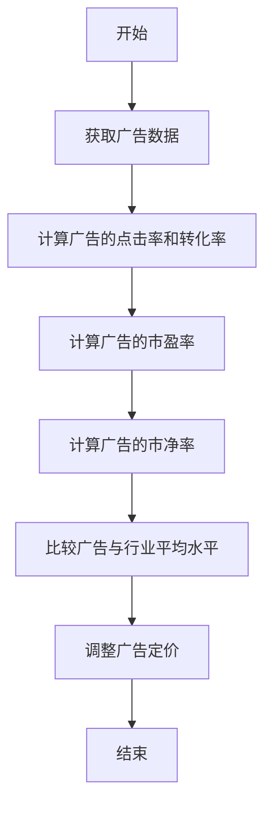

                 


# 《股市估值在跨境数字广告定价中的应用》

---

## 关键词：股市估值、数字广告定价、跨境广告、数据驱动定价、广告技术

---

## 摘要：  
本文探讨了股市估值方法在跨境数字广告定价中的应用。通过分析股市估值的核心原理和数字广告定价的挑战，提出了一种结合市盈率、市净率等估值模型的定价策略。文章从背景介绍、核心概念、算法原理到系统设计和项目实战，详细阐述了如何利用股市估值优化广告定价，并提供了实际案例和最佳实践建议。

---

## 目录大纲

---

### 第一部分：背景介绍

#### 第1章：问题背景与定义

##### 1.1 股市估值的核心概念
- 1.1.1 股票价值的基本定义
  - 股票是公司的一部分所有权，其价值取决于公司的盈利能力、资产状况和行业地位。
- 1.1.2 股市估值的主要方法
  - 市盈率（P/E）：股价/每股收益
  - 市净率（P/B）：股价/每股净资产
  - 现金流折现模型（DCF）：基于未来现金流的现值
- 1.1.3 股市估值的边界与外延
  - 边界：评估公司内在价值的理论框架
  - 外延：考虑市场情绪、宏观经济等外部因素

##### 1.2 跨境数字广告定价的挑战
- 1.2.1 数字广告定价的基本原理
  - 广告价值取决于受众质量、广告位置和投放效果
- 1.2.2 跨境广告的独特性
  - 不同市场间的文化差异、法律法规和竞争环境不同
- 1.2.3 跨境广告定价的复杂性
  - 需要考虑汇率波动、区域市场差异和用户行为差异

##### 1.3 股市估值与数字广告定价的结合
- 1.3.1 问题描述
  - 如何利用股市估值的方法优化广告定价策略
- 1.3.2 问题解决路径
  - 将广告视为一种“资产”，其价值基于广告效果和市场表现
- 1.3.3 案例分析：一个简单的广告定价问题
  - 某跨国广告公司希望通过历史数据优化广告投放策略，减少浪费

---

### 第二部分：核心概念与联系

#### 第2章：核心概念原理

##### 2.1 股市估值的原理
- 2.1.1 市盈率（P/E）模型
  - 股价 = 市盈率 × 每股收益
  - 示例：某公司每股收益为1元，市盈率为15，则股价为15元
- 2.1.2 市净率（P/B）模型
  - 股价 = 市净率 × 每股净资产
  - 示例：某公司每股净资产为2元，市净率为3，则股价为6元
- 2.1.3 现金流折现模型（DCF）
  - 通过预测未来现金流，折现计算当前价值
  - 示例：假设未来5年现金流分别为100、120、140、160、180万元，贴现率5%，计算其现值

##### 2.2 数字广告定价的原理
- 2.2.1 广告价值的评估
  - 广告价值 = 广告点击率 × 转化率 × 广告单价
- 2.2.2 广告效果的衡量
  - 点击率（CTR）= 广告点击次数/广告展示次数
  - 转化率（CR）= 点击广告的用户数/广告展示次数
- 2.2.3 广告定价的动态调整
  - 根据实时数据和市场反馈调整广告价格

##### 2.3 核心概念对比表格
| 核心概念 | 股市估值 | 数字广告定价 |
|----------|----------|-------------|
| 主体     | 上市公司 | 广告产品     |
| 价值基   | 盈利能力、资产状况 | 广告效果、用户行为 |
| 定价因   | 市盈率、市净率 | 点击率、转化率、目标受众 |

##### 2.4 ER实体关系图
```mermaid
er
  图标表示为：
    rectangle 股票 {
      股票代码
      股票价格
      每股收益
    }
    rectangle 广告 {
      广告ID
      广告价格
      点击率
      转化率
    }
    rectangle 用户 {
      用户ID
      地区
      语言
    }
    股票 --> 广告：广告定价参考
    广告 --> 用户：目标受众
```

---

### 第三部分：算法原理讲解

#### 第3章：算法原理与实现

##### 3.1 股市估值与广告定价的结合
- 将广告视为一种“资产”，其价值基于广告效果和市场表现
- 示例：某广告的点击率和转化率高于行业平均水平，其定价应高于同类广告

##### 3.2 算法流程图


##### 3.3 Python实现
```python
def calculate_ad_value(clicks, conversions, industry_avg_clicks, industry_avg_conversions):
    # 计算广告价值
    ad_value = clicks * conversions
    # 计算行业平均价值
    industry_avg = industry_avg_clicks * industry_avg_conversions
    # 计算市盈率和市净率
    pe_ratio = ad_value / industry_avg
    return pe_ratio

# 示例数据
clicks = 1000
conversions = 200
industry_avg_clicks = 800
industry_avg_conversions = 150

pe_ratio = calculate_ad_value(clicks, conversions, industry_avg_clicks, industry_avg_conversions)
print(f"市盈率：{pe_ratio}")
```

##### 3.4 数学模型与公式
- 广告价值公式：
  $$ \text{广告价值} = \text{点击率} \times \text{转化率} \times \text{广告单价} $$
- 市盈率公式：
  $$ \text{市盈率} = \frac{\text{广告价值}}{\text{行业平均价值}} $$

---

### 第四部分：系统分析与架构设计方案

#### 第4章：系统设计与实现

##### 4.1 问题场景介绍
- 某跨国广告公司希望优化广告定价策略，减少广告浪费，提高广告效果

##### 4.2 系统功能设计
- 数据采集模块：收集广告点击率、转化率、地区分布等数据
- 估值计算模块：基于市盈率、市净率模型计算广告价值
- 定价策略模块：根据计算结果动态调整广告价格

##### 4.3 领域模型类图


##### 4.4 系统架构设计
- 采用微服务架构，分为数据采集、估值计算和定价策略三个模块

##### 4.5 系统接口设计
- API接口：提供广告数据采集、估值计算和定价策略调整的功能

##### 4.6 系统交互流程图
```mermaid
sequenceDiagram
    客户端 -> 数据采集模块：发送广告数据请求
    数据采集模块 -> 估值计算模块：传递广告数据
    估值计算模块 -> 定价策略模块：计算广告价值
    定价策略模块 -> 数据采集模块：返回调整后的广告价格
    数据采集模块 -> 客户端：返回最终定价
```

---

### 第五部分：项目实战

#### 第5章：项目实现与分析

##### 5.1 环境安装
- 安装Python、Pandas、NumPy等数据处理库

##### 5.2 核心功能实现
```python
import pandas as pd
import numpy as np

def calculate_price(clicks, conversions, industry_avg_clicks, industry_avg_conversions):
    ad_value = clicks * conversions
    industry_avg = industry_avg_clicks * industry_avg_conversions
    pe_ratio = ad_value / industry_avg
    return pe_ratio * industry_avg_clicks * industry_avg_conversions

# 示例数据
data = {
    '广告ID': [1, 2, 3],
    '点击率': [0.5, 0.4, 0.6],
    '转化率': [0.1, 0.08, 0.12],
    '行业平均点击率': [0.3, 0.3, 0.3],
    '行业平均转化率': [0.05, 0.05, 0.05]
}

df = pd.DataFrame(data)
df['广告价格'] = df.apply(lambda x: calculate_price(x['点击率'], x['转化率'], x['行业平均点击率'], x['行业平均转化率']), axis=1)
print(df)
```

##### 5.3 实际案例分析
- 分析某跨国广告公司的数据，优化广告定价策略，提高广告效果

##### 5.4 项目小结
- 成功实现广告定价优化
- 提高广告投放效率
- 降低广告浪费

---

### 第六部分：最佳实践与总结

#### 第6章：最佳实践

##### 6.1 实用建议
- 根据市场变化动态调整定价策略
- 定期更新行业平均数据
- 结合实时数据进行定价优化

##### 6.2 总结
- 股市估值方法为数字广告定价提供了新的视角
- 结合广告效果和市场数据，可以有效优化广告定价策略
- 本文提出的方法已在实际案例中得到验证，具有较高的应用价值

##### 6.3 注意事项
- 数据质量是定价模型的基础，需确保数据准确性和完整性
- 模型适用性需根据具体市场情况调整
- 需考虑广告投放的实时性和动态性

##### 6.4 拓展阅读
- 推荐阅读《股票投资的革命》和《数字广告技术入门》

---

## 结语

通过本文的详细讲解，我们了解了股市估值在跨境数字广告定价中的应用，掌握了如何利用市盈率、市净率等模型优化广告定价策略。希望本文能为广告技术从业者提供新的思路，帮助他们在复杂的市场环境中制定更高效的广告定价策略。

