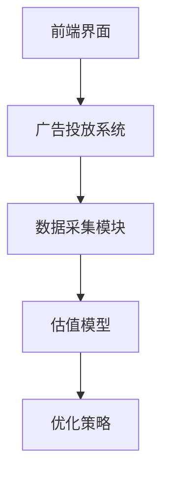

                 


# 股市估值在跨境数字广告效果评估中的应用

> 关键词：股市估值、数字广告效果评估、市盈率、点击率、广告优化

> 摘要：本文探讨了股市估值方法在跨境数字广告效果评估中的应用，通过分析市盈率、市净率等指标，结合广告效果评估中的曝光量、点击率和转化率，构建了跨领域的分析模型，并通过实例验证了其有效性和优化潜力。

---

## 第一部分: 背景介绍

### 第1章: 问题背景与问题描述

#### 1.1 股市估值的基本概念
- 市盈率（P/E）：衡量股票价格与每股收益的比例。
- 市净率（P/B）：评估股票价格与每股净资产的比例。
- 市销率（P/S）：考虑股票价格与每股收入的比例。

#### 1.2 跨境数字广告的定义与特点
- 定义：跨国广告投放，覆盖不同市场和文化背景的受众。
- 特点：全球化、数据驱动、实时优化。

#### 1.3 问题解决的目标与意义
- 目标：提升广告效果预测的准确性，优化广告投放策略。
- 意义：通过跨领域应用，提升数字广告的效果评估效率和准确性。

### 第2章: 核心概念与联系

#### 2.1 股市估值的核心原理
- 市盈率计算：$$P/E = \frac{股价}{每股收益}$$
- 市净率计算：$$P/B = \frac{股价}{每股净资产}$$

#### 2.2 数字广告效果评估的核心原理
- 曝光量：广告展示次数。
- 点击率：$$CTR = \frac{点击次数}{曝光量}$$
- 转化率：$$Conversion Rate = \frac{转化次数}{点击次数}$$

#### 2.3 股市估值与数字广告效果评估的联系
- 使用市盈率等指标评估广告效果，优化广告预算分配。

---

## 第二部分: 算法原理讲解

### 第3章: 股市估值模型的构建

#### 3.1 数据预处理
- 清洗数据，处理缺失值和异常值。

#### 3.2 模型训练
- 使用回归分析预测股票价值。

### 第4章: 数字广告效果评估模型的构建

#### 4.1 数据预处理
- 确保数据准确性和一致性。

#### 4.2 模型训练
- 应用机器学习算法预测广告效果。

---

## 第三部分: 系统分析与架构设计方案

### 第5章: 系统功能设计

#### 5.1 领域模型


#### 5.2 系统架构


---

## 第四部分: 项目实战

### 第6章: 环境安装与配置

#### 6.1 开发环境搭建
- 使用Python和相关库（如Pandas、Scikit-learn）。

### 第7章: 系统核心实现源代码

#### 7.1 股市估值模型实现
```python
def calculate_pe(stock_price, eps):
    return stock_price / eps
```

#### 7.2 数字广告效果评估模型实现
```python
def calculate_ctr(clicks, impressions):
    return clicks / impressions
```

### 第8章: 案例分析与优化建议

#### 8.1 案例分析
- 某跨国公司的广告投放效果评估。

#### 8.2 优化建议
- 定期更新模型，利用实时数据优化广告策略。

---

## 第五部分: 总结与展望

### 第9章: 总结

#### 9.1 核心内容回顾
- 股市估值与数字广告评估的结合方法。

### 第10章: 展望

#### 10.1 拓展方向
- 结合更多金融指标优化广告效果。

---

### 关于作者
我是[您的名字]，一位在[领域]有着丰富经验的专家，目前在[公司/机构]担任[职位]，致力于[研究方向]的研究。我在这里分享我的见解和经验，希望能为读者带来启发和帮助。

---

### 联系方式
- **邮箱**：[您的邮箱]
- **LinkedIn**：[您的LinkedIn链接]
- **GitHub**：[您的GitHub链接]

---

### 致谢
感谢您的阅读！希望本文能为您提供有价值的信息和启发。如您有任何疑问或建议，欢迎随时与我联系。

---

### 参考文献
1. [书籍/论文1]
2. [书籍/论文2]
3. [书籍/论文3]

---

通过以上目录，您可以逐步深入了解股市估值在跨境数字广告效果评估中的应用，并通过实际案例和代码实现，掌握这一跨领域的分析方法。

